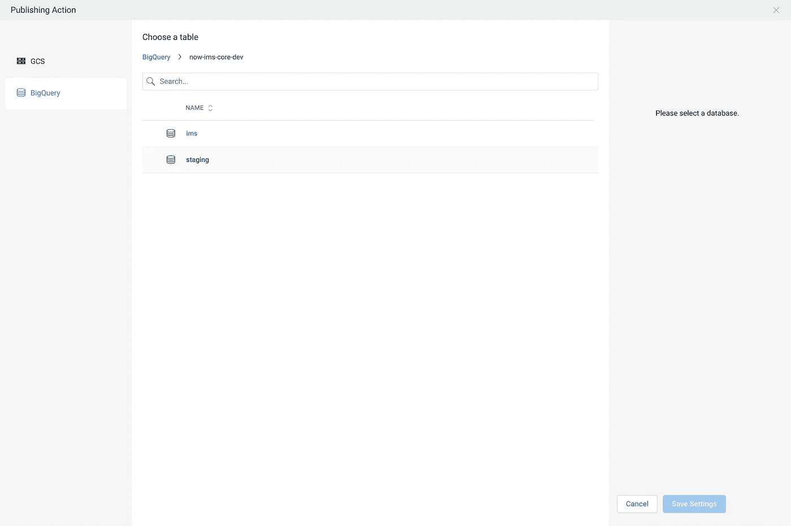
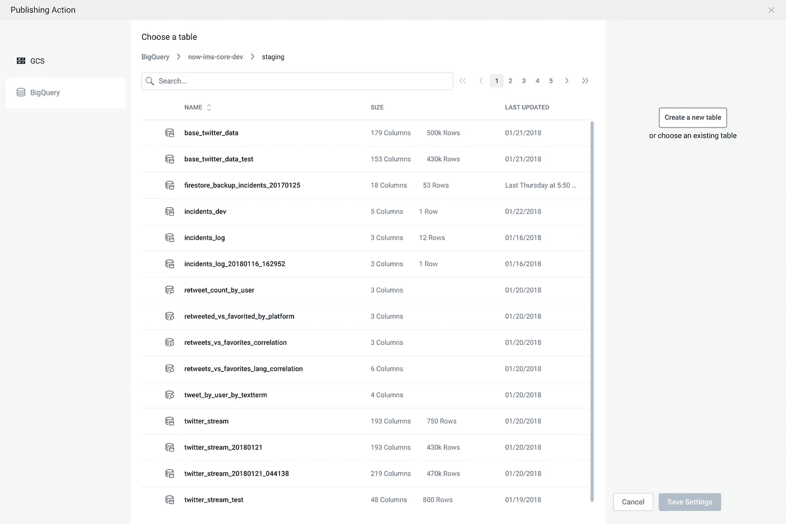

# 使用云 Dataprep 将 Twitter 数据流入 BigQuery

> 原文：<https://medium.com/google-cloud/stream-twitter-data-into-bigquery-with-cloud-dataprep-73aa8998fcc1?source=collection_archive---------0----------------------->

## 受[拉克什马南 V](https://medium.com/u/247b0630b5d6?source=post_page-----73aa8998fcc1--------------------------------) 的[文章](/google-cloud/how-to-schedule-a-bigquery-etl-job-with-dataprep-b1c314883ab9)的启发，展示了几个额外的特性

> 这里提到的所有代码都可以在我的 [git repo](https://github.com/jeremylorino/gcp-dataprep-bigquery-twitter-stream) 中找到。贡献，偷窃，或者什么都不做——你的选择；)

让我们看看通过监听 [Twitter 的流媒体 API](https://developer.twitter.com/en/docs/tweets/filter-realtime/overview) 可以获得多少数据。我将把代码分成几块来解释，但是所有这些都包含在 [git repo](https://github.com/jeremylorino/gcp-dataprep-bigquery-twitter-stream) 中。

## 听流媒体 Twitter 数据

下面我们将利用一个 *TwitterStream* 助手类，它接受一组关键字来过滤实时 tweet 流。

用 Twitter 关键字过滤器配置流监听器

然后，我们将一个事件监听器绑定到从上面的 *TwitterStream* 实例发出的数据事件。这个侦听器将捕获所有以 JSON 形式发出的 tweets，并将它们缓冲到一个工作数组中。一旦缓冲区满了，通过 *StorageProvider* 将工作数组的副本保存到配置好的 Google 云存储桶中；并且工作数组被清空以允许更多的 tweets。

还有别忘了你的 *config.json* 。填写您的 GCP 项目 id、默认应用程序凭据的位置、twitter 应用程序凭据和存储桶名称。

## 将云存储文件夹导入到 Dataprep

打开[谷歌云平台仪表盘](https://console.cloud.google.com) —从左上角菜单中选择；数据准备。

> 它出现在列表的最底部是很正常的——除非你把它钉在了你的最爱上。

导入数据集的快速视频。说真的，很快。

导入数据集

## 争论新导入的数据集

Cloud Dataprep 的出色之处在于它希望您“争论”您的数据。对身为德州人的我特别有吸引力。

至少有 10，000 篇深入的云数据准备文章，我将坚持基本的。

现在运行作业哟。(右上)

## 将 Dataprep ETL 调度到 BigQuery

我们将要经历的这个小场景最棒的部分是:我们在云存储空间中选择一个“文件夹”。每次运行该流时，它都会提取文件夹中的所有文件，并将这些文件视为要争论的数据集。因此，当 TwitterStream 收集器运行并将文件转储到云存储中时，Dataprep 将能够持续获得最新和最好的。

向您的流程添加计划

每小时；整点过 15 分钟

选择一个大查询数据集

选择“创建新表”

选择“每次运行时创建新表”

最终结果

> 下次…用 Datastudio 可视化

