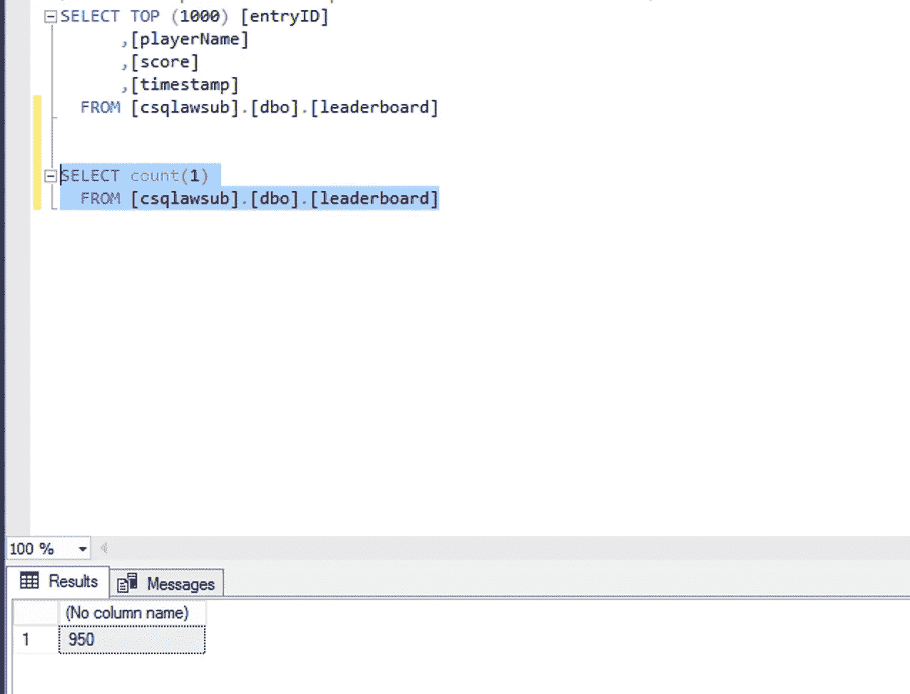

# 流式传输您的数据:从本地 MS-SQL 到云 SQL SQL Server 到 BigQuery(第 1 部分)

> 原文：<https://medium.com/google-cloud/stream-your-data-on-prem-ms-sql-to-cloudsql-sql-server-to-bigquery-part-1-14a920dbab48?source=collection_archive---------1----------------------->

**第 1 部分:**从本地 MS-SQL 到 CloudSQL SQL Server 的在线复制

# 为什么需要？

企业关系数据库的传统版本一直是我们应用程序堆栈不可或缺的一部分，但随着组织向数字时代过渡，他们开始意识到未开发数据的价值以及他们错过的大量机会。因此，大多数组织现在都在寻找有效的方法，利用批处理或流管道将其数据源与下一代云原生数据仓库平台集成。

> 根据[哈佛商业评论](https://hbr.org/2017/05/whats-your-data-strategy)，跨行业的研究表明，平均来说，一个组织的结构化数据只有不到 50%被积极地用于决策。

在这篇由多个部分组成的博客中，我将带您经历一个从遗留 SQL Server 到 BigQuery 构建数据管道的端到端场景。

S

由 Unsplash 网站上的 seli̇m·阿尔达·埃里希马兹

C挑战: SQL Server 2014 标准版默认情况下不支持 CDC，因此，客户需要升级到 2016 标准版或 SQL Server 2014 企业版。后一种方法不可行，因为客户对成本非常敏感，前一种方法需要 1 到 2 个月的时间来全面测试其应用，并且由于缺乏及时的分析，这可能会导致潜在机会的损失。

M

I **实施计划:** Microsoft SQL Server 提供了 SQL Server 实例之间的多种复制选项，供分布式应用程序使用。对于这个场景，我们将实现[事务复制](https://docs.microsoft.com/en-us/sql/relational-databases/replication/transactional/transactional-replication?view=sql-server-ver15)，这使得源数据库成为发布者，并且所有配置的对象&数据被近乎实时地应用到订阅者(目标)数据库。数据更改应用于订阅服务器的顺序与发布服务器相同，并且在相同的事务边界内。

到 CloudSQL SQL Server 的事务复制，作者*作者*

为了演示，我在 SQL Server 2014 Std 中创建了一个名为*“demo”*的数据库。版本，并提供了一个标准版 Google CloudSQL SQL Server 2017，数据库名为*“csqlawsub”*。

现在，让我们通过在源 SQL Server 上配置分发服务器和发布服务器来设置基于推送的事务复制。

源 SQL Server 上的分发服务器配置(按作者)

发布者配置，按作者

在源 SQL Server 的“demo”数据库中创建了一个名为“Leaderboard”的表，并配置发布者“demo_pub”将该表的所有更改数据推送到 subscriber @ CloudSQL 实例。

排行榜表 DDL，按作者

启动复制，并以接近实时的状态测试从源 SQL Server 到 CloudSQL 的数据复制。

复制监视器:按作者从发布服务器到订阅服务器

在“demo”数据库的“leaderboard”表中插入 950 行，该数据库近乎实时地复制到 cloud SQL“csqlawsub”中。

“排行榜”表@源数据库“演示”，作者

CloudSQL SQL Server 2017 中“leaderboard”表@“csqlawsub”数据库中复制的行(按作者)

不进入 SQL Server 事务复制解释(关于这个可以参考[链接](https://docs.microsoft.com/en-us/sql/relational-databases/replication/transactional/transactional-replication?view=sql-server-ver15))。在这里，我简要介绍了如何设置在线复制，只需点击几下鼠标就可以将用户数据从现有的 SQL Server 实例迁移到 Google CloudSQL。

由于 Google CloudSQL SQL Server 默认为您提供 2017 版本，您将从标准版本身获得 CDC 功能，这是 Google 的一项完全托管的数据库服务。现在，在第 2 部分中，我们将利用相同的方法&通过可能的方法来基于业务需求构建到 BigQuery 的管道。

**参考文献:**

 [## 创建和管理 SQL Server 数据库|云 SQL for SQL Server

### " type": "thumb-down "，" id": "hardToUnderstand "，" label ":"难以理解" }，{ "type": "thumb-down "，" id"…

cloud.google.com](https://cloud.google.com/sql/docs/sqlserver/create-manage-databases)  [## 用于 SQL Server 功能的云| Google Cloud

### " type": "thumb-down "，" id": "hardToUnderstand "，" label ":"难以理解" }，{ "type": "thumb-down "，" id"…

cloud.google.com](https://cloud.google.com/sql/docs/sqlserver/features)  [## 事务复制- SQL Server

### 适用于:SQL Server(所有支持的版本)Azure SQL 数据库事务性复制通常以…

docs.microsoft.com](https://docs.microsoft.com/en-us/sql/relational-databases/replication/transactional/transactional-replication?view=sql-server-ver15)