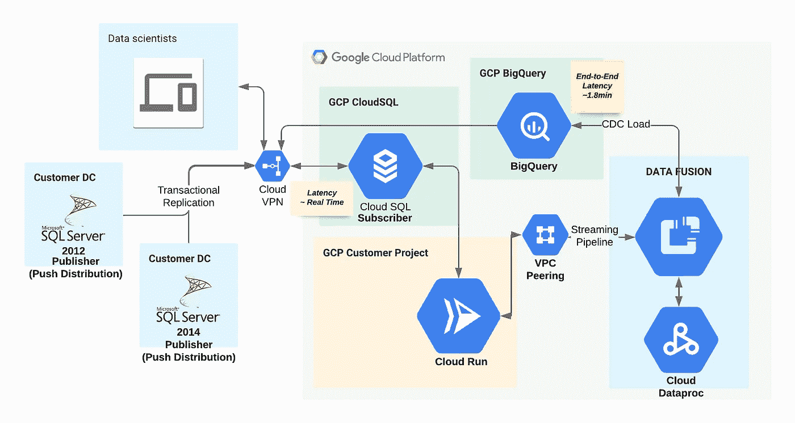

# 流式传输您的数据:从本地 MS-SQL 到云 SQL SQL Server 到 BigQuery(第 2 部分)

> 原文：<https://medium.com/google-cloud/stream-your-data-on-prem-ms-sql-to-cloudsql-sql-server-to-bigquery-part-2-47057e9e2637?source=collection_archive---------0----------------------->

**第 2 部分:**构建从 CloudSQL SQL Server 到 BigQuery 的管道

在[第 1 部分](/google-cloud/stream-your-data-on-prem-ms-sql-to-cloudsql-sql-server-to-bigquery-part-1-14a920dbab48)中，我们采用了一个场景:“一个对成本敏感的客户，他拥有 SQL Server 2014 standard edition，并希望构建一个到其仓库平台(即 BigQuery)的 CDC 管道。”并缓解第一个挑战，即如何在传统 SQL Server 不支持 CDC 功能时设置来自传统 SQL Server 的变更数据流，以及设置从传统 SQL Server 到 CloudSQL SQL Server 的事务复制。

现在，在第 2 部分中，让我们讨论从 CloudSQL 到 BigQuery 的可能管道。


**从 CloudSQL 到 BigQuery 的管道选项，作者**

Google Cloud Pub/Sub 和 Kafka 都是消息服务，其中任何一个都可以用来从 CloudSQL 捕获变更数据。两者的主要区别在于选择的扩展策略。


[**卡夫卡 vs 云 Pub/Sub**](https://cloud.google.com/architecture/migrating-from-kafka-to-pubsub) **，出自谷歌云**

在上图中，每个 *M* 代表一条消息。 **Kafka brokers** 管理消息的多个有序分区，由消息的水平行表示。消费者从特定分区读取消息，该分区的容量取决于承载该分区的机器。

**Pub/Sub** 没有分区，取而代之的是消费者从一个根据需求自动缩放的主题中读取。您可以为每个 Kafka 主题配置处理预期消费者负载所需的分区数量。发布/订阅根据需求自动扩展。


维多利亚诺·伊斯基耶多在 [Unsplash](https://unsplash.com?utm_source=medium&utm_medium=referral) 拍摄的照片

现在让我们讨论一下可能的选择

O 这对你来说是显而易见的选择。下面是实现相同功能的高级步骤。


**旧版 SQL Server->Cloud SQL SQL Server->Debezium Connector->Cloud Pub/Sub->big query，作者**

1.  使用以下命令在 CloudSQL SQL Server 上配置 [CDC:](https://cloud.google.com/sql/docs/sqlserver/replication/enable-cdc)

```
**# Enable CDC** 
EXEC msdb.dbo.gcloudsql_cdc_enable_db '[DATABASE_NAME]'**#Start CDC Capture Jobs**
EXEC sys.sp_cdc_start_job @job_type = N'cleanup'
EXEC sys.sp_cdc_change_job  @job_type = N'capture',
        @maxtrans = 20,
        @pollinginterval = NULL,
        @maxscans = NULL,
        @continuous = NULL**#Enable CDC for the required tables**
EXECUTE sys.sp_cdc_help_change_data_capture
  @source_schema = N'dbo',
  @source_name = N'leaderboard'
```

2.使用 Kafka Connect 通过 debezium 连接器调配 GCE 和捕获 CloudSQL 数据，并利用 Kafka-Pub/Sub Sink 连接器将 CDC 数据推送到云发布/订阅。

O


**旧版 SQL Server 实例->Cloud SQL SQL Server->Debezium Connector->Kafka | Cloud Pub/Sub->data flow->big query，作者**

*   从“[https://downloads.apache.org/kafka](https://downloads.apache.org/kafka)”下载并安装最新版本的卡夫卡。
*   为 kafka 和 zookeeper 服务创建 systemd 单元文件*"/etc/systemd/system/Zookeeper . service "*&*"/etc/systemd/system/Kafka . service "*或者您可以安排它作为作业在后台运行。


**O/P:** 系统状态动物园管理员&系统状态卡夫卡，作者

*   发布 kafka 配置，从*"*[*Debezium . io*](https://debezium.io)*"*下载 Debezium for SQL Server，用*" $ KAFKA _ HOME/config/connect-distributed . properties "*的*plugin . path】*变量中的 jar 文件设置 Debezium 连接器路径。
*   配置连接器并将配置添加到 Kafka Connect 集群。

```
**# SQL Server Connector configuration example.**
{     
"name": "***inventory-connector***",      
"config": {         "connector.class":"***io.debezium.connector.sqlserver.SqlServerConnector***",          
"database.hostname": "***<< IP Address >>***",          
"database.port": "***1433***",          
"database.user": "***sa***",          
"database.password": "***<< Password >>***",          
"database.dbname": "***csqlawsub***",          
"database.server.name": "***sqlserver-1***",          "table.include.list": "***dbo.leaderboard***",          "database.history.kafka.bootstrap.servers": "***kafka:9092***",          "database.history.kafka.topic": "***dbhistory.fullfillment***"      } }**# Start Kafka Connector.**
ravishgarg@gce-inst-1:/usr/local/kafka/config$ /usr/local/kafka/bin/connect-distributed.sh /usr/local/kafka/config/connect-distributed.properties
```


**O/P:**/usr/local/Kafka/config $/usr/local/Kafka/bin/connect-distributed . sh/usr/local/Kafka/config/connect-distributed . properties，作者

*   您还可以在 Kafka connect 服务启动后注册 Debezium 连接器，并调用 kafka topic 从 CloudSQL SQL Server 捕获更改的数据。

```
**# Registering connector.**
curl -i -X POST -H "Accept:application/json" -H "Content-Type:application/json" localhost:8083/connectors/ -d '{ "name": "test-connector", "config": { "connector.class": "io.debezium.connector.sqlserver.SqlServerConnector", "database.hostname": "<<IP Address>>", "database.port": "1433", "database.user": "sqlserver", "database.password": "ravish", "database.dbname": "csqlawsub", "database.server.name": "csqlawsub", "table.whitelist": "dbo.leaderboard", "database.history.kafka.bootstrap.servers": "localhost:9092", "database.history.kafka.topic": "dbhistory.fulfillment" } }';
```

*   您可以使用以下命令检查调用的 Kafka 主题的详细信息:

```
$ /usr/local/kafka/bin/kafka-topics.sh --list -zookeeper localhost:2181**O/P:**
__consumer_offsets
connect-configs
connect-offsets
connect-status
csqlawsub
**csqlawsub.dbo.leaderboard
dbhistory.fulfillment**
sqlserver-topic
```

*   连接到主题"**csqlawsub . dbo . leader board "**以验证捕获的已更改数据。

```
$ /usr/local/kafka/bin/kafka-console-consumer.sh --bootstrap-server localhost:9092 --topic csqlawsub.dbo.leaderboard --from-beginning
```

*   现在，您可以直接从 Kafka 或通过 Pub/Sub 将捕获的更改数据推送到数据流。下面是为 Kafka 主题配置数据流的步骤。


**从 Kafka 捕获数据并将其推送到 BigQuery 的数据流作业，作者**

*   Google Cloud 已经提供了预构建的模板来将数据流与 Kafka 链接起来，并将捕获的数据推送到 BigQuery。


**数据流作业 Kafka 到 BigQuery 模板，作者**

O **选项 3:** Google Cloud Datafusion 也是一个很好的选择，如果你正在寻找一个无代码选项来建立你的转换管道，因此，不需要任何编程知识来构建你的转换层。



**传统 SQL Server 实例->cloud SQL SQL Server->data fusion->big query，作者**

> **云数据融合**提供了图形用户界面和 API，提高了时间效率，降低了复杂性。它使业务用户、开发人员和数据科学家能够快速轻松地构建、部署和管理数据集成管道过渡。

云数据融合是一个完全托管的、无代码的数据集成服务，用于管理 ETL/ELT 管道并跟踪该数据的血统。此外，利用复制加速器，用户可以直接从 CloudSQL SQL Server 捕获更改的数据，对其进行转换并将其推送到 BigQuery，而无需任何复杂的 Debezium 或 Kafka 消息传递系统。以下是实现相同功能的步骤:

*   Google Cloud Data Fusion 支持使用私有 IP 地址提供实例，因此，该网络上的流量不会通过公共互联网。参考[创建私有实例](https://cloud.google.com/data-fusion/docs/how-to/create-private-ip)文档，使用私有 IP 地址设置环境。
*   您还需要[为 CloudSQL](https://cloud.google.com/sql/docs/mysql/configure-private-services-access) SQL Server 实例配置私有服务访问，以便您的 VPC 网络中的 VM 实例和您访问的服务使用内部 IP 地址进行独占通信。
*   目前，GCP 不提供 transit VPN 功能，因此，为了缓解这一问题，我们需要通过 CloudRun 或 GCE 设置 [HAProxy](http://www.haproxy.org/) 或 [CloudSQLProxy](https://cloud.google.com/sql/docs/sqlserver/sql-proxy) ，以确保云数据融合和 CloudSQL SQL Server 实例之间的通信。
*   现在，让我们使用复制加速器初始化云数据融合，并对其进行配置。


**数据融合实例供应，作者**

*   提供数据融合实例后，进入实例-> HUB，下载 *Microsoft SQL Server JDBC 驱动程序 v6.0.jre8* 并对其进行配置。
*   选择复制并创建一个从 MS-SQL 到 BQ 的流作业。


**从数据融合主页选择复制，作者**


**创建用于将数据从 CloudSQL 迁移到 BigQuery 的复制作业，作者**


**复制作业的详细信息，由作者提供**

**结论:**

到此，我们结束了这个博客，我相信你会发现它很有用。因此，如果您正在寻找在线迁移或想要为您的 SQL Server 实例到 CloudSQL 构建灾难恢复策略，只需参考[第一部分](/google-cloud/stream-your-data-on-prem-ms-sql-to-cloudsql-sql-server-to-bigquery-part-1-14a920dbab48)。如果您对从数据中提取更多的价值感兴趣，并希望将它传输到下一代数据湖(也称为 BigQuery ),那么第 2 部分就是为您准备的。

**参考文献:**

[](https://cloud.google.com/sql/docs/sqlserver/replication/enable-cdc) [## 为 SQL Server 启用变更数据捕获(CDC) |云 SQL

### 本页介绍如何在 Cloud SQL for SQL Server 中启用变更数据捕获(CDC)。此功能适用于…

cloud.google.com](https://cloud.google.com/sql/docs/sqlserver/replication/enable-cdc)  [## 卡夫卡索引

### 编辑描述

downloads.apache.org](https://downloads.apache.org/kafka)  [## Debezium

### Debezium 是一个用于变更数据捕获的开源分布式平台。启动它，指向你的数据库，然后…

debezium.io](https://debezium.io) [](https://cloud.google.com/data-fusion/docs/how-to/create-private-ip) [## 创建私有实例|云数据融合文档

### 本页描述了如何使用私有 IP 地址创建云数据融合实例。您创建了自己的私有云…

cloud.google.com](https://cloud.google.com/data-fusion/docs/how-to/create-private-ip) [](https://cloud.google.com/sql/docs/mysql/configure-private-services-access) [## 为 MySQL 配置私有服务访问|云 SQL

### " type": "thumb-down "，" id": "hardToUnderstand "，" label ":"难以理解" }，{ "type": "thumb-down "，" id"…

cloud.google.com](https://cloud.google.com/sql/docs/mysql/configure-private-services-access) [](http://www.haproxy.org/) [## HAProxy

### 快速新闻最近新闻描述主要功能支持的平台性能可靠性安全性下载…

www.haproxy.org](http://www.haproxy.org/) [](https://cloud.google.com/sql/docs/sqlserver/sql-proxy) [## 关于云 SQL 身份验证代理|用于 SQL Server 的云 SQL

### 此页面提供了云 SQL 身份验证代理的基本介绍，并描述了代理选项。对于循序渐进的…

cloud.google.com](https://cloud.google.com/sql/docs/sqlserver/sql-proxy) [](https://cloud.google.com/data-fusion/docs/tutorials/replicating-data/sqlserver-to-bigquery) [## 将数据从 SQL Server 复制到 BigQuery

### 发送反馈本教程向您展示了如何创建和部署一个不断复制已更改数据的管道…

cloud.google.com](https://cloud.google.com/data-fusion/docs/tutorials/replicating-data/sqlserver-to-bigquery)