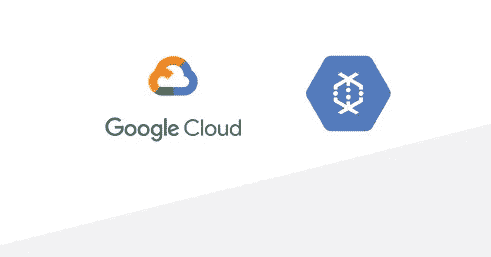
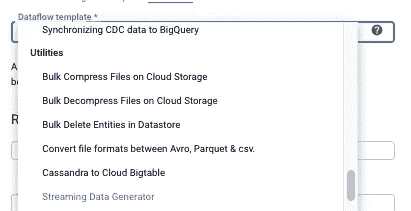
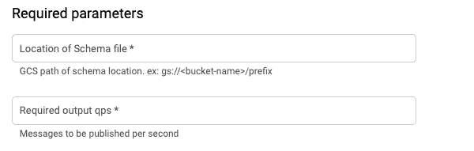

# GCP 上的流数据生成器数据流灵活模板

> 原文：<https://medium.com/google-cloud/streaming-data-generator-978846c5c807?source=collection_archive---------0----------------------->

我们很高兴地宣布推出新的 Dataflow Flex 模板**流数据生成器**，它支持根据目的地以各种格式(JSON/AVRO/PARQUET)将大量 JSON 消息连续写入 Google Cloud Pub/Sub Topic 或 BigQuery 或云存储。在这篇博文中，我们将简要讨论模板的需求和用法。



# **Flex 模板**

在深入了解流数据生成器模板功能的详细信息之前，让我先从较高的层面介绍一下模板:

[模板](https://cloud.google.com/dataflow/docs/guides/templates/overview)的主要目标是以可重用工件的形式打包数据流管道，并支持通过各种渠道(UI / CLI / REST API)启动，以便通过提供所需的管道参数，这些模板可以被各个团队利用。在模板的第一个版本(称为[传统模板](https://cloud.google.com/dataflow/docs/guides/templates/creating-templates))中，管道在 GCS 上进行，可以从控制台、gcloud 命令或其他服务(如云调度程序/功能等)启动。

然而传统模板有一定的局限性:
1 .缺乏对动态 DAGS 的支持
2。大量 I/O 不支持运行时参数

[Flex 模板](https://cloud.google.com/dataflow/docs/guides/templates/using-flex-templates)克服了这些限制。Flex 模板以 docker 图像的形式打包数据流管道代码和应用程序依赖项，并将图像存放在 Google 容器注册表(GCR)中。Flex template launcher 服务使用提供的参数启动管道，其方式类似于用户在开发期间启动管道。

# **什么是流数据生成器？**

流数据生成器模板可用于根据用户提供的模式，以指定的速率(每秒消息数)向 Google Cloud 发布/订阅主题或 BigQuery 或云存储发布虚假的 JSON 消息。[流水线使用的 JSON 数据生成器](https://github.com/vincentrussell/json-data-generator) 库支持各种 faker 函数与 schema 字段关联。管道支持配置参数来控制每秒发布的消息数量(即 QPS)和所需的资源(通过自动缩放)

一些可能的用例是:

1.  模拟向发布/订阅主题发布大规模实时事件，以测量和确定处理发布事件所需的消费者数量和规模。
2.  向 BigQuery 表或云存储桶生成合成数据，以评估性能基准或用作概念证明。

就您可以生成的事件类型而言，可能性是无穷无尽的。

# **如何经营管道？**

可以从云控制台或通过 gcloud 命令启动管道。

从`cloud console`启动:

1.  进入云控制台的[数据流页面](https://console.cloud.google.com/dataflow/jobs)
2.  点击**从模板**创建作业。


3.从**数据流模板**下拉菜单中选择流数据生成器



4.输入作业名称

5.输入所需的参数，如下所示:



6.根据接收器类型、输出编码、autoScalingAlgorithm 和 maxNumWorkers 等输入其他参数，如接收器详细信息

7.单击运行作业

要使用`gcloud`启动管道将消息发布到云发布/订阅，请使用以下命令:

```
gcloud beta dataflow flex-template run ${JOB_NAME} \
 —-project=${YOUR_PROJECT_ID} \
 —-region=${REGION_NAME} \
 —-template-file-gcs-location=gs://dataflow-templates/latest/flex/Streaming_Data_Generator \
 —-parameters \
schemaLocation=${SCHEMA_LOCATION}\
qps=${QPS},\
topic=${PUBSUB_TOPIC}
```

# 参考

*   代码可在 [GitHub](https://github.com/GoogleCloudPlatform/DataflowTemplates/tree/master/v2/streaming-data-generator) 上获得
*   关于文件，请参考[数据流文件](https://cloud.google.com/dataflow/docs/guides/templates/provided-utilities#streamingdatagenerator)
*   各种[批次](https://cloud.google.com/dataflow/docs/guides/templates/provided-batch)和[流](https://cloud.google.com/dataflow/docs/guides/templates/provided-streaming)模板的云数据流文档。