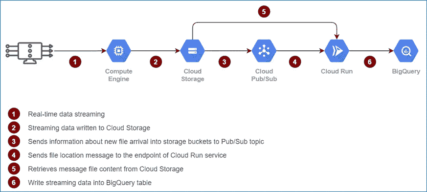

# 使用 Google Cloud Run 将数据流式传输到 BigQuery

> 原文：<https://medium.com/google-cloud/streaming-data-into-bigquery-using-google-cloud-run-469365a731b9?source=collection_archive---------2----------------------->

## 使用无服务器计算将实时流数据导入 BigQuery 的解决方案

## 解决办法

该解决方案旨在使用 Google cloud 无服务器平台将流数据接收到 BigQuery 中，而无需担心底层基础架构。它还支持同步数据读/写功能，并有助于线性容量规划和数据准确性。此解决方案中使用了一个额外的跃点(计算引擎),以便在将多条消息写入云存储之前将其整合到一个文件中，从而提高存储效率。

发布/订阅通知将有关新消息/文件到达存储桶的信息发送到发布/订阅主题。一旦发布/订阅收到通知，它就会将消息推送到云运行服务的端点。

云运行处理从发布/订阅接收的消息，从云存储中检索文件内容，并写入 BigQuery 表。

## **架构**

流数据接收的数据流图

## 步骤 1:创建 BigQuery 数据集和表

这种解决方案允许灵活的模式定义，而不需要修改源代码，但是它必须遵守流式数据属性。在下面的示例中，只有三列表示数据摄取过程，并且可以根据需要进行扩展。

BigQuery 数据集和表

## **第二步:创建服务账户并添加角色**

此解决方案需要一个具有 BigQuery 管理员、发布/订阅编辑器、云存储管理员和云运行管理员角色的服务帐户。

## 步骤 3:构建和部署云运行应用程序

Cloud Run 是完全托管的计算平台，用于快速、安全地部署和扩展容器化的应用程序。下面描述的应用程序代码演示了多个步骤，包括将应用程序代码打包到容器映像中，将容器映像上传到容器注册表，然后将容器映像部署到云运行。

源代码是用 node.js 语言编写的，但也可以用多种语言编写，如 Go、Python、Java、Ruby。

处理传入请求的应用程序代码

发布/订阅消息控制器

集装箱应用程序并上传至集装箱登记处

部署云跑应用

## 步骤 4:创建发布/订阅主题和订阅

创建具有服务帐户的发布/订阅，以将消息推送到云运行服务的端点。每个消息包含文件名和云存储桶中的文件位置。

## 步骤 5:为云存储创建发布/订阅通知

使用 OBJECT_FINALIZE 事件类型创建的云存储的发布/订阅通知，以确保只有在桶中成功创建新对象时才会触发通知。

## 步骤 6:将消息推送到云存储中

可以通过启用流管道将消息推送到云存储桶，也可以通过将 JSON 格式的消息文件直接写入云存储桶来实现。

## 源代码库

[https://github . com/soumendra-mis HRA/stream-analytics-API . git](https://github.com/soumendra-mishra/stream-analytics-api.git)