# 桌面/设备/Raspberry Pi 上的流媒体对话流

> 原文：<https://medium.com/google-cloud/streaming-dialogflow-on-your-desktop-device-raspberry-pi-fe95b70b33a1?source=collection_archive---------0----------------------->


*把你的本地电脑变成一个由 Dialogflow 驱动的听、说的语音用户界面。*

如果你以前使用过 [Dialogflow](https://dialogflow.com/) (DF)，你就会知道这是一种构建智能对话界面的快捷方式。Dialogflow [代理](https://cloud.google.com/dialogflow/docs/agents-overview)可以是 Facebook Messenger 或 Slack chatbot、Google Assistant 或 Alexa 应用程序，甚至是自动化客户服务代理背后的大脑。

Dialogflow 自带了一些支持的集成，使得在 Slack/脸书/Alexa/etc 上部署一个 DF 应用变得轻而易举。

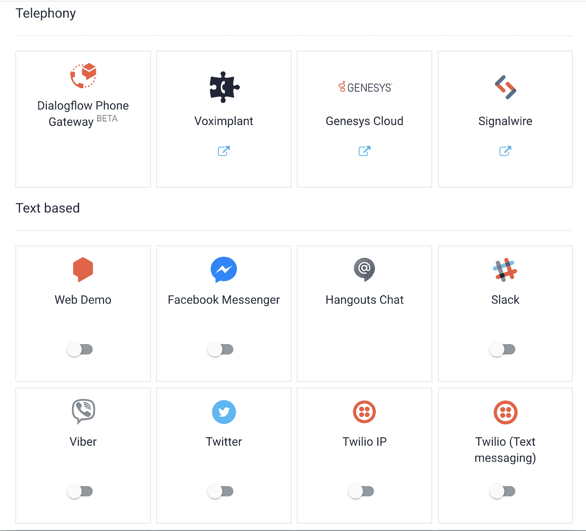

一些内置的 Dialogflow 集成。

但有时，您并不想将代理集成到现有平台中，而是想在自己的设备上运行它。也许你正在构建一个自助信息亭，想直接从你的 localMac/PC/Raspberry Pi 与 Dialogflow 对话。

在本文中，我将向您展示如何做到这一点，方法是连接 Node.js 中的 Dialogflow 代理，从您计算机的麦克风流入音频，并通过您的扬声器流出 DialogFlow 代理的响应。(如果您不使用 Node，请在这里查看 Python 代码示例。)您需要的只是一个现有的 DF 代理。同时，如果你想直接跳到代码，你可以在这里找到它[。](https://gist.github.com/dalequark/4648c110b02963a049da2bfa637493fb)

我们开始吧👉

# 将 Dialogflow 配置为说话

首先，登录到 [Dialogflow 控制台](https://dialogflow.cloud.google.com/#/login)并导航到您想要流化的项目。就我而言，我正在从事一个名为`SimpleAlarm`的项目。

点按屏幕左上角的齿轮图标。

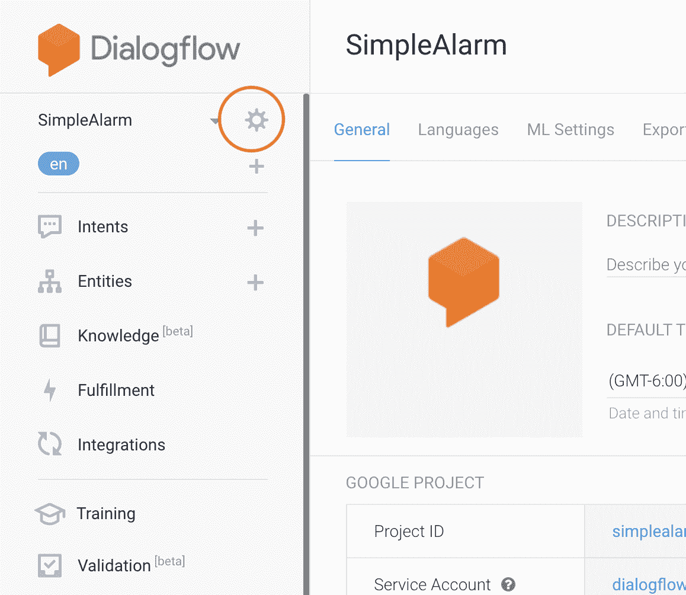

在这里，在 General 选项卡下，记下您的项目 id(我的是`simplealarm-spoitm`)。保存该值以备后用。

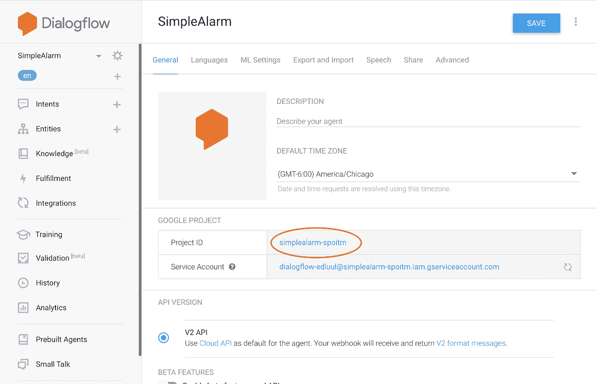

接下来，导航到“语音”选项卡，向下滚动并单击“启用自动文本到语音”旁边的滑块启用此选项会导致 Dialogflow 在其响应中返回音频数据，这些数据可以直接通过扬声器播放。

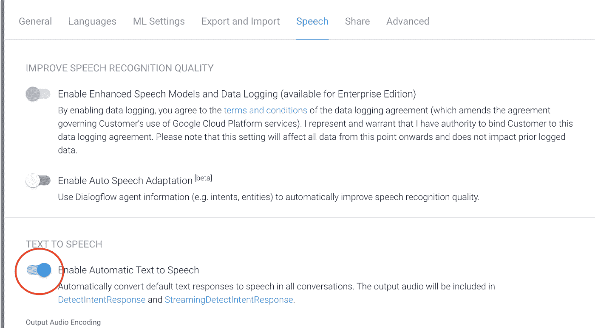

如果您向下滚动到此处，您还可以看到用于更改代理声音的各种选项。在默认设置为“自动”的“语音”下，您可以选择男声和女声以及 [WaveNet](https://cloud.google.com/text-to-speech/docs/wavenet) 语音，它们听起来比标准语音更像人类。

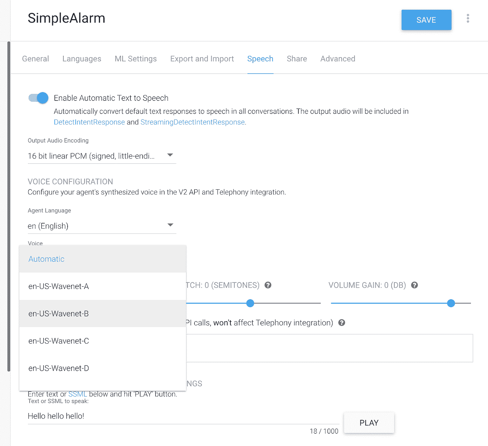

点击保存，我们就可以开始了。

## 证明

因为我们希望从本地计算机与 Node.js 中的 Dialogflow 代理进行交互，所以我们需要设置身份验证。在整个 Google Cloud 中，认证是通过[服务账户](https://cloud.google.com/iam/docs/service-accounts)来处理的，我们现在就来设置。

首先，导航到 GCP [控制台](https://console.cloud.google.com/)(现在是一个很好的时机，你需要有一个谷歌云帐户和登录)。导航到项目 id 与您的 Dialogflow 代理的项目 id 相对应的 GCP 项目(还记得我们在上一步中注意到的吗？).

在左侧栏中，转到 IAM & admin ->服务帐户。

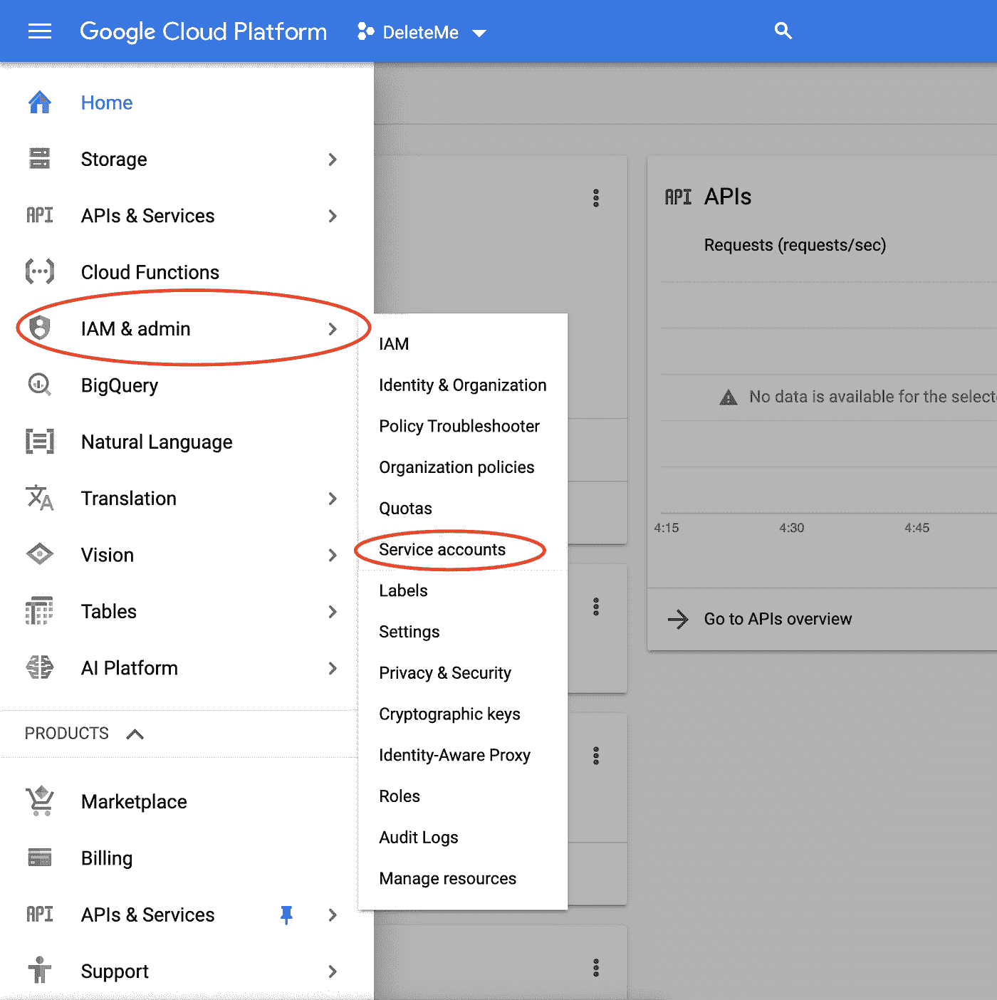

点击屏幕顶部的“+创建服务帐户”。

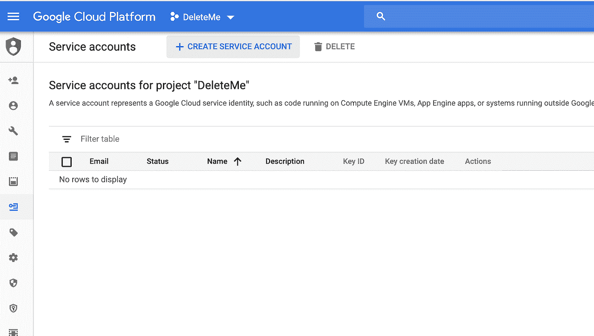

创建一个新的服务帐户，用某个名称描述它的使用位置(在本例中，在我们的 desktop/raspi/etc 上)。

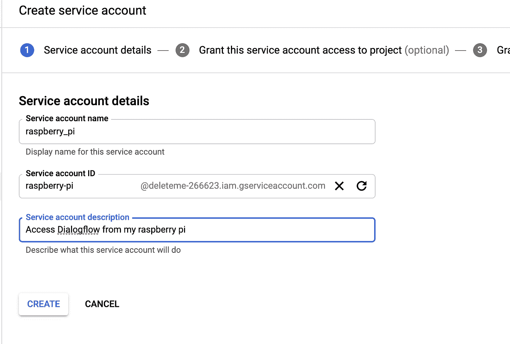

单击创建。在下一页，您可以为您的帐户授予权限。现在，我们需要的只是“Dialogflow API Client”权限。

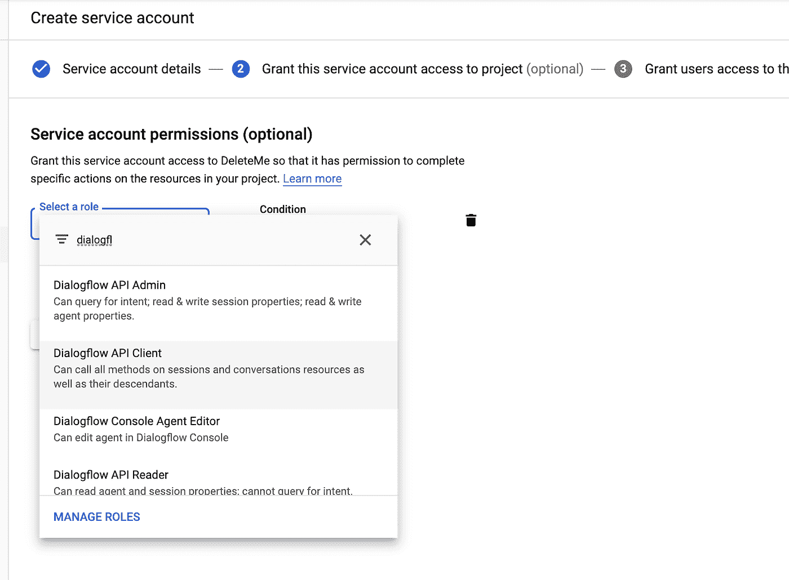

最后，在最后一个屏幕上，您会看到一个按钮，上面写着“+ CREATE KEY”单击该按钮。

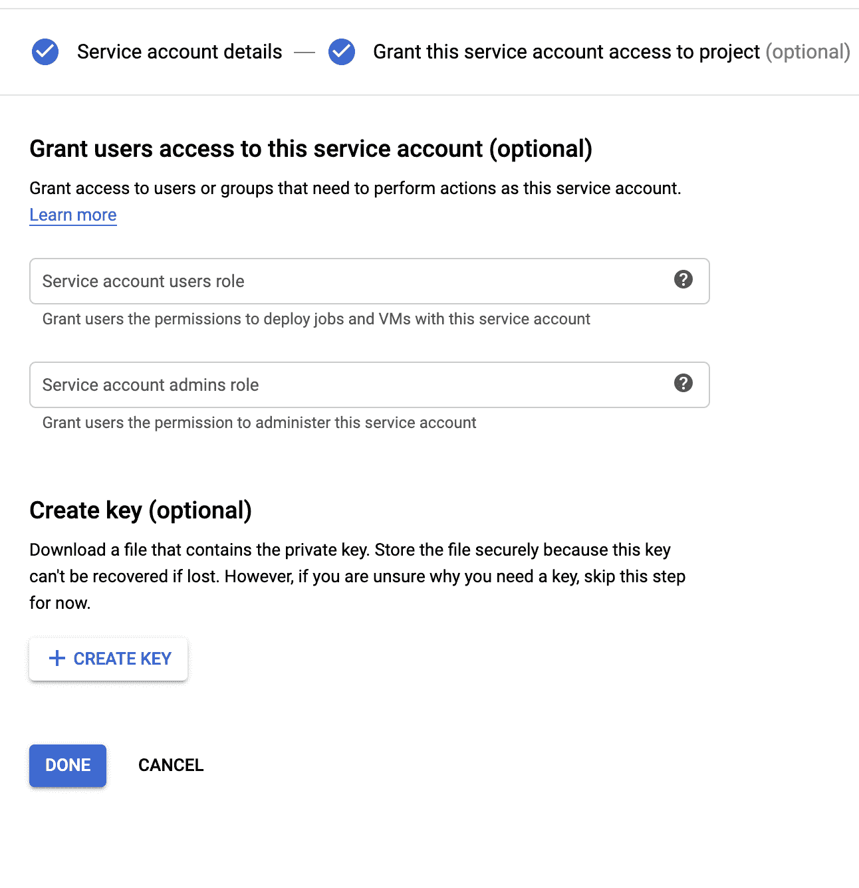

接下来，选择“JSON”作为键类型，并选择 Create。

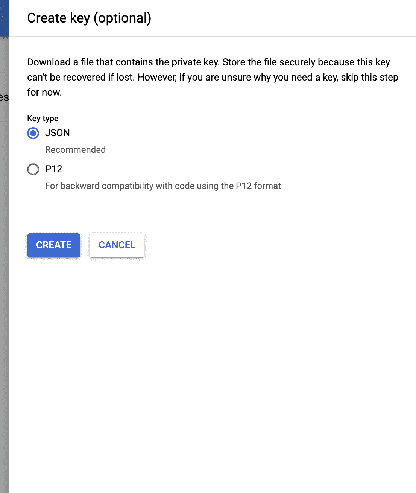

这会将一个`json`凭证文件下载到您的计算机上。任何拥有此文件的人都可以访问您的 Dialogflow 代理，所以请保密，不要将其签入任何 GitHub repos！

同时，为该项目创建一个新文件夹(即`dialogflow_streaming_agent`)，并将凭证`json`文件移动到该文件夹中。

# 编写 Node.js Dialogflow 流代码

## 属国

要开始，您需要下载一些依赖项。对于这个项目，我使用包 [node-record-lpcm16](https://www.npmjs.com/package/node-record-lpcm16) 来记录来自我的麦克风的音频，使用包 [node-speaker](https://github.com/TooTallNate/node-speaker) 通过我的扬声器播放来自 Dialogflow 的音频响应。你可以使用其他的扬声器和麦克风库，但我发现它们在我的 MacBook 和 Pi 上都能正常工作。

要安装`node-record-lpcm16`，你可能需要先安装一些依赖项，比如`sox`。在这里看文档[，但是在 Mac 上，你可能会想做这样的事情:](https://github.com/gillesdemey/node-record-lpcm16)

```
brew install sox
npm install node-record-lpcm16
```

在 Linux 上:

```
sudo apt-get install sox libsox-fmt-all
npm install node-record-lpcm16
```

要安装`node-speaker`:

```
npm install speaker
```

或者在 Linux 上:

```
sudo apt-get install libasound2-dev
npm install speaker
```

在我的 Mac 上，我注意到我在使用这个库的时候总是出现错误`Illegal Instruction: 4`。解决方案是安装带有该标志的`speaker`:

```
npm install speaker --mpg123-backend=openal
```

最后:

```
npm install pump dotenv dialogflow-v2
```

## 了解 Dialogflow 流接口

**对话流流配置**

如果您浏览 Dialogflow 文档，您会看到有一个名为[Detect Intent with Audio Stream Input](https://cloud.google.com/dialogflow/docs/detect-intent-stream#detect-intent-stream-nodejs)的示例代码页。这个片段向您展示了如何在*文件*之间传输音频。但是在这篇文章中，我们不是从文件中提取音频，而是直接从麦克风中收集音频，并通过扬声器直接播放。我将一步一步地向您介绍如何做到这一点，但是完整的代码示例在这里是。

要开始使用 Dialogflow 流接口，请导入库并创建新的客户端:

```
const dialogflow = require('dialogflow');const sessionClient = new dialogflow.SessionsClient();
```

在这个流设置中，我们将从麦克风收集音频，并不断将其发送到`sessionClient`。但是在我们发送音频之前，我们需要发送给 Dialogflow 的第一个数据包是一个配置对象。我将这一步打包成一个函数，我称之为`makeInitialStreamRequestArgs`:

```
function makeInitialStreamRequestArgs(projectId, sessionId) {
    // Initial request for Dialogflow setup

    const sessionPath = sessionClient.sessionPath(projectId, sessionId);

    return {            
        session: sessionPath,            
        queryInput: {                
            audioConfig: {                    
                audioEncoding: "LINEAR16",
                sampleRateHertz: 16000,
                languageCode: "en-US",
            },                
            singleUtterance: true,            
         },            
         outputAudioConfig: {                
             audioEncoding: `OUTPUT_AUDIO_ENCODING_LINEAR_16`,
             sampleRateHertz: 16000,            
         },        
    };    
}
```

先说这些配置参数。

首先，`makeInitialStreamRequestArgs`需要两个参数，`projectId`和`sessionId`。`projectId`是您的 GCP 项目 ID，它是我们从上面的 Dialogflow 控制台收集的(在我的例子中，它是`simplealarm-spoitm`)。另一方面，`sessionId`是您，即调用者，为每个用户*会话*创建的 id。您将在每次调用 Dialogflow 时发送此 sessionId，以表明您正在继续正在进行的对话。

这两个参数`projectId`和`sessionId`一起用于创建一个`sessionPath`变量，该变量与初始配置一起发送。

您会注意到上面的代码中有一个名为`queryInput`的`json`字段，它告诉 Dialogflow 预期的输入音频数据类型。我们设置`audioEncoding: "LINEAR16"`来表示我们正在以“16 位线性脉码调制(PCM)编码”从麦克风发送音频。该字段也可以是`"MP3"`、`"FLAC"`，或者这里所列[的几种其他编码类型。对于来自麦克风的原始数据，您通常会希望使用`"LINEAR16"`。`sampleRateHertz: 16000`表示我们将发送以 1600 赫兹采样的 Dialogflow 音频。在 Linux 上，您可以使用以下命令确定麦克风的采样速率:](https://cloud.google.com/speech-to-text/docs/encoding)

```
arecord --list-devices
```

然而，我发现在这里使用一个交替的采样率不会破坏任何东西🤞。

在`queryInput`中，我们将设置字段`singleUtterance: true`。来自[文档](https://cloud.google.com/dialogflow/docs/detect-intent-stream):

*   如果`false`(默认)，语音识别不会停止，直到客户端关闭流。
*   如果是`true`，Dialogflow 将检测输入音频中的单个话语。当 Dialogflow 检测到音频的声音已经停止或暂停时，它会停止语音识别并向您的客户端发送一个带有识别结果`END_OF_SINGLE_UTTERANCE`的`StreamingDetectIntentResponse`。在收到`END_OF_SINGLE_UTTERANCE`后，任何发送到 Dialogflow 的音频都会被 Dialogflow 忽略。

将该字段设置为`true`方便地意味着 Dialogflow 将自动检测用户何时停止讲话，允许它处理何时停止监听并开始讲话的逻辑。

最后，`outputAudioConfig`告诉 Dialogflow 我们想要接收什么类型的音频，然后我们将通过扬声器播放。

**将 Dialogflow 连接到麦克风**

为了开始收集音频和检测意图，让我们创建一个新函数`getAudio(sessionId)`，它将处理创建一个 Dialogflow 流、创建一个麦克风流、设置配置和检测意图。`getAudio`将返回一个 [Javascript Promise](https://developers.google.com/web/fundamentals/primers/promises) ，当它收到来自 Dialogflow 的音频响应时，这个 Promise 将被解析。

首先，创建一个新的 Dialogflow 意图检测流，如下所示:

```
function getAudio(sessionId, projectId) { const detectStream = this.sessionClient.streamingDetectIntent()            .on('error', console.error);
```

接下来，我们将使用上一步中编写的函数发送 Dialogflow 配置包:

```
detectStream.write(makeInitialStreamRequestArgs(projectId, sessionId));
```

现在我们将开始从麦克风收集音频，并将其传输到`detectStream`对象。

为了创建麦克风流，我们将使用之前安装的库`node-record-lpcm16`创建一个新的`record`对象:

```
const recording = record.record({
    sampleRateHertz: 16000,                
    threshold: 0,                
    verbose: false,                
    recordProgram: 'arecord', // Try also "arecord" or "sox"
    silence: '10.0',            
});            
const recordingStream = recording.stream().on('error', console.error);
```

您应该将`recordProgram`设置为您电脑上安装的任何音频录制软件。我的 MacBook 上用的是`sox`，Linux/Raspberry Pi 上用的是`arecord`。

为了将记录流(`recordingStream`)连接到 Dialogflow 流(`detectStream`)，我使用了一个名为 [pump](https://www.npmjs.com/package/pump) 的小型 Javascript 库。这让我们对来自`recordingStream`的数据做一个小的转换，所以它是`detectStream`期望的格式。

```
const pumpStream = pump(recordingStream,            
    // Format the audio stream into the request format.
    new Transform({objectMode: true,
    transform: (obj, _, next) => {
        next(null, { inputAudio: obj });
    },}),            
    detectStream);
```

**流式音频和检测意图**

现在我们正在将音频数据传输到云端，Dialogflow 可以监听——当它检测到用户结束讲话时——尝试匹配用户的[意图](https://cloud.google.com/dialogflow/docs/intents-overview)并返回响应。

让我们来看看:

将麦克风数据流式传输到 Dialogflow 并监听 Dialogflow 的响应

这里[发生了很多事情](http://baby-name-gen.firebaseapp.com)，我们来分解一下。

`detectStream.on('data'`是监听 Dialogflow 发出的`data`事件的处理程序。Dialogflow 发出`data`事件来传达[丢失的不同类型的信息](https://cloud.google.com/dialogflow/docs/reference/rpc/google.cloud.dialogflow.v2#google.cloud.dialogflow.v2.StreamingDetectIntentResponse):

```
{ responseId: '',
  recognitionResult: null,
  queryResult:
   { fulfillmentMessages: [],
     outputContexts: [],
     queryText: '',
     speechRecognitionConfidence: 0,
     action: '',
     parameters: null,
     allRequiredParamsPresent: false,
     fulfillmentText: '',
     webhookSource: '',
     webhookPayload: null,
     intent: null,
     intentDetectionConfidence: 0,
     diagnosticInfo: null,
     languageCode: 'en-US',
     sentimentAnalysisResult: null },
  webhookStatus: null,
  outputAudio: <Buffer >,
  outputAudioConfig: null }
```

例如，当用户说话时，Dialogflow 将触发一个设置了参数`data.recognitionResult`的`data`事件，该事件包含它认为用户所说内容的实时副本。例如，如果我对着麦克风说，“今天天气如何？”Dialogflow 可能会发出几个带有`recognitionResult.transcript`的`data`事件，分别包含:

```
“What’s”
“What’s the”
“What’s the heather” // NOTE: heather changed later to "weather"
“What’s the weather today?”
```

请注意，有时(如上例所示)，当用户说出更多单词并提供更多上下文时，转写可能会发生变化。

当用户停止讲话时，Dialogflow 将发出一个数据包，其中字段`data.recognitionResult.isFinal`设置为`true`。此时，你会**需要**关闭**麦克风:**

```
if (data.recognitionResult.isFinal) {           
   console.log("Result Is Final");                    
   recording.stop();                    
}
```

当用户停止说话时，Dialogflow 将开始将用户所说的内容与意图进行匹配。然后它将发出一个数据事件，字段`data.queryResult`被填充。`data.queryResult.fulfillmentText`将包含 Dialogflow 回复的文本版本(即“今天天气多云”)。`queryResult`还包含[其他有用的字段](https://cloud.google.com/dialogflow/docs/reference/rpc/google.cloud.dialogflow.v2#queryresult)，如`queryResult.intent.displayName`(匹配意向的名称)和用于匹配参数的`queryResult.parameters`。

最后，Dialogflow 发出的最后一个`data`事件将包含一个音频响应`data.outputAudio`。此时，在上面的代码中，我们关闭泵(`pumpStream.end`)并解析承诺，返回音频和`queryResult`:

```
resolve({“audio” : data.outputAudio, “queryResult” : queryResult});
```

顺便说一下，如果不清楚这些是如何组合在一起的，请查看[完整的代码示例](https://gist.github.com/dalequark/4648c110b02963a049da2bfa637493fb)(到目前为止，我们一直在谈论`getAudio`函数)。

恭喜你！您已经设置了使用 Dialogflow 进行流式传输的最难部分。

**通过扬声器播放 Dialogflow 的音频响应**

在用户向我们的代理发出请求并且我们收到它的音频响应后，我们将需要使用`node-speaker`库通过我们计算机的扬声器播放该响应。我们将在一个名为`playAudio`的函数中完成:

```
playAudio(audioBuffer) {        
    return new Promise(resolve => {            
        // Setup the speaker for playing audio            
        const speaker = new Speaker({                
            channels: 1,                
            bitDepth: 16,                
            sampleRate: 16000,            
        });                        
        speaker.on("close", () => {                
            resolve();            
        });                
        // Setup the audio stream, feed the audio buffer in   
        const audioStream = new PassThrough();
        audioStream.pipe(speaker);
        audioStream.end(audioBuffer);        
    })    
}
```

因为通过扬声器播放音频是一个异步操作，`playAudio`返回一个承诺，当`audioBuffer`完成播放时，这个承诺就解决了。这里，在`Speaker`的配置中，`sampleRate`应该与我们在配置 Dialogflow 流时在`outputAudioConfig`中传递的值相同(在本例中是 16000)。

现在你有了一个通过扬声器播放音频的功能！

**将所有这些放在一起**

现在我们已经编写了获取和播放音频的代码，让我们将它们编织成一个“听-播放-听-播放-听…”的循环。换句话说，我们将设计一个新的功能，听用户说话，等待他们停止说话，说出一个响应，然后再次开始听，就像一个真正的(有礼貌的)人一样。

写一个新函数，`stream`，像这样:

```
async function stream() {
   console.log('Listening, press Ctrl+C to stop.');   
   // Create a new id for this session    
   const sessionId = uuidv1();        

   while (true) {        
       const res = await getAudio(sessionId, YOUR_PROJECT_ID);     
       if (res["queryResult"]) {
           console.log("Got query result ", res["queryResult"]);      
       }        
       if (res["audio"]) {
           await stream.playAudio(res["audio"]);        
       }
}}
```

这个异步函数`stream`通过生成一个随机的会话 id 来创建一个新的会话。然后，它创建一个循环，从麦克风收集数据，侦听来自 Dialogflow 的音频响应，并通过扬声器播放它。它在一个`while(true)`循环中这样做，即永远这样做。

现在，如果在 Javascript 文件的末尾调用`stream()`，就可以开始了！当然，你也可以下载并运行[我的代码](https://gist.github.com/dalequark/4648c110b02963a049da2bfa637493fb)。(抱歉，它与这些内联样本不完全一致，但它们非常接近)。

# 你完了！

调高音量，开始聊天。你刚刚建立了你的第一个会说会听的数字伴侣，它永远不会厌倦听你说话。告诉你的朋友不客气。