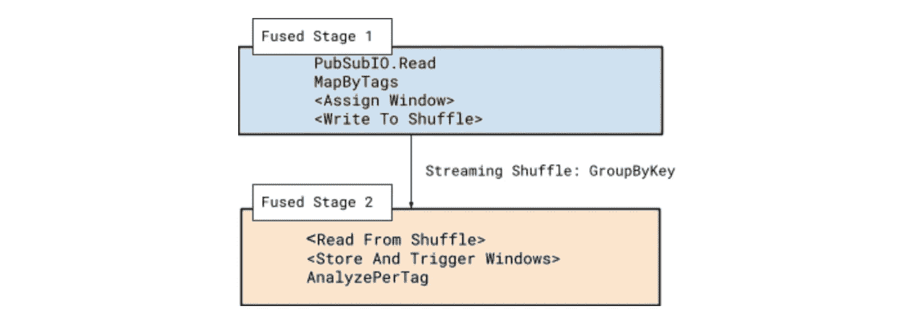
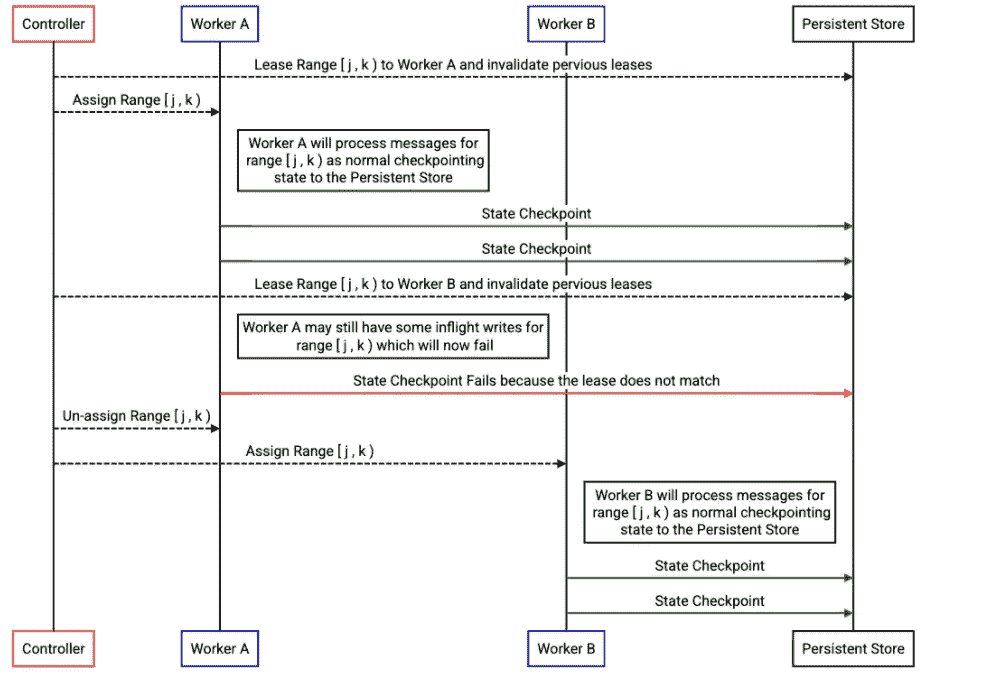

# 流媒体引擎:高可伸缩、低延迟数据处理的执行模型

> 原文：<https://medium.com/google-cloud/streaming-engine-execution-model-1eb2eef69a8e?source=collection_archive---------0----------------------->

# 引言:我为什么要写这个？

[Google Cloud Dataflow](https://cloud.google.com/dataflow/?utm_source=google&utm_medium=cpc&utm_campaign=na-US-all-en-dr-bkws-all-all-trial-e-dr-1009892&utm_content=text-ad-none-any-DEV_c-CRE_526598862430-ADGP_Desk%20%7C%20BKWS%20-%20EXA%20%7C%20Txt%20~%20Data%20Analytics%20~%20Dataflow_Data-KWID_43700061552833248-kwd-74728849964&utm_term=KW_google%20cloud%20dataflow-ST_google%20cloud%20dataflow&gclid=Cj0KCQiAlMCOBhCZARIsANLid6Z_dttPRxsWE3yB-t-eoTgK9RPUDPDJXwUUbYZBt2dBMAFc33ej4UYaAnwOEALw_wcB&gclsrc=aw.ds) 的[流媒体引擎](https://cloud.google.com/blog/products/data-analytics/introducing-cloud-dataflows-new-streaming-engine)被用于运行数据分析、ETL、ML 和其他类型的管道，其中许多管道正在处理**数千万条消息和每秒数十亿字节的数据。**在这些管道中，数据在**精确处理一次**的保证下进行处理，延迟始终保持在较低的**个位数秒。**我想写下允许我们构建和扩展流媒体引擎的各种设计选择，并通过这样做来回答我经常遇到的各种问题。

这篇文章旨在作为对[流 101](https://www.oreilly.com/radar/the-world-beyond-batch-streaming-101/) 和 [102](https://www.oreilly.com/radar/the-world-beyond-batch-streaming-102/) 以及[流系统](https://www.oreilly.com/library/view/streaming-systems/9781491983867/)讨论的深入补充。虽然这些文章在一定程度上探索了流处理的原理，但这篇文章深入研究了执行模型的一些具体细节，这些细节使得使用流引擎实现快速、可伸缩、正确的流成为可能。

我听到你说:“如果我用 [Apache Beam](https://beam.apache.org/) 编写我的管道，为什么流引擎的实现细节很重要？”除了一般的好奇心之外，如果你在流引擎上运行你的 Beam 管道，泄漏抽象的[定律](https://www.joelonsoftware.com/2002/11/11/the-law-of-leaky-abstractions/)暗示着不管在编程模型中投入多少精力和精力，没有完美的抽象会永远对你隐藏所有的细节。因此，理解流引擎的执行模型将有助于填补抽象与流引擎如何运行管道的“基本事实”之间的差距。有了这些知识，您将能够更好地理解在执行大型分布式管道时的权衡，从而选择更具可伸缩性和效率的设计。

让我们开始吧…

# 从流水线代码到执行图

为了将这一讨论建立在某种现实的基础上，并且使其更容易理解，让我们从一个具体的示例管道开始。我不想在真空中描述架构，所以我将用示例管道来比较它。对于我们的示例，让我们编写一个简单的管道，从 PubSub 读取消息，对于消息体中遇到的每个#hashtag，生成包含该标记的消息的特定时间分析。我们通过以下方式实现这一目标:

当一个管道被提交给数据流服务执行时，它首先被转换成一个被称为“优化”管道图的执行计划。诸如运算符融合、合并器提升、展平解压缩等优化被应用于原始管道，以产生具有等效语义的新管道。更多关于 fusion 的信息请点击[这里](https://cloud.google.com/dataflow/docs/guides/deploying-a-pipeline#fusion-optimization)。输出是一个有向无环图(DAG ),有称为阶段的节点和表示连接阶段的数据洗牌的边。每个阶段大致执行以下操作序列:

*   从 shuffle 输入或数据源读取:这是数据进入阶段的方式，可以来自前一个(上游)阶段，也可以来自一些外部数据源，如 Cloud Pub/Sub、Kafka、GCS 等。
*   应用一系列用户定义的转换/函数(UDF):这是这个阶段数据流管道的“业务逻辑”。这可能包括转换、聚合、窗口等。在许多情况下，这还包括连接到数据接收器的逻辑，如 BigQuery、Cloud BigTable 等。
*   将结果更改提交到持久状态和输出混洗:将要混洗的输出发送到下游的后续阶段进行处理。序列的这一部分也确保了持久性和正确性，我们将在下面详细讨论。

该图中的边表示将一个这样的节点的输出连接到另一个节点的输入的混洗流。对于我们的示例管道，数据流将到达下图:

我们的优化图将只包含对应于不需要数据混洗的操作融合的两个阶段。融合被流水线中间的 GroupByKey 操作所暗示的洗牌所中断。请注意，只有在将同一标签的所有消息混洗到同一个键上，并且窗口关闭后，才能进行完全聚合。

*提示:您可以使用以下命令检查数据流作业的结果融合阶段和优化图:*

*关于监控聚变的文档* [*这里*](https://cloud.google.com/dataflow/docs/guides/deploying-a-pipeline) *提供了更多的细节。例如，对于上面的管道，输出看起来会像这样:*

# 可伸缩性:键和并行性

单个流引擎管道每秒可以并行处理数千万条消息。为了实现这一点，同时保持恰好一次的处理，流引擎采用了许多技术，包括消息批处理、并行执行、仔细的流水线操作以及无细粒度障碍的持久状态的排序。每个要在串流引擎中处理的消息都与一个特定的“键”相关联，给定融合阶段的所有消息处理都在该键的上下文中执行。

什么是钥匙？键是一个标识符，它允许我们将相关消息的状态联系起来。此上下文中的“相关”是指用户想要分组(如 GroupByKey 中)以进行聚合的消息。这个键与[键值存储](https://en.wikipedia.org/wiki/Key%E2%80%93value_database)中的键完全相同。事实上，与每个键相关联的状态就存储在这样一个键值存储中， [BigTable](https://research.google/pubs/pub27898/) 。

在上面的示例管道中，我们按标签混洗到阶段 2——这允许我们为每个标签累积计数。具体来说，在融合阶段 2 中应用 UDF 将在这些密钥的上下文中执行。这允许正确和有效地管理计算延迟计数操作所需的每个键的状态，实现为窗口和触发。

在许多情况下，就像我们的示例管道的第 2 阶段一样，键显然是处理输入的结果。然而，在其他情况下，当键没有语义意义时，键由实现隐式选择。例如，在融合阶段 1 中，当从 PubSub 读取时，对于键值没有语义意义。事实上，密钥甚至不是用户级别的概念。然而，由于仍然存在要跟踪的隐式系统状态(例如与恰好一次处理相关的状态，以及下游洗牌——下文对此有更多描述),所以键由实现来分配和管理。

消息处理是按键串行的。具体而言，一旦给定融合阶段的 UDF 被应用于给定键的一批消息，则该键的其他传入消息将被缓冲，直到当前批的处理完成。这样做的主要原因是一种设计选择，可以实现每个键的高吞吐量。由于应用 UDF 的结果会导致对持久状态的修改，因此序列化每个键的处理允许有效的状态缓存以及盲写，而不是完整的事务或细粒度的障碍。(为什么任何转换的应用都必须导致持久的状态突变？即使没有明确的用户指定的状态，也通过每个键的状态跟踪来实现“恰好一次”处理，因此，至少，消息处理会导致对存储的“恰好一次”状态的修改——在下面的部分中对此有更多的介绍。)

这种方法带来了高度的可伸缩性，但重要的是要有足够的并行性。换句话说，由于处理是在可用的键上进行的，所以键的数量不足会导致处理出现瓶颈。换句话说，可用键的数量是可能的并行线程数量的上限。“热键”是这个问题的另一种表现。虽然一个键空间可能很大，但是“热键”的存在意味着只有少数几个键占据了大部分通信量，从而使这些键成为瓶颈。因此，在评估流水线设计时，处理并行性是一个重要因素，因为任何阶段的并行性不足都会导致性能下降。从某种意义上来说，我们已经重新建立了 [Amdahl 定律](https://en.wikipedia.org/wiki/Amdahl%27s_law)对于流的一个结果——可能的加速受限于并行执行的程度。

*提示:您可以通过检查“data flow . Google APIs . com/job/processing _ parallelism _ keys”指标来查看作业的每个融合阶段的并行度。有关度量的更多信息，请点击***和* [*点击*](https://cloud.google.com/monitoring/api/metrics_gcp#gcp-dataflow) *。**

# *分区和分布式执行*

*融合阶段 2 中语义上有意义的关键字将是在处理输入消息时遇到的标签。如果源字典全部是英语，那么在任何一个时间点都将有多达几十万个不同的键。我们处理的每个阶段的这些不同的键形成了执行工作的划分和分配的基础，以便我们可以扩展我们的系统。*

**

*第一个重要的细节是，首先对逻辑关键字进行哈希处理，哈希将被添加到 Streaming Engine 中所有操作的关键字之前。后端中所有基于键的操作都使用键作为不透明的标识符，让每个键都加上哈希可以解决几个问题。首先，它允许我们将一个无界的键空间映射到一个所有前缀都是有界范围的一部分的键空间。当我们使用 64 位散列时，所有散列的可能集合存在于限定前缀的区间[0，INT64 _ MAX 中。这让我们可以推理出按字典顺序排序的“整个”键空间，并对其进行有意义的操作，我们将在下面看到。*

**

*另一个重要的特性是，逻辑键空间的空间局部性被哈希前缀打破。这意味着任何表现出局部性的键上的负载分布模式都会在散列空间中被“涂抹”。举一个例子来说明这一点的重要性:假设你的信息是搜索查询，会有一些非常常见的词有几乎一样常见的拼写错误。这些在词法上是接近的，但在哈希空间中是远离的。当我们讨论如何在许多工人之间实现工作分配时，这将变得很重要。*

*让我们回到我们的示例管道。有两个不同的键空间与之相关联，每个融合阶段一个。不需要对流经的消息类型和将要遇到的键类型做任何假设，我们就知道散列域中每个键空间的全部值。*

**

*然后，串流引擎将这些键空间中的每个键空间划分为一组不同的键范围，这些键范围完全覆盖了每个键空间。每个融合级的每个密钥空间的分区是独立的，并且可以不同。例如，键空间可以按如下方式划分，其中每个范围将包含任何在词法上属于它的键。例如，如果我们的键“Banana”具有散列 5E58716B24，那么完整的键<5E58716B24,”Banana”>将包含在阶段 2 范围[5678，DEF0 的键空间中，因为散列值落在该范围的开始和结束前缀之间。*

**

*然后，将这些范围分配给管道可用的流引擎工作线程。这些范围表示这些工作线程对所包含的键的独占所有权。这确保了它们被分配到的工作者是与那些键相关联的专用变异状态。这是在没有细粒度障碍或完整事务的情况下实现高可伸缩性的必要条件，如前一节所述。*

**

*这些分配的排他性是通过粗粒度的屏障(租约)来实施的，这些屏障阻止写入成功，除非工作者拥有给定的范围，因此实施了排他性。让我们详细了解一下，在从一个员工到另一个员工的范围重新分配中，这是如何实施的。称为“控制器”的流引擎组件管理关于范围到工作进程的分配的元数据，以及与持久性存储层的通信。持久存储层有必要实现租约语义，以保证只有具有有效租约的写入才被允许成功。*

**

*在上面的序列图中，我们可以看到控制器如何驱动特定范围从 Worker A 到 Worker B 的移动，以及来自 Worker A 的延迟写入如何在持久状态层被拒绝。这确保了 Worker B 在处理重新分配的密钥范围的流量时不会有任何读-修改-写竞争。*

*这些关键范围的分割也代表串流引擎的负载平衡单位。细分或重新划分范围边界，并更改每个人被分配到的工作程序，这是我们可以根据串流引擎中的各种性能测量来转移负载的机制。对于流媒体引擎来说，这是一个开放的、正在进行的研究领域，我希望在以后的文章中介绍它。*

# *有效的工作生命周期*

*到目前为止，我们已经讨论了处理图是什么样子，关键是什么，以及我们如何划分和扩展我们的处理。但是我们还没有处理任何实际数据！流经串流引擎的消息实际上会发生什么情况？这又一次有助于将我们的讨论建立在具体的现实基础上。让我们看一下为阶段 2 分配了某个范围的键的 worker，这意味着它位于标签上 GroupByKey 操作分组的 shuffle 的接收端。假设我们的工人被分配了包含(散列的)关键字 Apple 而不是 Banana 的范围。然后我们会收到类似这样的消息:*

**<键:苹果，时间戳:10/11/21 1:30:12 UTC，数据:{PubsubMessages} >
<键:苹果，时间戳:10/11/21 1:31:48 UTC，数据:{PubsubMessages} >
<键:苹果，时间戳:10/11/21 1:36:02 UTC，数据:{PubsubMessages} >**

*让我们从“概念上”看一下发生了什么，然后讨论它在流引擎中是如何实际实现的。概括来说，会发生以下一系列事件:*

*   *对于每条消息，我们确定它是准时的还是迟到的。水印用于做出这一决定——要了解更多关于这个[流系统的信息，推荐阅读第 3 章](https://www.oreilly.com/library/view/streaming-systems/9781491983867/ch03.html)。*
*   *为了简单起见，我们来谈谈准时消息。这意味着现在还不是排放总量的时候。我们仍在“收集”部分聚合，并等待窗口关闭，然后才能物化总结果。在这种情况下，部分聚合被附加到键的状态。*
*   *当窗口关闭时(由水印确定),就到了具体化总聚合的时候了。我们读回累积的部分聚合状态，计算总聚合并将其发送到下一个处理阶段。*

*为了进一步讨论上述概念性步骤的实现细节，我们必须“放大”到 worker 的概念。当我们打开这个黑匣子时，在“工作者”的概念中实际上有两种不同的工作者，每一种从事不同的工作。*

**

*这两个工人通过“Windmill API”相互通信，这允许职责分离。用户工作人员调用 Windmill API 与 Windmill 工作人员进行通信，这包括以下内容:*

***GetWork** :返回风车工作器的输入，用户定义的转换将在其上运行。例如，来自 shuffle 的一批传入消息，或者准备触发延迟聚合的计时器。*

***GetData:** 返回在执行特定用户定义的转换期间所需的状态。诸如列表状态、包状态或映射状态的多种类型的存储状态允许有效地访问状态，而不需要总是具体化整个存储状态。[光束状态 API](https://beam.apache.org/documentation/programming-guide/#types-of-state) 提供了与该状态交互的直接方式。窗口聚合等概念也隐含地依赖于这种状态和 GatData。*

***commit network**:将应用用户定义的转换的结果从用户工作器发送到风车工作器。例如，要写入下游阶段的 shuffle 的元素，或者状态的突变。*

**提示:出于好奇，你可以在这里* *阅读整个风车 API 定义* [*。*](https://github.com/apache/beam/blob/master/runners/google-cloud-dataflow-java/worker/windmill/src/main/proto/windmill.proto)*

*Windmill API 中明显缺少诸如窗口或触发器这样的概念。这些完全在用户工作器中实现，使用 Windmill API 的状态和定时器的低级语义。为了帮助理解它是如何工作的，让我们回到我们在阶段 2 的消息处理中应该发生什么的概念描述，并在记住两个 workers 和 windmill API 的情况下更详细地跟踪执行。*

**

*按照上面的顺序，我们可以理解责任的划分。windmill worker 主要负责消息、状态和计时器的排队和持久状态。用户工作器负责应用用户提供的转换以及更高级别的原语，如窗口，并将结果翻译回 Windmill API。风车工作者由状态支持，确保一致的处理，而用户工作者是无状态的。我们将在下面的正确性一节中详细讨论这是如何实现的。但首先，让我们解决管道设计的一个常见陷阱:*

# *长时间运行或停滞操作的影响*

*在大多数情况下，应用 UDF 的时间在毫秒量级。然而，在有些情况下，这个时间可能会明显更长—通常是在涉及到阻塞对其他服务的调用时。这种长时间运行的操作可能是一个挑战。我们有时听到的一个问题是“为什么我们不能忽略卡住的操作，继续处理其他所有的事情？”*

*如果没有来自管道代码的额外工作，在数据流中“忽略”一个卡住的操作并继续处理所有其他操作基本上是不可能的。*

*流式数据流中的所有处理都是在键的上下文中执行的，并且由于上一节中解释的原因，每个键的消息处理是串行的。因此，永远阻塞的操作将最终阻塞对所有到达该键的进一步消息的处理。为了保证只发送一次，流引擎永远不会丢弃数据，因此未决消息将继续等待。最初，只有分配给相同键的消息会受到影响。最终，缓冲区将会增长，一旦触发了不同级别的内存预算和流量控制限制，处理将会全部暂停。*

*那么对此能做些什么呢？最好的选择总是找出为什么操作要花很长时间，并解决这个问题。这通常涉及重新思考管道设计，避免昂贵或阻塞的操作，而是依赖内置的数据接收器，如 PubsubIO 和 BigQueryIO，它们旨在实现大规模性能。当然，通过谨慎应用批处理、适当位置的超时和重试限制，可以实现可伸缩的自定义接收器。*

**提示:执行用户转换的时间分布直方图很快将作为一个指标发布。这将有助于指示所经历的延迟是否合理，以及是否有任何长期运行的掉队者可能会限制吞吐量。**

# *正确性:恰好一次处理*

*关于正确性和一次性处理的更广泛、更深入的讨论，请参见[流系统第 5 章](https://www.oreilly.com/library/view/streaming-systems/9781491983867/ch05.html)。这里，让我们关注几个关键点，这样我们就可以更深入地了解特定于执行的细节。当谈到处理的“正确性”时，我们通常指的是以下概念:*

*   *每个收到的信息都至少被处理过一次吗*？*这意味着没有消息丢失或丢弃。至少一次语义不排除重复。*
*   *每个传入的消息都被处理过一次吗？这意味着消息至少被处理过一次，而且只有一次。应该过滤掉任何重播的消息。*

*串流引擎始终保证对任何内部重放进行恰好一次的处理，并且可以保证对提供足够语义的外部源和接收器进行恰好一次的处理。让我们首先关注内部重放和容错。*

*什么样的事情会出错，导致消息丢失或重复？最常见的失败类型是员工因某种原因离开。这可能是由于崩溃、硬件故障、网络故障或任何其他无法完全预见的原因造成的。由持久状态支持的处理用于实现至少一次保证*。但是防止重播有点棘手。让我们放大到一些细节，重点是系统的哪些部分会崩溃，以及串流引擎如何处理这种情况。当我们的用户工作人员或风车工作人员在执行过程中崩溃时会发生什么？**

**

*在第一个场景中，我们看一下这样一种情况，当我们的用户 Worker 正在处理它通过 GetWork 收到的一些消息，然后崩溃了。上面的序列显示了我们如何向 worker 重放输入(以确保至少一次)，以及我们如何使用租约来确保只允许一个 CommitWork 响应返回到我们的 windler Worker。用户工作人员的每个实例化都有一个惟一的 id，用于使租约无效。因为用户工作者是无状态的，所以这种情况更容易处理。接下来，我们将看看更复杂的序列，我们用它来处理一个崩溃的风车工人。*

**

*跟踪上面的序列有助于我们理解 Windmill Worker 上持久化到持久化状态的仔细排序如何允许我们对重放具有弹性:当消息被打乱时，我们对照传入的消息 id 检查先前持久化的消息 id，以确定该消息是否是重复的。如果它不是重复的，我们允许它处理。一旦处理完成，我们就保存由提交调用产生的状态变化、刚刚处理的消息的消息 id 以及任何想要的混洗输出。我们以原子方式执行对持久状态的写入，保证代表消息的所有有状态更改要么一起提交，要么根本不提交。一旦持久化到持久状态完成，我们就可以向上游工作进程确认传入的 shuffle，并允许下游 shuffle 开始，写入持久状态的更改现在保证消息已被处理，并且将来的尝试将被拒绝。要了解这是如何发生的，请考虑以下工人崩溃的顺序:*

**

*要考虑的第一个场景是，如果我们的 windmill worker 在接收到传入 shuffle 上的消息之后，但在将处理结果持久化到持久化状态之前崩溃。在这种情况下，传入的 shuffle 请求永远不会被成功确认，并将重试该工作线程的新实例。因为没有完成对持久状态的写入，所以这些消息不会被标记为重复，并且将被允许继续处理。*

**

*要考虑的第二个场景是，如果我们的 windler 工作线程在写入持久状态已经成功完成之后，但在我们向上游发送确认或开始向下游进行预期的洗牌之前崩溃，会发生什么情况。在这种情况下，当我们从上游重试 shuffle 时，我们将使用持久状态中存储的信息来确定传入的消息是重复的，并且已经被处理。这将允许我们立即承认洗牌已经成功。我们计划的下游洗牌呢？嗯，我们也将这些存储在 state 中，作为启动新 worker 实例的一部分，我们也将开始向下游 worker 发出这些 shuffles。*

*在工人何时崩溃的序列中，关于一个主题还有一些其他变化，但所有这些变化都导致相同的事情——保证我们的处理结果在管道的每个阶段都被准确地写入持久状态一次。*

**提示:通过检查指标
‘data flow . gooogleapis . com/job/duplicates _ filtered _ out _ count’可以获得被过滤为重复的消息的数量，如这里的***所示。***

**细心的读者会注意到，这一切都很好，但细节中有一个魔鬼。您可能会问，如果位于 GetWork 和 CommitWork 之间的 UDF 对外部系统执行一些非幂等操作——比如告诉银行电汇一些资金——会发生什么？那么，在这种情况下，您将有潜在的重播，因为流媒体引擎并没有内在地防止这一点-钱可能会被电汇两次或更多。因此，当与管道代码中数据流之外的外部系统交互时，需要仔细考虑。**

**最常见的情况是，将管道输出写入外部系统(通常是 BigQuery、PubSub 和 GCS)时会出现这种情况。好消息是，在大多数情况下，写入是等幂的(GCS)，或者有问题的系统提供了一种机制来利用重复数据删除元数据(如消息 id)来扩展数据流管道边缘的一次性保证(BigQuery，PubSub)。对于那些将其管道与其他数据接收器集成的人来说，这是一个重要的细节——确保接收器可以正确地处理幂等重放，或者它可以利用可用的元数据来正确地消除重复。**

****总结思路:****

**在这篇文章中，我试图保持一种谨慎的平衡，给出了关于流引擎的足够的技术深度，而没有用不相关的实现细节让你不知所措。我写这一切的希望是，下次你去写或调整一个流数据流作业，你会知道如何使它在流引擎上执行和缩放。如果你想让我对我提到的任何话题进行更深入的探讨，请在评论中告诉我。**