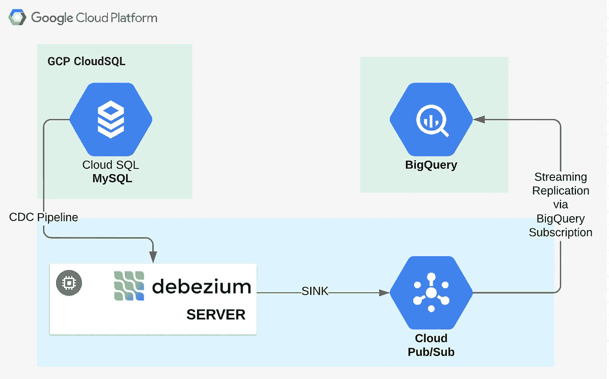
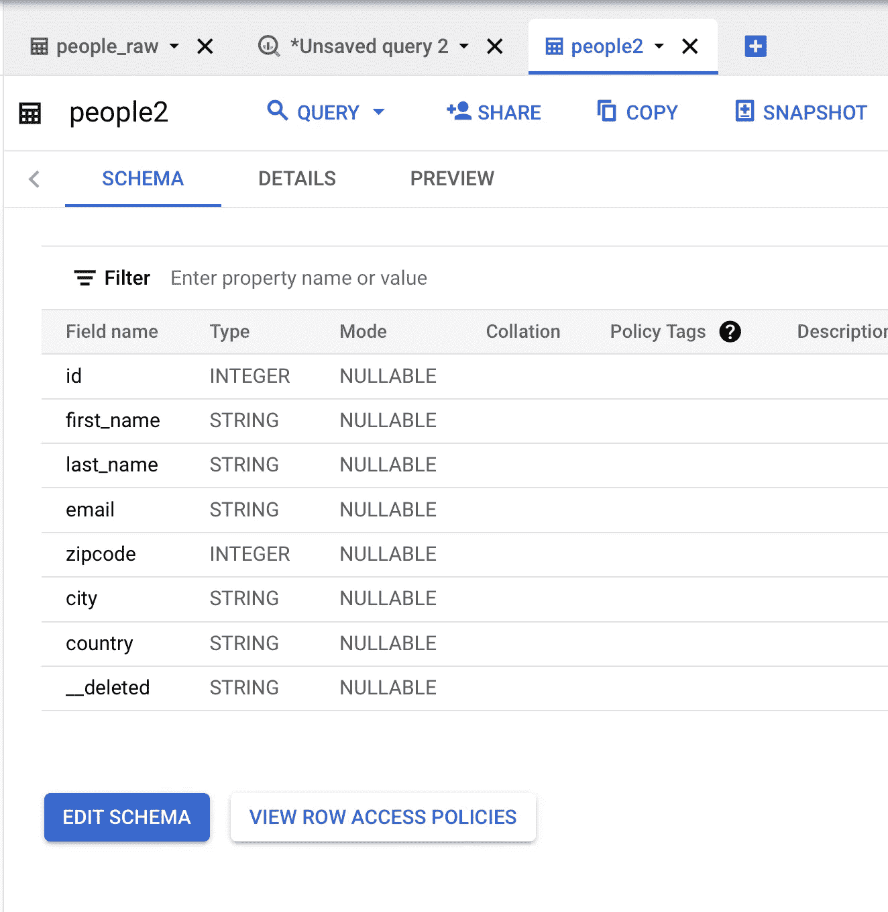
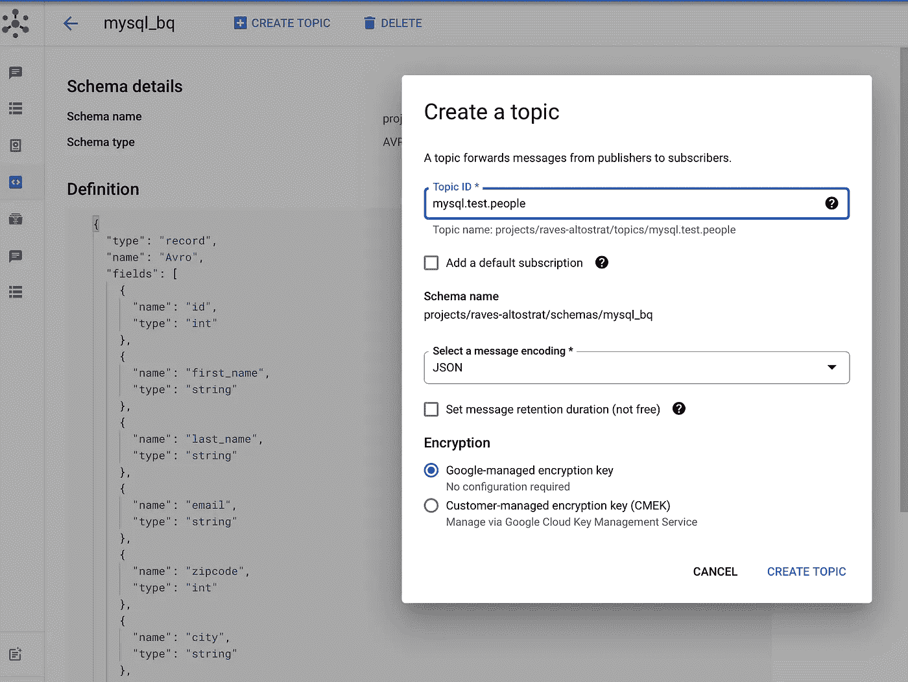
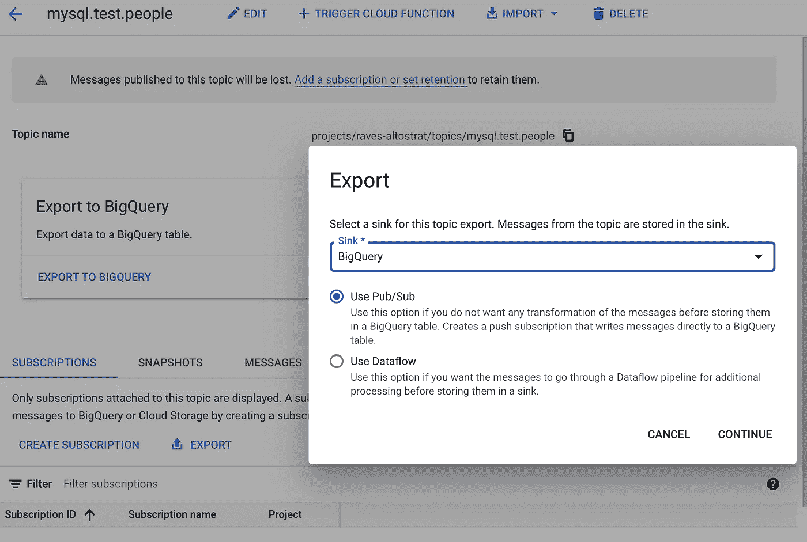
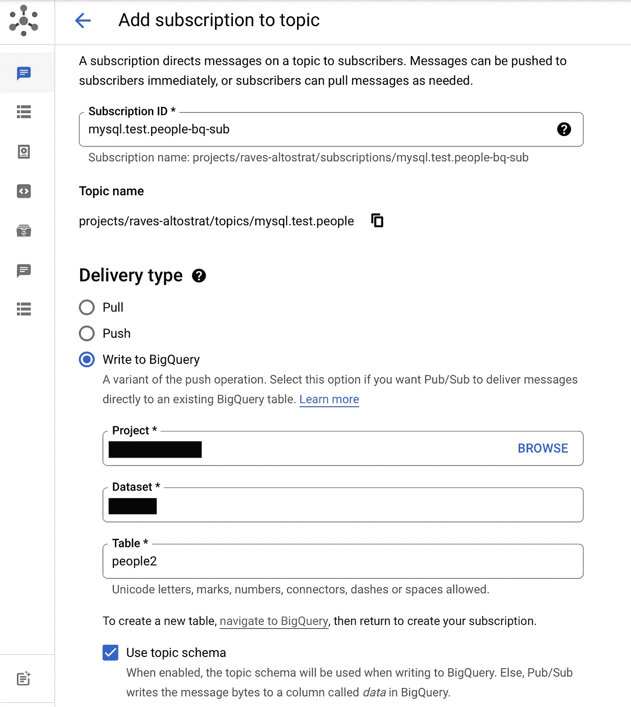
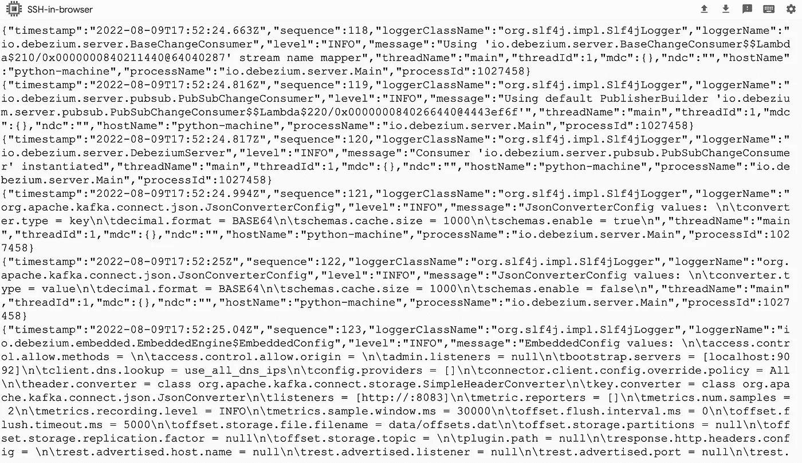
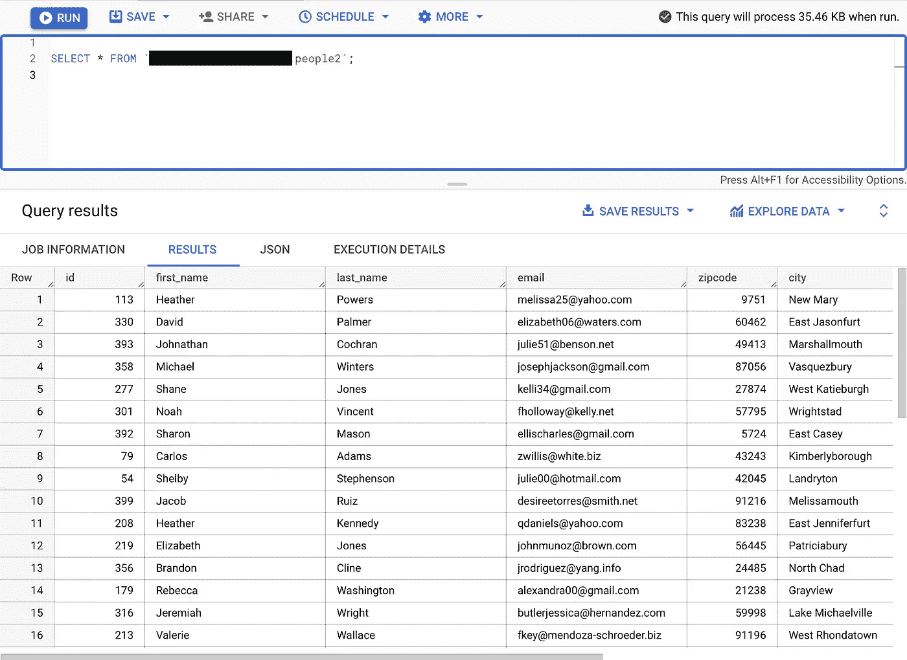

# 从 Google Cloud Pub/Sub 流至 Bigquery，无需中间人

> 原文：<https://medium.com/google-cloud/streaming-from-google-cloud-pub-sub-to-bigquery-without-the-middlemen-327ef24f4d15?source=collection_archive---------0----------------------->


[迈克尔·巴恩斯](https://unsplash.com/@mikeyb63?utm_source=unsplash&utm_medium=referral&utm_content=creditCopyText)在 [Unsplash](https://unsplash.com/s/photos/bypass?utm_source=unsplash&utm_medium=referral&utm_content=creditCopyText) 上拍照

要将数据从发布/订阅实时接收到 BigQuery，必须利用数据流管道以及模式定义和所需的转换(如果有的话)。不过，如果只需要接收原始数据，或者不需要从发布/订阅转换到大查询，这也是一个挑战。

因此，为了进一步简化这种简单的用例，谷歌现在已经通过[“大查询订阅”](https://cloud.google.com/pubsub/docs/bigquery)推出了来自 Pub/Sub 的直接流媒体功能。此外，发布/订阅主题模式提供了将发布/订阅消息写入具有兼容模式的 BigQuery 表的选项。如果没有为您的主题启用模式，消息将作为字节或字符串注册到给定的 BigQuery 表中。你可以在这里[浏览它的细节，但是在这个博客中，我想做一个快速的设置来展示它的简单性，让你对它的实现更舒服。](https://cloud.google.com/pubsub/docs/bigquery)

让我们考虑一个场景，您希望利用 Google Cloud 本机解决方案为 CloudSQL MySQL 表*【people】*到 BigQuery 构建一个简单的实时 CDC 管道，例如:

*   **“Debezium Server”**用于捕获 MySQL 表的变更日志*“people”*。
*   **创建 BigQuery 表***【people 2】*，CDC 工作负载将被接收到该表中。
*   **使用与 BigQuery 表*“people 2”*兼容的 Avro 框架创建发布/订阅主题模式**。
*   **创建与 Debezium 服务器兼容的发布/订阅主题**，附加到上述主题模式。
*   **创建附加到上述发布/订阅主题的 BigQuery 订阅**。
*   启动 Debezium 服务器,这样它将开始把变更日志作为消息推送到相关的发布/订阅主题。
*   相应的**发布/订阅**消息在被直接推送到提供的**大查询**表之前，利用附加的发布/订阅模式进行解码。



**作者发布/订阅 BigQuery 直接流**

现在，让我们卷起袖子，开始同样的实施:

## 设置和配置 Debezium 服务器:

*   下载并安装 [Debezium 服务器发行版](https://repo1.maven.org/maven2/io/debezium/debezium-server-dist/1.9.5.Final/debezium-server-dist-1.9.5.Final.tar.gz)。
*   配置 Debezium 服务器 ***”。/conf/application _ properties "***，其中将包含与源、宿、格式&适用转换相关的所有配置。
*   以 CloudSQL — MySQL 数据库作为源，以 Google Cloud PubSub 作为消息传递基础设施的配置文件如下所示:

```
debezium.sink.type=pubsub
debezium.sink.pubsub.project.id=<<$PROJECT_ID>>
debezium.source.connector.class=io.debezium.connector.mysql.MySqlConnector
debezium.source.database.hostname=10.67.112.10
debezium.source.database.port=3306
debezium.source.database.user=root
debezium.source.database.password=mysqldb
debezium.source.database.server.id=373472625
debezium.source.database.server.name=mysql
debezium.source.database.include.list=test
debezium.source.table.include.list=test.people
debezium.source.database.history=io.debezium.relational.history.FileDatabaseHistory
debezium.source.database.history.file.filename=data/history.dat
debezium.source.offset.storage.file.filename=data/offsets.dat
debezium.source.offset.flush.interval.ms=0
debezium.source.transforms=unwrap
debezium.source.transforms.unwrap.type=io.debezium.transforms.ExtractNewRecordState
debezium.source.transforms.unwrap.delete.handling.mode=rewrite
debezium.source.key.converter.schemas.enable=false
debezium.source.value.converter.schemas.enable=false
```

*   基于 BigQuery 订阅[模式兼容性](https://cloud.google.com/pubsub/docs/bigquery#schema_compatibility)在 BigQuery 中创建目标表。



**作者的 BigQuery 表定义**

*   用 Apache Avro 框架创建发布/订阅模式*“MySQL _ bq”*。

```
{
  "type": "record",
  "name": "Avro",
  "fields": [
    {
      "name": "id",
      "type": "int"
    },
    {
      "name": "first_name",
      "type": "string"
    },
    {
      "name": "last_name",
      "type": "string"
    },
    {
      "name": "email",
      "type": "string"
    },
    {
      "name": "zipcode",
      "type": "int"
    },
    {
      "name": "city",
      "type": "string"
    },
    {
      "name": "country",
      "type": "string"
    },
    {
      "name": "__deleted",
      "type": "string"
    }
  ]
}
```

*   创建与上述模式相关联的发布/订阅主题*“MySQL . test . people”*。



**由作者创建连接到 mysql_bq 模式的发布/订阅主题**

*   将 BigQuery 订阅添加到发布/订阅主题中。



**发布/订阅 BigQuery 订阅，按作者**



**发布/订阅 BigQuery 订阅，按作者**

*   启动 Debezium 服务器。

```
**<<Debezium_Server_Path/run.sh>>**
```



**Debezium-服务器输出，作者**

*   **还有，Wollaaa…** 这里，我们在 BigQuery 中有表格格式的 CDC 数据。



**作者从发布/订阅到 BigQuery 直播**

# 参考资料:

[](https://cloud.google.com/pubsub/docs/subscriber) [## 选择订阅类型|云发布/订阅| Google 云

### 本文档概述了不同类型的订阅在发布/订阅中的工作方式。重点:了解一个…

cloud.google.com](https://cloud.google.com/pubsub/docs/subscriber) [](https://cloud.google.com/pubsub/docs/bigquery) [## BigQuery 订阅|云发布/订阅文档| Google 云

### BigQuery 订阅在收到消息时将其写入现有的 BigQuery 表。你不需要…

cloud.google.com](https://cloud.google.com/pubsub/docs/bigquery) [](https://faun.pub/writing-a-pub-sub-stream-to-bigquery-401b44c86bf) [## 将发布/订阅流写入 BigQuery

### 我们将探索 Google 云平台的两个重要组件:PubSub 和 BigQuery。

faun.pub](https://faun.pub/writing-a-pub-sub-stream-to-bigquery-401b44c86bf)