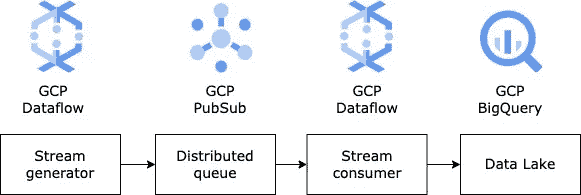
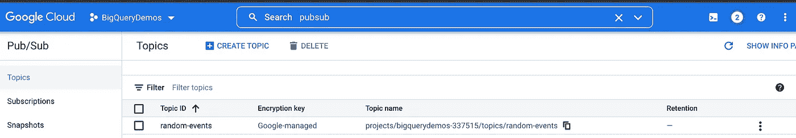
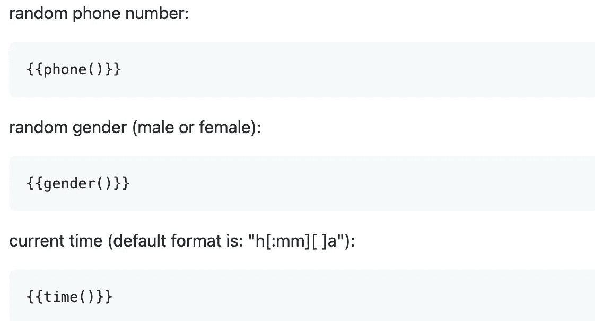
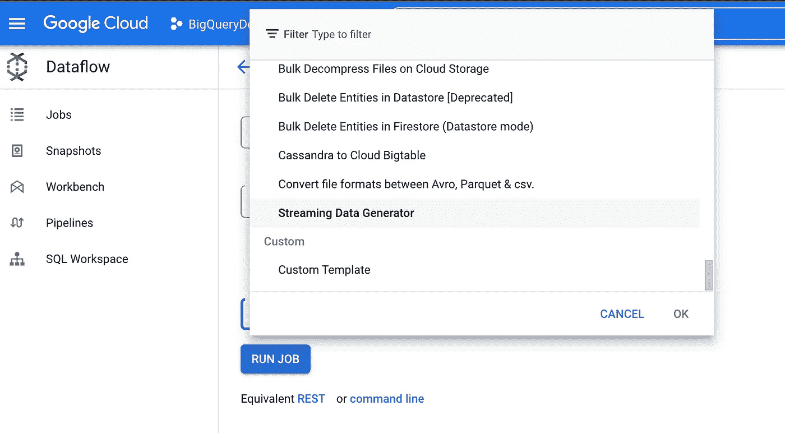
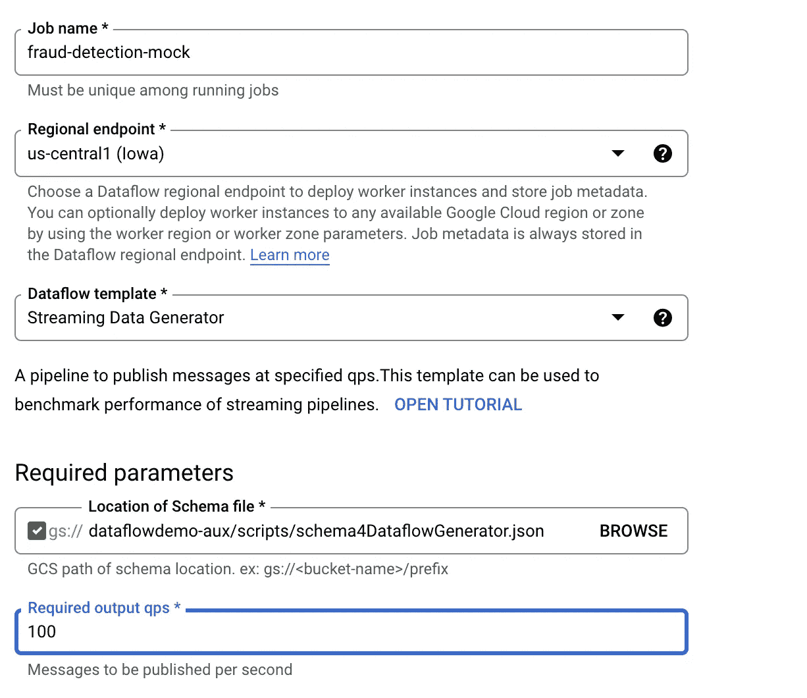
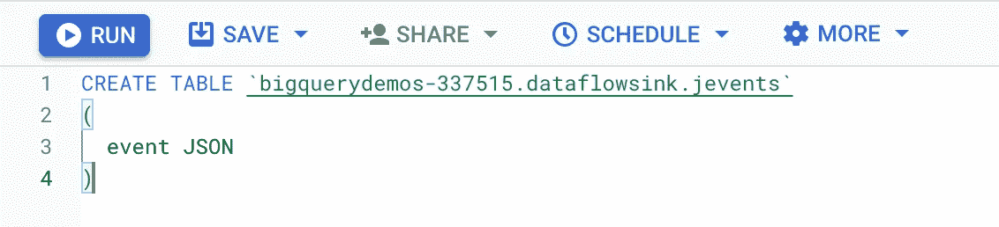
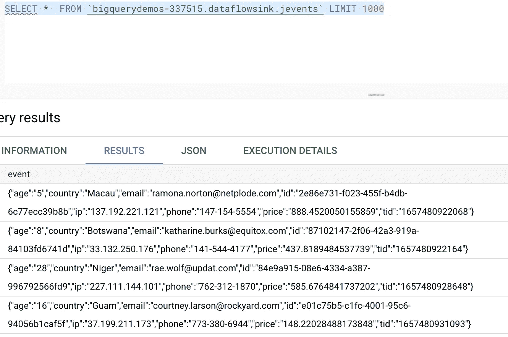
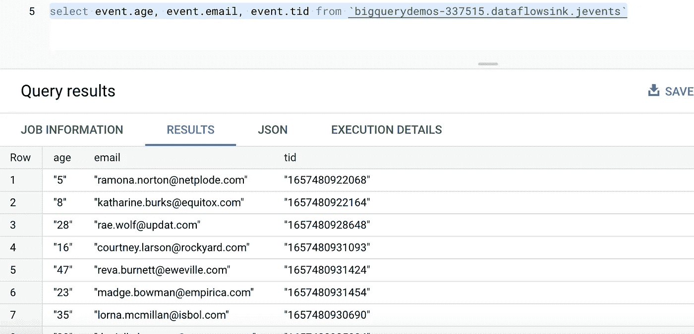
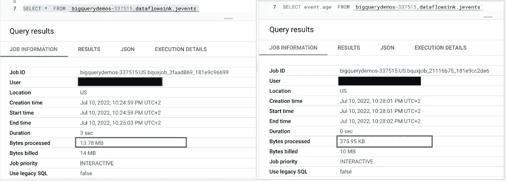

# 将 JSON 消息流式传输到 BigQuery JSON 类型的列

> 原文：<https://medium.com/google-cloud/streaming-json-messages-into-bigquery-json-type-column-7b9702a49a36?source=collection_archive---------0----------------------->

Google 最近宣布了 BigQuery 的新数据类型——JSON。因此，BigQuery 用户能够插入半结构化的 JSON 消息，而不需要提供消息模式，也不需要将消息简化为结构化格式。然而，正如我们将在本文中展示的，在 BigQuery 表单元格中存储 JSONs 的可能性远不止这些:

1.  BigQuery 工程师用简单的 SQL 和对子结构和属性的简单点标记访问使得解析 JSON 结构变得非常容易。
2.  与大多数云数据仓库不同，BigQuery 将 JSON 元素表示为存储级的单个虚拟列，因此 BigQuery 也能够对 JSON 列应用列压缩。
3.  作为#2 的结果，当用户查询具有 JSON 列的表并只选择 JSON 消息中可用元素的子集时，BigQuery 不需要读取整个 JSON 消息，而是能够只获取请求的元素，这大大减少了需要处理的字节数，从而提高了性能，并降低了按需 BigQuery 计划的成本，该计划具体取决于处理的字节数。
4.  请看这个:用户可以**将** JSON 消息直接流入带有 JSON 列的 BigQuery 表。

本文旨在成为一个实践指南，展示上面列出的所有优点。


# 语境

假设我们有一个验证电子商务交易的欺诈检测系统。每次有新的支付请求时，电子商务支付服务都会要求我们的系统对欺诈风险进行评分。评分由机器学习算法处理，该算法定期重新训练以从新数据中学习模式。训练用于欺诈检测的机器学习模型超出了本文的范围，但是我们将展示如何在我们的系统和数据分析后端之间建立一座桥梁，这些模型就是在这里制作的。因为机器学习模型从数据中学习，我们的桥的主要职责将是将传入的评分请求的有效载荷传递到数据湖，然后由我们的数据和机器学习工程师使用。

就本文而言，在点击支付按钮和风险评分的机器学习模型之间发生的一切都是由数据流作业抽象的。该作业从流数据生成器模板实例化，以生成代表评分请求有效负载的 JSON 消息。

消息被发送到由 GCP 公共订阅服务处理的分布式队列，该服务将我们的欺诈检测系统与数据分析后端相分离。

> 我们强烈推荐阅读 Spotify 如何将其事件交付系统从 Kafka 迁移到 GCP PubSub:[https://cloud . Google . com/blog/products/GCP/spotifys-journey-to-cloud-why-Spotify-migrated-its-event-delivery-system-from-Kafka-to-Google-cloud-PubSub](https://cloud.google.com/blog/products/gcp/spotifys-journey-to-cloud-why-spotify-migrated-its-event-delivery-system-from-kafka-to-google-cloud-pubsub)。



然后，我们需要的东西，将拉从 GCP 公共订阅主题的消息，因为他们来到，并把它们推到 BigQuery。这项任务也将由数据流作业处理。

# 设置

以下是在 Google Console 中重现这种设置时需要做的一些事情的高级列表:

1.  为我们的消息创建发布订阅主题。我们的主题是随机事件:



2.创建服务帐户，该帐户将能够从/向您的 PubSub 主题读取和写入消息。

3.我们的 JSON 消息将具有良好定义的模式，但值将非常随机，为了生成这样的消息，我们将使用流数据生成器模板使用的[数据生成器](https://github.com/vincentrussell/json-data-generator)库。流数据生成器模板将需要指向描述消息字段的所谓模式文件的路径。数据生成库允许我们为每个模式字段使用不同的 faker 函数:



我们的模式将由以下字段组成:

```
{
  "id": "{{uuid()}}",
  "email": "{{email()}}",
  "ip": "{{ipv4()}}",
  "phone": "{{phone()}}",
  "age": "{{integer(1,50)}}",
  "price": "{{double(1,1000)}}",
  "tid": "{{timestamp()}}",
  "country": "{{country()}}"
}
```

保存这个文件，上传到 Google 云存储桶。

4.从数据流生成器模板创建数据流作业。



该模板有两个必需的参数:

*   模式位置的 GCS 路径，这是我们的消息的模式文件的位置。
*   输出 QPP，这是预期的每秒输出消息数。我们用了 100。



点击**运行作业**按钮。您的数据流作业应该开始将消息流式传输到 PubSub 主题。

5.用 JSON 列创建 BigQuery 表。JSON 类型的语法相当简单:



bigquerydemos-337515 代表 GCP 项目 id (p **请注意，您将需要自己的 GCP 项目。bigquerydemos-337515 是我的**)，dataflowsink 表示 BigQuery 数据集名，jevents 表示 BigQuery 表名。

# 结论

我们将从最后开始处理第 1–4 项，这意味着我们将首先在 PubSub topic 和 BigQuery 之间设置流作业，以将我们的 JSON 消息流式传输到带有 JSON 列的 BigQuery 表中。

> 4.用户可以将**JSON 消息直接流入带有 JSON 列的 BigQuery 表。**

然而，这一次没有准备好重用的数据流模板。我们需要编码所谓的数据处理管道，可以理解为数据处理步骤的图形。

正如 remainder: Dataflow 是 Apache Beam 的托管服务——定义批处理和流数据并行处理管道的统一模型。Apache Beam 就是这样——一些关于如何定义数据处理管道的建议，以便相同的代码可以在任何地方执行:本地，也可以在许多受支持的分布式执行引擎中的一个上执行，如 Spark、Flink 和……data flow。是的，Dataflow 也是非常可扩展的分布式执行引擎。

我们可以用 java 或 python 实现数据流处理图。这里我们使用了 python。

我们的管道由 5 个步骤组成:

*   从 PubSub 主题中提取消息(由第 16 行的 beam.io.ReadFromPubSub 处理)
*   将 PubSub 消息(它只是一个字节流)转换成 UTF-8 编码的字符串(第 19 行)
*   BigQuery writer 希望我们将 BigQuery 表行表示为带有<key value="">对的 JSON，其中 key 表示列名，value 表示该列的值([https://beam . Apache . org/releases/javadoc/2 . 2 . 0/org/Apache/beam/SDK/io/GCP/big query/tablerowjsoncoder . html](https://beam.apache.org/releases/javadoc/2.2.0/org/apache/beam/sdk/io/gcp/bigquery/TableRowJsonCoder.html))。我们的表只有一个名为 event 的 JSON 类型的列(第 13 行)。因此，我们需要告诉 BigQuery，我们希望将我们的消息作为值注入到事件列中，并遵守 [TableRowJsonCoder](https://beam.apache.org/releases/javadoc/2.2.0/org/apache/beam/sdk/io/gcp/bigquery/TableRowJsonCoder.html) ，对于我们的表，我们需要使用单个<键、带有事件的值>对作为键构建 JSON，并将我们的 JSON 消息的字符串表示作为相应的值(第 20 行)。我们将 json.dumps 函数应用于我们的 json 消息，将其转换为转义字符串:例如:{"event": { "id": 10，" email ":"[foo@abc.com](mailto:foo@abc.com)" } }变成{ " event ":" { " id \ ":10，" email ":\ "[foo@abc.com](mailto:foo@abc.com)\ " } " }</key>
*   将代表 TableRow JSON 的字符串转换成 JSON 对象(第 21 行)。
*   使用 beam.io.WriteToBigQuery 模块将表示为 TableRow 对象的(流)消息写入 BigQuery(第 22 行)。

一旦执行，该代码将持续运行，作为从 PubSub 主题提取到 BigQuery 表的数据流作业流消息。

这里我们想强调的一点是，我们不修改原始的 JSON 消息——我们只是传递它并指定它应该被分配给哪一列。没有必要对我们的 JSON 消息进行逆向工程。

这里的最后一步是查询我们的目标 BigQuery 表:



> 1.BigQuery 工程师用简单的 SQL 和对子结构和属性的简单点标记访问使解析 JSON 结构变得非常容易。

让我们转到 Google Cloud 控制台，使用 BigQuery workbench 查询我们的目标表，并使用点标记法从我们的 JSON 消息中选择属性的子集:



虽然我们的 JSON 消息具有非常简单的模式，但是 BigQuery 中的点符号也可以用于遍历更复杂的结构。

> 2.与大多数云数据仓库不同，在存储级别上，BigQuery 将 JSON 元素表示为单独的虚拟列，因此 BigQuery 也能够对 JSON 列应用列压缩。
> 
> 3.作为#2 的结果，当用户查询具有 JSON 列的表并只选择 JSON 消息中可用元素的子集时，BigQuery 不需要读取整个 JSON 消息，而是能够只获取请求的元素，这大大减少了需要处理的字节数，从而提高了性能并降低了成本，因为在 BigQuery 按需计划中，成本具体取决于处理的字节数。

为了验证这一点，让我们向目标 BigQuery 表发送两个查询。第一个将是经典的 select star——因此 BigQuery 将读取所有 JSON 属性。第二个查询将只针对年龄属性:



“职务信息”选项卡包含得出某些结论所需的所有信息。事实上，使用 select star 查询，BigQuery 必须读取整个 JSON 消息，因此处理的字节数达到 13.78 MB。然而，当我们只查询 JSON 消息的单个属性时，BigQuery 只需要处理 376 KB，并且返回结果的速度要快得多。这个简单的实验表明，BigQuery 并不仅仅将我们的消息作为 blob，而是作为单独的虚拟列在内部持久化。

> ***本文由*** [***卢卡兹***](https://www.linkedin.com/in/lukasz-olejniczak-1a75a613/) ***和*** [***雅各布***](https://www.linkedin.com/in/jakubskuratowicz) ***合著。所表达的观点是作者的观点，不一定反映谷歌的观点。***

如果你喜欢这篇文章，请为它鼓掌。更多 google 云端数据科学、数据工程、AI/ML 关注我[***LinkedIn***](https://www.linkedin.com/in/lukasz-olejniczak-1a75a613/)***。***