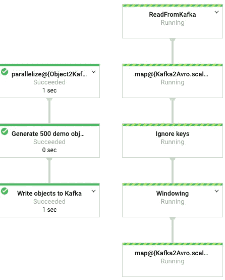
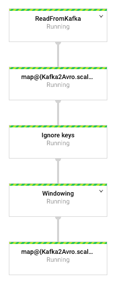
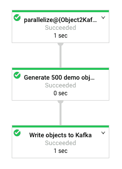

# Google 云平台上 Scala 和 Kafka 的流媒体管道

> 原文：<https://medium.com/google-cloud/streaming-pipelines-with-scala-and-kafka-on-google-cloud-platform-ef39c41fc1d3?source=collection_archive---------1----------------------->



我们将在这篇博文中推出的管道

谷歌云平台(GCP)提供了许多运行流媒体分析管道的选项。GCP 的基石消息队列处理系统是[云发布/订阅](https://cloud.google.com/pubsub/)。然而，[卡夫卡](https://kafka.apache.org/)可能是 Pub/Sub 最受欢迎的替代品，关于如何与其他 GCP 产品集成，目前还没有太多信息。

对于流处理，[数据流](https://cloud.google.com/dataflow/)是最先进的系统之一。为了在数据流上运行管道，我们必须使用 [Apache Beam](https://beam.apache.org/) ，这是一个开源的 SDK，可以在许多不同的系统上运行，如 [Apache Flink](https://flink.apache.org/) 、 [Apache Spark](https://spark.apache.org/) 和[许多其他的](https://beam.apache.org/documentation/runners/capability-matrix/)，而不仅仅是数据流。然而，在我写这篇文章的时候， [Beam SDK 只有 Java、Python、Go 和 SQL](https://beam.apache.org/documentation/sdks/java/) 版本，我深深地喜欢 Scala 和函数式编程。

当编写数据处理系统时，我认为函数式编程范式非常适合流处理的概念。对于像我一样喜欢 Scala 的人来说，幸运的是， [Spotify 开发了 Scio，这是一个用于 Apache Beam 的 Scala API](https://spotify.github.io/scio/)。尽管基于光束顶部，因此[可用于任何光束运行器](https://spotify.github.io/scio/Runners.html)，Scio 更关注数据流；这很有意义，因为其他典型处理系统(Spark、Flink)的原生 API 已经在 Scala 中了。事实上， [Scio API 的灵感来自 Spark，一些想法来自滚烫的](https://spotify.github.io/scio/Scio,-Scalding-and-Spark.html)。

它还附带了许多额外的好东西。我特别喜欢[BigQuery 的类型安全 API](https://spotify.github.io/scio/io/Type-Safe-BigQuery.html#using-type-safe-bigquery)，它允许将任何 BigQuery 表映射到 Scala 中的 case 类，自动从 BigQuery 推断模式——也就是说，*您不必为您的 case 类编写任何字段来表示您在 big query(！).*

# 这个例子

在这篇文章中，我们将使用来自谷歌云专业服务团队 Github repo 的这个例子:[https://Github . com/Google Cloud platform/Professional-Services/tree/master/examples/data flow-Scala-Kafka 2 avro](https://github.com/GoogleCloudPlatform/professional-services/tree/master/examples/dataflow-scala-kafka2avro)

在示例中，我们将设置两条数据流管道:一条将对象写入 Kafka，另一条从相同的 Kafka 主题中读取这些对象。管道是用 Scala 编写的，使用 Scio。

这里我假设你已经准备好了一个谷歌云平台项目。如果你以前从未使用过 GCP，你可以使用免费的 GCP 信用点数。

# 设置 Kafka 服务器

我们需要做的第一件事是建立一个 Kafka 服务器。通常，您会将 Kafka 作为一个集群来运行，但是对于这个示例，使用一个标准虚拟机(VM)就足够了。

要在虚拟机中部署 Kafka，[请参见上一篇文章](/@iht/setting-up-a-small-kafka-server-on-google-cloud-platform-for-testing-purposes-9958a47ea8b9)。对于您的虚拟机，您必须选择一个区域，尝试选择离您最近的[区域，该区域也有一个数据流端点](https://cloud.google.com/dataflow/docs/concepts/regional-endpoints)。

在我的例子中，我的区域是`europe-west1`，我将在区域`europe-west1-d`中部署我的 Kafka VM。当您部署了 Kafka VM 后，请回到这里继续学习本教程。

# 设置虚拟机来编译和触发管道

虽然我们可以使用云外壳来尝试编译管道，但是云外壳并不意味着进行繁重的计算，它更像是一个方便的外壳而不是 VM 来支持我们的计算。

因此，为了编译管道代码，并在数据流中触发它们，我们将创建一个小型虚拟机。如果你在之前的帖子中仍然有`test-vm`在运行，请删除它，因为我们需要添加一个额外的选项。

让我们创建一个`build-vm`，并确保它与我们的小型 Kafka 服务器在同一个区域中。我们需要确保这个虚拟机的范围允许它访问所有 Google Cloud APIs(否则它将无法触发数据流管道):

```
**$ export ZONE=europe-west1-d**
**$ gcloud compute instances create build-vm --zone=$ZONE                 --machine-type=g1-small                                             --scopes=https://www.googleapis.com/auth/cloud-platform** Created [[https://www.googleapis.com/compute](https://www.googleapis.com/compute/v1/projects/ihr-kafka-dataflow/zones/europe-west1-d/instances/test-vm)...
NAME     ZONE            MACHINE_TYPE  PREEMPTIBLE  INTERNAL_IP ...
build-vm europe-west1-d  g1-small                   10.132.0.4  ....
```

# 克隆谷歌云专业服务回购

我们示例的代码在[谷歌云平台专业服务 Github repo](http://github.com/GoogleCloudPlatform/professional-services/) 中。在这个报告中，我们包括了你的工作(和我们的工作)的所有类型的例子和工具！)在谷歌云平台上。

在这种情况下，我们要用这个例子:[https://github . com/Google cloud platform/professional-services/tree/master/examples/data flow-Scala-Kafka 2 avro](https://github.com/GoogleCloudPlatform/professional-services/tree/master/examples/dataflow-scala-kafka2avro)

在该目录中，您会发现两条用 Scala 编写的数据流管道。

其中一个管道是*生成器*，它将向 Kafka 填充一些消息。消息实际上是序列化的对象(case 类的实例)，它们被转换成 base64 编码的字符串。所以我们不仅传递字符串消息，我们还通过 Kafka 主题传递整个对象！

另一个管道是*消费者*，它将监听相同 Kafka 主题中的更新，将恢复对象，将它们转换为 [Avro 格式](https://avro.apache.org/)，并将对象复制到 Google 云存储中。因此，从某种意义上说，这个*消费者*管道正在对发送到该主题的所有对象进行备份。

让我们从克隆 Github repo 开始，并切换到示例的目录。首先，我们需要 ssh 到`build-vm`并安装一些缺失的依赖项:

```
**$ gcloud compute ssh build-vm --zone=$ZONE**
**build-vm$ sudo apt install -y git apt-transport-https kafkacat default-jdk** [...]**build-vm**$ **git clone** [**https://github.com/GoogleCloudPlatform/professional-services.git**](https://github.com/GoogleCloudPlatform/professional-services.git)
Cloning into 'professional-services'...
remote: Enumerating objects: 48766, done.
remote: Total 48766 (delta 0), reused 0 (delta 0), pack-reused 48766
Receiving objects: 100% (48766/48766), 189.70 MiB | 25.66 MiB/s, done.
Resolving deltas: 100% (14245/14245), done. 
```

# 配置文件

传递给管道的选项通过配置文件设置。这个配置文件与编译后的代码一起打包在生成的 JAR 包中。

其中一个选项需要在 [Google Cloud Storage (GCS)](https://cloud.google.com/storage/) 中有一个存储桶，Avro 文件将存储在这里。所以我们先创建一个桶。我们将在与 Kafka 服务器相同的区域中创建一个区域存储桶，以避免跨区域从数据流或 Kafka 向 GCS 发送数据。选择上面使用过的相同区域(在我的例子中是`europe-west1`)。在所有 GCP 项目的所有可能时段中，时段名称必须是唯一的。所以我通常选择我的项目 id 或项目名称(有时项目名称可能不是唯一的)。在本例中，这是我创建的 bucket(您可以在构建 VM 或云 Shell 中运行该命令):

```
**$ gsutil mb -l europe-west1 gs://ihr-kafka-dataflow** Creating gs://ihr-kafka-dataflow/...
```

配置文件位于我们示例目录的`src/main/resources/application.conf`中。回购协议中该文件的内容是:

```
broker = "YOUR_IP_HERE:PORT"
dest-bucket = "BUCKET_NAME_NOT_STARTING_WITH_GS://"
dest-path = "PATH_INSIDE_BUCKET"
kafka-topic = "TOPIC_NAME"
num-demo-objects = 500  # number of messages to be generated...
```

代理 IP 是`kafka-vm`的内部地址，在前面的章节中创建(如果你按照前一篇文章中给出的说明，你的 Kafka 服务器的名称是`kafka-vm`)，端口是 9092。您可以使用(从构建 VM 或云 Shell 运行)找出服务器的内部 IP 地址:

```
**$ gcloud compute instances list**
NAME      ZONE   MACHINE_TYPE   PREEMPTIBLE  INTERNAL_IP  ...
kafka-vm  eu...  n1-standard-1               ***10.132.0.3***
```

我们将把文件复制到一个名为`kafka2avro`的子目录中，主题名将被命名为`avro_objs`。

最后，这是我的配置文件的内容:

```
broker = "10.132.0.3:9092"
dest-bucket = "ihr-kafka-dataflow"
dest-path = "kafka2avro"
kafka-topic = "avro_objs"
num-demo-objects = 500
```

要编辑文件并设置管道选项，请切换到 repo 中包含源代码的目录，并使用编辑器 nano 编辑文件:

```
**build-vm$ cd
build-vm$ cd professional-services/examples/dataflow-scala-kafka2avro/
build-vm$ nano src/main/resources/application.conf**
```

编辑完文件后，按 Ctrl + X，回复“Y”(表示是)，然后按 enter 编写文件并退出编辑器。现在，您可以编译代码并生成一个包了:

# 生成一个 JAR 包

为了启动数据流管道，我们需要编译代码并生成一个 Java 包。此外，配置文件包含在生成的包中，因此对配置的任何更改都需要重新编译包。

作为一个 Scala 项目，我们将要使用的构建工具是 [sbt (Scala 构建工具](https://www.scala-sbt.org/))。让我们将它安装在我们的构建虚拟机中。或者，如果您在本地安装了 sbt，您可以跳过这些步骤。我们正在安装 sbt，以便能够生成一个 JAR 包并启动数据流管道。

按照文档中的说明，让我们在构建 vm 中执行一些命令。

首先将 sbt 的存储库添加到`build-vm:`中的 repos 列表中

```
**echo "deb https://dl.bintray.com/sbt/debian /" | sudo tee -a /etc/apt/sources.list.d/sbt.list**
```

导入密钥以检查包签名:

```
**curl -sL "https://keyserver.ubuntu.com/pks/lookup?op=get&search=0x2EE0EA64E40A89B84B2DF73499E82A75642AC823" | sudo apt-key add**
```

现在更新你的包列表

```
**sudo apt update**
```

让我们安装 sbt

```
**sudo apt install -y sbt**
```

一旦安装完成，我们就可以调用`sbt`来编译和生成这个包:

```
**build-vm$ cd
build-vm$ cd professional-services/examples/dataflow-scala-kafka2avro/
build-vm$ sbt** [..]
**sbt:kafka2avro>** compile
[..]
**sbt:kafka2avro>** pack
[..]
**sbt:kafka2avro>** exit
[..]
```

至此，我们已经生成了一个启动管道的包。

我们使用了一个小的 VM 来编译代码，我们也将使用它来启动管道。为了避免为此运行虚拟机，你可能会想使用像[云构建](https://cloud.google.com/cloud-build/)这样的服务。事实上，在这个管道的 repo 中有[一个云构建配置文件。但是我们不会在这篇文章中使用它。](https://github.com/GoogleCloudPlatform/professional-services/tree/master/examples/dataflow-scala-kafka2avro#continuous-integration)

# 启动消费者渠道

消费者管道将只读取在消费者管道启动后发布到 Kafka 主题的消息。出于这个原因，我们将在生产者管道之前启动它。

要启动管道，我们需要为包和临时文件设置一个暂存位置，并且我们需要设置一个本地类路径来找到所有必需的依赖项。

此外，我们需要[确保 Dataflow API 在我们的项目](https://console.cloud.google.com/flows/enableapi?apiid=dataflow,compute_component,logging,storage_component,storage_api,bigquery,pubsub,datastore.googleapis.com,cloudresourcemanager.googleapis.com&_ga=2.211629653.1598145337.1580125273-1377503026.1579767663&_gac=1.216945124.1579767775.Cj0KCQiApaXxBRDNARIsAGFdaB9GpS9FghvK2rsvuTSbtQjrkKDj8Mq06I1LylP4A_ppkNK79U4CoyEaAlkUEALw_wcB)中启用(使用该链接在您的项目中启用必要的 API)。

至于凭证，我们将依靠`gcloud` CLI 实用程序来处理认证。[您还可以为您的数据流管道创建一个服务帐户，并使用这些凭证进行身份验证](https://cloud.google.com/dataflow/docs/quickstarts/quickstart-java-maven#before-you-begin)。

所有需要的库都存储在目录`target/pack/lib/`中，暂存位置将是我们 bucket 中的一个目录(例如，我将使用`gs://ihr-kafka-dataflow-stg`)。

现在，还有最后一个要求:我们需要连接到 Kafka 服务器来启动管道。提交过程在启动管道之前从 Kafka 获取一些元数据。因为我们在与 Kafka 服务器相同的区域中运行虚拟机，所以这不会成为问题。但是，如果您从不同的机器或服务运行管道，您应该考虑添加防火墙规则和正确的权限。

在与上一节相同的目录中，现在让我们触发消费者管道:

```
**build-vm$ export STAGING_LOCATION=gs://ihr-kafka-dataflow/stg
build-vm$ export PROJECT_ID=ihr-kafka-dataflow
build-vm$ export** **CLASSPATH="target/pack/lib/*"** **build-vm****$ export REGION=europe-west1** **build-vm****$ java com.google.cloud.pso.kafka2avro.Kafka2Avro                   --exec.mainClass=com.google.cloud.pso.kafka2avro.Kafka2Avro          --project=$PROJECT_ID --stagingLocation=$STAGING_LOCATION           --runner=DataflowRunner --region=$REGION**
```

一旦管道运行，只要 Kafka 主题开始接收消息，它就会开始在 Google 云存储中产生 Avro 文件。

启动管道后，我们可以在[数据流界面](https://console.cloud.google.com/dataflow/)的作业页面中检查管道是否正在运行。我们应该会看到如下图表:



消费者管道，全天候运行，因为它是一个流管道

# 启动生产者管道

除非我们在 Kafka 中发布消息，否则消费者管道不会开始处理消息。所以我们也启动它吧。我们使用与前面管道中相同的环境变量:

```
**build-vm$** **java com.google.cloud.pso.kafka2avro.Object2Kafka                   --exec.mainClass=com.google.cloud.pso.kafka2avro.Object2Kafka          --project=$PROJECT_ID --stagingLocation=$STAGING_LOCATION           --runner=DataflowRunner --region=$REGION**
```

启动管道后，我们可以在[数据流 UI](https://console.cloud.google.com/dataflow/) 的作业页面中检查管道是否正在运行:



管道刚刚完成向卡夫卡发布对象

为了检查它实际上已经向 Kafka 主题发布了 500 个对象(在上面的配置中:`avro_objs`)，让我们用 Kafka 的命令行客户端`kafkacat`连接 check:

```
**build-vm:~$ export BROKER=10.132.0.3 
build-vm:~$ export TOPIC=avro_objs
build-vm:~$** **kafkacat -b $BROKER:9092 -t $TOPIC -e | wc -l**
% Auto-selecting Consumer mode (use -P or -C to override)
% Reached end of topic avro_objs [0] at offset 500: exiting
500
```

消费者管道应该已经开始处理消息，并且应该已经产生了一个 Avro 文件，将 500 个对象分组为一个列表。我们可以检查输出位置:

```
**$ export DEST_BUCKET="ihr-kafka-dataflow"**
**$ export DEST_PATH="kafka2avro"**
**$ gsutil ls -hl gs://${DEST_BUCKET}/${DEST_PATH}**
 22.18 KiB  2020-01-27T16:09:35Z  gs://ihr...0930.avro
TOTAL: 1 objects, 22713 bytes (22.18 KiB)
```

所以两条管道都工作正常！

# 清理

请注意，消费者管道是一个流管道，**因此它将一直运行(并产生额外的成本)，直到您停止它**。要停止管道，请执行下列操作:列出正在运行的作业，记下作业 id，然后取消作业(如果使用不同的作业，请更改区域):

```
**$ export REGION=europe-west1
$ gcloud dataflow jobs list --status=active --region=$REGION** JOB_ID                                    NAME       ...                        
2020-01-27_08_32_00-13108354405313287331  kafka2avro-...
**$ gcloud dataflow jobs cancel 2020-01-27_08_32_00-13108354405313287331 --region=$REGION** Cancelled job [2020-01-27_08_32_00-13108354405313287331]
```

生产者管道是一个批处理管道，所以它一创建 500 个对象就结束了。

您可能还希望停止和/或删除构建虚拟机。如果你让它运行，即使你不使用它，它也会产生费用。从云 Shell 运行这个程序:(**注意:不可逆删除**)

```
**gcloud compute instances delete build-vm — zone=$ZONE**
```

同样，记住`kafka-vm`仍然在运行。您可能想要停止和/或删除它。

另外，请记住，您已经创建了一个 GCS bucket(在云 Shell 中使用`gsutil ls`检查其名称)来删除它，在云 Shell 中运行:(**注意:不可逆删除**)

```
**gsutil -m rm -rf gs://[BUCKET_NAME]**
```

# 序列化任何种类的自定义对象

管道通过序列化和反序列化对象来工作，这些对象在 Kafka 主题中被编码为 base64 字符串，并且在代码中由 Scala case 类表示:

示例中使用的演示类型

代码可以处理任何 Scala case 类。唯一的限制是这个类在编译时必须是已知的。在管道的开始，类型被定义为`T` [。您需要提供两个函数来使](https://github.com/GoogleCloudPlatform/professional-services/blob/master/examples/dataflow-scala-kafka2avro/src/main/scala/com/google/cloud/pso/kafka2avro/Kafka2Avro.scala#L47)[序列化](https://github.com/GoogleCloudPlatform/professional-services/blob/master/examples/dataflow-scala-kafka2avro/src/main/scala/com/google/cloud/pso/kafka2avro/utils/Kafka2AvroUtils.scala#L56-L65):

用于序列化管道对象的示例类型不可知函数

并且[反序列化](https://github.com/GoogleCloudPlatform/professional-services/blob/master/examples/dataflow-scala-kafka2avro/src/main/scala/com/google/cloud/pso/kafka2avro/utils/Kafka2AvroUtils.scala#L38-L45)对象:

用于反序列化管道对象的示例类型不可知函数

请注意，在这种情况下，这两个函数都是类型不可知的，因此您可以将它们应用于任何 case 类或任何其他类型，只要它是可序列化的。

# 使用消费者管道读取旧消息

我们首先启动了消费者管道，否则它不会接收到消息。这是因为在创建消费者管道之前，消息是带时间戳发送的。

我们如何解决这个问题？如何确保我们阅读了主题中包含的所有未确认消息？

为此，我们需要知道比我们要读取的消息的时间戳早一个时刻的时间戳，[，并在](https://github.com/GoogleCloudPlatform/professional-services/blob/master/examples/dataflow-scala-kafka2avro/src/main/scala/com/google/cloud/pso/kafka2avro/Kafka2Avro.scala#L116-L121) `[KafkaIO.Read](https://github.com/GoogleCloudPlatform/professional-services/blob/master/examples/dataflow-scala-kafka2avro/src/main/scala/com/google/cloud/pso/kafka2avro/Kafka2Avro.scala#L116-L121)`中设置 `[withStartReadTime](https://github.com/GoogleCloudPlatform/professional-services/blob/master/examples/dataflow-scala-kafka2avro/src/main/scala/com/google/cloud/pso/kafka2avro/Kafka2Avro.scala#L116-L121)` [属性(Github repo 中的原始代码没有指定任何开始读取时间):](https://github.com/GoogleCloudPlatform/professional-services/blob/master/examples/dataflow-scala-kafka2avro/src/main/scala/com/google/cloud/pso/kafka2avro/Kafka2Avro.scala#L116-L121)

在这种情况下，我们正在读取所有早于纪元 1 的消息，即早于 1970 年 1 月 1 日之后的一秒钟的消息。

# 包裹

在这篇文章中，我们看到了如何在 Google 云平台上使用 Scio 和 Dataflow，将 Scala 和 Kafka 用于流数据处理管道。

*   您可以使用 Scala 创建流和批处理管道，在数据流上运行，并与许多服务(GCP 本地或开源，如 Kafka)进行交互
*   我们展示了一个序列化和反序列化对象的例子，没有进一步的修改，但是您可以对您的数据应用任何转换，只需修改代码和几个函数。
*   如果您有一个需要从 Kafka 主题中恢复所有消息的消费者管道，我们已经看到了如何读取任何消息，不管它有多旧，只要它仍然存储在 Kafka 主题中。
*   你可以使用 GCP 的免费版本来学习这个教程。