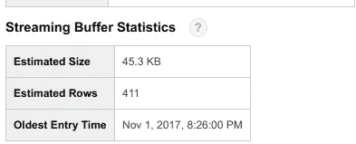
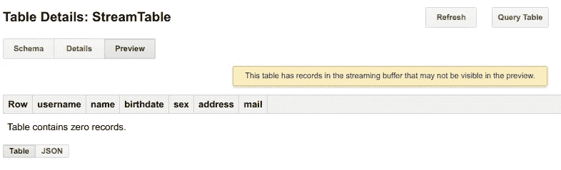
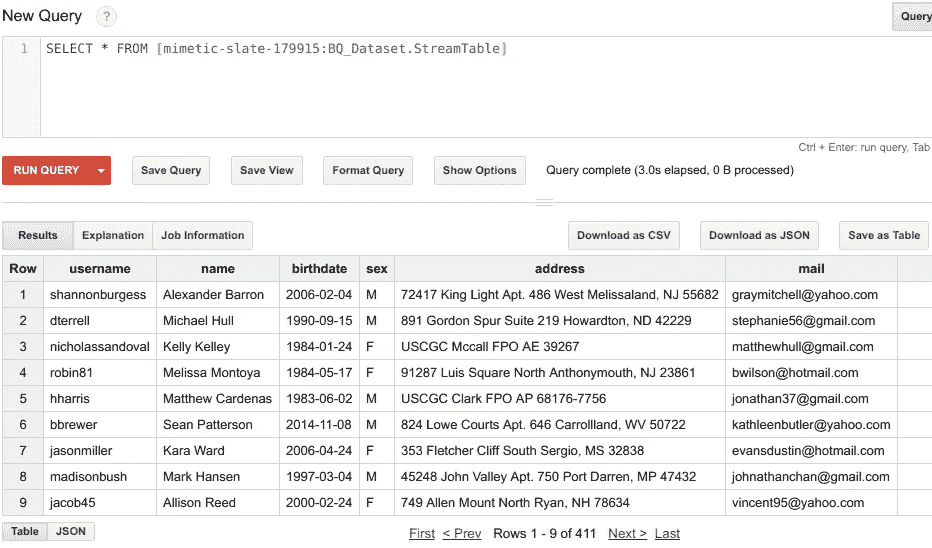

# Redis 流— BigQuery 第二部分

> 原文：<https://medium.com/google-cloud/streaming-with-redis-bigquery-part-ii-763cdec9a9ec?source=collection_archive---------0----------------------->

*最初出版。在一些需要解释的主题中添加了更多的单词。*

D aemon 博客:[https://sunnykrgupta . github . io/streaming-with-redis-big query-part-ii . html](https://sunnykrgupta.github.io/streaming-with-redis-bigquery-part-ii.html)

**系列其他帖子:**

*   [导出&用 MongoDB-big query Part-I 加载作业|由 Sunny Gupta | Google Cloud-Community | Medium](/google-cloud/export-load-job-with-mongodb-bigquery-part-i-64a00eb5266b)
*   [补丁和更新表— BigQuery Part-III |作者 Sunny Gupta | Google Cloud—Community | Medium](/google-cloud/patch-and-update-table-bigquery-part-iii-7f2547021926)

这是三贴系列的第二部分。在之前的帖子中，我们了解了使用 MongoDB-big query Part-I 加载作业 [**导出&的基本原理。**](https://sunnykrgupta.github.io/export-load-job-with-mongodb-bigquery-part-i.html)

在本文中，我们将深入探讨 BigQuery 的流特性。

# [流媒体](https://cloud.google.com/bigquery/streaming-data-into-bigquery)

**为什么？** —流有助于将我们的数据推送到 BigQuery(简称 BQ)中，并有助于使数据可用于查询，而不会延迟运行加载作业。

> 选择流媒体有一些权衡。下面是一些例子:

*   在进行流 API 调用时，我们需要遵循一些配额，如 http 主体大小、最大行数/请求数等。
*   表中的写入数据不能立即用于 bigquery 中的复制或导出作业，需要 90 分钟才能完成，而基于负载的表可以立即使用。
*   在写这篇文章的时候，在流中发生的费用，而加载作业是免费的。

记住以上内容，我们需要在 BigQuery 中选择流式作业还是负载作业。

**配额:【https://cloud.google.com/bigquery/quotas#streaminginserts】**

# 将数据流式传输到 BigQuery

在本文中，我们将使用一个 [redis 服务器](https://redis.io/)作为消息代理来保存我们的数据。

我们将准备数据，数据的框架将是任何人的基本信息(用户名、姓名、生日、性别、地址、电子邮件)。根据这些信息，我们需要在流式传输之前预先创建 bigquery 中的模式和表。创建表后，我们将运行流程序来批量接收我们的数据，这些数据将从 redis 中读取，并实时写入 bigquery 表。我们将使用`python`作为我们的编程语言。

## 1.在 Redis 中准备数据

我们将编写一个小的 python 脚本来预准备 [redis 列表](https://redis.io/topics/data-types)中的数据。

**Redis 安装:**[https://redis.io/download](https://redis.io/download)

```
*#!/usr/bin/env python***import** **redis**
**import** **json**, **time**
*#Faker :* [*https://github.com/joke2k/faker*](https://github.com/joke2k/faker)
**from** **faker** **import** FakerstreamRedis = redis.Redis(host='127.0.0.1',
             port='6379',
            password='')fake = Faker()**def** profile_generator():
    **return** fake.simple_profile(sex=None)**def** main():
    **while** True:
        streamRedis.lpush("redisList", json.dumps(profile_generator()) )
        *#sleep 200ms*
        time.sleep(0.2)**if** __name__ == "__main__":
    main()
```

## 2.检查数据并为表准备模式

我们的数据看起来像:

```
{
    'username': u'tarawade',
    'name': u'Jennifer Lewis',
    'birthdate': '2005-06-14',
    'sex': 'F',
    'address': u'7134 Robinson Club Apt. 530\nPort Andreachester, GA 19011-6162',
    'mail': u'tmorgan@yahoo.com'
}
```

对于上面格式化的数据，下面的模式将起作用

```
[
    {
        "name": "username", "type": "STRING", "mode": "NULLABLE"
    },
    {
        "name": "name", "type": "STRING", "mode": "NULLABLE"
    },
    {
        "name": "birthdate", "type": "STRING", "mode": "NULLABLE"
    },
    {
        "name": "sex", "type": "STRING", "mode": "NULLABLE"
    },
    {
        "name": "address", "type": "STRING", "mode": "NULLABLE"
    },
    {
        "name": "mail", "type": "STRING", "mode": "NULLABLE"
    }
]
```

## 3.在 BigQuery 中创建一个表

我们将创建两个 python 文件，即保存模式配置的`**createConfig.py**`和执行对 bigquery 的表创建 API 调用的`**tableCreate.py**`。我们将使用`**Google Application Default Credentials**`来授权我们的 python 应用程序与 bigquery APIs 对话。

```
$ cat createConfig.pyTableObject = {
    "tableReference": {
      "projectId": "mimetic-slate",
      "tableId": "StreamTable",
      "datasetId": "BQ_Dataset",
    }, "schema": {
      "fields": [
          {
              "name": "username",
              "type": "STRING",
              "mode": "NULLABLE"
          },
          {
              "name": "name",
              "type": "STRING",
              "mode": "NULLABLE"
          },
          {
              "name": "birthdate",
              "type": "STRING",
              "mode": "NULLABLE"
          },
          {
              "name": "sex",
              "type": "STRING",
              "mode": "NULLABLE"
          },
          {
              "name": "address",
              "type": "STRING",
              "mode": "NULLABLE"
          },
          {
              "name": "mail",
              "type": "STRING",
              "mode": "NULLABLE"
          }
      ],
  },
}
```

我们将使用[**Google-API-python-client**](https://developers.google.com/api-client-library/python/)库与我们的 bigquery APIs 进行交互。

```
*#!/usr/bin/env python***from** **googleapiclient** **import** discovery
**from** **oauth2client.client** **import** GoogleCredentials
**from** **tableCreate** **import** TableObject **def** createTable(bigquery):
    tables = bigquery.tables() *#insert utility make call to BQ API with payload \*
    *#(TableObject) contains schema and table-name information*
    tableStatusObject = tables.insert( projectId='mimetic-slate', \
     datasetId='BQ_Dataset', body=TableObject).execute()
*# [END]***def** main():
    *#to get credentials from my laptop*
    credentials = GoogleCredentials.get_application_default()
    *# Construct the service object for interacting with the BigQuery API.*
    bigquery = discovery.build('bigquery', 'v2', credentials=credentials)
    createTable(bigquery)**if** __name__ == '__main__':
    main()
    **print** "BQ Table Creator !!"
```

运行上述程序，在 bigquery 数据集`**BQ_Dataset**`中创建名为 **StreamTable** 的表。确保您已经创建了数据集。

您可以通过访问 bigquery UI 来验证创建的表。参观:[https://bigquery.cloud.google.com](https://bigquery.cloud.google.com/)

**参考**:

*   **表创建:**[https://developers . Google . com/resources/API-libraries/documentation/big query/v2/python/latest/big query _ v2 . tables . html](https://developers.google.com/resources/api-libraries/documentation/bigquery/v2/python/latest/bigquery_v2.tables.html)
*   **谷歌应用默认凭证:**[https://developers . Google . com/identity/protocols/Application-Default-Credentials](https://developers.google.com/identity/protocols/application-default-credentials)
*   **构建服务对象:**[https://developers . Google . com/API-client-library/python/start/get _ started # Build-the-service-object](https://developers.google.com/api-client-library/python/start/get_started#build-the-service-object)

## 4.流入 Bigquery

现在，我们已经创建了表，并将数据排队到 redis 列表中，我们已经准备好通过运行 python 脚本进行流式传输，让我们将这个脚本称为`**bq-streamer.py**`

```
*#!/usr/bin/env python***from** **googleapiclient** **import** discovery
**from** **oauth2client.client** **import** GoogleCredentials**import** **json**, **time**, **copy**
**import** **redis** batchCount = 100redisStream = redis.Redis(host='127.0.0.1',
             port='6379',
            password='')streamObject = {
    "rows": [
      *#{ "json": {# Represents a single JSON object. } }*
    ],
 }*#[START Streaming batcher]*
**def** streamBuilder():
    *#Every API needs a refresh copy of dict*
    newStreamObject = copy.deepcopy(streamObject) currentCounter = 0
    **while** currentCounter < batchCount:
        packet = redisStream.brpop("redisList",  timeout=0)[1]
        newStreamObject["rows"].append({"json":json.loads(packet)})
        currentCounter +=  1 **return** newStreamObject
*#[END]* *# [START Streaming Utility]*
**def** streamUtils(bigquery):
    tabledata = bigquery.tabledata() *#Run infinitely*
    **while** True:
        streamBuildBatch = streamBuilder() *#BQ API to insert bulk data into table*
        insertStatusObject= tabledata.insertAll( \
                   projectId='mimetic-slate', \
                   datasetId='BQ_Dataset', tableId='StreamTable', \
                   body=streamBuildBatch).execute() *# [ MAIN]*
**def** main():
    credentials = GoogleCredentials.get_application_default()
    *# Construct the service object for interacting with the BigQuery API.*
    bigquery = discovery.build('bigquery', 'v2', credentials=credentials) *#Stream utility*
    streamUtils(bigquery)
*# [END]* **if** __name__ == '__main__':
    main()
```

上面的程序将从列表名`**redisList**`中读取运行在`127.0.0.1:6379`上的 redis，并构建一个被 bq 流 API 接受的 dict 对象`**streamObject**`。我们调用`**insertAll**`实用程序向 bigquery API 提交我们的流请求。

`**insertAll**`将`**projectId, datasetId, tableId**`作为参数，而`**body**`包含您要传输的数据。

脚本已配置为[从 redis 列表中弹出](https://redis.io/commands/brpop) `100 entries`，并准备将其推入表中。运行`**bq-streamer.py**`脚本，开始将数据传输到 bigquery 表中。

**参考**:

*   **流媒体 insertAll:**[https://developers . Google . com/resources/API-libraries/documentation/big query/v2/python/latest/big query _ v2 . table data . html](https://developers.google.com/resources/api-libraries/documentation/bigquery/v2/python/latest/bigquery_v2.tabledata.html)

## 5.验证 BigQuery 表中的数据

运行流后，当您单击表信息时，您将开始看到类似如下所示的内容。单击预览将不会显示任何流数据，需要一段时间才会显示，但它会在缓冲区中，可供立即查询。

**缓冲区统计**



**表格预览**



# BQ 表中的 SQL 查询

我们将运行一个简单的查询来显示显示您的流数据的输出。

```
SELECT * FROM [mimetic-slate:BQ_Dataset.StreamTable]
```

**查询结果**



**Github 参考**:[https://github.com/sunnykrGupta/Bigquery-series](https://github.com/sunnykrGupta/Bigquery-series)

# 结论

以上就是这个**系列第二部**的全部内容。希望你能从这篇文章中对 BigQuery 中的流有基本的了解。在您希望数据立即可供查询的情况下，流式处理很有帮助，在您需要构建实时分析的情况下，流式处理也很有帮助。

我希望通过评论得到反馈。在本系列的下一篇博客中，我将介绍在 BigQuery 中修补和更新表模式的 [**，这在您想要添加或更新表的字段时非常重要。**](/google-cloud/patch-and-update-table-bigquery-part-iii-7f2547021926)