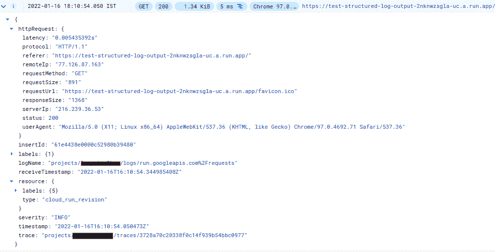
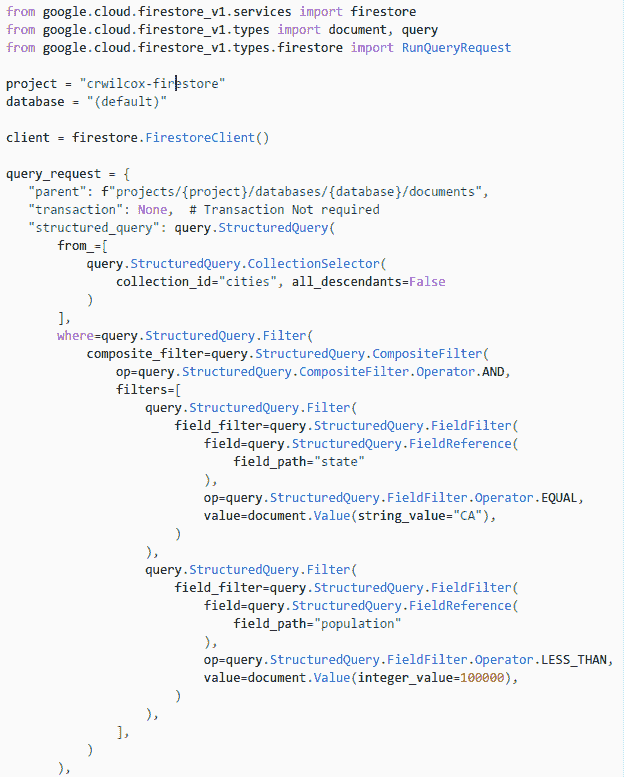
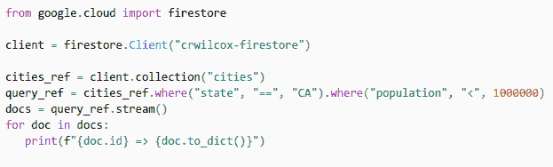

# 谷歌云中的结构化日志记录

> 原文：<https://medium.com/google-cloud/structured-logging-in-google-cloud-61ee08898888?source=collection_archive---------1----------------------->

这篇文章是[云日志如何工作](https://minherz.medium.com/how-cloud-logging-works-series-3aab7e7a1eed)系列的一部分。

结构化日志记录这一术语已经使用了很长时间。随着市场上更多的日志分析和管理解决方案的出现，这已经成为一种被广泛接受的做法。许多使用专有格式[的流行解决方案将](https://kubernetes.io/blog/2020/09/04/kubernetes-1-19-introducing-structured-logs/)迁移到使用结构化日志记录。

> **结构化日志记录**是为应用程序日志实现一致的、预先确定的消息格式的实践，允许它们被视为数据集而不是文本。

什么是结构化日志记录有许多不同的定义。结构化日志记录的根本思想是将每个日志条目描述为一个对象或一条记录，以便可以使用自动化工具对其进行处理和查询。结构化日志通常使用预先确定的文本或二进制格式(如 Json、XML 或协议缓冲区(protobuf ))来获取，然后作为对象进行解析和存储。

Google Cloud 从一开始就使用结构化日志记录。Google Cloud 中的日志由 [LogEntry](https://cloud.google.com/logging/docs/reference/v2/rest/v2/LogEntry) 结构描述。正如我在[中提到的](/google-cloud/how-logs-are-stored-in-cloud-logging-b6869ced0fa)，它以二进制格式存储为 protobuf 记录。可以使用[日志浏览器](https://cloud.google.com/logging/docs/view/building-queries)或通过[日志 API](https://cloud.google.com/logging/docs/reference/v2/rest/v2/entries/list)来查询和分析日志。可以将日志条目导出到 [BigQuery](https://cloud.google.com/logging/docs/export/bigquery) 或使用[日志分析](https://cloud.google.com/logging/docs/log-analytics)进行更复杂的分析。

# 日志结构布局

存储在结构化日志中的信息可以大致分为三类:

*   **关于日志条目**的信息，描述该日志条目何时被创建和接收，它在其他日志条目中的顺序，通常被称为*严重性*的“日志级别”等。
*   **创建日志的上下文**描述关于日志生成环境的元数据、生成日志的源代码位置等。
*   **日志的有效负载**，包含开发者定义的数据和元数据。

在云日志中， [LogEntry](https://cloud.google.com/logging/docs/reference/v2/rest/v2/LogEntry) 结构的`[**logName**](https://cloud.google.com/logging/docs/reference/v2/rest/v2/LogEntry#FIELDS.log_name)`、`[**timestamp**](https://cloud.google.com/logging/docs/reference/v2/rest/v2/LogEntry#FIELDS.timestamp)`、`[**receivedTimestamp**](https://cloud.google.com/logging/docs/reference/v2/rest/v2/LogEntry#FIELDS.receiveTimestamp)`、`[**severity**](https://cloud.google.com/logging/docs/reference/v2/rest/v2/LogEntry#FIELDS.severity)`、`[**insertId**](https://cloud.google.com/logging/docs/reference/v2/rest/v2/LogEntry#FIELDS.insert_id)`、`[**traceSampled**](https://cloud.google.com/logging/docs/reference/v2/rest/v2/LogEntry#FIELDS.trace_sampled)`字段存储日志条目的信息。在`[**resource**](https://cloud.google.com/logging/docs/reference/v2/rest/v2/LogEntry#FIELDS.resource)`、`[**httpRequest**](https://cloud.google.com/logging/docs/reference/v2/rest/v2/LogEntry#FIELDS.http_request)`、`[**operation**](https://cloud.google.com/logging/docs/reference/v2/rest/v2/LogEntry#FIELDS.operation)`、`[**trace**](https://cloud.google.com/logging/docs/reference/v2/rest/v2/LogEntry#FIELDS.trace)`、`[**spanId**](https://cloud.google.com/logging/docs/reference/v2/rest/v2/LogEntry#FIELDS.span_id)`、`[**sourceLocation**](https://cloud.google.com/logging/docs/reference/v2/rest/v2/LogEntry#FIELDS.source_location)`字段中捕获日志上下文。数据有效负载包括以字符串的键值对集合形式存储在`[**labels**](https://cloud.google.com/logging/docs/reference/v2/rest/v2/LogEntry#FIELDS.labels)`字段中的调用者元数据，以及可以作为纯文本存储在`[**textPayload**](https://cloud.google.com/logging/docs/reference/v2/rest/v2/LogEntry#FIELDS.text_payload)`字段中或者作为 Json 对象存储在`[**jsonPayload**](https://cloud.google.com/logging/docs/reference/v2/rest/v2/LogEntry#FIELDS.json_payload)`字段中的应用程序数据。还有第三种选择，使用`[**protoPayload**](https://cloud.google.com/logging/docs/reference/v2/rest/v2/LogEntry#FIELDS.proto_payload)`字段将应用程序的日志数据存储为 protobuf 有效负载。protobuf 有效负载通常由各种 Google 云服务使用。此外，它只能通过调用日志 API 来获取。

> 记住**结构化日志**和**结构化负载**是**不同的**。前者可以离开后者而存在，但反之则不行。

# 如何写日志

当应用程序[向远程目的地发送日志](/google-cloud/how-cloud-logging-works-series-3aab7e7a1eed#967c)时，方法会因日志管理解决方案、本地日志框架和应用程序环境而异。云日志公开了日志 v2 API，可以通过 REST 或 gRPC 直接调用，或者使用专用的日志框架适配器调用。开发者也可以使用 Google 提供的日志客户端库(7 种编程语言)。这些选项将日志直接接收到云日志后端。此外，还可以利用 Google 云平台中的日志代理，将日志摄取任务“委托”给代理。拥有日志代理的平台有 [AppEngine](https://cloud.google.com/appengine/docs/flexible/python/writing-application-logs#writing_structured_logs) 、 [GKE](https://cloud.google.com/stackdriver/docs/solutions/gke/managing-logs) 、Cloud Run、[云函数](https://cloud.google.com/functions/docs/monitoring/logging)、Cloud Build、DataProc 和 DataFlow。代理必须[显式安装](https://cloud.google.com/logging/docs/agent/logging/installation)在 GCE 实例上，然后可以[配置](https://cloud.google.com/logging/docs/agent/logging/installation#configure-agent)来支持日志捕获。当在带有日志代理的平台上运行应用程序时，只需将日志打印到`stdout`或`stderr`就可以将日志接收到云日志中。代理支持捕获纯文本和结构化负载。受支持的结构化有效负载应该格式化为单行 Json 字符串。有效载荷可以包括代理解析并存储到上下文信息字段中的[特殊字段](https://cloud.google.com/logging/docs/structured-logging#special-payload-fields)(例如`**httpRequest**`)。以下信息**不能使用特殊字段**提供:

*   `**logName**`字段——将结构化有效载荷打印到`stdout`时，无法自定义日志的目的地或其名称
*   `**resource**`字段—代理自行填充资源字段。无法自定义该字段。

阅读[公共文档](https://cloud.google.com/logging/docs/structured-logging)关于支持的特殊字段和其他细节。

使用日志代理接收日志有一定的好处。我将尝试捕捉下面的主要利弊。

## 使用日志代理接收日志的优势

**打印到 stdout** **很简单**。它不需要额外的库，也不需要关心通信延迟、可能的重试机制和错误处理。

**就是快**。任何 API 调用都需要时间，这取决于网络延迟、后端延迟和其他因素。即使异步执行通信部分，应用程序也应该在完成 API 调用所需的时间内保持运行。打印到 stdout 就像调用(几乎)任何其他系统调用一样。

**是无资源**。API 调用需要使用 CPU、内存、网络等资源。在 prem 上运行时，哪个组件消耗硬件资源并不重要，因为同一主机上的所有应用程序都会受到影响。在云环境中，情况有所不同。诸如 Cloud Run 之类的受管环境将具有为部署分配的专用资源(例如 CPU ),这些资源不同于日志记录代理所使用的资源。

## 使用日志代理时的注意事项

**单行 Json 字符串的格式化**要求并不像看起来那样容易实现。除非使用专门的库，否则正确格式化的负担就落在了应用程序开发人员的身上。虽然未能实现正确的格式不会导致有效载荷的丢失，但它可能会导致产生难以处理的有效载荷。

**并非所有平台和环境**都有日志代理。也没有一个通用的方法来识别所有平台的日志代理。在没有日志代理的平台上运行这样的应用程序会导致将日志打印到 stdout，而不会将日志接收到云日志后端。

**限制**比如无法控制日志目的地，这对于在一个 Google Cloud 项目中运行但需要将日志接收到另一个项目中的应用程序来说可能是至关重要的。

# 开发者工具

我提到 Google 用 7 种语言维护[日志客户端库](https://cloud.google.com/logging/docs/reference/libraries):Java、Python、NodeJS、Golang、C#、Ruby 和 PHP。这些库在 Github 上由 [googleapis](https://github.com/googleapis) 组织维护。这些库有两种类型:

*   *自动生成* —基于 API 的 protobuf 定义生成的客户端库；这些库为使用 gRrpc 传输层实现对 API 的低级调用提供了存根:

*   手写—由 Google DevRel 工程师开发和维护的客户端库，使用自动生成的存根，与自动生成的库相比，提供了最佳实践和改进的开发体验:

## 记录客户端库

*   **Python** 客户端库发布了第 3 版，扩展了对自动填充上下文元数据的支持，集成了标准 Python 日志记录和 JSon 格式化程序，可用于日志记录代理。在[最新消息](https://cloud.google.com/blog/products/devops-sre/google-cloud-logging-python-client-library-v3-0-0-release)帖子中阅读更多已发布功能的详细概述。
*   **Java** 客户端库扩展了对自动填充附加上下文元数据的支持，并在 JUL 和 logback 适配器中集成了日志代理。在[云博客](https://cloud.google.com/blog/products/devops-sre/google-cloud-logging-java-client-library-new-features)中了解更多。
*   版本 9.9+中的 NodeJS 客户端库开始支持一组类似的自动元数据填充，用于接收日志条目。最近在[云博客](https://cloud.google.com/blog/products/devops-sre/get-more-insights-with-the-new-version-of-the-nodejs-library)发布的帖子解释了细节。
*   **Go**1 . 5 . 0 版本中的客户端库通过添加关于源位置信息的元数据、对 W3C 上下文跟踪的支持以及提供对进程外日志摄取的支持，完成了对结构化日志的支持。在云博客的专栏中阅读更多信息。