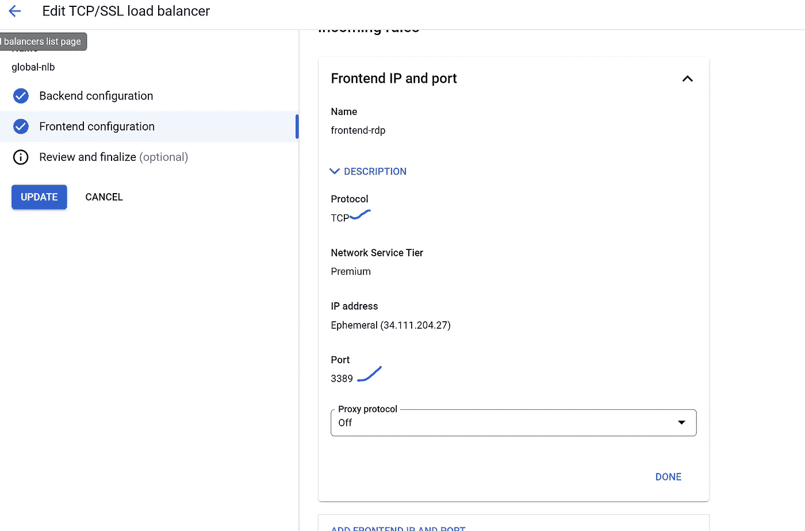
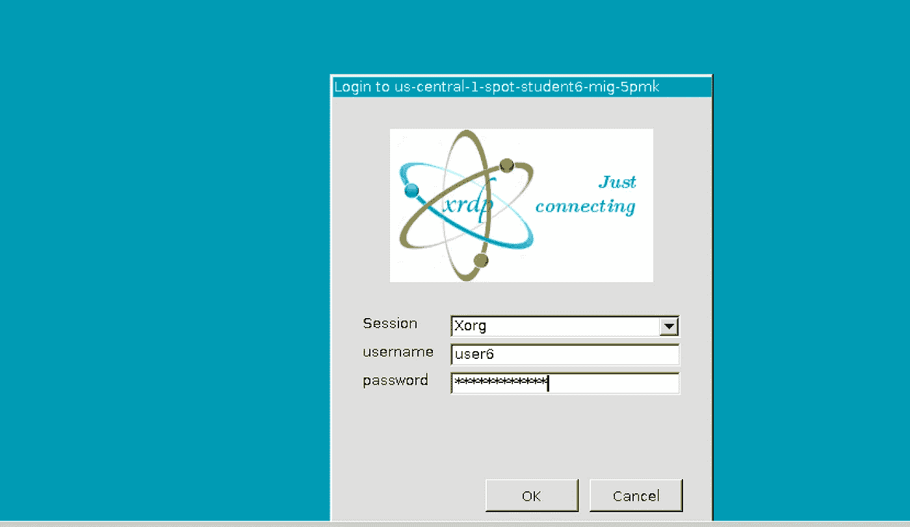

# GCP 学生实验室解决方案—低成本解决方案，运营开销最小

> 原文：<https://medium.com/google-cloud/student-lab-solution-on-gcp-low-cost-solution-least-operational-overhead-f222d506fb69?source=collection_archive---------0----------------------->

**使用案例:**学生需要具有图形用户界面(GUI)的专用界面/机器& Linux 终端，可以从任何地方通过他们自己的笔记本电脑或台式机进行访问。在有限的时间内或在学习时间内需要使用计算机。只有。学习应用程序可以是基于浏览器的，或者高年级/大学生可能需要 Linux 终端来学习 AI/ML、编程或新兴技术。该解决方案要求在云上以最少的 IT 运营开销提供较低的学生人均成本。

**主要挑战:**

*   云按需定价高于预期定价，没办法去争取。
*   更高的 Windows 许可证成本
*   面向多用户的更高级 Windows RDP/加州许可证(仅免费 2 次 RDP 会话)
*   云提交/预留不适用(仅需要有限的计算/学习时间)
*   为学生提供无缝体验，无需更改 URL/IP 等。
*   会话期间每个学生数据/文件或文件夹的存在(没有任何数据丢失)

**可能性:**

GCP 现货/可抢占计算选项，可为 Linux 操作系统提供巨大折扣(最低 61%的按需折扣)，但在需求激增的情况下，现货虚拟机可能会被终止，或者在特定 AZ 或地区可能没有备用容量。此外，管理每个虚拟机磁盘、日常备份、在 az 和区域之间传输计算映像/快照需要太多的维护活动，这可能会让学生失望，并以糟糕的体验告终。

**按需** vs **可抢占/现货定价**

**按需:**

-地区:爱荷华州

-实例类型:E2-标准-2

-预计组件成本:每 1 个月 48.92 美元

**可抢占/现货:**

-地区:爱荷华州

-实例类型:E2-标准-2

-预计组件成本:每 1 个月 14.68 美元

***~ 70%价格跌幅/月***

# **GCP 解决方案:**

Linux ->Ubuntu + GCP 跨多个区域分布的点/可抢占计算+(按需计算作为备用)，TCP 全局负载平衡器和云存储安装到每个计算引擎。

**业务投资回报(ROI)** —计算使用小时/月的 GCP 即期/可抢占(90%) +按需(10%)。这是一笔大交易👍

**GCP 的高层建筑**

架构图—解决方案的工作原理

**如何实施？**

-操作系统— Ubuntu 20.04 LTS 版

-安装 Xrdp(针对类似 windows 的 GUI 界面)——[如何安装？](https://tecadmin.net/how-to-install-xrdp-on-ubuntu-20-04/)，如果需要，在/etc/xrdp/sesman.ini 文件中进行会话限制。

-强化了操作系统、安全性和必需的学生软件、用户名、密码、目录、权限、[GCS 使用](/@antrixsh/how-to-mount-cloud-storage-bucket-with-gcp-compute-engine-ba7c95ad5349) &存储桶映射作为文件系统等的基础映像。

*   创建黄金/基础图像

黄金图像

根据 GCP 地区创建**实例模板**(架构中说明的*):*

> 已经为按需计算引擎创建了“ **US-central-1-on-demand** ”，这将在 **US Central、West 和 east** regions(每个 AZs)中没有现货/可抢占容量的情况下使用。

实例模板—每个地区有不同的计算能力选项

如果需要自动扩展，则创建实例组"**新的受管实例组(无状态)**如果工作负荷处于满状态且自动扩展不成功，则创建新的受管实例组(有状态):

美国中心 1-按需组是使用 **"0"** 实例创建的，因为我们将在美国中部、西部和东部地区(每个 AZs)没有现货/可抢占容量的情况下采取小册子行动。

**举例来说，**每个区域和位置有一个计算引擎—选择多个区域目标分布形状= **甚至**

具有多 az/区域选项的实例组

创建全局负载平衡器( **TCP/SSL 负载平衡器**)和 RDP 的后端配置，并选择为 U **S central、west、East** SPOT 和 on-demand 创建的每个 MIG:

全局负载平衡器—后端

全局负载平衡器—具有实例组映射的前端

全局负载平衡器(TCP/SSL 负载平衡器)前端配置:

RDP 港，带 LB 公共 IP

全局负载平衡器(TCP/SSL 负载平衡器)配置如下所示:

全局负载平衡器—展望

现在，继续进行全局负载平衡器 IP 地址的 RDP 会话。负载平衡器将根据发起流量的地理位置和 IP 地址来引导 RDP 会话流量。*在测试过程中，您可能会注意到大多数会话都是在特定的计算机上进行的，因为源 IP/发起 IP 是相同的，LB 表现得就像流量来自相同的用户，并尽最大努力将流量再次定向到相同的计算机。*否则，它应该在循环算法中工作。

使用 LB IP 或 DNS 名称测试 RDP

所有学生都可以使用各自的用户名和密码(*提前给定*)访问 LB 公共 IP。底层计算引擎将从每个位置作为现场服务提供。

**对于 DNS 记录更新，**您可以更新一条记录下的 LB 公共 IP 地址。*例如 5dollar.xyz* DNS 取自 godaddy.com

在 DNS 中输入一个记录作为 LB IP

使用 DNS 名称连接

美国中部-1 点虚拟机

美国东部-1 点虚拟机

美国西部-1 Spot VM

学生可以使用默认的 **Firefox** 或**chrome**(Ubuntu 20.04 上的[chrome Web 浏览器](https://linuxize.com/post/how-to-install-chromium-web-browser-on-ubuntu-20-04/))访问基于浏览器的应用程序，也可以安装或打算访问终端，只需键入 terminal 并开始访问 Linux 终端。

特定用户权限的 Linux 终端

现在创建存储桶，它将作为" N **网络驱动器"**在所有计算引擎之间上传/共享公共文件，这里，有 2 个文件存在于标准桶中，同样可以在 **user1 VM** 中看到，这也可以在文件- >计算机& **google-gcs** 名称或终端下的图形(Ubuntu GUI)界面中看到。

GCP 云存储标准桶

GCP 云存储桶挂载点— Google-Gcs(这里可以看到 2 个文件)

# **环境管理:**

云管理员将监控计算使用情况，如果使用情况高于预期，可以在 MIG 中添加更多容量(*只需更改计算数量*)或者在最坏的情况下，在 MIG 中添加按需容量数量(**而在定义的区域没有现货容量**)。

在此图中，我不希望在中心区域有任何容量，所以我只需将 MIG 编号更改为**“0”。我的 US-central-1 虚拟机被终止。(*我的数据存储在云存储中，所以不用担心任何数据丢失*)。**

在低需求期间-不需要美国中部-1 点

**在非营业时间**内，管理员可以为 MIG 创造**【0】**的价值，然后回家而不用担心云费用。全球负载平衡器收费将继续进行，如果想节省更多的成本，请为 LB 保留外部 IP，在一天结束时删除 LB，并在第二天重新创建一个具有相同 IP 的新 LB。

**工作日结束时计算 MIGs 快照示例:** *环境不运行时，没有 vCPU、RAM 和存储成本。*

非工作时间，不需要容量，所有虚拟机和存储均已终止