# 黑客新闻中幸存的流量峰值:我可怕的谷歌云发票

> 原文：<https://medium.com/google-cloud/surviving-traffic-spike-from-hacker-news-my-dreaded-google-cloud-invoice-6b940dd9eba6?source=collection_archive---------0----------------------->

这个故事讲述了发生在 2019 年 9 月 26 日的事件。都是真的。我建的一个网站，“[编程习惯用语](https://www.programming-idioms.org)”，打到了“橙站”(又名黑客新闻)的第一页。我的云提供商监控控制台让我知道突发流量是否导致了停机。而几天后的发票让我明白，在云端运行服务不是免费的饭。

*免责声明 1:我目前在谷歌云工作。然而，在加入谷歌之前，我已经设计和部署了网站编程习惯用法。*

*免责声明 2:这是我具体经历的忠实报告。显然不适用于任何不相关的类似云项目。YMMV。*

# 1.症状

下午 5:07，我收到一个通知:有人要求在我的网站中添加对他们最喜欢的编程语言的支持。然后五分钟后，另一个通知，来自其他人，要求相同的语言。这是怎么回事？

在[编程习惯用法](https://www.programming-idioms.org/)中，用不支持的语言编写代码片段会产生一个令人愉快的[老式错误页面](https://en.wikipedia.org/wiki/Blue_screen_of_death):

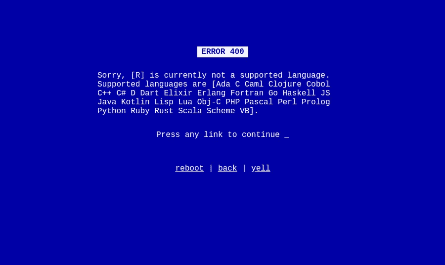

*一个令人愉快的老式错误页面*

我决定登录谷歌云平台(GCP)的 web 控制台，查看最近是否发生了许多这样的错误。贡献系统可能会因为某些原因而中断。

我注意到的第一件事是“每秒请求数”仪表板中一个不寻常的形状。我还注意到一个高实例计数。

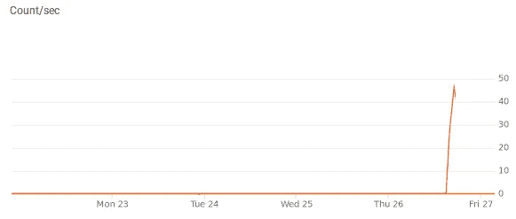

每秒异常的请求数

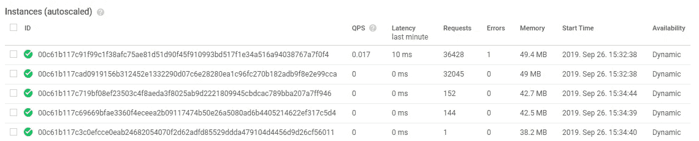

当前运行的服务器实例数量异常

我的第一个想法是，我犯了一个大错，就像 cronjob 启动的失败任务的无限循环。我必须马上解决这个问题！云中的无限循环对银行账户不利。

在这一点上，知道 GCP 还没有提供一个简单的方法来限制一个给定项目的成本，也就是说，自动地阻止已计费的$$$的暴涨是很有用的。然而，至少可以说，这是件好事。

在项目层面，当成本超过一些特定的阈值时，可以设置“预算提醒”电子邮件。但是在我的脚本横行肆虐的情况下(或者一个真正的流量突然激增)，我很可能会在大量现金被烧掉后*阅读邮件并采取行动。*

然而，在 App Engine 标准级别上**有**一个[每日消费限额](https://cloud.google.com/appengine/docs/standard/go111/console/#setting_a_spending_limit)选项。很高兴知道！

这个选择可以挽救你的退休计划

***编辑:*** 在服务层面(GCP 组件)，可以学习到一种有效的方法[用定额](https://www.youtube.com/watch?v=XpSBBFSBM9g)设置成本控制。这涵盖了所有可能的坏场景的很大一部分。

我还没想到会有大量游客涌入。

我在 web 服务可伸缩性方面的经验是，预期流量的不确定性通常是通过雄心勃勃的防御设计和过度供应来解决的，遵循了这本伟大著作中的建议和智慧:

鸣谢:[推特上的 the practical dev](https://twitter.com/ThePracticalDev/status/800752571497545729)

基本上，企业家对他们的服务迅速传播并取得成功的可能性有很高的评价，并且在其他关键问题之前，非常关心处理不可避免的巨大负载的能力。在我看来，市场调查，用户界面，UX，可用性，拥有一个 MVP，收集早期反馈，等等。比处理 100 万并发用户更紧迫。成功终将到来(也可能根本不会到来)，连续几波流量增加将会发生，每次显著的增加都将是修改可伸缩性策略的机会，将实际流量和错误监控指标考虑在内，以及对项目需求的更好理解(比原型阶段早期)。

然而，我承认，在大众媒体 ***的意外曝光是一种切实的威胁。没有人希望他们的服务在流量激增时失败。其实现在是最不好下去的时候！***

就我而言，谷歌分析证实了不寻常的访客涌入:

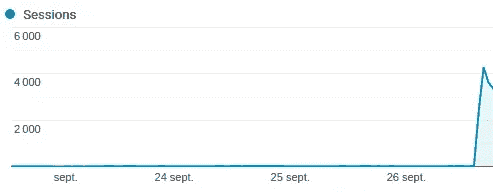

每小时的会话数

高峰前的每小时流量肯定不是零(每月~6000 个会话，平均每小时~8)。与峰值相比简直是小巫见大巫。

罪魁祸首就在几下鼠标之外，在“收购”部分:

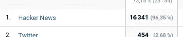

现在我明白是怎么回事了，我想知道服务质量是否受到负载的影响。

# 2.体系结构

编程习惯用法使用以下基础结构组件:

*   [带有](https://cloud.google.com/appengine/docs/go/) [Go](https://golang.org/) 语言环境的 App Engine
*   [数据存储](https://cloud.google.com/datastore/docs/concepts/overview)，一个 NoSQL 数据库
*   [Memcache](https://cloud.google.com/appengine/docs/standard/go/memcache/) ，分布式内存数据缓存

这些组件*本身*是可扩展的:App Engine 根据需要旋转尽可能多的无状态 web 服务器实例(自动扩展，yay)，并且数据存储具有“自动管理扩展的分布式架构”。

这并不意味着我的网站不会在重压之下崩溃。需要仔细的设计和实现来正确地利用平台的可伸缩性。我的主要挑战是数据一致性:编程习惯用法接受任何人的贡献，而不需要创建一个帐户，并且当用户同时修改同一个“习语”时，我必须小心编辑冲突。

我设计网站时使用了一些性能优化技术，考虑到了**响应**，这也正好降低了成本:

## 前端

*   所有响应都启用了 Gzip。
*   JS 被连接并压缩成一个文件，其中包含 jQuery、Bootstrap、Prettify 和我自己的 JS 代码。
*   JS 文件包含在 HTML 的底部。
*   CSS 被连接和缩小。
*   所有静态文件都有一个很长的公共缓存头。更新静态文件是通过一种[加速](https://www.stevesouders.com/blog/2008/08/23/revving-filenames-dont-use-querystring/)技术完成的:每当我修改一个静态文件时，我会撞击静态资产的[虚拟文件夹](https://github.com/Deleplace/programming-idioms/blob/master/pigapp/app.yaml#L20)，隐式地使浏览器缓存和服务器缓存中过时的资源失效。
*   网站大部分是文本，只有有限数量的小图片。
*   所有页面都是服务器端呈现的。根据我的测量，模板相当快，不是瓶颈。备选方案(客户端呈现)将涉及 JSON 编组，这也不是免费的。
*   所有静态资源在 app.yaml 中都声明为[“static _ dir”，也就是说由一个高效的分布式 CDN 来服务，根本不用我的 App Engine 服务器实例。](https://cloud.google.com/appengine/docs/standard/go111/serving-static-files)
*   HTTP 请求的数量很少:10 个页面请求，其中 8 个响应(静态资产)进入浏览器缓存，不再需要被请求。

## 后端

*   数据存储是一个 NoSQL 文档数据库。我有大约 180 个“习语”,包含大约 3000 个片段。每个习语都存储为一个包含几个片段的文档。读取速率将远远超过写入速率。
*   访问 Memcache 比访问数据存储快几个数量级。因为我总共有大约 2MB 的数据，所以我积极地将所有的片段存储在 Memcache 中。
*   对代码片段的修改必须使缓存中的代码片段无效。缓存失效被认为是困难的。我的策略包括有选择地驱逐所有与被修改的元素相关的缓存条目(但不在每次写操作时刷新整个缓存)。
*   从 HTML 模板生成页面速度很快，但仍然会产生一些工作量。我决定积极缓存(在 Memcache 中)所有的 HTML 页面。
*   索引对搜索很重要，但不允许降低请求的处理速度。I [延迟](https://godoc.org/google.golang.org/appengine/delay)索引工作，它将被放入一个任务队列中，在用户请求的范围之外执行。
*   我保存了所有代码片段的所有后续版本的历史记录，但是写入历史记录并不重要，这也委托给了后台任务队列。
*   [Go](https://golang.org) 对于 App Engine standard 来说是个不错的选择，因为克隆启动非常快，运行时占用的内存也很少。一个[最小级别 F1](https://cloud.google.com/appengine/docs/standard/#instance_classes) 的实例通常足以服务多个并发访问者。
*   外部 API 调用(例如对数据库的调用)通常是无服务器实例处理 web 请求的延迟瓶颈。因此，利用 goroutines 和 [waitgroups](https://golang.org/pkg/sync/#WaitGroup) 并发启动几个 API 调用是有意义的，因为它们是受网络限制的，而不是受 CPU 限制的。对于习语视图页面，我实际上不需要这样做，但是我确实使用了并发来改善文本搜索体验。

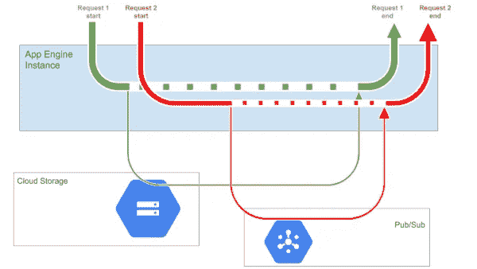

一个服务器实例 vCPU 花费大量时间处于空闲状态，即使在处理多个并发请求时也是如此，因为大部分等待时间都花在了等待外部组件上。这是一个例子；我在这个项目中不使用 GCS 和 Pub/Sub。

有关 Go 和云性能的更多信息，请参见本文[和视频](/@val_deleplace/go-code-refactoring-the-23x-performance-hunt-156746b522f7)。

App Engine 自带丰厚的每日免费额度。事实上，我通常每月的 10K 浏览量很少达到配额的百分之几。

略微担心但不太多。

当我们*超过*限额时，这份免费赠品多少“掩盖了[将被收取](https://cloud.google.com/appengine/pricing)费用的事实。我不知道我将真正面对的是什么。

但是现在还不是考虑钱的时候，首先我想知道**服务质量**是否受到负载的影响。

# 3.监视

日志视图中的[错误]级别不算太差。主要是“不支持的语言”BSOD 的十几次出现。到目前为止，没有异常错误率。(不过，从 UX 的角度来看，我应该[修理这个](https://github.com/Deleplace/programming-idioms/issues/79)。)

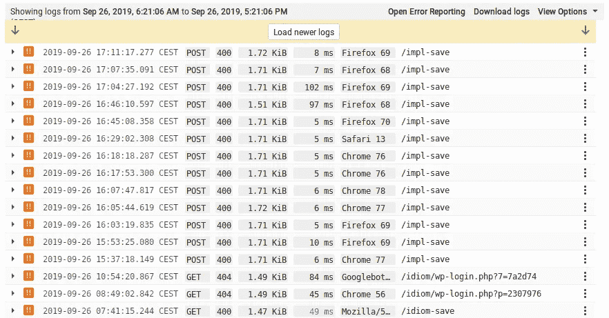

Stackdriver 日志视图中的错误级别

日志视图中的[警告]级别也不算太差。它主要由一个 404 组成，表示一个较小的丢失图像，哎呀。到目前为止，没有异常错误率。

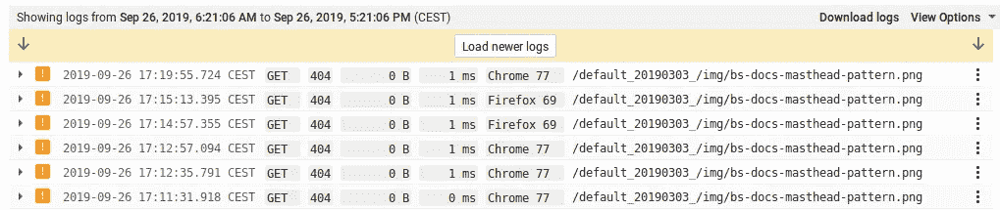

Stackdriver 日志视图中的警告级别

为了获得关于服务器端性能的详细信息，我通常会使用 BigQuery 交互式控制台:

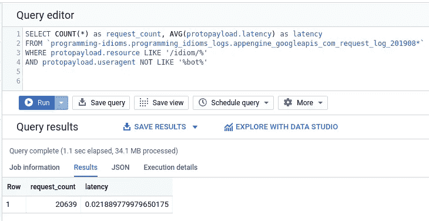

在那里，我发现 BigQuery 中缺少今天的日志，过了很久我才意识到在两天前迁移到 go111 运行时的过程中出现了配置故障。哎呀。虽然我仍然将日志导出到云存储中，但是 JSON 文件不太方便挖掘。[。/jq](https://stedolan.github.io/jq/) 还是朋友！

在 App Engine 的延迟仪表板中，我可以检查流量峰值前后的第 50、95 和 99 个百分点。

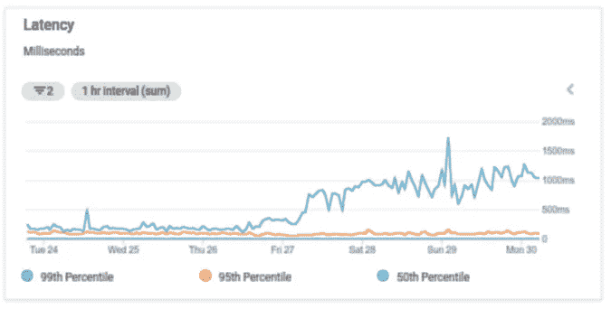

这看起来很糟糕，但实际上很好，除了第 99 百分位

**中值**延迟总是极低的(~ 2 毫秒)，因为静态文件是由类似 CDN 的系统提供的。这很好，但也不是一个非常相关的指标。

第 95 百分位的数字对我来说更重要，事实证明它一直低于 100 毫秒，这很好。

然而，我应该检查一下为什么第 99 百分位的蓝绿色线条从 26 号之前的 200 毫秒上升到 28 号之后的 1000 毫秒。即使只有不到 1%的请求达到这一延迟，5 倍的跳跃也令人担忧。同样耐人寻味的是，降级的 99%在峰值后一天进入*，然后*在峰值后很长时间内保持持久降级*。*

[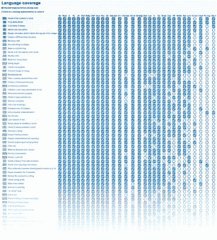](https://www.programming-idioms.org/about#about-block-language-coverage)

一个[网格](https://www.programming-idioms.org/about#about-block-language-coverage)为每个代码片段包含一个正方形

原来，所有缓慢的请求都是为了显示一个特定的页面，该页面具有一个根据整个数据库的当前状态动态构建的网格:所有的习惯用法，所有的片段。

网格数据缓存在服务器端，并且经常更新。这个特定请求有 65%的时间命中缓存并且很快，有 35%的时间网格重新生成并且响应时间很长。

出于某种原因，网格现在需要多花 50%的时间来提供服务，无论是在快速情况下(缓存)，还是在慢速情况下。这可能与最近迁移到 App Engine 第二代运行时有关，尽管在这一点上我不是 100%确定。

主页和习语的详细页面都很好:从服务器的角度来看，在流量高峰期间，它们的延迟没有降低。

# 4.切肉刀

一把菜刀([演职员表](https://commons.wikimedia.org/wiki/File:Foster_Cleaver.jpg)

## 在交通高峰之前

我每个月都会收到一张发票。正如我提到的，流量(6K 次会议，10K 浏览量)通常很容易就符合免费配额。因此，App Engine、Datastore 和 Memcache 通常不花我一分钱。

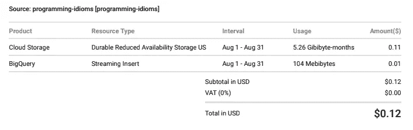

一个月的典型费用

我在 GCS(日志)中有 5GB 的非关键文件，如果我想保存 11 个，我可以删除它们。

你有没有注意到把我所有的日志写到 BigQuery 上需要 0.01 美元来进行分析？我强烈建议设置这个日志导出。BigQuery 非常适合日志调查。

## 在交通高峰之后

9 月份共有 44，000 次会话，16 万次浏览量。其中 94%发生在 26 号之后。

峰值后的第六天，我收到了 9 月份的发票:

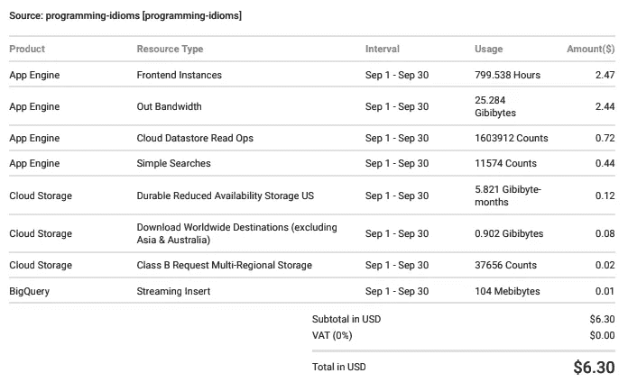

2019 年 9 月

基础设施成本最终没有让我破产。

在*输出带宽*部分，有两件事让我感到惊讶:

*   起初，25GB 似乎很多。让我们计算一下:25GB/160K 的页面平均每页 150KB。这是有意义的，因为习语的详细页面视图下载了 240KB 的 gzipped (700KB 未压缩)，主页稍微重一些(340KB)。带有热缓存的后续页面非常小:只有 15KB！
*   如果我没记错的话，App Engine 中的静态文件以前是免费提供的。我不知道这是一个错误还是一个政策，但似乎[不再是这样的](https://cloud.google.com/appengine/quotas#Requests)。静态文件可能占我的 25GB 出口网络流量的 95%。

我在这里，少了 6 美元，并且被一个庞大的开发人员社区所打动，他们来看看并留下来贡献他们自己的代码片段——实现一个两行代码可能看起来像是一件微不足道的小事，但实际上编写合理的代码并链接到官方文档是非常耗时的。我要衷心感谢每一个人。

如果你想贡献一个片段，这里有一个切入点:[查看网格](https://www.programming-idioms.org/about#about-block-language-coverage)，在你熟悉的语言栏中找到一个空圈。我也鼓励你编辑现有的片段来改进它们。

在我的 Twitter 上有更多关于技术、云和 go 的庆祝活动！[https://twitter.com/val_deleplace](https://twitter.com/val_deleplace)