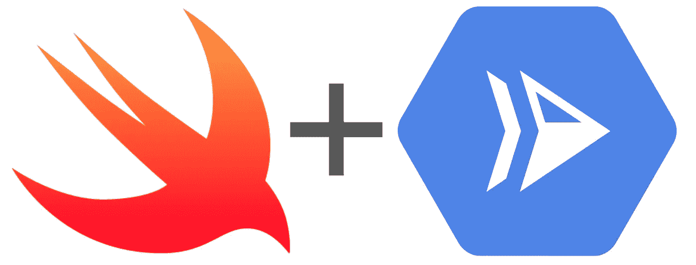
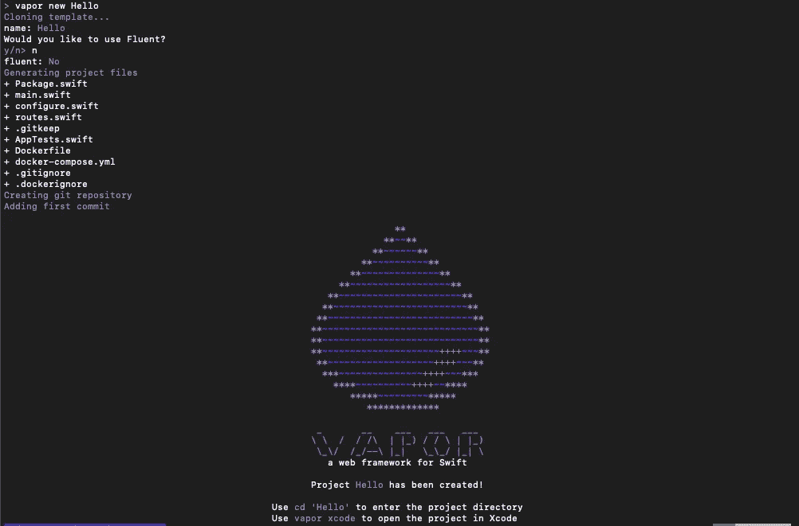
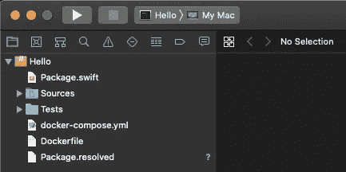
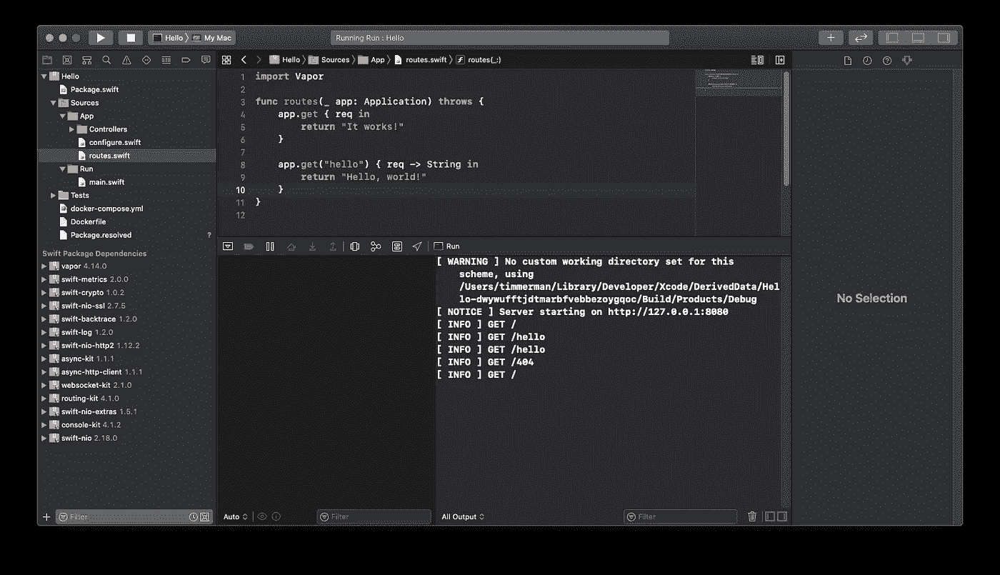
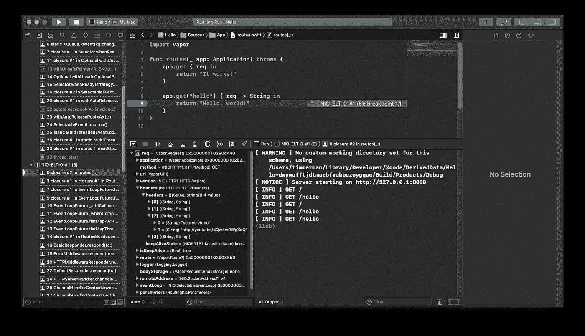
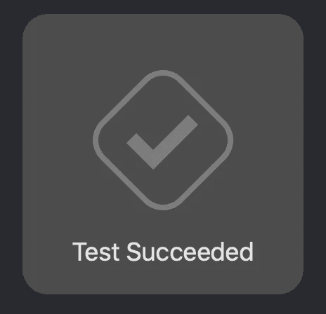

# 云运行上的 Swift

> 原文：<https://medium.com/google-cloud/swift-on-cloud-run-b6397a428d?source=collection_archive---------1----------------------->



Swift 云运行。

> Swift 徽标是 Apple Inc .的商标。Swift 徽标的使用根据与 Swift 编程语言教学相关的技术出版物进行。

***迅捷*** ( [🔗](https://developer.apple.com/swift/resources/) ) 是一种创新的开源编程语言，由 Apple 开发，旨在让各地的软件创建起来更安全、更快速、更有趣。

***Vapor***([Vapor . codes](https://vapor.codes/))是一个基于苹果 [SwiftNIO](https://github.com/apple/swift-nio) 之上的非阻塞、事件驱动架构，用 Swift 编写，关注类型安全。

总之，您可以构建强大的 web 服务，这些服务可以托管在云运行之上。这篇博客将会给你一个快速的开始。

# 先决条件

要使用 Swift，你需要一个工具，Xcode。

*   通过 App Store 安装 Xcode 11.4+(免费)
*   打开 Xcode 并安装任何更新。
*   确保 Swift 在您的终端中可用:`swift --version`

安装 Xcode 后，你应该可以访问 S `wift.`

# 设置蒸汽

对于我们的应用程序，我们将使用开源 web 框架 Vapor。

1.  通过自制软件安装`vapor`:

```
brew install vapor/tap/vapor
```

2.打开一个新的终端窗口，创建一个新的 Vapor 项目:`vapor`

```
vapor new Hello
```

3.出现提示时，说出`n`以使用`Fluent`。

您的终端应该如下所示:



蒸汽 CLI

使用 Vapor 工具箱设置 Xcode 项目:

```
cd Hello && vapor xcode
```

> 注意:Xcode 是开发 Vapor 应用程序的好方法，但是可以使用任何你喜欢的编辑器。

要构建并运行您的 Vapor 应用程序，请确保您拥有我们创建的`Hello`方案并选择了`My Mac`设备:



Xcode 应该用“我的 Mac”方案在工具栏中显示你的“Hello”程序。

选择后，只需点击按钮或按下`⌘R`。您会注意到日志中写着:`Server starting on [http://127.0.0.1:8080](http://127.0.0.1:8080)`。

转到 [http://localhost:8080/](http://localhost:8080/) 来测试您的 web 服务器。您应该看到:

```
It works!
```

## 检查代码

在 Xcode 中，您应该能够深入源代码并查看日志:



Xcode 工作区窗口的完整屏幕截图。

我不会介绍整个应用程序，但是主程序有一个默认路由器用于`/` `GET`请求，还有一个路由器用于`/hello` `GET`请求:

一个简单的蒸汽路由器。

# 使用断点调试

通过添加断点来调试您的应用程序，并使用调试区域进行检查:



# 本地测试

一个样本单元测试正在`Tests`下进行。要运行您的单元测试，请按`Command + U`。



Xcode 中测试成功时的通知。

# 部署到云运行

通过首先构建然后部署 Docker 容器映像(使用生成的`Dockerfile`)，轻松地将您的 web 应用程序部署到 Cloud Run:

构建并运行您的容器

在我的例子中，构建容器花费了 10m23s。

这是上面部署在 Cloud Run 上的 Swift/Vapor 应用程序:

> [**https://vapor-Q7 vieseilq-UC . a . run . app**](https://vapor-q7vieseilq-uc.a.run.app)

您正在运行用 Swift 编写的基于容器的自动扩展 web 服务器！🎉

## 感谢阅读！

如果你喜欢这篇博客，你可能也会喜欢其他的学习资源:

*   [🦕云运行时的噪声](/google-cloud/deno-on-cloud-run-89ae64d1664d)
*   [💧蒸汽代码](http://vapor.codes)