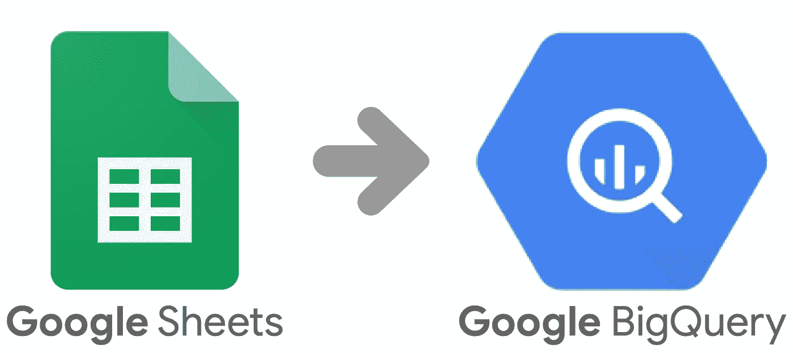

# 一键从 Google Sheets 同步到 BigQuery 表

> 原文：<https://medium.com/google-cloud/synchronize-google-sheets-with-bigquery-tables-96901cac0a0e?source=collection_archive---------1----------------------->

**TL；DR:** 使用我的([工作表](https://docs.google.com/spreadsheets/d/1XDiRFwUD6fSGPG0OQEbnpkOn2iotqI1rXdae6wy1qJk/edit?usp=sharing)和[应用脚本](https://script.google.com/a/allenday.com/d/1EpRnyPdtQvpwHwJLOwb2H3TF5Iah7Fgto89gE4FL1XW6tCLmZw3Dctq6/edit?mid=ACjPJvHo2JTZGkEnjlxZG03ZVMyqxflYSEc08eGksXG2sIp44RU6p3Zah6DV71Mj5JsAy-9n0gmKata4eO8rsp3Dnm_nnw0ZfWajUFOhhpv5rHDgU0h5SANtduBvU0-OvsUeiORkqHCLDII&uiv=2))模板，让你的电子表格与 BigQuery 保持同步。

# 这看起来熟悉吗？

*   您希望构建数据可视化作为概念验证
*   数据在一个电子表格中，来自一些你无法控制的过程——它可能会被更新。