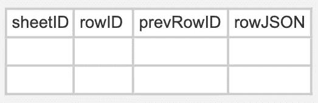

# Google Sheets 是如何工作的？

> 原文：<https://medium.com/google-cloud/system-designing-google-sheet-bdf12321b99c?source=collection_archive---------0----------------------->

我们都用过 Google Sheets，但从未想过它在协同编辑中是如何有效工作的。设计表单并不像设计一个谷歌文档那样简单，要考虑到表单提供的众多高级功能，而由于它提供的众多功能，这些功能要复杂得多，所以这篇博客关注于谷歌表单的**高级设计，是为所有层次的有经验的人写的。**

在开始设计之前，你应该问自己的问题是:

> **问题 1:** 如果我必须从头重新创建一个类似 Google Sheets 的东西，你更喜欢哪个数据库:关系数据库还是非关系数据库？这些哪个会更有效*。*
> 
> **回答:** *如果你正在考虑一个大规模的应用程序，那么是的，你应该选择 NOSQL，因为在 NOSQL 中存储行/列数据和连续的 CRUD 操作比在 RDBMS 中具有更高的可伸缩性。*
> 
> **问题 2:** 我们的设计主要需要关注哪些板材操作？
> 
> **答** : *在我们的案例中，我们关注的是 sheet 上的基本 CRUD 操作，包括协同编辑。*

协作编辑通俗地说就是多个用户同时贡献/共享同一个资源。但是实现起来并不容易，因为在为大量用户设计的过程中，我们需要考虑许多因素。

> ***问题 3:*** 我们目前在服务多少个请求？
> 
> ***答:*** *我们目前专注于数据库设计，首先处理基本功能，然后相应地进行扩展。*

你的脑海中肯定会浮现出更多的问题:

1.  考虑到一致性问题，我们将如何实现协作编辑功能？
2.  工作表允许自动保存功能吗？

回答完这些问题后，现在让我们开始着手数据库设计。

# **数据库设计**

现在让我们深入设计，先谈谈数据库的设计和使用。

因此，作为一个 Google Sheet，我们广泛地讨论了行和列，这比实现 google docs 的数据库要困难得多。

这是一个示例，它可能是开发人员在考虑关系设计时首先想到的几个想法之一。

这个设计是一个高度相关的设计，我们在构建最初的几个解决方案时可以很容易地使用它。但是这么多持续更新，这样有效率吗？这对于获取数据有好处吗？答案是一个**大不**。

我认为引入数据表的列值表会对表连接产生巨大的性能开销。假设我们达到了数据表中行数的上限，假设是 *10* ，每一行有 *100* 列。要获取整个数据手册，我们必须阅读:

***10 * 10 = 1000 * 100 =10⁵***

假设这个表被 100 个不同的用户访问，每次我们查询服务器获取这个表时，负载恰好是

***10⁵ * 10 = 10⁷***

现在有人会说，我们将从缓存中获取它，而不是直接从服务器中获取。所以答案是缓存的内存是有限的，在缓存中存储多个表的整个表数据最终不是一个好主意。

有人会说，我会提出一个更动态的数据库设计，只在需要时用下面的设计动态地创建行和列。

表格中的新单元格只有在不存在的情况下才会形成。但是现在让我们用上面的值来计算一下。

***10(行)* 10(列)= 10⁵单元格总数。***

因此，当更新整行的更新请求到来时，我们需要进行 ***100*** 更新查询来更新整行，并且如果我们在中间添加一行，我们需要用新的 **rowID** 来更新下面所有的行，这将导致数据库上非常沉重的负载，并且在获取数据和对响应分页方面不可伸缩。

现在让我们看看 NoSQL 的设计，可以比上述更有效。

其中 **sheetID** 表示包含该行的工作表。 **rowNo** 表示该行的顺序号。而**行 JSON** 代表行数据的 JSON。行数据如下所示:

但是我提到的将数据表列值作为行表本身中的 JSON 的方法，在更新行数据时省去了麻烦。

现在上面的数据模型有两大缺陷。如果到目前为止你还没有得到，暂停一分钟，然后再回来。

1.  如果我们在数据表中添加一行，我们的行表需要更新所有后续行的 rowNo。这可能是一个巨大的数据库写问题，需要更新相当多的记录，因为只是在中间添加一行。
2.  如果我们在数据表中添加一列，我们所有的行都需要更新，以便在每行的 **raw JSON** 中包含额外的空白数据表列。

让我们以**数据结构和算法**的形式来考虑它，并问自己在这种情况下哪种数据结构最有效。

问题:**将数据/行**前移，并在现有工作表中添加一条新记录。

解决方案:哪个 DS 在移位记录时性能最好？

如果我们使用 ***链表*** 会怎么样？哦，天啊，你想的方向是对的。我们有唯一的 rowID，让我们把它们作为 LinkedList 节点，当我们知道下一行是哪一行时，我们就知道序列是如何进行的。

这意味着我们只需要改变下一个指针，我们在单个更新请求中就完成了，我们不再需要将整个数据一个接一个地向左/向右移动。

所以在某种程度上，我的第一个数据模型被证明是一个非常糟糕的设计。我通过在行表中用 **rowID** 替换 **rowNo** 来修复它。并在 rows 表中引入一个新列，即**pre rowid**，它包含前一行的 ID。因此，在某种程度上，当数据表中添加新行时，我们只在 rows 表中创建一个新行。并更新表中的一行以更改先前的行标识符。这是更新的行表的简化版本，如下所示。这种方法也不是没有缺陷，但为了简洁起见，让我们继续进行。

**原始 JSON** 也存在类似的问题。类似地，我们可以通过引入存储在**原始 JSON** 的每个对象中的 **prevColumnID** 来解决这个问题。大概是这样的:

这样我们就解决了新行和新列的问题。但是我们肯定需要数据库中的另一个表来包含数据表列元数据。

## 现在我们已经准备好了数据库，我们可以在火上存储数据。

# **协同编辑**

构建可相互编辑的文档不是一件容易的事情。我们面临几个问题。

1.  并发性:这意味着多个计算同时发生。不管我们喜欢与否，It 在现代编程中无处不在:网络中的多台计算机。在一台计算机上运行多个应用程序。一台计算机中的多个处理器(今天，通常在一个芯片上有多个处理器内核)
2.  **延迟:**由于我们使用互联网访问可相互编辑的文档，因此可能会有延迟问题，甚至可能导致并发。

对于并发，首先想到的是什么— **锁**。

但是在这种情况下他们真的能拯救我们吗？没有，从来没有。

多个用户同时编辑同一个文档，我们需要实现一个基于 turn-based 的锁架构，这种架构效率不高，也不容易实现。所以锁不可能总是并发问题的最佳选择。让我们从现在开始记住这一点，当我们听到并发这个词时，不要总是跳到这个方法上:P

我们需要一个无锁架构。嗯，我们有什么方法可以做到这一点？

> 基于行更新进行同步？
> 
> 基于单元更新的同步？

基本上，有三种主要的方法可以做到这一点。

1.  ***差分同步***——就像一个 git 差分

2. ***事件同步***——每当用户更新任何东西的时候。

3. ***行同步***——每当一行被更新时，以及更新完成后。

用什么？谷歌和其他大型竞争对手用什么？

是的，你猜对了，是第二种，基于事件的同步。但在技术界，这叫 **OT(运营转型)。**

OO**操作转换** ( **OT** )是一种在高级[协同软件](https://en.wikipedia.org/wiki/Collaborative_software)系统中支持一系列协同功能的技术。OT 最初是为了纯文本文档协同编辑中的一致性维护和[并发控制](https://en.wikipedia.org/wiki/Concurrency_control)而发明的。它的应用扩展到包括组撤销、锁定、冲突解决、操作通知和压缩、应用共享。

会单独写博客深入讲解**运营转型**。

# **高层设计**

现在让我们来谈谈我的设计在高层次上会是什么样子。

所以在很高的层面上，我建议如下。这太简单了，功能较少，不包括操作事务设计流程。

*建筑的卫星视图*

在这里，我们使用**分布式系统方法和水平扩展**来提高**可用性和运营效率**。

***进一步挑战*** *:* 我们永远不知道浏览器的哪个更新命令会被哪个服务器选中。一种解决方案可以是使用数据流技术(例如 Kafka ),该技术将支持相同数据表的命令发送到同一数据处理器服务器。因此，我们现在可以扩大卡夫卡集群。

系统设计有很多内容，而且每一部分都有问题。

因此，与不同的人讨论并尽你所能获得最佳解决方案总是一个好方法，而这又会让其他人产生疑问。

**这是谷歌工作表设计的一部分。事情远不止如此。**

**干杯！！:)**