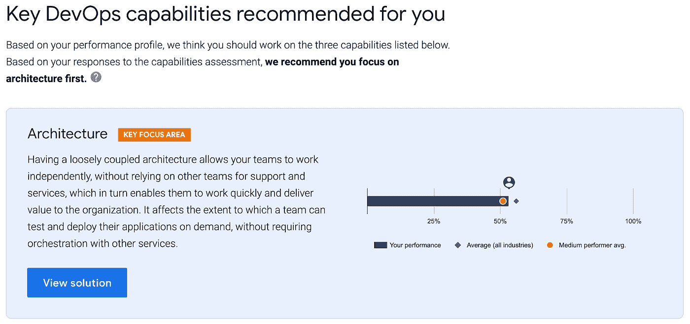

# 迈出 DevOps 之旅的下一步

> 原文：<https://medium.com/google-cloud/taking-the-next-step-on-your-devops-journey-e4ceae1c6f8c?source=collection_archive---------2----------------------->

有助于提高团队绩效的循证解决方案

*By @jezhumble 和*[Riona MacNamara](https://medium.com/u/ca052955394a?source=post_page-----e4ceae1c6f8c--------------------------------)

你如何改变你的组织交付和管理软件的方式？不仅仅是你用的工具的问题。六年来，DORA 的[devo PS 研究项目状态](https://www.devops-research.com/research.html)一直在调查推动技术交付和组织成果的高绩效的因素。现在，我们利用这项研究来帮助您准确了解您的组织可以在哪些方面以及如何改进。

研究项目的核心是衡量软件交付性能的四个关键指标。前两个是吞吐量或速度的度量，后两个是稳定性的度量:

*   **变更的交付时间:**从提交到版本控制到在生产中运行变更需要多长时间？
*   **部署频率:**您多久部署一次生产或发布给最终用户？
*   **变更失败率**:生产或发布给用户的变更导致服务降级并随后需要补救的百分比是多少？
*   **恢复时间**:当发生影响用户的服务事件或缺陷时，恢复服务一般需要多长时间？

对来自全球数千个组织的超过 31，000 份答复的分析一致表明，高绩效者不会在吞吐量和稳定性之间进行权衡:相反，最好的团队——即使是在[大型、高度监管的组织](https://www.linkedin.com/pulse/double-half-quarter-lesson-from-book-richard-david-knott)中——也会实现高水平的吞吐量和稳定性。此外，我们发现软件交付绩效预测组织绩效:我们的最高绩效者达到或超过其组织绩效目标的可能性是两倍，包括盈利能力、生产率、市场份额、运营效率、客户数量、客户满意度以及实现组织和任务目标的能力。您交付软件的速度和稳定性对您的组织很重要。

DORA 已经确定了推动这些指标改进的 34 项关键 DevOps 功能,这些功能不仅描述了您的架构和技术实践，还描述了您组织的文化以及管理和领导方法。但是每个组织都有自己的环境和策略，没有单一的成功之路。那么你从哪里开始呢？

本周，我们推出了一套[基于证据的解决方案](https://cloud.google.com/devops/)，不仅帮助您了解您的组织如何运作，还提出了我们认为您在开始转型时应该重点关注的能力。

首先，使用扩展的[快速检查工具](https://www.devops-research.com/quickcheck.html)查看贵组织的绩效与行业基准相比如何。该工具还将确定您应该优先考虑哪些功能，以便根据四个关键指标提高您的绩效。

然后，查看我们的详细指南。为了补充这些建议，我们为该工具推荐的所有 DevOps 功能编写了详细的解决方案。这些涵盖了关键的 DevOps 实践和技术([基于主干的开发](https://cloud.google.com/solutions/devops/devops-tech-trunk-based-development)、[持续集成](https://cloud.google.com/solutions/devops/devops-tech-continuous-integration)、[持续交付](https://cloud.google.com/solutions/devops/devops-tech-continuous-delivery)、[架构](https://cloud.google.com/solutions/devops/devops-tech-architecture)、[持续测试](https://cloud.google.com/solutions/devops/devops-tech-test-automation)、[云基础设施](https://cloud.google.com/solutions/devops/devops-tech-cloud-infrastructure))和度量([监控和可观察性](https://cloud.google.com/solutions/devops/devops-measurement-monitoring-and-observability))。他们还对推动转型的文化和流程变化提供了可操作的见解，包括[组织文化](https://cloud.google.com/solutions/devops/devops-culture-westrum-organizational-culture)，它认识到[小批量工作](https://cloud.google.com/solutions/devops/devops-process-working-in-small-batches)的重要性，优先考虑[代码可维护性](https://cloud.google.com/solutions/devops/devops-tech-code-maintainability)和[流程限制中的工作](https://cloud.google.com/solutions/devops/devops-measurement-wip-limits)，并促进[持续学习](https://cloud.google.com/solutions/devops/devops-culture-learning-culture)。

这些解决方案描述了每项功能如何推动性能的提高，并就如何在您的组织中实施这些功能提供了可行的指导。如果快速检查工具的建议没有引起您的共鸣——每个组织都是不同的，因此它们不会适合每个人——请查看我们前几年写的其他功能。你可以在[https://devops-research.com/research.html](https://devops-research.com/research.html)发现和探索这些能力和更广泛的研究项目，以及六年的 DevOps 报告。不要错过[我们实施组织转型的指南](https://cloud.google.com/solutions/devops/devops-culture-transform)，以及我们描述[如何计算开发运维转型投资回报的白皮书](https://cloud.google.com/resources/roi-of-devops-transformation-whitepaper)。

我们希望您能找到一些激励您在 DevOps 之旅中迈出下一步的东西，无论您从哪里开始。