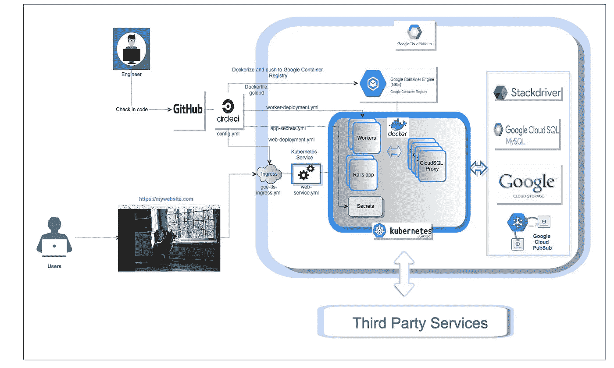
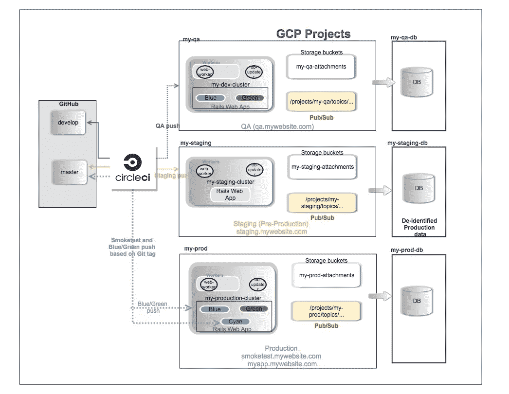
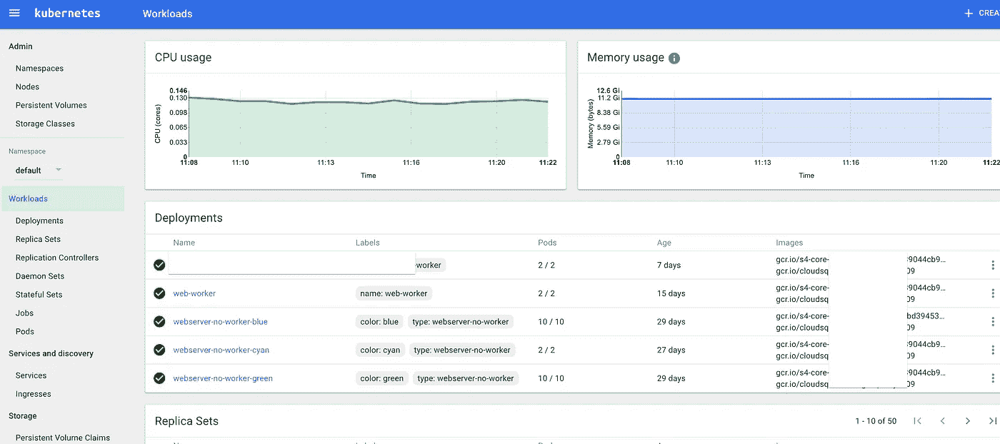
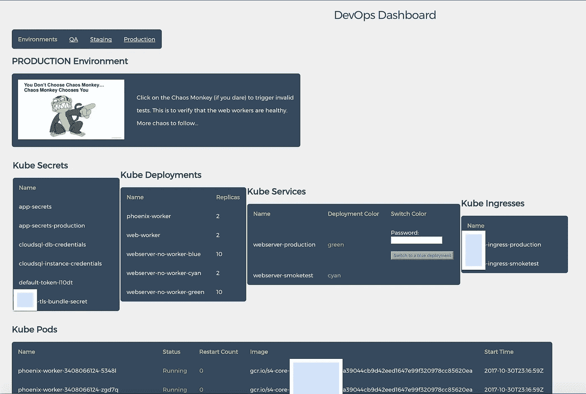
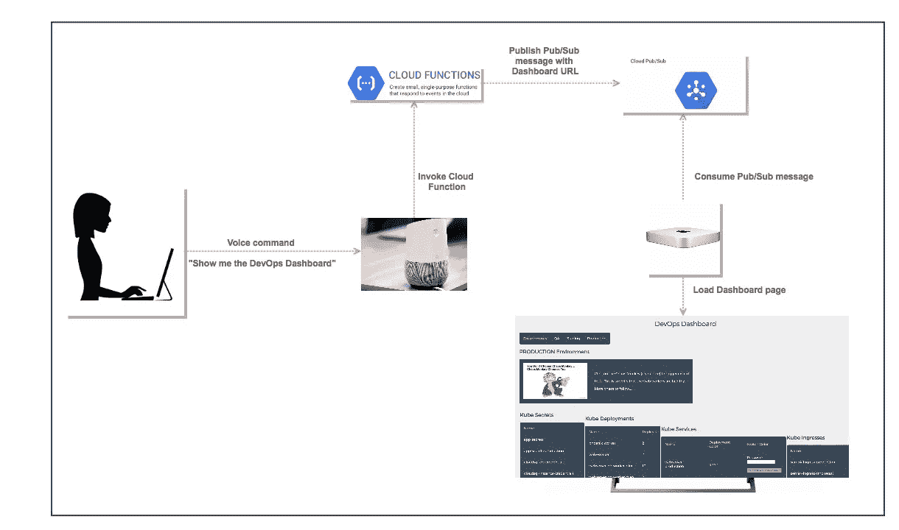
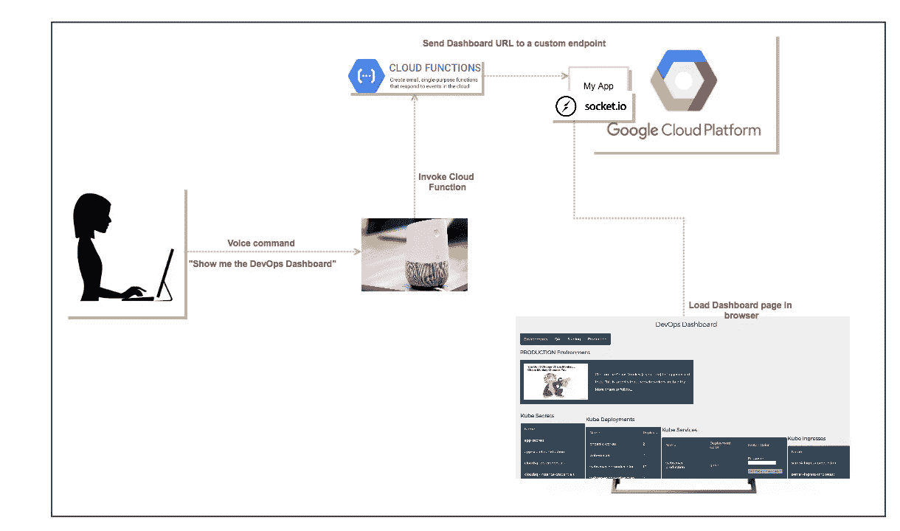

# 谈论一个好的 DevOps 游戏:Google 容器引擎部署、Kubernetes 仪表盘和 Google Home

> 原文：<https://medium.com/google-cloud/talking-a-good-devops-game-google-container-engine-deployments-kubernetes-dashboards-and-google-63a576b3e29b?source=collection_archive---------1----------------------->

这是我上一篇文章([让我们谈谈 Google Home、CircleCI 和 Google Container Engine](/google-cloud/lets-talk-deployments-with-google-home-circleci-and-google-container-engine-f4121703ef26) 的部署)的后续文章，并更详细地介绍了:

*   组织您的 GKE 部署。
*   使用 Kubernetes APIs 创建定制的 Kubernetes 仪表板。
*   使用 Google Assistant 加载仪表板

> **背景**:在[过去的文章](/me/stories/public)中，我们已经将应用程序(主要是 Rails 应用程序)部署到 GKE，并使用不同的技术通过 Kubernetes 实现零停机部署。本文中的技术也可以用于用其他语言构建的应用程序。
> 
> 我们还看到了一个[概念验证](/google-cloud/lets-talk-deployments-with-google-home-circleci-and-google-container-engine-f4121703ef26)，我们可以使用 Google Assistant，通过与 CircleCI 的 RESTful APIs 集成，开始构建和部署到 GKE。在那篇文章中，我提到了将助手与 Kubernetes API 连接起来以显示定制的仪表板。

本文简要论述了以下内容:

1.  典型的 GKE 部署模型是什么样的？
2.  如何将您的应用程序部署到各种环境中(QA、试运行、生产等。)
3.  快速浏览一下 [Kubernetes Web UI(仪表板)](https://kubernetes.io/docs/tasks/access-application-cluster/web-ui-dashboard/)
4.  如何使用[Kubernetes API](https://kubernetes.io/docs/concepts/overview/kubernetes-api/)来实现定制仪表板
5.  **有趣的功能**:如何通过谷歌助手的语音命令显示这个仪表盘或几乎任何其他网页

好的，让我们逐一解决这些问题。

# **典型的 GKE 部署模式是什么样的？**

**在下图**中，您可以看到一个示例 Rails 应用程序，它执行以下操作:

*   允许用户张贴狗的图片。该应用程序部署在 GKE。
*   它还运行后台进程(工人),处理这些图像，识别狗的品种和其他特征，并将这些细节保存在数据库中
*   它使用 CloudSQL 存储数据，使用 StackDriver 进行日志记录/监控/警报，使用 Pub/Sub 进行异步事件处理，使用 Storage buckets 存储狗图片。
*   该应用程序的用户将通过 HTTPS 访问网站。



谷歌容器引擎(GKE)中的 Rails 应用和工人的标准部署模型

> **在**的引擎盖下，你会看到一个**入口**(路由规则)完成 TLS 终止，一个**服务**(负载均衡器)将请求发送到 web 应用实例(**部署**)。web 应用程序和工作程序有单独的部署(异步流程)。入口和部署将使用**机密**(用于环境变量)来访问与第三方服务等对话所需的凭证。**由于该应用也是一个好公民**，它将使用 CloudSQL 代理打开到您数据库的安全连接。

**伟大的**！你在 GKE 有你的第一次部署。现在，您所要做的就是在您的多个环境中复制这一点(QA、试运行、生产…)就大功告成了！:-)

# 如何将您的应用程序部署到各种环境中(QA、试运行、生产等。)

该画第二张图了。这里有一种组织方式:



自动构建和部署到多个 GKE 环境

上图中有一组*信息。*

**主要特点:**

> 我们现在有 3 个环境(QA、试运行或预生产和生产)。生产有两种类型的部署(蓝色和绿色)。稍后我会详细解释“青色”。所有的构建/测试/部署过程都是完全自动化的，并且由 CircleCI 根据 Github 库中的不同触发器进行编排。

1.  合并到开发分支的代码**通过 CircleCI 自动部署到“my-QA”GCP 项目的集群中**
2.  合并到主分支的代码**自动部署到“我的分期”GCP 项目的集群中**
3.  当您**‘git tag’****master**分支时，一个部署会自动发生在同一个“my-prod”GCP 项目中的一个集群上，并被部署到同一个集群上的一个“青色”部署中。它还被部署到生产服务器中的“非活动颜色”中。示例:如果当前“颜色”为绿色，则标记为**蓝色**部署**的吊舱已完成部署。**
4.  该团队现在可以在“smoketest.mywebsite.com”上对指向青色部署的功能进行内部测试。此时，我们在青色部署和非活动蓝色部署上有了新版本的应用程序。绿色仍然支持生产中的当前版本。
5.  一旦“smoketest.mywebsite.com”上一切正常，您就可以切换开关，将您的生产应用程序(smoketest.mywebsite.com)指向上面“蓝色”部署中新部署的应用程序。
6.  为了保持数据库前端的数据模型和数据是最新的(对于 Rails 应用程序)，我们有一个 Kubernetes Pod(上图中的“db-updater ”),它在部署期间启动以运行迁移和种子，如果遇到任何错误，部署将会停止。通过一些创造性的查询，您可以发现作业何时运行及其输出。该 Pod 将在过程结束时被删除，但您仍然可以在通过/失败的 CircleCI 作业中看到日志。

**注意**:如果蓝/绿和现在的青色(！)术语没有多大意义，请看我关于这个话题的[文章](/@nithinmallya4/blue-green-deployments-for-a-rails-app-in-google-container-engine-gke-49ddcc1b002)

# 如何利用默认的 Kubernetes 仪表板

一旦我们有了上面的部署，接下来就是确保我们的部署看起来不错，没有重启等等。除了查看 StackDriver 仪表板、设置具有正确阈值的警报等，我们还需要一种能够可视化访问这些信息的方法。

> T **ip** :查看生产中的 pod 以了解是否有任何新的重启总是一个好的做法，因为通过通常的监控和警报方法来捕捉这些重启更加困难。

熟悉 [**kubectl**](https://kubernetes.io/docs/user-guide/kubectl-overview/) 命令的用户知道，当您运行下面的命令时，Kubernetes 提供了一个非常干净、用户友好的仪表板。您可以使用这个仪表板做很多事情(创建部署、服务、机密、增加/减少副本等。)，而这在**大部分**情况下应该足够了。

```
kubectl proxy
```



> **为附加功能提供案例**:有时，对于分布式团队和不同时区的团队，当需要生产推送时，请求生产部署的团队成员可能不一定熟悉部署模型或 **gcloud** 和 **kubectl** 工具。在这种情况下，拥有一个定制的仪表板可能会有所帮助，这个仪表板可以更具体地满足我们所拥有的应用程序的需求，并且可以被团队轻松地访问和理解。有多种方法可以实现这一点，下一节将对此进行讨论

# 如何使用 Kubernetes APIs 创建定制仪表板。

如果需要使用默认的 Kubernetes 仪表板，我们可以通过调用 Kubernetes RESTful APIs 来创建自己的仪表板。这可以通过以下方式实现:

*   使用 Kubernetes 提供的[标准客户端库](https://kubernetes.io/docs/reference/client-libraries/)(在 Go 和 Python 中)
*   使用[社区支持的](https://kubernetes.io/docs/reference/client-libraries/#community-maintained-client-libraries) (Node.js，Ruby 等)。)
*   通过标准 REST 客户端直接调用 RESTful APIs

下图显示了一个简单的仪表板，我们可以用它来跟踪**我们所有的环境**，并将我们的部署切换到相应的颜色。

以下亮点:

*   查看我们所有的 Kubernetes 工件及其状态(重启计数等。).您可以看到我们的应用程序被部署到 webserver-blue、webserver-green 和 webserver-cyan 部署中。我们还有异步工作进程(web-worker，phoenix-worker)
*   部署时间戳，以查看每次部署发生的时间和使用的映像。
*   一键切换到不同“颜色”部署的能力
*   将工作线程回滚到先前版本的能力(图中未显示)
*   当生产颜色切换完成时，自动发出宽限通知，详细说明谁在何时进行了更改
*   混沌猴功能(发送无效数据，测试连接中断等。)等等..



示例 DevOps 仪表板显示了各种 Kubernetes 工件，并允许用户修改部署

**如何:**

**选项 I:** 如前所述，您可以使用官方的 Kubernetes 客户端库(Go/Python)并利用这些库或社区支持的库构建一个仪表板。更多详情请点击[这里](https://kubernetes.io/docs/reference/client-libraries/#community-maintained-client-libraries)

**选项 II:** 创建一个简单的 Node.js Express 应用程序，它访问我们的主 API 服务器上的各个 Kubernetes 端点并获取数据。*为了实现这一点，您需要事先知道集群中 API 服务器的 IP 地址。通过这种方法，一个应用程序可以服务于 DevOps 仪表板，因为它能够从不同项目的多个集群中获取部署细节。上图显示了这种方法*

当运行 kubectl 命令并将详细程度设置为 8 时:

```
kubectl <your command> --v=8
```

您将获得 API 服务器的 IP 地址和实际调用的 GET/PATCH 调用。

例如，如果您运行:

```
kubectl get deployment —-v=8
```

您将看到类似如下的输出:

```
GET https://<API-SERVER-IP-ADDRESS>/apis/extensions/v1beta1/namespaces/default/deployments
```

**选项三:**

另一种选择是在集群中启动一个容器，该容器在本地运行一个“kubectl 代理”,并且可以由在该容器中运行的应用程序通过 http://localhost:8001/…访问..端点。

**注:**每个集群都需要这种方法。

# **趣味功能**:如何通过谷歌助手的语音命令显示这个仪表盘(或任何其他网页)

以下是通过语音命令(" **Show me the DevOps Dashboard** ")显示您的仪表盘的几种方法:

1.  您可以使用 Google Pub/Sub 和一个充当 Pub/Sub 消费者的本地轻量级客户端来加载仪表板页面(参见我的[以前的文章](/google-cloud/lets-talk-deployments-with-google-home-circleci-and-google-container-engine-f4121703ef26)关于如何为 Google Assistant 创建实体、意图和实现端点)



node.js 中的云函数片段如下所示:

```
const PubSub = require('[@google](http://twitter.com/google)-cloud/pubsub');// Instantiates a client
const pubsub = PubSub();function publish (req, res) {
  console.log(`Publishing message to topic <YOUR TOPIC>`);
  const topic = pubsub.topic('<YOUR TOPIC>');const message = {
    data: {
      url: '<MY DASHBOARD URL'
    }
  };// Publishes a message
  return topic.publish(message)
    .then(() => res.status(200).send('Message published.'))
    .catch((err) => {
      console.error(err);
      res.status(500).send(err);
      return Promise.reject(err);
    });
};
```

Ruby 中的本地桌面客户端(Pub/Sub consumer)看起来像下面的例子(它连续运行，并简单地打开一个浏览器窗口，其中包含从 Pub/Sub 消息中获得的 URL)。

```
# Local Pub/Sub client (ruby)require 'google/cloud/pubsub'pubsub = Google::Cloud::Pubsub.new(
  project: '<MY GCP PROJECT>',
  keyfile: '<MY SERVICE ACCOUNT CREDENTIALS JSON FILE'
)loop do
  sub = pubsub.subscription '<MY SUBSCRIPTION NAME>'
  msgs = sub.pull
  sub.acknowledge msgs
  received_message = msgs[0] unless msgs.nil?
  next if received_message.nil?
  json_obj = JSON.parse(received_message.data) 
  url = json_obj['data']['url']
  `open #{url}`
end
```

> ***注意*** *:由于这种方法的异步特性，请做好准备，它需要大约 10 秒来加载仪表板。*

2.通过 socket.io 在 Node.js 应用程序中使用自定义端点将用户请求的 URL 实时发送到客户端浏览器。您需要使用 socket.io 服务器和客户端库来实现这一点。这显然会比上述方法更快。



**结论:**我们已经讨论了很多内容，详细描述了过去对我们有所帮助的一些部署策略。希望这篇文章实现了它的初衷:分享将我们的应用程序部署到 GKE 的不同方法，同时通过使用 Google Assistant 查看仪表板的更现代的方式，将它提升一个档次。