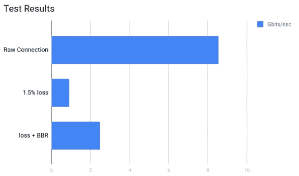

# TCP BBR:网络性能的魔尘。

> 原文：<https://medium.com/google-cloud/tcp-bbr-magic-dust-for-network-performance-57a5f1ccf437?source=collection_archive---------0----------------------->

大多数人都不知道，今天的互联网运行在 80 年代设计的算法和协议上。你知道，回到像“留言板”这样最令人兴奋的事情发生的时候。

但这不是今天的互联网。今天的互联网分布在 70 亿人的设备和网络连接上，从令人惊叹的 1GB /秒有线连接到……嗯..不是。

这就带来了一个问题，也许今天的互联网需要要求并升级我们 30 年前制作的那些算法。

**这就是 BBR TCP 的用武之地。**这是一种 TCP 拥塞控制算法，针对现代互联网的拥塞而构建。

# TCP:分享就是关爱。

TCP 试图平衡快速(快速传输数据)和平衡(多个用户共享管道)之间的需求，更注重平衡。

大多数 TCP 实现使用退避算法，这导致您获得管道的带宽(任何大于该带宽的带宽都会排挤其他人)。不利的一面是，即使你是唯一使用管道的人，TCP 通常也会大量利用你的网络连接(高达 50%)。

这是 TCP 的主要问题，它对平衡网络传输的关注导致了带宽的浪费。

# TCP BBR:重要的比特

你可以阅读[的论文](http://queue.acm.org/detail.cfm?id=3022184)了解更多细节，但要点是 BBR 是一种拥塞控制技术，它:

**旨在应对实际拥塞，而不是丢包。**BBR 团队设计这种算法的目的是希望能够对实际的拥塞做出反应，而不是丢包。BBR 对网络进行建模，使其发送速度与可用带宽一样快，在 10Gb、100 毫秒的链路上比以前的 TCP 快 2700 倍，并且只有 1%的丢失

**专注于在网络不太好时提高网络性能。** TCP BBR 更准确地平衡了公平性和利用率，从而在同一网络上获得更快的下载速度。这在网络不好的情况下最明显(然而，如果你在一个非常干净的网络上，这不会伤害你)

**不要求客户端实现 BBR** 。这是神奇的仙尘。以前的算法，如 QUIC，要求客户机&服务器都实现该算法。BBR 不要求客户也使用 BBR。这在发展中国家尤其重要，这些国家使用较旧的移动平台，带宽有限，或者网站服务还没有进行转换的地区。

# 带着 BBR 去兜风

这一切听起来很好，但让我们踢踢轮胎，看看这项技术到底有多好。为了进行测试，我在两个不同的区域设置了两个虚拟机，并做了一个快速的 Iperf 测试来检查它们的性能:

*[4]0.0–10.0 秒 9.97 千兆字节 8.55 千兆位/秒*

为了模拟 BBR 有用的理想条件(高分组丢失),我们执行下面的 tc 命令，模拟特定百分比的分组丢失。

***sudo tc qdisc add dev eth0 根 netem 损失 1.5%***

当现有虚拟机连接时，我们看到性能显著下降(这是我们预料到的):

*[3]0.0–10.3 秒 1.10 千兆字节 921 兆比特/秒*

然后，我们在服务器端仅使用以下命令打开 BBR:

***sysctl-w net . IP v4 . TCP _ congestion _ control = BBR***

(注意，这只是在您使用 4.10+ linux 内核的情况下，否则，您将需要[来执行这些步骤](https://github.com/google/bbr/blob/master/Documentation/bbr-quick-start.md))

我们做了同样的 Iperf 测试

*[3]0.0–10.0 秒 2.90 千兆字节 2.49 千兆位/秒*

我们看到，仅仅为了在服务器中设置一个简单的标志，原始连接的带宽就增加了近两倍。

# 在哪里使用 TCP BBR？

这是最棒的部分，如果你在谷歌云平台上构建你的技术，那么你已经让 BBR 在运行了。谷歌云平台的[前端](https://cloud.google.com/endpoints/)、[负载均衡器](https://cloud.google.com/load-balancing/)和[托管服务](https://cloud.google.com/appengine/)已经启用了 TCP BBR，所以你在糟糕地区的任何客户端都已经看到了性能的提升。

然而，如果你将一个 VM 端点直接暴露给用户(比方说，对于一个 VPN)，那么你将需要自己启用 TCP BBR(如果你的内核支持 BBR，通过设置标志，或者[自己编译升级](https://github.com/google/bbr/blob/master/Documentation/bbr-quick-start.md)，或者将端点放在一个 GFE 接口后面(关于这方面的更多信息，请参见我以前对 [HTTP 负载平衡](/@duhroach/profiling-gcps-load-balancers-94c552f06736)的测试)。

现在，大部分的好处将会出现在**面向不良流量区域终端的客户端上**。因此，如果您在虚拟机之间启用此功能，如果情况没有明显好转，也不要惊慌。也就是说，使用它没有坏处，即使是在良好的连接区域；

我的建议？打开它，告诉你的用户你已经取得了巨大的性能改善，并继续去关注更重要的事情；)