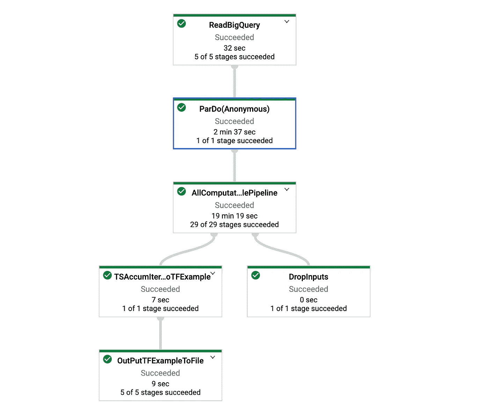
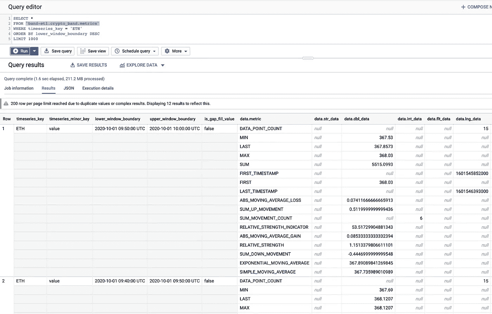
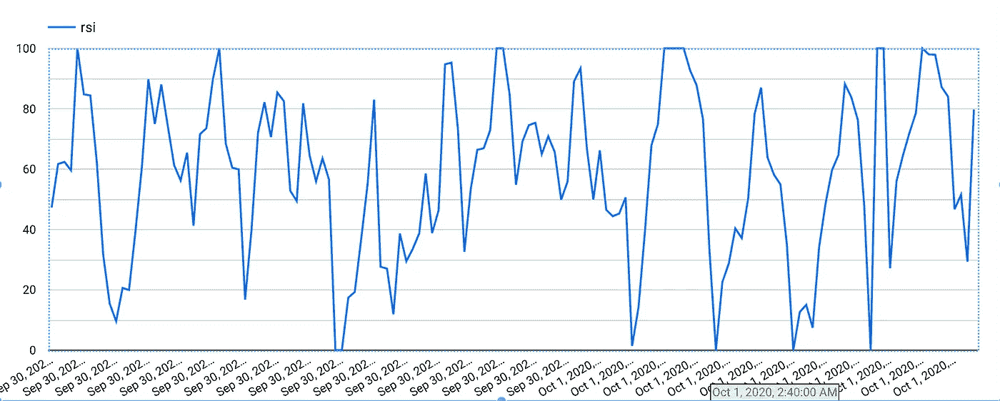

# 基于深度学习和 Band 协议的实时加密价格异常检测

> 原文：<https://medium.com/google-cloud/technical-indicators-calculation-and-anomaly-detection-on-band-protocol-data-6dbf3b9b92c6?source=collection_archive---------0----------------------->

对金融时间序列数据进行即时、准确的分析，对于处于资本市场核心的价格发现机制至关重要。

**我们将向您展示如何使用机器学习从金融时间序列数据中实时获得洞察力**。特别地，提供了实现用于异常检测的 LSTM 神经网络的 Keras 模型。

**我们正在使用的数据来自 Google BigQuery** 中的 [**波段协议公共数据集**](https://console.cloud.google.com/marketplace/product/public-data-finance/crypto-band-dataset) **。 [Band Protocol](https://bandprotocol.com/) 是一个跨链的数据 oracle 平台，它将真实世界的数据和 API 聚合并连接到智能合约。[这个示例查询](https://console.cloud.google.com/bigquery?sq=514812189943:ddb21ecda3324764ae185eef010a187d)给出了 100 种货币对的最新和历史美元价格，包括$ETH、$BTC 和$BAND。**

# 分析一目了然

整个过程可以分为两部分:

**第 1 部分:使用** [**数据流**](https://cloud.google.com/dataflow) 的度量计算。包括以下度量指标和技术指标:相对强弱指标( [RSI](https://en.wikipedia.org/wiki/Relative_strength_index) )、移动平均线( [MA](https://en.wikipedia.org/wiki/Moving_average) )、开盘价、最高价、最低价、收盘价( [OHLC](https://en.wikipedia.org/wiki/Open-high-low-close_chart) )。

第 2 部分:异常检测。我们正在使用在 [Keras](https://keras.io/) 中实现的 [LSTM](https://adventuresinmachinelearning.com/keras-lstm-tutorial/) 模型。

现在，让我们来看看细节。

# 第 1 部分:度量计算

从检查源代码库开始:

```
git clone [https://github.com/blockchain-etl/band-dataflow-sample-applications.git](https://github.com/blockchain-etl/band-dataflow-sample-applications.git)
cd band-dataflow-sample-applications
cd timeseries-streaming/timeseries-java-applications
```

**从历史数据中引导指标**

BandDataBootstrapGenerator 管道允许您计算历史 oracle 请求的指标。数据来源于 BigQuery 表`[*public-data-finance.crypto_band.oracle_requests*](https://console.cloud.google.com/bigquery?p=public-data-finance&d=crypto_band&t=oracle_requests&page=table)` *。*

初始化变量:

```
*PROJECT=$(gcloud config get-value project 2> /dev/null)    
# Make sure to update the date to yesterday's date
TIMESTAMP_THRESHOLD="2020-10-01T07:00:00.0Z" 
DATASET_NAME=crypto_band
TABLE_NAME=metrics
TEMP_BUCKET=<replace_with_your_temporary_bucket>*
```

创建大查询数据集:

```
bq --location=US mk --dataset $DATASET_NAME 
```

运行管道:

```
./gradlew generate_band_bootstrap_data --args="\
    --bigQueryTableForTSAccumOutputLocation=$PROJECT:$DATASET_NAME.$TABLE_NAME \
    --timestampThreshold="$TIMESTAMP_THRESHOLD" \
    --runner=DataflowRunner \
    --tempLocation=gs://$TEMP_BUCKET/temp \
    --maxNumWorkers=1 \
    --region=us-central1 \
"
```

管道将被部署到数据流，根据历史数据的数量，需要 30 到 60 分钟。



“引导度量”数据流管道

默认情况下，管道对 OHLC 使用 10 分钟的聚合窗口，对移动平均和 RSI 计算使用 60 分钟的滚动窗口。您可以分别使用`--typeOneComputationsLengthInSecs`和`--typeTwoComputationsLengthInSecs`自定义参数。

您可以在我们之前设置的公共表`band-etl.crypto_band.metrics`中观察结果:

```
SELECT * 
FROM `band-etl.crypto_band.metrics` 
--WHERE timeseries_key = 'ETH'
ORDER BY lower_window_boundary DESC
LIMIT 1000
```



BigQuery 控制台中的 band-etl.crypto_band.metrics 表

您可以查询前一天的$ETH 的 RSI:

```
SELECT upper_window_boundary as time, data.dbl_data as RSI 
FROM `band-etl.crypto_band.metrics` 
CROSS JOIN UNNEST(data) AS data
WHERE timeseries_key = 'ETH'
  AND data.metric = 'RELATIVE_STRENGTH_INDICATOR'
ORDER BY lower_window_boundary DESC
LIMIT 144
```

并直接从 BigQuery 控制台在 [Data Studio](http://datastudio.google.com) 中将其可视化:



以太坊相对强度指数(RSI)

**从发布/订阅流计算指标**

[BandDataStreamGenerator](https://github.com/blockchain-etl/band-dataflow-sample-applications/blob/master/timeseries-streaming/timeseries-java-applications/BandExamples/src/main/java/io/blockchainetl/band/examples/simpledata/transforms/BandDataStreamGenerator.java)管道允许您计算从发布/订阅订阅`projects/public-data-finance/topics/crypto_band.oracle_requests`中提取的 oracle 请求的指标。它会将结果输出到指定的 BigQuery 表和指定的发布/订阅主题。

为波段协议 oracle 请求创建发布/订阅:

```
gcloud pubsub subscriptions create crypto_band.oracle_requests.metrics \
    --topic=crypto_band.oracle_requests \
    --topic-project=public-data-finance
```

初始化变量:

```
*PROJECT=$(gcloud config get-value project 2> /dev/null)    
# Make sure to update the date to yesterday's date
TIMESTAMP_THRESHOLD="2020-10-01T07:00:00.0Z" 
DATASET_NAME=crypto_band
TABLE_NAME=metrics
TEMP_BUCKET=<replace_with_your_temporary_bucket>* TOPIC_NAME=crypto_band.metrics
```

在数据流中启动管道:

```
./gradlew run_band_example --args="\
    --pubSubSubscriptionForOracleRequests=projects/$PROJECT/subscriptions/crypto_band.oracle_requests.metrics \
    --bigQueryTableForTSAccumOutputLocation=$PROJECT:$DATASET_NAME.$TABLE_NAME \
    --timestampThreshold="$TIMESTAMP_THRESHOLD" \
    --pubSubTopicForTSAccumOutputLocation=projects/$PROJECT/topics/$TOPIC_NAME \
    --runner=DataflowRunner \
    --maxNumWorkers=1 \
    --workerMachineType=n1-standard-1 \
    --diskSizeGb=30 \
    --region=us-central1 \
"
```

输出将被传输到指定的 BigQuery 表和发布/订阅主题。

# 第 2 部分:异常检测

下面提供的示例旨在探索处理频段协议数据所需的数据工程，并将其交付给[自动编码器—解码器](https://en.wikipedia.org/wiki/Autoencoder#Anomaly_Detection)。

第 2 部分可以分为三个步骤:

1.  正在生成 TF。训练模型的示例。
2.  根据训练数据训练 LSTM 模型。
3.  批量异常检测。

**生成 TF。带协议数据的示例**

为了构建模型，您需要首先运行生成器作业
[BandDataBootstrapGenerator.java](https://github.com/blockchain-etl/band-dataflow-sample-applications/blob/master/timeseries-streaming/timeseries-java-applications/BandExamples/src/main/java/io/blockchainetl/band/examples/simpledata/transforms/BandDataBootstrapGenerator.java)，它将创建训练数据作为 TF。示例:

```
*git clone https://github.com/blockchain-etl/band-dataflow-sample-applications.git
cd dataflow-sample-applications/timeseries-streaming/timeseries-java-applications*
```

运行数据流作业(确保用您的值替换`<your_temp_bucket>`，并更新`TIMESTAMP_THRESHOLD`变量):

```
TIMESTAMP_THRESHOLD="2020-10-03T00:00:00.0Z"
BUCKET=<your_temp_bucket>
./gradlew generate_band_bootstrap_data --args="\
    --interchangeLocation=gs://$BUCKET/band_bootstrap_tfexamples/run0 \
    --timestampThreshold="$TIMESTAMP_THRESHOLD" \
    --runner=DataflowRunner \
    --tempLocation=gs://$BUCKET/temp \
    --maxNumWorkers=1 \
    --region=us-central1 \
"
```

一旦工作完成，从`gs://$BUCKET/band_bootstrap_tfexamples/run0`下载生成的文件，
修改 [config.py](https://github.com/blockchain-etl/band-dataflow-sample-applications/blob/master/timeseries-streaming/timeseries-python-applications/MLPipelineExamples/test_pipelines/config.py) 中的信息以匹配您的本地环境。

**训练模型**

设置虚拟环境:

```
virtualenv -p python3.7 streaming-tf-consumer
source streaming-tf-consumer/bin/activate
```

安装依赖项:

```
git clone [https://github.com/blockchain-etl/band-dataflow-sample-applications.git](https://github.com/blockchain-etl/band-dataflow-sample-applications.git)
cd dataflow-sample-applications/timeseries-streaming/timeseries-python-applications
cd MLPipeline
pip install -e .
cd ..
ls
```

在激活虚拟环境的情况下运行命令:

```
python MLPipelineExamples/test_pipelines/timeseries_local_simple_data.py
```

您应该会看到如下的模型建筑:

```
....
Epoch 26/30
280/280 [==============================] - 6s 21ms/step - loss: 119.8072 - mean_absolute_error: 6.8178 - val_loss: 684588.3750 - val_mean_absolute_error: 670.2068
Epoch 27/30
280/280 [==============================] - 7s 23ms/step - loss: 119.6002 - mean_absolute_error: 6.8087 - val_loss: 203.5257 - val_mean_absolute_error: 8.6160
Epoch 28/30
280/280 [==============================] - 6s 20ms/step - loss: 119.5842 - mean_absolute_error: 6.8084 - val_loss: 41512.6406 - val_mean_absolute_error: 160.1564
Epoch 29/30
280/280 [==============================] - 6s 20ms/step - loss: 119.5832 - mean_absolute_error: 6.8084 - val_loss: 5213.2568 - val_mean_absolute_error: 58.4286
Epoch 30/30
280/280 [==============================] - 5s 19ms/step - loss: 119.5791 - mean_absolute_error: 6.8083 - val_loss: 24351.4551 - val_mean_absolute_error: 151.2784
```

这将在 config.py 文件中您为`PIPELINE_ROOT`指定的位置下输出一个 serving_model_dir。
现在，您可以按照选项 1 中概述的其余步骤，但使用您自己的模型。

**批量推断**

在 [batch_inference.py](https://github.com/blockchain-etl/band-dataflow-sample-applications/blob/master/timeseries-streaming/timeseries-python-applications/MLPipelineExamples/test_pipelines/batch_inference.py) 中定义的流水线读取给定的 TF。示例和保存的模型，
运行推理以获得预测值，将该值与实际值进行比较，如果差值大于阈值
，则将该值报告为异常。

在激活 virtual-env 的情况下运行命令，使用在上一步中构建的模型提供
`--saved_model_location`的位置值，以及使用`--tfrecord_folder:`从 GCS bucket 下载的生成数据的位置值

```
*python MLPipelineExamples/test_pipelines/batch_inference.py \
--saved_model_location=./build/Trainer/model/5/serving_model_dir \
--tfrecord_folder=/<your-directory>/data/**
```

您将看到检测到异常值的消息:

```
*...
Outlier detected for ETH-value-LAST at 2020-08-23 21:20:00 - 2020-08-23 22:20:00 Difference was 279.74764251708984 for value input 388.8900146484375 output 109.14237213134766 with raw data [388.8900146484375]
Outlier detected for ETH-value-FIRST at 2020-08-22 14:20:00 - 2020-08-22 15:20:00 Difference was 310.73509216308594 for value input 392.1044921875 output 81.36940002441406 with raw data [392.1044921875]
Outlier detected for ETH-value-LAST at 2020-08-22 14:20:00 - 2020-08-22 15:20:00 Difference was 308.1451416015625 for value input 392.1044921875 output 83.9593505859375 with raw data [392.1044921875]*
```

**注 1:** 本样本旨在展示支持从流束管道生成并交付给 LSTM 自动编码器-解码器的数据所需的数据工程工作。它并不打算展示异常检测的最新机器学习方法，还需要做更多的工作来优化模型以获得更好的性能。

**注 2:** 这里使用的 LSTM 是预先训练和部署的，而不是在线学习的。将这个示例扩展为小批量在线学习留给读者作为练习。

## 参考

本文基于 Reza Rokni 的工作。有关数据流中时间序列数据处理的更多示例，请参考以下知识库:

[https://github . com/Google cloud platform/data flow-sample-applications/tree/master/time series-streaming](https://github.com/GoogleCloudPlatform/dataflow-sample-applications/tree/master/timeseries-streaming)。