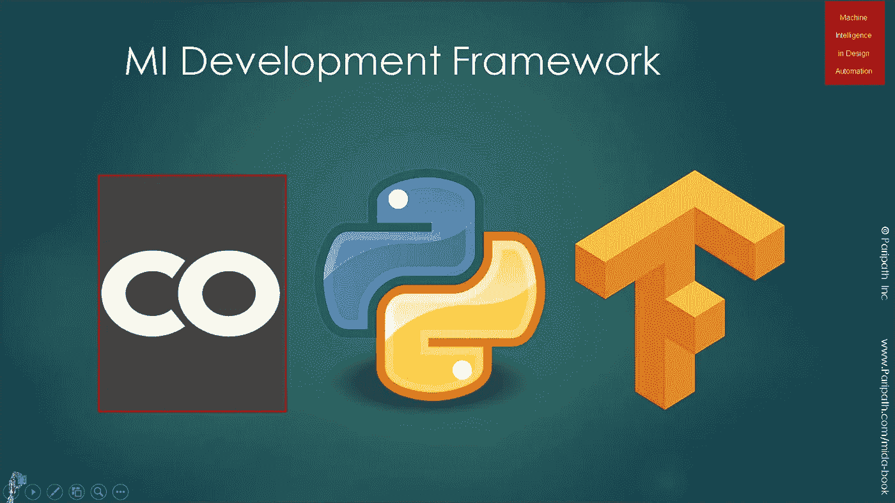
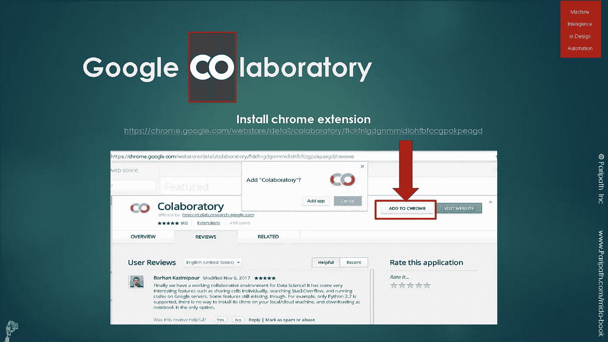
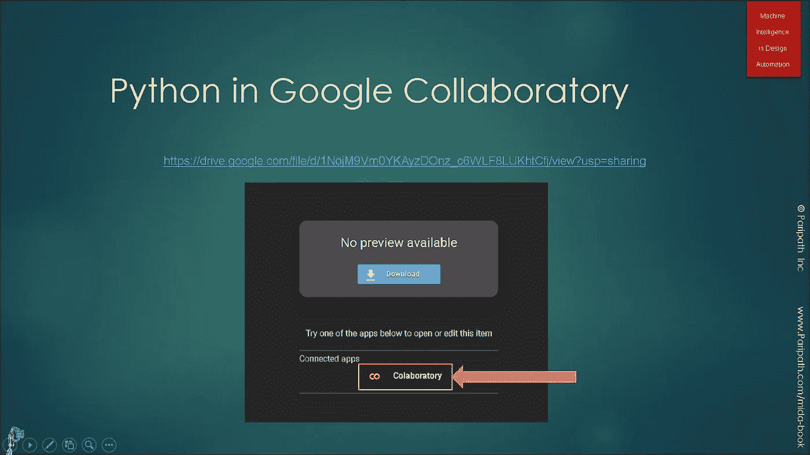
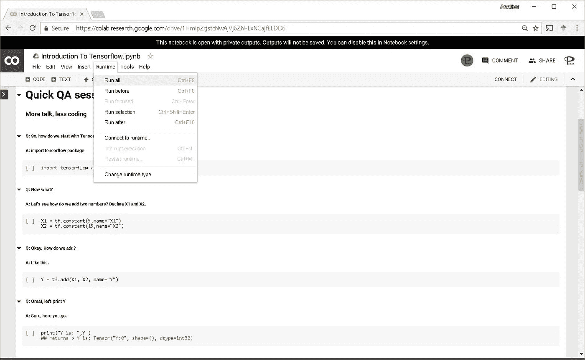
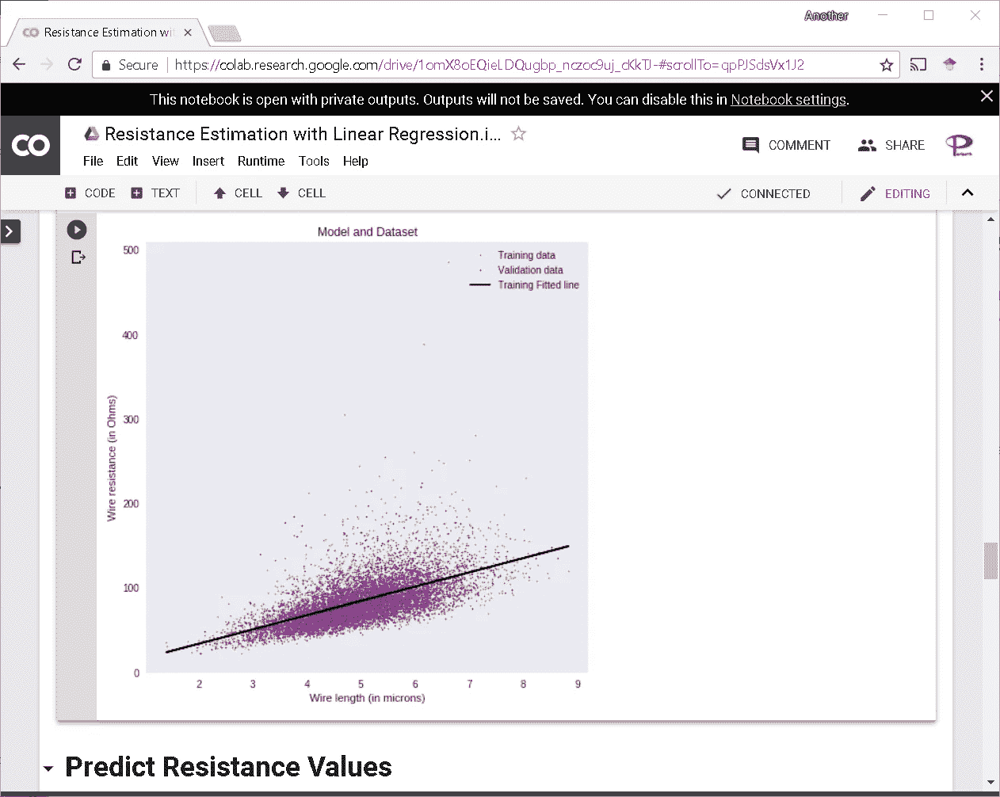

# 60 秒后张量流

> 原文：<https://medium.com/google-cloud/tensorflow-in-a-60-seconds-3529e637d207?source=collection_archive---------0----------------------->

用 TensorFlow 和**对机器学习说**你好**感谢**谷歌提供免费资源(包括 Chrome 浏览器、Colab 笔记本、云端强大的 GPU)。这里是一个 60 秒的快速复习，只需 3 个步骤和 3 次点击。

# **谷歌联合实验室的 Python 与 tensor flow**

图片鸣谢:[设计自动化中的机器学习](http://amzn.to/2paZ53b)

本文将向您展示如何使用 Python、Tensorflow 和 Google Colab 作为软件基础设施，使用 Google Cloud 作为硬件主干来运行一个样本机器学习应用程序。

# **在 Chrome 浏览器中点击并安装 co laboratory**

点击以下网址在 chrome 浏览器中安装 colab 扩展—[https://chrome . Google . com/web store/detail/co laboratory/flckfnigdgnmmidlohbfccgpakpeagd](https://chrome.google.com/webstore/detail/colaboratory/flckfnigdgnmmidlohfbfccgpakpeagd)。这个扩展充当机器学习应用程序的 IDE。

图片鸣谢:[设计自动化中的机器学习](http://amzn.to/2paZ53b)

# **打开 TensorFlow 笔记本**

在 chrome 浏览器中点击以下网址—[https://colab . research . Google . com/drive/1 hmipzcjstcnwajvj 6 Zn-lxncajfeld 6](https://colab.research.google.com/drive/1HmIpZcjstcNwAjVj6ZN-LxNCajfELDD6)。这将打开 Colab IDE。点击“ ***在游乐场*** 打开”，然后点击“ ***复制到硬盘*** ，在你的 google drive 中创建一个本地副本。

图片鸣谢:[设计自动化中的机器学习](http://amzn.to/2paZ53b)

# 我们跑吧

一旦你有了本地副本，按下<ctrl-f9>或点击“运行时->运行所有”在你的浏览器中运行简单的机器学习应用。</ctrl-f9>

图片鸣谢:[设计自动化中的机器学习](http://amzn.to/2paZ53b)

# **结果**

一旦你运行，你会看到机器学习模型训练，生成和分析一次踢进一个细胞。见下图:

图片鸣谢:[设计自动化中的机器学习](http://amzn.to/2paZ53b)

# **概要:**

一旦你成功运行了这个示例应用程序，你就可以删除代码或者导入一个新的 [jupyter](http://jupyter.org) 笔记本，开始编写你最新的机器学习应用程序。编码快乐！

# **参考文献**:

1.  [设计自动化中的机器智能](http://amzn.to/2paZ53b)
2.  [使用机器学习开发 EDA 应用](https://srohit0.github.io/mida/)
3.  关于 EDA 中的[机器学习的网络研讨会。](http://go.eventshigh.com/zm2oi)