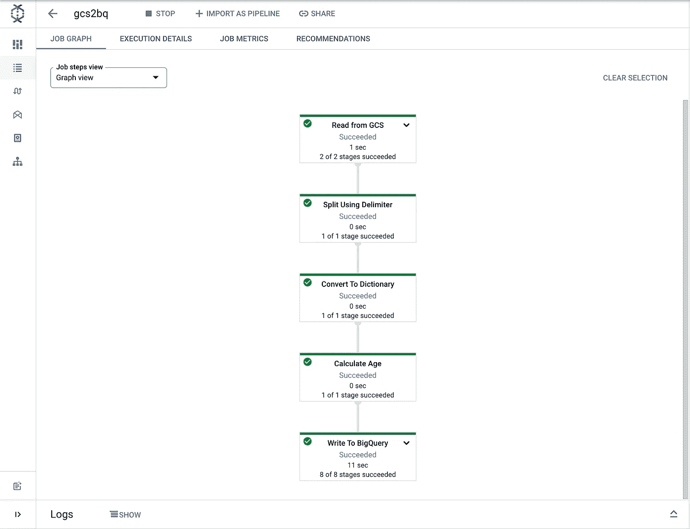

# Teradata 到 BigQuery 迁移指南

> 原文：<https://medium.com/google-cloud/teradata-to-bigquery-migration-guide-b053c262b3e2?source=collection_archive---------0----------------------->

对于希望利用 BigQuery 的可扩展性和成本效益来满足数据分析需求的企业来说，将数据从 Teradata 迁移到 Google BigQuery 是一个常见的用例。

将数据从 Teradata 迁移到 BigQuery 时，可以采用几种不同的方法。最适合您组织的方法将取决于您的特定需求和要求。

一些常见的方法包括:

1.  **直接导出和导入:**这种方法包括使用 Teradata Parallel Transporter(TPT)或 Teradata Studio 等工具从 Teradata 导出数据，然后使用 BigQuery web UI、CLI 或 API 将数据导入 BigQuery。这是一种简单的方法，适用于中小型数据集。
2.  **使用 BQ 数据传输进行数据传输:**BigQuery 数据传输服务是一种完全托管的云原生数据集成服务，允许您计划和自动将来自各种来源的数据传输到 big query，包括 Teradata 等本地数据库..这种方法适用于一次性或定期的数据传输，尤其适用于需要在 BigQuery 中自动迁移分区和集群数据的情况。
3.  **使用云数据流的 ETL(提取、转换、加载):** Google Cloud Dataflow 是一个完全托管的云原生数据处理服务，允许您为 ETL、批处理和流处理构建和执行数据管道。数据流是数据迁移的有用工具，特别是对于较大的数据集或需要更复杂转换的情况。总的来说，使用云数据流进行 Teradata 到 BigQuery 的迁移允许您构建和执行完全托管的数据管道，该管道可以处理您的迁移项目的 ETL 或 ELT 需求。

总的来说，将数据从 Teradata 迁移到 BigQuery 的过程需要仔细规划和执行，以确保数据的成功传输。

# 方法 1: BigQuery 数据传输服务

# Teradata 实例设置

出于测试目的，可以在 Google Cloud 上设置 Teradata 实例。如果您在本地服务器或任何其他云环境上运行 Teradata，您可能需要为该实例设置网络和防火墙规则。这可能涉及创建虚拟私有云(VPC)并配置必要的防火墙规则，以允许传入流量进入实例。

## 为数据传输创建服务帐户

```
# Set the PROJECT variable
export PROJECT=$(gcloud config get-value project)

# Create a service account
gcloud iam service-accounts create td2bq-transfer
```

## BigQuery 和云存储管理员角色绑定

```
# Set TD2BQ_SVC_ACCOUNT = service account email
export TD2BQ_SVC_ACCOUNT=td2bq-transfer@${PROJECT}.iam.gserviceaccount.com

# Bind the service account to the BigQuery Admin role
gcloud projects add-iam-policy-binding ${PROJECT} \
  --member serviceAccount:${TD2BQ_SVC_ACCOUNT} \
  --role roles/bigquery.admin

# Bind the service account to the Storage Admin role
gcloud projects add-iam-policy-binding ${PROJECT} \
  --member serviceAccount:${TD2BQ_SVC_ACCOUNT} \
  --role roles/storage.admin
```

## 创建 Teradata GCE 实例

```
# Create the Teradata GCE instance
gcloud compute instances create teradata-vantage-express \
  --zone=us-central1-a \
  --machine-type=n2-custom-4-8192 \
  --create-disk=boot=yes,device-name=ve-disk,image-project=ubuntu-os-cloud,image-family=ubuntu-2004-lts,size=70,type=pd-balanced \
  --enable-nested-virtualization \
  --tags=ve
  --service-account=${TD2BQ_SVC_ACCOUNT}
```

## 遵循 Teradata 官方指南在 Google Cloud 上运行 Vantage Express

[https://quickstarts.teradata.com/vantage.express.gcp.html](https://quickstarts.teradata.com/vantage.express.gcp.html)

## 在计算引擎实例上启动 Teradata 虚拟机

```
# ssh to the VM
gcloud compute ssh teradata-vantage-express --zone=us-central1-a

# switch to root user
sudo -i
```

```
export VM_IMAGE_DIR="/opt/downloads/VantageExpress17.20_Sles12"
DEFAULT_VM_NAME="vantage-express"
VM_NAME="${VM_NAME:-$DEFAULT_VM_NAME}"
vboxmanage createvm - name "$VM_NAME" - register - ostype openSUSE_64
vboxmanage modifyvm "$VM_NAME" - ioapic on - memory 6000 - vram 128 - nic1 nat - cpus 4
vboxmanage storagectl "$VM_NAME" - name "SATA Controller" - add sata - controller IntelAhci
vboxmanage storageattach "$VM_NAME" - storagectl "SATA Controller" - port 0 - device 0 - type hdd - medium "$(find $VM_IMAGE_DIR -name '*disk1*')"
vboxmanage storageattach "$VM_NAME" - storagectl "SATA Controller" - port 1 - device 0 - type hdd - medium "$(find $VM_IMAGE_DIR -name '*disk2*')"
vboxmanage storageattach "$VM_NAME" - storagectl "SATA Controller" - port 2 - device 0 - type hdd - medium "$(find $VM_IMAGE_DIR -name '*disk3*')"
vboxmanage modifyvm "$VM_NAME" - natpf1 "tdssh,tcp,,4422,,22"
vboxmanage modifyvm "$VM_NAME" - natpf1 "tddb,tcp,,1025,,1025"
vboxmanage startvm "$VM_NAME" - type headless
vboxmanage controlvm "$VM_NAME" keyboardputscancode 1c 1c
```

## 下载 Teradata 客户端和 jar

*   导航至 [Teradata 工具和实用程序下载页面](https://downloads.teradata.com/download/tools/teradata-tools-and-utilities-linux-installation-package-0)
*   点击你想下载的文件
*   从浏览器复制下载 URL 并运行`curl`命令，如下所示:

```
# Download file
curl -o FILE_NAME "URL"

# Extract the file
tar -xvf TeradataToolsAndUtilitiesBase__ubuntu_x8664.17.20.08.00.tar.gz
```

解压实用程序文件后，安装`tptbase`以使用`tbuild`实用程序

```
# Change directory
cd TeradataToolsAndUtilitiesBase

# Install
./setup.sh tptbase
```

按照相同的步骤从 [Teradata JDBC 驱动程序下载页面](https://downloads.teradata.com/download/connectivity/jdbc-driver)下载 Teradata JDBC 驱动程序

*   解压主目录下的文件，得到`terajdbc4.jar`

## 安装转移代理

该代理是 BigQuery 数据传输服务的一部分，可以自动在 Teradata 和 BigQuery 之间移动数据

```
# Install Java
sudo apt-get install openjdk-8-jre-headless

# Download transfer agent
sudo wget -P /root/ \
https://storage.googleapis.com/data_transfer_agent/latest/mirroring-agent.jar
```

## 到虚拟机和查询数据库的 ssh

```
# ssh to Vantage Express VM. Use root as password
ssh -p 4422 root@localhost

# Validate if the DB is up
pdestate -a
```

一旦 Vantage Express 启动并运行，启动`bteq`客户端命令行客户端。当询问密码时，输入`dbc`

```
>> bteq
Enter your logon or BTEQ command:
.logon localhost/dbc
Password: dbc
```

## 运行测试查询

最初，不会出现任何数据库或表。您需要从本地文件导入表，或者使用 SQL 创建表并手动插入数据。在这一步中，根据您的要求创建环境结构。

```
SELECT * FROM HR.Employees;

# Close BTEQ
.QUIT
```

# 使用 BigQuery 控制台创建传输

在谷歌云控制台中，

*   转到 BigQuery 页面
*   点击`**Data transfers**`
*   点击`**Create transfer**`

根据要求提供适当的信息。


数据传输配置详细信息

提供目标和源的详细信息:

*   目标数据集
*   源数据库类型。选择`Teradata.`
*   提供云存储桶路径。这个存储桶将用于在迁移过程中存储中间数据。
*   源数据库名称
*   **表名模式**
    -选择特定的表，提供管道分隔的表名`table1|table2`
    -指定`.*`处理源数据库中的所有表
*   对于**服务帐户电子邮件**，输入 IAM 服务帐户附带的电子邮件。
*   对于**模式文件路径**选项，提供自定义模式文件的路径。如果不想使用，就让它为空，BigQuery 会自动检测表模式。


数据传输源详细信息

*   点击**保存**

这将成功创建传输。您可以在传输详细信息页面上查看详细信息，如显示名称、时间表、目标数据集等。

*   在**传输详情**页面，点击**配置**选项卡。
    -记下资源名称，因为我们将在接下来的步骤中使用它来运行迁移代理。

## 自定义模式文件

下面的 json 是一个样本模式文件。迁移后，您可以在`originalName`下指定源数据库名称，在`name`下指定目标数据库名称。表中的所有列也是如此。此外，您可以为一个列指定目标数据类型，而`usageType.`指定**默认**作为使用类型。此 usageType 表示该列在源系统中没有特殊用途。这是默认值。

```
{
  "databases": [
    {
      "name": "hr",
      "originalName": "hr",
      "tables": [
        {
          "name": "employees",
          "originalName": "employees",
          "columns": [
            {
              "name": "ID",
              "originalName": "ID",
              "type": "INT64",
              "originalType": "integer",
              "usageType": [
                "DEFAULT"
              ]
            },
            {
              "name": "NAME",
              "originalName": "NAME",
              "type": "STRING",
              "originalType": "character",
              "usageType": [
                "DEFAULT"
              ]
            },
            {
              "name": "UPDATE_DATE",
              "originalName": "UPDATE_DATE",
              "type": "DATE",
              "originalType": "date",
              "usageType": [
                "PARTITIONING"
              ]
            },
            {
              "name": "DEPARTMENT_CODE",
              "originalName": "DEPARTMENT_CODE",
              "type": "STRING",
              "originalType": "character",
              "usageType": [
                "DEFAULT"
              ]
            }
          ]
        }
      ]
    }
  ]
}
```

## 增量更新

*   为了处理增量更新，您可以将 **COMMIT_TIMESTAMP** 指定为`usageType`，并支持相同的数据类型，即时间戳或日期。到目前为止，对于这种使用类型，我们只能为每个表指定一列。该列用于提取自上次传输运行以来创建/更新的行。

## 分区表

*   如果您有要迁移的分区表，您可以将**分区**指定为`usageType`，并支持相同的数据类型，即时间戳或日期。该列用于包含*表*对象的分区表定义中。

## 使聚集

*   如果您有要迁移的分区表，您可以将**集群**指定为`usageType` 我们可以用这种用法类型注释最多四列。聚类的列顺序是根据它们在自定义架构中出现的顺序来确定的。

# 初始化代理

切换回 Teradata 终端。按照以下格式初始化 bigquery 迁移代理:

```
java -cp terajdbc4.jar:mirroring-agent.jar com.google.cloud.bigquery.dms.Agent - initialize
```

出现提示时，配置以下选项:

*   为本地提取的文件提供目录
*   `localhost`作为数据库主机名
*   提供连接端口或输入以使用默认端口
*   键入`yes`使用 TPT 卸载数据
*   提供数据库身份证明文件的路径，或输入以在运行时提供身份证明。凭据文件的示例内容:

```
username=dbc
password=dbc
```

*   在配置名称中提供从 BigQuery 传输详细信息控制台复制的资源名称。
*   最后，配置文件路径。

```
root@teradata-vantage-express:~/export_data# java -cp ~/mirroring-agent.jar com.google.cloud.bigquery.dms.Agent - initialize
Reading data from gs://data_transfer_agent/latest/version

Would you like to write the default TPT template to disk? (yes/no): yes
Enter path to write default TPT script template: tpt_template
Enter directory path for locally extracted files: /tmp
Enter Database hostname: localhost
Enter Database connection port (press enter to use default port):
Would you like to use Teradata Parallel Transporter (TPT) to unload data? Recommended - yes. (yes/no): yes
Enter database credentials file path:
Enter BigQuery Data Transfer Service config name (press enter to create new transfer config): projects/project-id/locations/us/transferConfigs/639641d3–0000–2061–9b3a-240588725d64
Enter configuration file path: config.json

Configuration file successfully created!
```

有了以上细节，初始化过程将创建两个文件:`tpt_template`和`config.json`

## 步骤 4:运行代理

```
java -cp ~/mirroring-agent.jar:terajdbc4.jar com.google.cloud.bigquery.dms.Agent --configuration-file=config.json
```

如果出现提示，请提供 Teradata 用户名和密码。

如果提供的所有配置都正确，代理将列出指定的表，并将它们传输到 BigQuery 中的目标数据集。

# 方法 2:使用 TPT 导出工具+ gsutil

一般来说，任何数据传输都可以分为 **ETL** 过程或 **ELT** 过程。如果我们不想对源数据执行任何转换，BigQuery 数据传输服务是一个不错的选择。

如果您的用例需要对源数据进行任何转换或预处理，使用**云存储**作为中转区，并通过**数据流**执行转换可能是解决方案之一。


使用 TPT 导出和数据流的数据传输流

# 从 Teradata 导出数据

Teradata 提供了两个能够从 Teradata 平台发送数据的数据导出实用程序:

*   BTEQ 和
*   快速出口

**Teradata 并行传输实用程序(TPT)** 将 Fastload、Multiload、TPUMP、BTEQ 和 Fastexport 的功能合并到一个实用程序中。

# 过程

## 定义 TPT 脚本

脚本中有 3 个组件

*   定义`EXPORT_DATA`工作。这包括操作符的类型，在我们的例子中是 Consumer_Opp，模式和输出属性，比如输出文件名、分隔符、模式等。
*   然后是需要导出的表的模式。
*   最后，生产者出口经营者。在这里，我们定义源数据库凭证、teradata 进程 id、会话信息等。你必须在这里提供`SelectStmt`，可以修改它来创建`full-load`和`incremental-load`

样本`td_export.tpt`文件

```
DEFINE JOB EXPORT_DATA
(
    DEFINE OPERATOR Consumer_Opp
    DESCRIPTION 'Consumer Operator'
    TYPE DATACONNECTOR CONSUMER
    SCHEMA *
    ATTRIBUTES
    (
        VARCHAR FileName='employee.csv',
        VARCHAR FORMAT= 'DELIMITED',
        VARCHAR OpenMode='Write',
        VARCHAR TextDelimiter = ','
);
DEFINE SCHEMA Employee_Schema
(
   GlobalID INTEGER,
   FirstName VARCHAR(30),
   LastName VARCHAR(30),
   DateOfBirth CHAR(10),
   JoinedDate CHAR(10),
   DepartmentCode BYTEINT
);
DEFINE OPERATOR Producer_Export
TYPE EXPORT
SCHEMA Employee_Schema
ATTRIBUTES
(
   VARCHAR UserName='dbc',
   VARCHAR UserPassword='dbc',
   VARCHAR SelectStmt = 'select * from HR.EMPLOYEES;',
   VARCHAR Tdpid='localhost',
   INTEGER MaxSessions=5,
   INTEGER minsessions=1,
   VARCHAR DateForm='ANSIDATE'
);
APPLY
TO OPERATOR( Consumer_Opp )
SELECT * FROM OPERATOR( Producer_Export[2] );
);
```

## 运行脚本:

```
tbuild -f td_export.tpt
```

*   在本地服务器上输出 CSV 文件

## 使用 gsutil 将本地文件导出到 GCS:

```
gsutil cp *.csv gs://bucket-name/dest-folder
```

完成这一步后，有两种方法可以将数据加载到 BigQuery 中。

## 路线 1:直接加载到 BQ

通过提供源数据格式、gcs 文件路径和输出模式文件，使用`bq load`命令将数据从云存储数据源直接加载到 BigQuery。

```
bq load \
 --source_format=CSV \
 td2bq.employees_gcs \
 gs://bucket-name/dest-folder/employee.csv \
 ./employee_schema.json
```

## 路线 2:使用数据流

如果需要在加载到 BigQuery 之前对源数据执行任何数据清理或转换，可以使用 Dataflow。Dataflow 是一种无服务器、快速且经济高效的服务，支持流和批处理。


使用数据流进行数据质量检查的数据传输流程

**流程:**

*   启用数据流 API
*   Dataflow 使用云存储桶作为暂存位置来存储临时文件。为暂存和临时数据创建 GCS 文件夹 <gs:>&</gs:>
*   转到谷歌云控制台
*   点击`Activate Cloud Shell`
*   安装 apache beam 依赖关系`sudo pip3 install apache_beam[gcp]`
*   如下图所示创建`quality_check.py`:

```
import apache_beam as beam
from apache_beam.options.pipeline_options import PipelineOptions

FILEPATH = 'gs://bucket-name/employee.csv'

def calculate_age(data):
    from datetime import date, datetime
    today = date.today()
    dob = datetime.strptime(data['date_of_birth'], '%Y-%m-%d')
    data['age'] = today.year - dob.year - ((today.month, today.day) < (dob.month, dob.day))
    return data

def run():
    with beam.Pipeline(options=PipelineOptions()) as pipeline:
        (pipeline | 'Read Data' >> beam.io.ReadFromText(FILEPATH)
         | beam.Map(lambda x: x.split(','))
         | 'Convert to Dictionary' >> beam.Map(
                    lambda x: {"id": x[0], "first_name": x[1], "last_name": x[2], "date_of_birth": x[3],
                               "date_of_joining": x[4], "department_code": x[5]})
         | 'CalculateAge' >> beam.Map(calculate_age)
         | 'WriteToBigQuery' >> beam.io.WriteToBigQuery(
                    project='project-id',
                    dataset='td2bq',
                    table='emp_data',
                    schema='id:INTEGER,first_name:STRING,last_name:STRING,date_of_birth:STRING,'
                           'date_of_joining:STRING,' 'department_code:INTEGER,age:INTEGER',
                    write_disposition=beam.io.BigQueryDisposition.WRITE_APPEND,
                    create_disposition=beam.io.BigQueryDisposition.CREATE_IF_NEEDED
                )
         )

if __name__ == '__main__':
    run()
```

上面是一个示例 python 脚本，它从 GCS bucket 中读取数据，从`date_of_birth`中填充`age`字段，并将这些数据写回到具有新模式的目标 BigQuery 表中。

您可以修改上面的脚本来应用数据清理、转换、验证和其他数据质量检查。

*   运行数据流作业

```
python3 quality_check.py \
--runner DataFlowRunner \
--project jarvis-365810 \
--temp_location gs://bucket-name/GCS_to_BQ_Dataflow/temp \
--staging_location gs://bucket-name/GCS_to_BQ_Dataflow/staging \
--region us-central1 \
--job_name gcs2bq
```

在谷歌云控制台中:

*   转到数据流
*   点击`Jobs`
*   从`Job details`页面点击作业名称并跟踪进度。



数据流作业

作业成功完成后，将在 BigQuery 的数据集`td2bq`下创建表`emp_data`。检查模式&预览表以检查数据的正确性。

# 翻译查询

使用 BigQuery，您可以用两种不同的方式翻译 SQL 查询:

*   使用[批处理 SQL 翻译](https://cloud.google.com/bigquery/docs/batch-sql-translator)批量迁移您的 SQL 脚本
*   [interactive SQL 翻译](https://cloud.google.com/bigquery/docs/interactive-sql-translator)翻译特定查询。

## 1.使用批量 SQL 转换

在谷歌云控制台中，

*   转到 BigQuery 页面
*   在`Migration`下点击`SQL Translation`
*   点击`Start Translation`

按如下方式指定转换配置:


SQL 转换配置

在 Source details 部分，提供 GCS 文件夹的位置，该文件夹包含需要转换为 BigQuery SQL 的所有 Teradata 兼容的 SQL 脚本。


SQL 转换的来源详细资料

同样，在“目标详细信息”部分，提供输出脚本的目标路径。

在可选设置中，

*   您可以提供默认的数据库名称。当源查询没有指定名称时，它会选择这个名称。
*   您还可以通过 json 文件提供源-目的地名称映射
*   或者，通过手动输入，您可以提供名称映射对


可选设置

点击`Create`后，将同时创建并触发一个翻译作业。您可以通过单击作业名称来查看进度和翻译详细信息。


SQL 转换详细资料页

一旦作业完成，您可以检查目标详细信息部分中提供的目标 GCS 路径。在输出文件夹中，如果作业对所有文件成功运行，您将找到所有 BigQuery 兼容的 SQL 脚本。


输出桶内容

批处理 SQL 转换器将以下文件输出到指定的目标:

*   翻译后的文件。
*   CSV 格式的翻译摘要报告。
*   JSON 格式的消费输出名称映射。

## 2.交互式 SQL 翻译

在谷歌云控制台中，

*   转到 BigQuery 页面
*   转到`SQL Workspace`
*   在查询编辑器中，点击`MORE`并选择`Enable SQL Translation`
*   窗户将会一分为二。在左侧编辑器窗口中，点击`Translating from`，选择源数据仓库`Teradata`
*   将 Teradata SQL 查询粘贴到编辑器中。单击`Translate`,这将为您提供等效的 BigQuery 标准 SQL 查询。


即席查询翻译

# 进一步的步骤

*   迁移业务应用程序
*   迁移数据管道
*   优化性能
*   验证和确认

> 如果你喜欢读这篇文章或者觉得它有用，请留下一些掌声和评论。我很乐意听到你的反馈和鼓励来写更多关于数据工程的东西。
> 
> *请随时在* [*LinkedIn*](https://www.linkedin.com/in/darshanbarapatre) 上与我联系