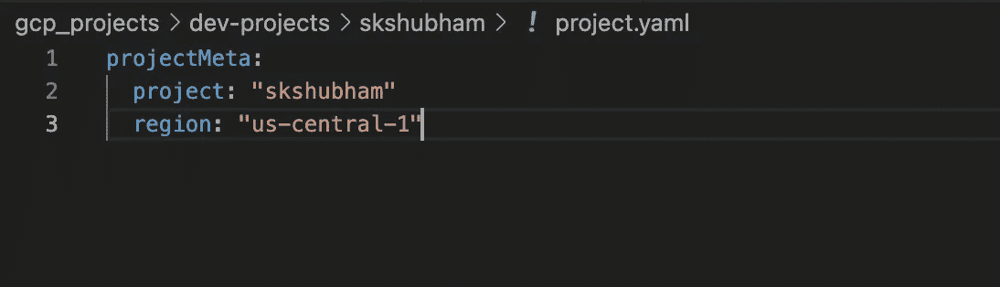
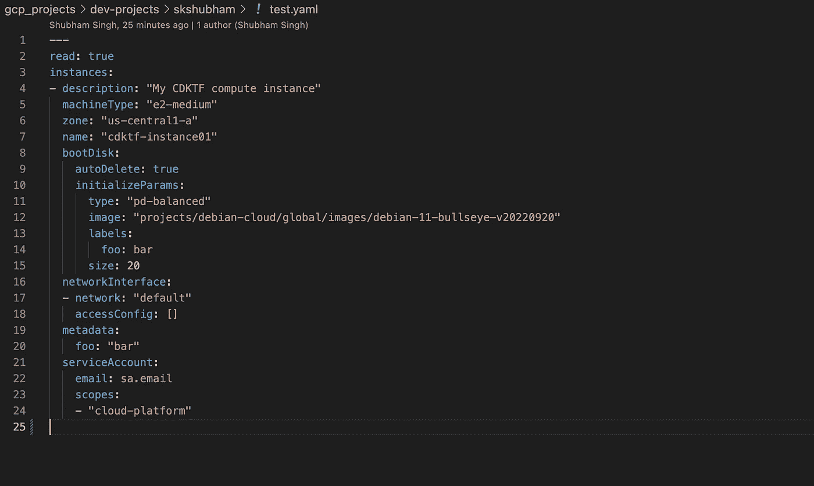
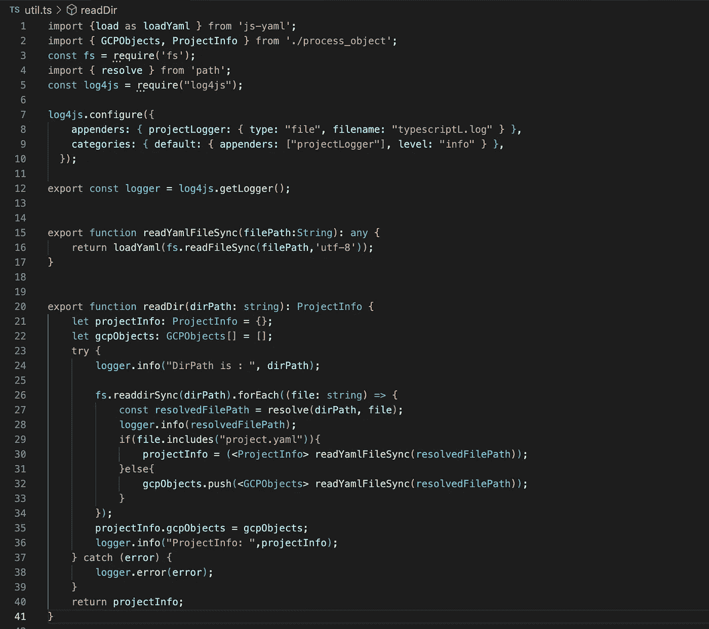
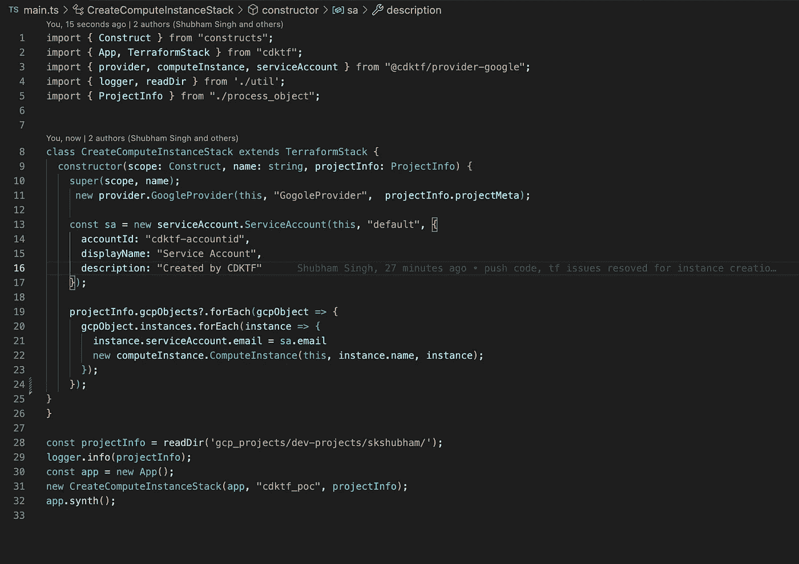
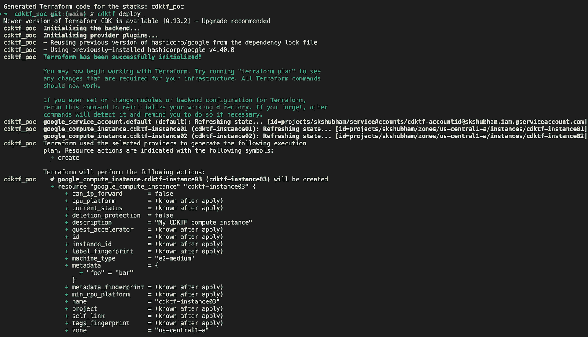

# 地形 CDK GCP

> 原文：<https://medium.com/google-cloud/terraform-cdk-gcp-5455c481f364?source=collection_archive---------1----------------------->

GCP CDK Terraform 公司入门

在过去的几个月里，我们被分配了围绕资源调配创建一些标准的任务。我们想写一些可以作为迁移一部分的机器。它们应该是从同一块布上剪下来的，同时让我们能够更快地旋转机器。我们用传统的 terraform HCL 编写代码；然而，我们尝试了另一种策略，我将在这里演示。另一个动机是为 Google-Cloud 写点东西，因为目前在 GCP 的 terraform 网站上还没有官方的入门指南。

## 目标

在这篇博客的结尾，我们将实现以下目标

1.  可以根据请求创建机器的代码库
2.  验证输入变量并将其转换为对象
3.  使用语言来自动化任务，这是 CDKs 背后的动机
4.  一个真实的机器应该被创造出来
5.  将文件作为一个对象来处理，而不是像标准地形代码中的地图一样

# 要求

使用 terraform-cdk 有一些硬性要求和语言依赖性。我把它们列在下面

1.  为了使用 CDKTF，您需要:

*   [Terraform CLI](https://developer.hashicorp.com/terraform/tutorials/aws-get-started/install-cli) (1.1+)。
*   [Node.js](https://nodejs.org/) 和 npm v16+。

2.有 Tyepscript 方面的经验者优先

3.一些处理 yaml 文件的开发库

# 方法

为了解决第一组问题，我们采用了 GitOps 工作流的方法。在这里，人们可以确定他们在 YAML 需要的资源，CDK 可以为他们提供这些资源。然而，在企业级项目中，它必须得到 are 云操作团队的批准，以确保不会引入安全漏洞。我们将采取以下步骤来实现同样的目标

1.  安装 CDK 和地形。我们已经在 terraform 的[官方](https://developer.hashicorp.com/terraform/tutorials/cdktf/cdktf-install#prerequisites)页面记录了这一点
2.  我们已经将代码保存在 [Github](https://github.com/shubhamkr619/ckdtf-gcp) 中。这个代码是开放使用的
3.  您可以在 gcp_projects 文件夹下的 yaml 文件中定义所需的资源
4.  执行代码并捕获输出

## https://www.terraform.io/cdktf CDK[安装](https://www.terraform.io/cdktf)

一旦安装了 node js，CDKTF 就是另一个必须下载的外部程序。这可以使用 NPM 来完成

```
$ npm install --global cdktf-cli@latest #installing the package$ cdktf help # Verifying the installation # Install npm package for GCP$ npm install @cdktf/provider-google
```

## 设置新项目

CDKTF 自带用于搭建新项目的命令。人们也可以从这个[链接](https://developer.hashicorp.com/terraform/tutorials/cdktf/cdktf-install#quick-start-tutorial)开始

```
$ cdktf init --template=typescript --local# This step should add google provider 
$ cdktf provider add google# Verify $ cat cdktf.json 
{
  "language": "typescript",
  "app": "npx ts-node main.ts",
  "projectId": "32bba6c6-91a9-4deb-879b-33f55335c2f7",
  "sendCrashReports": "false",
  "terraformProviders": [],
  "terraformModules": [],
  "context": {
    "excludeStackIdFromLogicalIds": "true",
    "allowSepCharsInLogicalIds": "true"
  }
}
```

## 安装 Yaml 处理库

我们正在尝试处理 yaml 文件，为此我们将使用 *js-yaml* 。我们将安装它并将其存储在 npm package.json 文件中。此外，我们希望像 java-log4j 一样保存日志。我们将安装相同的另一个包，即 *log4js*

```
# install js-yaml $ npm install --save [@types/js-yaml](http://twitter.com/types/js-yaml)# Log4js
$ npm install --save [l](http://twitter.com/types/js-yaml)og4js
```

## 设置凭据

在执行代码之前，必须设置凭证，使用 *gcloud auth login* 进行设置。

## 让我们写一些代码

我在 [Github](https://github.com/shubhamkr619/ckdtf-gcp) 中写了一些代码，并将其公开。我将在这里解释这个想法，预处理，接口映射，然后创建地形对象。

**预处理**

让我们挑选一个操作员应该提供的 yaml 文件的例子，我已经制作了一个经过处理的例子文件，



project.yaml



test.yaml 文件

这将是我们可以处理的 yaml 文件。我来举例说明一下预处理代码。



预处理. yaml

# 处理

这里，我们只需要处理对象，即 projectInfo。该对象将封装 gcpObjects。使得处理过程对开发人员非常友好。



# 输出

我们必须执行两个命令，一个确保成功编译，另一个执行与 terraform deploy 相同的代码。

```
$ cdktf synth # compile the code and create the intermidiate file in cdktf.out folder
$ cdktf deploy # executes the terraform apply 
```



## 结论

我们用这种方法取得了成功，减少了处理代码。它比 terraform HCL 的可变处理逻辑更具可读性。然而，它也不是没有缺陷，你必须了解像 typescript 和 python 这样的语言，代码质量必须像任何代码库一样保持，Git 实践必须遵循，像分支和 PR 等。