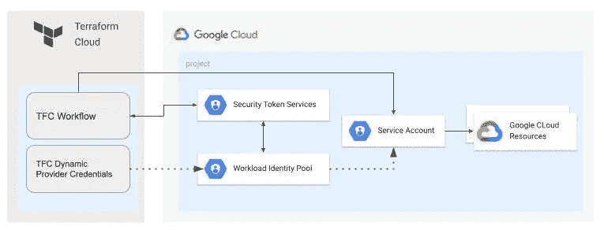
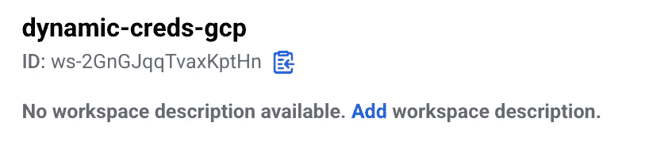
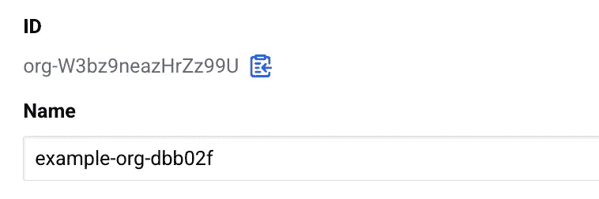
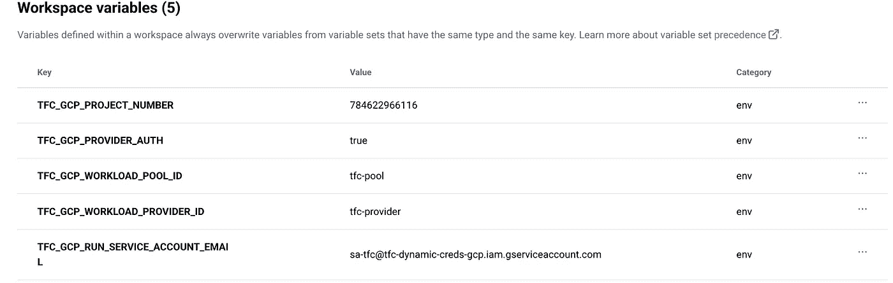

# Terraform 云/企业和 GCP 工作负载身份联盟

> 原文：<https://medium.com/google-cloud/terraform-cloud-enterprise-and-gcp-workload-identity-federation-fbb84a3dfbeb?source=collection_archive---------0----------------------->

*注意:本文已更新，最初的文章主要基于 GCP 工作负载身份的集成和*[*terra form Cloud OpenID Connect(OIDC)*](https://developer.hashicorp.com/terraform/enterprise/releases/2022/v202208-1)*集成。今天有一种更清洁的方式叫做* [*Terraform 云动态提供者凭证*](https://www.hashicorp.com/blog/terraform-cloud-adds-dynamic-provider-credentials-vault-official-cloud-providers) *，在引擎盖下是一样的，但是在 TFC runner 端更加自动化。*

如果你看到这篇文章，你可能会使用 [Terraform Cloud](https://cloud.hashicorp.com/products/terraform) 或 [Terraform Enterprise](https://developer.hashicorp.com/terraform/enterprise) 自托管实例。很长一段时间以来，利用 Terraform Cloud 进行 Google 云部署的唯一方法是[上传一个服务帐户 Json 密钥](https://support.hashicorp.com/hc/en-us/articles/4406586874387-How-to-set-up-Google-Cloud-GCP-credentials-in-Terraform-Cloud)。自托管 Terraform Enterprise 实例有更多选项，虽然它托管在 GCP 上，但它可以利用连接到托管计算引擎实例的服务帐户，并模拟特定于工作流的服务帐户。但即使这样也不理想，因为没有适当的控制来防止工作流模仿其他工作流打算使用的其他服务帐户。

那么，发生了什么变化？作为 [TFE 版本 v 202208–1(647)](https://developer.hashicorp.com/terraform/enterprise/releases/2022/v202208-1)的一部分，OpenID Connect (OIDC)被引入 Terraform Enterprise/Cloud。我想知道这是否能与 GCP 工作负载身份联盟一起工作，该联盟本身支持 OIDC 作为外部身份提供者。长话短说，确实有效！

此外，Terraform Cloud 还引入了[动态提供商证书](https://developer.hashicorp.com/terraform/cloud-docs/workspaces/dynamic-provider-credentials?product_intent=terraform)，这是一个简化层，用于设置与主要云提供商的 OIDC 集成。



# 为 Terraform 云和企业工作流配置 GCP 工作负载身份联盟

要运行这个示例，首先克隆[存储库](https://github.com/GoogleCloudPlatform/cloud-foundation-fabric)并切换到示例文件夹。

```
git clone [https://github.com/GoogleCloudPlatform/cloud-foundation-fabric.git](https://github.com/GoogleCloudPlatform/cloud-foundation-fabric.git)
cd cloud-foundation-fabric/blueprints/cloud-operations/terraform-cloud-dynamic-credentials
```

## 创建 Terraform 云工作流

如果你没有现成的 Terraform 云组织，你可以注册一个[免费试用](https://app.terraform.io/public/signup/account)账户。

为 [CLI 驱动的](https://developer.hashicorp.com/terraform/cloud-docs/run/cli)工作流创建一个新的工作区。工作负载身份联合适用于任何工作流类型，但为了简化蓝图，我们使用 CLI 驱动的工作流。请注意工作区名称和 id，我们将在后面的阶段使用它们(您的值会有所不同)。



转到组织设置并记下组织名称和 id(您的值将会不同)。



## 为 Terraform 云集成部署 GCP 工作负载身份池提供程序

*注意:* *这是准备部分，需要有足够权限的用户代表执行。*

创建新项目时所需的权限:

*   父 GCP 文件夹/组织的项目创建者

使用现有项目时所需的权限:

*   GCP 项目层的工作量身份管理
*   GCP 项目层的项目 IAM 管理

填写必需的变量，使用前面步骤中的 TFE 组织和工作区 id(id 不是 as 名称):

```
cd gcp-workload-identity-provider
mv terraform.auto.tfvars.template terraform.auto.tfvars
vi terraform.auto.tfvars
```

使用应用程序默认凭证进行身份验证，执行 terraform 代码并部署资源

```
gcloud auth application-default login
terraform init
terraform apply
```

因此，将生成一组输出(您的值会有所不同)，记下该输出，我们将在接下来的步骤中使用它。

```
project_id = "tfc-dynamic-creds-gcp"
tfc_workspace_wariables = {
  "TFC_GCP_PROJECT_NUMBER" = "200635100209"
  "TFC_GCP_PROVIDER_AUTH" = "true"
  "TFC_GCP_RUN_SERVICE_ACCOUNT_EMAIL" = "sa-tfc@tfc-dynamic-creds-gcp.iam.gserviceaccount.com"
  "TFC_GCP_WORKLOAD_POOL_ID" = "tfc-pool"
  "TFC_GCP_WORKLOAD_PROVIDER_ID" = "tfc-provider"
}
```

作为部署的一部分，我们有以下内容:

*   GCP 工作量身份池和提供者。
*   提供商有一个属性条件，以确保只有在特定的 TFC 组织生成的 OIDC 令牌可以使用。
*   用于模拟的服务帐户，其中我们仅允许基于令牌属性的特定 TFC 工作流进行模拟。
*   对于测试步骤，我们授予服务帐户存储管理权限。

## 为您的 TFC 工作流配置动态提供商凭据

要为 TFC 工作流配置 [GCP 动态提供者凭证](https://developer.hashicorp.com/terraform/cloud-docs/workspaces/dynamic-provider-credentials/gcp-configuration)，您需要设置一组环境变量:

*   `TFC_GCP_PROVIDER_AUTH`
*   `TFC_GCP_PROJECT_NUMBER`
*   `TFC_GCP_RUN_SERVICE_ACCOUNT_EMAIL`
*   `TFC_GCP_WORKLOAD_POOL_ID`
*   `TFC_GCP_WORKLOAD_PROVIDER_ID`

转到工作流->变量页面，然后单击+添加变量按钮。对于变量类型，选择 `Environment variable`。上面列出的变量名是您需要设置的变量名。上一步中 terraform 输出中提供的值是您需要为每个变量提供的值。



此时，我们设置 GCP 身份联盟来信任 TFC 生成的 OIDC 令牌，工作流应该能够使用动态提供者凭据来模拟 GCP 服务帐户。

## 测试结果

为了测试该设置，我们将从上一步中创建的 TFC 工作流中部署一个 GCS bucket。这将允许我们验证工作流是否可以使用 TFC 动态提供者凭据成功地与 GCP 服务进行交互。

让我们跳转到 *tfc-workflow-using-wif* 目录，配置 terraform backend 指向我们的工作区，使用 TFE 组织名称和工作区名称(名称与 id 不同):

```
cd ../tfc-workflow-using-wif
mv backend.tf.template backend.tf
vi backend.tf
```

根据准备步骤的结果填写变量:

```
mv terraform.auto.tfvars.template terraform.auto.tfvars
vi terraform.auto.tfvars
```

## 验证 terraform 以触发 CLI 驱动的工作流

按照此[文档](https://learn.hashicorp.com/tutorials/terraform/cloud-login)从 CLI 登录 ti terraform cloud 并触发工作流执行:

```
terraform login
terraform init
terraform apply
```

因此，我们使用工作负载身份联合成功部署了 Terraform Cloud workflow 的 GCS bucket。

一旦完成测试，您可以通过首先在 *tfc-workflow-using-wif* 中运行 *terraform destroy* ，然后运行*GCP-workload-identity-provider*文件夹来清理资源。