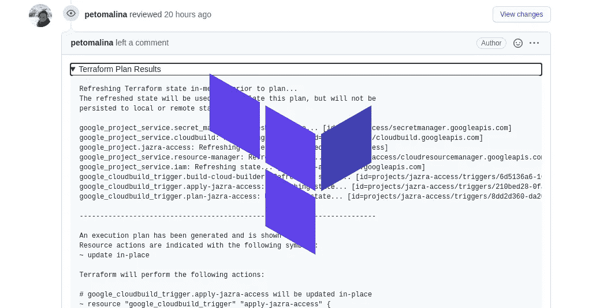
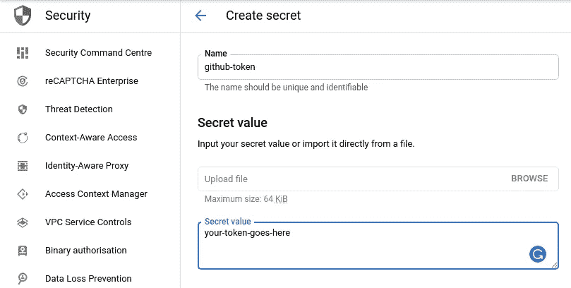
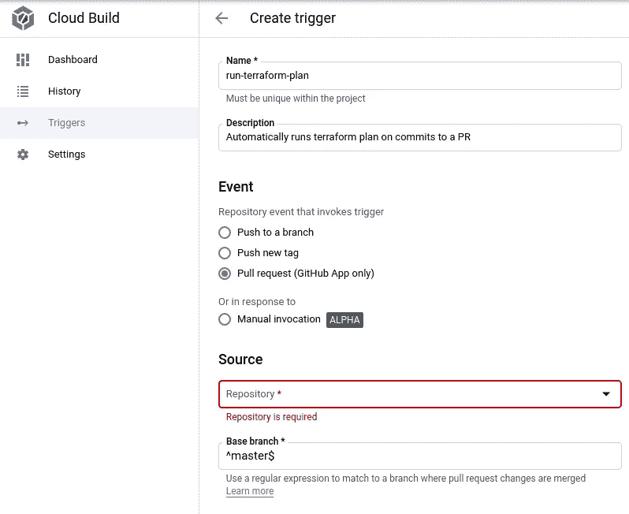
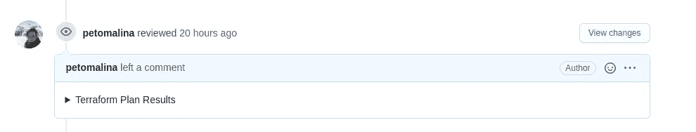

# 使用 Google Cloud Build 的拉式请求中的地形计划

> 原文：<https://medium.com/google-cloud/terraform-plan-in-pull-requests-with-gcp-cloud-build-603790a2b734?source=collection_archive---------0----------------------->

在本地运行 Terraform 只是为了审查一个拉取请求，这总是有点让人头疼。好的一面是，有一些好人在经营像[亚特兰蒂斯](https://github.com/runatlantis/atlantis)这样的项目，如果你自己主持或者使用 [Spacelift](https://spacelift.io/) ，你会做得很好。

我总是觉得管理亚特兰蒂斯只是运行计划和应用程序有点太多了。相反，我深入到[云构建](https://cloud.google.com/cloud-build)中，试图复制同样的想法，但是以一种无服务器的方式。



# 公关评论是一个问题

当我试图将所有组件缝合在一起时，有一个组件丢失了:Github CLI 的容器化云构建器。是的，Github 有一个新的 [CLI](https://github.com/cli/cli) ，可以让你在 PRs 上发表评论。多酷啊。

所以我在 [PR#469](https://github.com/GoogleCloudPlatform/cloud-builders-community/pull/469) 中把 Github CLI builder 贡献到了[cloud-builders-community](https://github.com/GoogleCloudPlatform/cloud-builders-community)(当你读到这篇文章的时候，它可能已经在 master 中了，如果没有，请随意使用分支)。

>**编辑:**贡献被合并，下面的安装步骤被更新。

```
git clone https://github.com/GoogleCloudPlatform/cloud-builders-community.git && cd cloud-builders-community/github
gcloud builds submit --config=cloudbuild.yaml .
```

该脚本将 Github builder 安装到您的 Google Cloud 项目中。如果你错过了地形，只需`cd ../terraform`并以同样的方式提交构建。

# 规划云构建中的平台

首先，我们要使用 [terraform builder](https://github.com/GoogleCloudPlatform/cloud-builders-community/tree/master/terraform) 来初始化和计划变更。确保您的云构建服务帐户有足够的权限在 terraform 中执行您需要的任何操作。

```
steps:
  - name: 'gcr.io/$PROJECT_ID/terraform'
    args: [
        'init'
    ]
  - name: 'gcr.io/$PROJECT_ID/terraform'
    entrypoint: 'bash'
    args: [
        '-c',
        'terraform plan -no-color > plan.txt'
    ]
```

第二步将其输出放入名为`plan.txt`的文件中。在`/workspace`目录中的文件在步骤之间被保留，使得它在接下来的步骤中可用。

# 提供 Github 令牌

下一步是为我们的 CLI 提供一个 Github 令牌。我们可以生成一个进入[设置/开发者设置/个人访问令牌](https://github.com/settings/tokens)的导航。该令牌需要具有以下权限:

*   `repo`这样它就可以从你的私有存储库中读取数据并写评论
*   如果你正在为一个组织使用它

一旦你的令牌被创建，复制它，并在你的项目的[秘密管理器](https://console.cloud.google.com/security/secret-manager)中创建一个新的秘密。你可以把这个秘密叫做`github-personal-token`。



在秘密管理器中创建秘密

# 将计划发布到 Github PR 中

要发布计划结果的注释，我们需要[为 Pull 请求事件创建一个触发器](https://console.cloud.google.com/cloud-build/triggers/add)，连接到您的 terraform 存储库。之后，我们将在我们的`cloudbuild.yaml`中增加两个步骤。这些步骤将获得 Github 令牌，并在 Github builder 中使用它来发布评论。

**首先，让我们创建我们的触发器。**将其放在 *Pull Request* 事件上，并连接您的存储库，如下例所示。您还可以启用*注释控制*，以防您希望仅针对协作者或所有者手动触发(以确保您不会在预批准的 PRs 上执行计划)。



创建新的地形图触发器

**其次，我们将更新我们的构建配置。**添加的步骤执行以下操作:

*   从秘密管理器获取 Github 令牌，这样我们就可以将它作为授权传递给我们的 Github 构建器
*   使用 Github builder 将计划注释为 PR 中的可折叠代码

```
- name: gcr.io/cloud-builders/gcloud
  entrypoint: 'bash'
  args: [
      '-c',
      "gcloud secrets versions access latest --secret=github-personal-token --format='get(payload.data)' | tr '_-' '/+' | base64 -d > token.txt"
  ]
- name: 'gcr.io/$PROJECT_ID/github'
  entrypoint: 'bash'
  args:
    - '-c'
    - |-
      read -r -d "" gh_comment_template << EOF
      <details>
        <summary>Terraform Plan Results</summary>

        \`\`\`
        %s
        \`\`\`
      </details>
      EOF

      gh_comment=$(printf "$$gh_comment_template" "$(cat plan.txt)")
      /usr/bin/gh.bash pr review $_PR_NUMBER -R $_GITHUB_USER/$REPO_NAME -c -b "$$gh_comment"
```

第二步可能看起来有点多，但是，它使评论折叠。多次运行触发器不会创建带有地形图的无限滚动 PRs。



折叠地形图导致拉式请求

设置完成后，您将在 PR 注释中看到完整的`terraform plan`输出。

如果你有任何问题，请打我的 [Twitter](https://twitter.com/petomalina)

尽情享受吧！