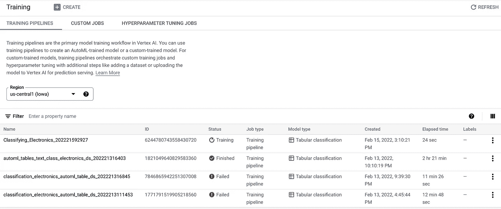

# 使用 AutoML 表格的文本分类|Google 云平台

> 原文：<https://medium.com/google-cloud/text-classification-using-automl-tables-google-cloud-platform-43816c4afb93?source=collection_archive---------2----------------------->

# 什么是 AutoML 表格？

AutoML Tables 是一种受监督的机器学习服务，它使用表格数据以大幅提高的速度和规模在结构化数据上构建和部署最先进的机器学习模型。

它是 GCP 核心 AutoML 平台的扩展，抽象出定制模型构建任务，如特征工程、超参数调整、ML 模型选择，并通过提供相关数据来提供构建正确模型的自动化方法。

首先，让我们看一个如何使用 AutoML 表的简单例子。

下图显示了有助于确定房屋价格的所需功能列表(显示在第 1 至第 6 列)，显示在右侧的 final_price 列中。

该房屋销售数据集可配置为 AutoML tables 服务的源，以便**自动构建和提供分类模型**，该模型可根据输入要素列值预测房屋价格。

在引擎盖下，输入数据分析、特征工程、模型选择、超参数调整和评估的整个繁重工作完全由 AutoML 平台管理，无需任何人工干预。模型的部署也是一种 UI 驱动的无代码方法，用于创建基于 REST 的可扩展微服务端点。

汽车——引擎盖下。

**对 AutoML 表格的一个常见误解**是表格的单元格中只能有数字。但实际上，AutoML 表也可以处理各种其他数据类型，如**时间戳、长文本描述、数组**以及数字。在我们的例子中，我们将使用**长文本描述**属性来构建 AutoML 分类模型。

# **为什么使用 AutoML，我们要解决什么问题？**

**问题陈述:**客户收到来自不同供应商的电子产品库存数据。这些数据包括手机、笔记本电脑、耳机、扫描仪等电子产品的结构化表格数据，每种产品都有其**复杂的长文本产品描述**、型号、版本、尺寸 SKU 等。这些行项目中的每一个都需要分类到正确的类别代码中。该代码用于关键的下游流程，如计划、库存和存货预测、计费和支付等，因此需要非常准确。

**当前解决方案:**内部数据科学家团队从一个供应商数据开始构建了一个定制的 ML 分类模型，但随着他们开始向其中添加更多的供应商数据，准确性水平开始下降**到 80%以下**，这是由于各供应商产品描述的复杂和**重叠**性质。

总结一下主要挑战:

1.  **成本和规模:**每个供应商定制模型构建的数据科学资源有限。将需要额外的**投资**来扩大规模，以及**扩大规模**来增加新的供应商。
2.  **速度:**3 到 6 个月的漫长定制构建周期影响了**选择和推出新供应商的速度**。
3.  **准确性**:使用所有供应商的数据构建的模型准确性低。

# **GCP 的 AutoML 表来救场了！**

在充分理解了关键挑战并将其定性为对格式良好的表格结构数据的机器学习分类问题后，我们提出了**Google Cloud AutoML Tables**来解决上面强调的挑战:

1.  **成本:**这是一个无代码的 ML 平台，不需要数据科学技能。
2.  **速度:** AutoML 表格可以在几小时到几天内创建模型，而不是几个月或几年。
3.  **扩展:**通过建立模型再培训 MLOps 管道，该平台可以配置为自动扩展新供应商注册。

# 那么，我们是如何着手的呢！

**第一步。正在创建自动表数据集:**

该过程的第一步是创建将用作输入的数据集。这一步需要数据探索、清理、格式化并将其转换为结构化表格格式。

以下是电子产品及其特性的样本数据集(**全部文本！**)，它唯一定义了特征列中的每个项目，并将其映射到相应的类别代码:

资料组

导航到 GCP 控制台→顶点人工智能→数据集→创建数据集

1.  提供数据集的名称-该数据集将在整个过程中被该名称引用。
2.  选择**表格**作为数据类型，选择**分类**作为目标。
3.  选择区域。
4.  单击创建。

**3。设置数据源:**

AutoML Tables platform 提供了多个选项来配置数据源，例如，上传数据文件、从 GCP 存储中选择数据或指定已经存储为 Bigquery 表的数据。

**数据分析:**一旦数据源被映射，AutoML 表格将显示数据集的摘要，即表格列、行数、位置等。您也可以选择单击 Generate statistics 链接，它将显示列级别的统计信息，如缺失值和非重复值。

**4。训练:**

单击上面屏幕中的“训练新模型”按钮开始训练。

数据集将已被选中。选择**分类**作为目标，选择 **AutoML** 作为训练选项，点击继续。

指定一个模型名，并选择**目标列**，这将是模型预测的结果——在我们的例子中是**类别 _ 代码**。您还可以探索“高级选项”,它提供了拆分训练和测试数据的方法。

接下来，AutoML tables 提供了选择优化目标和权重列的选项。您可以将其保留为默认值，平台将自行决定权重。

点击“继续”。

下一页将允许您输入平台用于训练模型的节点小时数。从成本角度来看，这一点至关重要，因为节点小时数越高，训练模型的成本就越高。作为最佳实践，还提供了基于行数的建议。

输入培训小时数，然后点击“开始培训”。

这将启动培训工作，平台将开始执行底层的机器学习生命周期开发流程。

要了解培训作业的状态，请单击 Vertex AI →培训。

每个状态更改都会发送一封通知电子邮件，让用户知道培训是成功还是失败。成功完成培训后，状态将变为“已完成”，如上所示。

**5。模型评估和测试:**

在这个阶段，模型创建完成。单击模型，它会将您带到模型详细信息页面。

第一个选项卡' **Evaluate** '提供各种模型性能评估统计数据、混淆矩阵和特征属性详情。

模型度量

混淆矩阵

特征属性图表提供了**对每个给定实例**的预测有贡献的特征的视图。

特征归属

**6。模型部署和测试—在线预测**

点击**部署&测试选项卡**。

deploy and test 页面提供了一个“**Deploy to endpoint”**来自动创建和部署一个模型作为一个在线 REST 微服务端点。

它提供了有关流量分割、节点数量、自动扩展、节点规格、监控等的附加配置。

配置完成后，单击“部署”创建一个端点。

单击 Vertex AI → Endpoints，您将看到已部署的模型端点，该端点已准备好供使用。

**样本剩余请求/响应:**

**7。批量预测:**

AutoML 表还支持批量预测，可对批量预测进行配置以对输入数据集运行模型预测。

# 结果如何？

通过 GCP AutoML 表格，我们能够在几天内快速构建并交付涵盖所有供应商的分类模型，无需额外成本，准确率高达 98%以上。

# **总结与结论:**

Google Cloud AutoML Tables 是一个最先进的机器学习平台，用于在结构化数据上构建和部署模型，其速度、规模和准确性大幅提高。

**然而，它不是满足所有需求的一站式机器学习解决方案**，因此需要进行资格认证，以便为您的客户获得最佳结果。

如欲了解谷歌云人工智能平台的完整视图，请访问 https://cloud.google.com/vertex-ai[T5](https://cloud.google.com/vertex-ai)

希望这对您有所帮助，并祝您的 AutoML table 工作负载一切顺利！