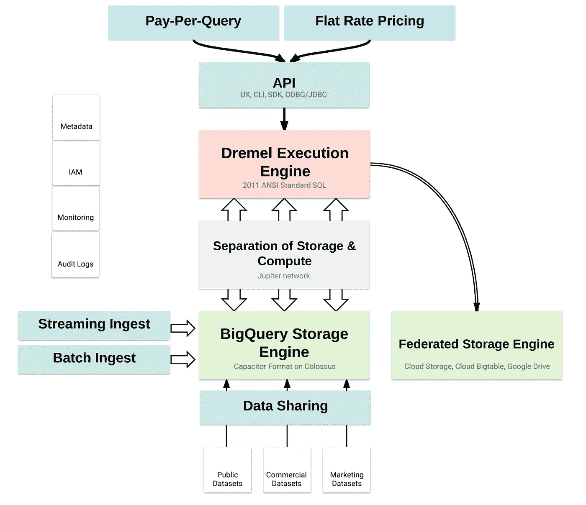
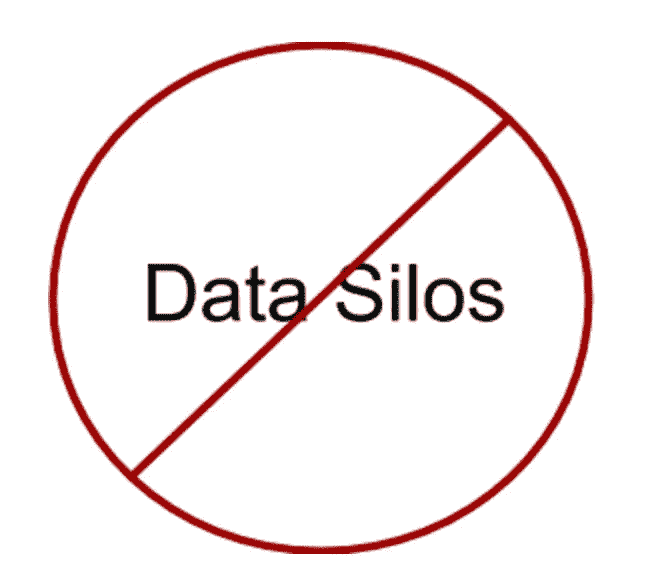
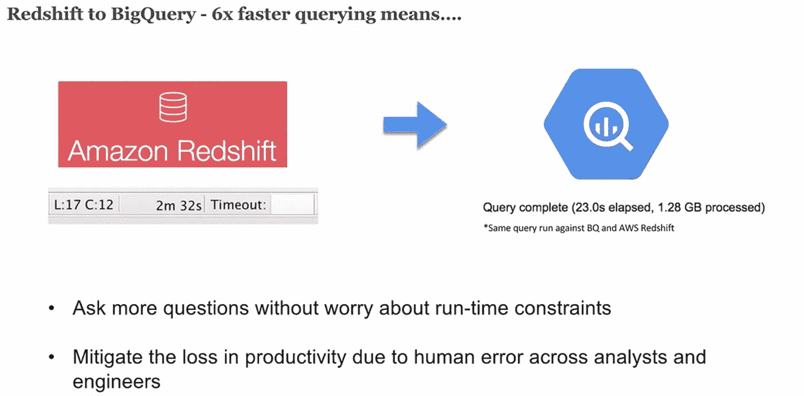
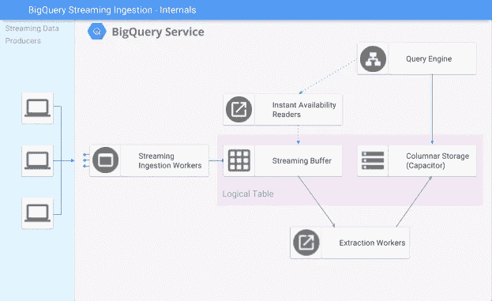

# 谷歌大查询的 12 个组成部分

> 原文：<https://medium.com/google-cloud/the-12-components-of-google-bigquery-c2b49829a7c7?source=collection_archive---------0----------------------->

人们这些天一直在讨论 BigQuery，这太棒了。但是 BigQuery 有很多东西——它是一个复杂、成熟的服务，有许多移动的部分，很容易迷失！

为了帮助理解什么是 BigQuery 服务，下面是我认为面向用户的主要组件的简要介绍:

*   无服务器服务模型
*   固执己见的存储引擎
*   Dremel 执行引擎和标准 SQL
*   通过 Jupiter 网络实现存储和计算的分离
*   企业级数据共享
*   公共数据集、商业数据集、营销数据集和免费定价层
*   流式摄取
*   批量摄取
*   联邦查询引擎
*   UX，CLI，SDK，ODBC/JDBC，API
*   按查询付费和统一费率定价
*   IAM、认证和审计日志

从业者视角下的 BigQuery

当然，BigQuery 远不止于此，我们在这里采用了以客户为中心的观点。我忽略了一些更平凡的部分。也就是说，我们之前写过[big query 在幕后的样子](https://cloud.google.com/blog/big-data/2016/01/bigquery-under-the-hood)，以及[关于 BigQuery](/google-cloud/15-awesome-things-you-probably-didnt-know-about-google-bigquery-6654841fa2dc) 你可能不知道的 15 件事。

# **无服务器服务模式**

BigQuery 最重要的方面可能是它的无服务器模型(请原谅这个时髦词)。我可以直截了当地说——big query 拥有业内最高级别的抽象、[可管理性](https://cloud.google.com/blog/big-data/2016/08/google-bigquery-continues-to-define-what-it-means-to-be-fully-managed)和自动化，将您从虚拟机和 CPU/RAM 规模的束缚中解放出来。BigQuery 的计算具有令人难以置信的弹性，[能够在几秒钟内将](https://cloud.google.com/blog/big-data/2016/01/anatomy-of-a-bigquery-query)扩展到数万个内核，同时让您只为自己消耗的资源付费；BigQuery 是一个高度可用、持久且安全的开箱即用的工具。在那里，选中“无服务器”的所有复选框，您会看到…

# 固执己见的托管存储引擎

BigQuery 拥有一个令人惊叹的存储引擎，可以代表您不断发展和优化您的存储——免费且无中断。

巨像是谷歌对 GFS 的继承。Colossus 非常棒——它经久耐用，性能卓越，可扩展性超强。BigQuery 将其数据以固执己见的[电容器](https://cloud.google.com/blog/big-data/2016/04/inside-capacitor-bigquerys-next-generation-columnar-storage-format)格式存储在 Colossus 中。BigQuery 的电容器在幕后做了大量的优化，在这个过程中消耗了大量的 CPU/RAM(不影响查询性能..或者你的账单！).

BigQuery 使用存储的一个很好的例子是，当您的表由太多小文件驱动时，会自动重新物化您的数据。“许多小文件”的问题是整整一代 DBA 生存的祸根。

# Dremel 执行引擎和标准 SQL

每个人都知道 BigQuery 运行在 [Dremel](https://research.google.com/pubs/pub36632.html) 之上。也就是说，Dremel 本身已经进化了，现在它与论文中描述的有点不同:

*   截至 2015 年夏天，100%的 BigQuery 用户运行在 Dremel 的新版本上。
*   BigQuery [在一个单独的子服务中执行](https://cloud.google.com/blog/big-data/2016/08/in-memory-query-execution-in-google-bigquery)它的内存洗牌
*   Dremel 做类似流水线执行和智能调度的事情

Dremel 本身就是一个庞大的多租户计算集群。您的查询只是 Dremel 中的短期租户，Dremel 调度程序执行类似太阳马戏团的体操来保持所有查询以最佳状态运行。Dremel 的性质也使你对任何单个节点的故障免疫——耶！

Dremel 目前支持其遗留的 SQL-ish 方言，以及 2011 ANSI 标准 SQL 方言。

# Jupiter 网络与存储和计算的分离

我们已经[骑着](https://cloud.google.com/blog/big-data/2016/01/bigquery-under-the-hood)这匹业余小马走到了它的最后一程。 [Jupiter](https://cloudplatform.googleblog.com/2015/06/A-Look-Inside-Googles-Data-Center-Networks.html) 是谷歌的内部数据中心网络，能够处理数 Pb 的二分流量，并允许 BigQuery 将数据从存储设备传输到计算设备，不会出现任何问题。是胶水。

# 企业级数据共享

BigQuery 将存储和计算完全分离，再加上 Colossus 的强大功能，使得人们可以相互共享 EB 级数据集，就像今天共享 Google 文档和工作表一样。

在某些体系结构中，将数据复制到不同的集群中以共享数据，从而创建数据孤岛，这并不是一种反模式。我认为数据孤岛是最糟糕的—你在用数据玩电话游戏，你在增加操作的复杂性，你的基础设施非常低效，最终你的账单会高得离谱！

对数据孤岛说不

BigQuery 不利用虚拟机作为其存储层(甚至不作为加速器)，因此您将不会受到任何与数据存储相关的欺骗，如竞争条件、锁定、热点，并且您可以抛弃您对 CLONE 和 SWAP 命令的了解。我说过巨像很棒吗？

最后，BigQuery 的无服务器特性允许您与其他组织共享数据，而不必强迫他们创建自己的集群。您为存储付费，他们为每次查询付费，这一切都是完全透明的。谁喜欢为闲置的集群付费？没错，谁都不是！

# 公共数据集、商业数据集、营销数据集和免费层！！

一些好人正在利用 BigQuery 强大的数据共享特性来做一些非常酷的事情。

[公共数据集项目](https://cloud.google.com/bigquery/public-data/)有下坡失控货运列车的势头。数据集几乎每周都在增加，NOAA 数据是最新加入的。

你可以通过 BigQuery 的[商业数据集](https://cloud.google.com/commercial-datasets/)货币化或获得商业级数据集。同样，如果你使用 Google Analytics、AdWords、Doubleclick 或 Youtube，你的数据可以通过[营销数据集](https://cloud.google.com/blog/big-data/2017/05/introducing-ads-data-hub-next-generation-insights-and-reporting)(正如 Mercedez-Benz、Hearst 和《纽约时报》的人发现的)一键进入 BigQuery。

最后，BigQuery 有一个永久的[空闲层](https://cloud.google.com/free/)，允许您每月存储 10GB 和查询 1TB。

智齿鱼的故事

# 流式传输和批量摄取

BigQuery 的[流 API](https://cloud.google.com/bigquery/streaming-data-into-bigquery) 是一个相当独特的特性。您可以将数据以每秒数百万行的速度流入 BigQuery，并且数据几乎可以立即用于分析。对于分析数据库来说，这实际上是一个很难解决的技术问题，所以这里的团队值得称赞。

流式摄取—不仅仅是看上去那样简单

BigQuery 的批量接收并不轻松，它上面有一个完整的独立的[博客](/google-cloud/paying-it-forward-how-bigquerys-data-ingest-breaks-tech-norms-8bfe2341f5eb)(TL；dr:它不会消耗您的查询能力，也不会花费任何东西！)

# 联邦查询引擎

如果您的数据驻留在 Bigtable、GCS 或 Google Drive 中，您可以直接从 BigQuery 查询这些数据，而无需移动任何数据。这就是我们所说的“[联邦查询](https://cloud.google.com/bigquery/external-data-sources)”。

# UX，CLI，SDK，ODBC/JDBC，API

典型的访问模式，都包装在 REST API 中。值得一提的一点是，它与 BQ 的语义配合得非常好:

*   提交存储(查询、加载、复制)的作业要么全部提交，要么全部不提交。不需要清理失败或未完成一半的作业。
*   查询会及时查看快照中的存储。因此，它们不受竞争条件、表/行/单元锁、中途状态等的影响。

# 按查询付费和统一费率定价

BigQuery 有两种定价模式——超高效的云原生按查询付费模式，以及可预测的企业级统一费率模式。

人们谴责按查询付费的模式过于昂贵。我很同情那些很难找到这个模型并预测它的人，但它并不昂贵。您只需为您消费的东西付费，不会多花一分钱，而且在分析工作负载(往往不稳定)中，[要花很多钱](https://cloud.google.com/blog/big-data/2016/02/visualizing-the-mechanics-of-on-demand-pricing-in-big-data-technologies)。

如果您有一个相当大的用例，并且珍惜价格的可预测性而不是效率，BigQuery 确实提供了统一费率定价模型。你只需支付一笔固定费用，所有的查询都是免费的！

最重要的是，你可以清楚地看到任何一种型号。您可以选择从一个型号跳到下一个型号，因为它符合您的预算需求。

# IAM、认证和审计日志

BigQuery 符合 Google Cloud 的 [IAM](https://cloud.google.com/iam/) 策略，允许组织为其用户划分高粒度的角色和控制。

BigQuery 支持两种通用的身份验证模式:

*   OAuth(三脚用户参与的认证方法)
*   服务帐户(通过机密文件无头)

两者都有有效的用例。如果你已经集成了谷歌的认证，OAuth 是很棒的，如果你在你这边联合访问控制，服务账户也可以工作。

最后，BigQuery 的审计日志是 BigQuery 中发生的所有事情的书面记录。大量用户将审计日志导出回 BigQuery，[在 Data Studio](/google-cloud/visualize-gcp-billing-using-bigquery-and-data-studio-d3e695f90c08) 中实时可视化 BigQuery 使用情况！

所以你有它。你已经成为我长篇大论的结尾了。希望我已经很好地详细描述了自 2012 年以来谷歌的分析主力 BigQuery 背后的广度和力量。请留下评论或问题！

# 更多资源

 [## r/bigquery

### r/bigquery:关于 Google BigQuery 的一切

www.reddit.com](https://www.reddit.com/r/bigquery/) 

*   【https://www.reddit.com/r/bigquery/ 号