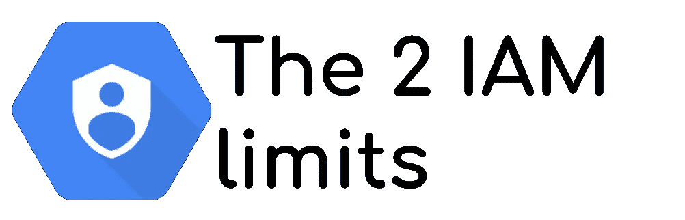

# 谷歌云 IAM 服务的两大局限

> 原文：<https://medium.com/google-cloud/the-2-limits-of-iam-service-on-google-cloud-7db213277d9c?source=collection_archive---------0----------------------->



安全性在云环境中至关重要， **IAM(身份和访问管理)服务有助于任何云提供商** *(例如，你可以在 Azure、AWS 和 GCP 上找到 IAM 服务)。*

在 Google Cloud 上，这个 IAM 服务使用 OAuth 和 OpenID 协议。它允许**认证和授权账户**(用户账户或服务账户)。
*仅针对 Google Cloud 组件进行授权；您不能在 IAM 服务中为自己的应用程序添加自定义授权/权限。*

身份验证部分使用 OAuth 协议来生成凭证。您可以使用**您自己的凭证(用户帐户**，在浏览器中进行交互式认证)或**技术凭证(服务帐户)**。

服务帐户凭证被自动加载到 Google Cloud 环境中*(稍后我会解释如何加载)*。然而，您也可以**生成一个服务帐户密钥文件**来在任何地方使用这个凭证。这是一种丑陋的做法，尤其是为了保守秘密……秘密！

# 难看的服务帐户密钥文件

服务帐户密钥文件在某些情况下是有用的，但如果使用不当，它们也是丑陋的(T21)。
首先想想**是什么:一个文件**。一个简单的文件。

文件是计算中最常见的对象。您可以复制它，通过电子邮件发送它，提交到 Git 存储库中。有时这个库是公开的，你会收到一封来自谷歌云的邮件，通知你你的秘密文件泄露了。

*在我的公司里，我们遇到过两次这种问题，都是那些用比特币矿工* *默默创造虚拟机的* ***坏演员。希望我们能尽快解决这个问题，并限制成本。此外，这是没有更大问题(例如机密数据泄露)的开发项目。我将发布另一篇文章，介绍我们如何解决这个问题并提高安全性。***

此外，**这个文件可以在开发者**之间共享，比起**保持这个秘密文件的安全**，更专注于特性的开发。你也可以让外部开发人员在你的公司工作一段时间，然后**带着仍然在他们电脑**中的密钥文件去其他地方。

所以，如果用户没有意识到这个关键文件的保密性，**你很快就失去了对它的控制**。这导致了第二个问题:Google 建议**定期轮换服务帐户密钥文件**，至少每 90 天一次。

> 如果不控制密钥文件，如何执行密钥轮换？

所以，总的来说，**服务账户密钥文件是管理**的噩梦。当应用程序默认凭证不足以解决您的身份验证时，它们在特定情况下非常有用。在所有其他情况下…

> 为了避免任何秘密的泄露，千万不要储存秘密

# 从未储存的秘密

基于此， **IAM 服务允许永远不必存储机密**，如服务帐户密钥文件，并在您的本地环境和 Google Cloud 上无缝工作。

所以，**原理是使用环境上下文被 IAM 服务认证**。这种策略被称为 [**ADC(应用默认凭证)**](https://cloud.google.com/docs/authentication/production#automatically) ，Google Cloud 客户端库支持多种语言的这种认证模式。该库根据环境检索凭证，并且**在应用程序**中使用它作为默认凭证。

例如，在 Python 中，`google-auth`库允许你这样做

```
import google.auth
credentials, project_id = google.auth.default()
```

你从不提及你的环境或账户，你让图书馆做它的工作。 ***同样适用于组件库(像 Google Storage)*** *:在那种情况下使用默认构造函数()或者关键字* `*defaultCredential*` *。*

## **本地环境上的 ADC**

您可以使用您的用户凭证，与您在 Google Cloud 控制台中使用的凭证相同。

*   要在`gcloud`命令行中使用您的用户帐户凭证，请像这样获取您的凭证

```
gcloud auth login
```

*   要在代码中使用您的用户凭据并使用 ADC，请使用以下命令配置您的本地环境

```
gcloud auth application-default login
```

在这两种情况下，你都必须进入你的浏览器，选择你的谷歌账户，如果有很多的话。你可能需要重新认证你自己，也许有两个因素的机制。**最后通过 gcloud SDK 授权使用您的账户。**

*本地仅存储刷新令牌，从不存储您的认证凭证登录/密码或机密。*

## **谷歌云环境下的 ADC**

**所有谷歌云服务都接入** [**元数据服务器**](https://cloud.google.com/compute/docs/storing-retrieving-metadata) 。该内部服务器提供关于环境的信息，**包括用于服务**的服务账户。因此，Google Cloud 客户端库可以检测到这个服务器，并且**通过这个元数据服务器**获得凭证。

有些产品允许你**自定义你想在服务中使用的服务账号**，比如[云功能](https://cloud.google.com/functions/docs/securing/function-identity)和[云运行](https://cloud.google.com/run/docs/securing/service-identity)。其他不是，**是默认使用的服务账号**。但是，**在任何情况下，服务帐户都是加载的并且是可用的。**

# ADC 的极限

当您使用您的用户凭证或在 Google Cloud 产品上运行您的代码时，ADC 工作得很好。

> 当您必须将内部环境连接到 Google Cloud 时会发生什么？
> 
> 您的 CI/CD(例如 gitlab CI 或 Github Action)？
> 
> 还是托管在其他云提供商上的其他应用？

没有神奇的解决方案，**你需要一个凭证文件进行认证**，其中存储了一个秘密(一个私钥):服务帐户密钥文件。服务帐户密钥文件主要是在这种情况下设计和使用的。

## 其他 ADC 限制

然而，即使使用 Google Cloud 环境上的本地用户帐户凭证或服务帐户凭证，仍然存在 2 个主要限制；

1.  无法**将范围**添加到应用引擎上的应用引擎默认服务帐户
2.  **无法**生成签名身份令牌**以使用**本地用户凭证**访问私有云运行和云功能。**

***对于这两种情况，最好使用服务帐户模拟(以避免生成密钥文件)，但这并不总是最安全的解决方案。***

# **1.应用引擎限制**

****App Engine 已经是 Google Cloud 的第一款产品**和**已经超过 12 岁了**！它允许您部署一组(微)服务来服务 web 应用程序。但是，**作为老的第一个产品，有一些遗留问题限制了你以后的发展。****

**App Engine 有 2 个限制:**

1.  ****App Engine 上的所有服务都有相同的默认服务账号**，并且**你不能自定义**(在 App Engine 上或每个服务)。这是一个问题，因为你在 App Engine 上的所有服务都将拥有相同级别的权限，而且它**违反了最小特权原则**。**
2.  ****App Engine 默认服务账号无法作用域**。更确切地说，凭证的范围允许你访问所有的谷歌云服务，而不是更多。*在我的公司用例中，我们正在将 App Maker 应用程序(该服务将于 2021 年 1 月停止)迁移到 App Engine。现有的 App Maker 应用程序使用了大量 GSuite 文档(尤其是 Sheet)*。**要访问工作表 API，您需要用`https://www.googleapis.com/auth/spreadsheets`范围来限定您的凭证**的范围。**而你不能****

****最好的方法是使用服务帐户模拟**(从而避免服务帐户密钥文件)。换句话说，您**不会直接使用 ADC** 来访问服务，但是您将**使用它们来代表另一个服务帐户**生成凭证。使用 IAM 服务，您可以管理哪些服务帐户可以被模拟或不可以被模拟。**

## ****权衡取舍****

1.  ****您使用同一个 ADC(App Engine 默认服务帐户)来模拟您想要的所有服务帐户**。*这意味着，如果应用引擎中的“服务 1”由于应用引擎默认凭证而能够模拟“服务帐户 1”，则“服务 1”也能够模拟“服务帐户 2”(最初为“服务 2”创建的)T26。最后，**就好像所有服务都可以访问所有“可模拟”的服务帐户**。而那个**打破了最小特权原则。*****
2.  ****云功能默认服务账号也是 App Engine 默认服务账号**。如果您在部署期间没有自定义您的云函数身份，**您的函数** **将自动拥有与 App Engine 服务**相同的权限。**

***附加问题:Python 和 Java Google Auth 库本身包含模拟方法。* ***其他语言就不是这样了。*****

## ****好处****

**当您在 App Engine 上使用模拟时，您也可以在本地环境中使用您的用户凭据。因此，y **我们在 App Engine 和您本地的代码是相同的**，您本地测试的代码与将在 App Engine 上运行的代码完全相同。**

## ****备选方案****

****您还可以为每个服务**生成服务帐户密钥文件，并用您的代码加载它们。
*它的* ***没用把密钥文件存储在*** [***秘密管理器***](https://cloud.google.com/secret-manager) *里面并检索它们，在运行时，用 App Engine 默认的服务账户凭证，因为我们回到了#1 权衡。而在这种情况下，* ***冒名顶替是一个好得多的解决方案。*****

**在我的公司，我们*很遗憾* **仅将服务帐户密钥文件用于 App Engine 关键服务，而非所有**。**

## ****提示****

**如果您部署在 App Engine 之外的另一个组件上，如云函数和云运行，您可以使用 ADC。然而，**在您的本地环境中，您的个人用户帐户会有范围问题**。**

**要解决这个问题，**在创建凭证时对其进行范围限定**，如下定义范围**

```
gcloud auth application-default login \
  --scopes='[https://www.googleapis.com/auth/spreadsheets](https://www.googleapis.com/auth/spreadsheets)',\
'[https://www.googleapis.com/auth/cloud-platform](https://www.googleapis.com/auth/cloud-platform)'
```

# **2.私有云功能和云运行限制**

**第二个问题是当**您的本地代码试图调用部署在私有模式**下的云功能或云运行上的服务时。*该模式暗示呼叫者出示签名的身份令牌。***

**要用简单的 curl 调用私有部署的服务，您可以这样做**

```
curl -H "Authorization: Bearer \
  $(gcloud auth print-identity-token)" https://service.url.run.app
```

**Gcloud SDK 能够使用您的用户凭据生成签名身份令牌。然而，**Google Auth 客户端库并没有为用户帐户凭证**实现这一功能，以直接从您的应用代码*访问部署的服务(例如，一个正在本地开发的服务调用另一个在 Google Cloud 上私有部署的服务)。***

**模拟可以像前面一样工作。**但是，我不喜欢这个解决方案，因为你必须在你的代码中执行一个钩子****

```
If "I'm using user account credential"
  then "impersonate a service account"
  else "use ADC"
```

**因此，你的代码**在本地和云中的运行方式**并不完全相同。因此，您可能在 Google Cloud 上遇到了本地没有检测到的问题。**它并不真正安全**(一个 bug 的观点，而不是安全的观点)**

**当然，您可以**在任何情况下模拟服务帐户，但是这增加了您的应用程序的复杂性**(因此降低了可维护性)。**

**最新的选择是**使用服务账户密钥文件，仅用于本地开发，并且仅具有** `**run.invoker**` **的作用，以限制泄露**时的影响。**

***我创建了一个* [*开源项目*](https://github.com/guillaumeblaquiere/token-generator) *，和* [*一篇文章*](/google-cloud/easily-generate-google-signed-id-token-with-token-generator-d25b7e235f2e) *，关于这个主题帮助本地测试，附带一个服务账号密钥文件。***

# **怎么办？**

**IAM 服务提供了很多可能性，也提供了很多在安全方面做错事的案例。**

****一个解决方案可以适用于任何用例**:每次生成一个服务帐户密钥文件。**这也是最糟糕、最危险的解决方案。****

****安全性意味着权衡和理解我们想要达到的目标**。这并不总是容易和自动的。没有唯一的解决方案。**

**最好的起点是**考虑 ADC 的所有用例，除了 3 种情况:****

*   **您的工作负载/应用运行在 Google Cloud 之外(API、网站后端、CI/CD 等)**
*   **您想要在 App Engine 上自定义每个服务的服务帐户**
*   **您希望使用您的用户帐户从代码(而不是从 gcloud CLI)本地调用私有云运行或云功能**

> ****这是真的**即使一些例子、教程，甚至 Google Cloud 文档上的**代码样本带有服务帐户密钥文件！****