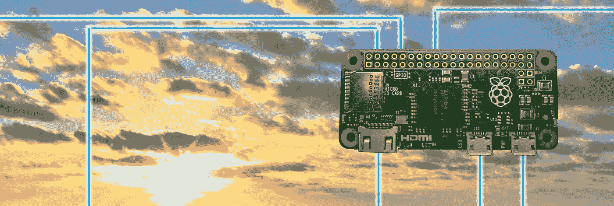

# 智能事物云

> 原文：<https://medium.com/google-cloud/the-cloud-of-smart-things-dc6e04491fb3?source=collection_archive---------0----------------------->

## 技术的未来是智能的、无形的和互联的

随着 2017 年的到来，我反思了过去 10 年的技术进步，展望了未来 10 年，并想象了未来可能会是什么样子。

# 五年内从几十万到几十亿

今天，智能手机应用为开发者和企业家带来的机会显而易见，但在 2009 年，当我的演讲向潜在的 Android 开发者吹嘘 Android 市场上有 12，000 个应用时，这种机会就不那么明显了。

首款安卓手机:T-Mobile G1

10 年前，还没有真正的智能手机。第一款[安卓手机](http://en.wikipedia.org/wiki/HTC_Dream)于 2008 年发布；2007 年第一款 [iPhone](http://www.macworld.com/article/54769/2007/01/iphone.html) 。我于 2009 年 3 月加入谷歌，正好赶上帮助推出 [Android 1.5 Cupcake](https://developer.android.com/about/versions/android-1.5-highlights.html) (API 等级 3——Widgets！实时文件夹！第三方键盘！)

[根据维基百科](https://en.wikipedia.org/wiki/Android_%28operating_system%29#Market_share)的数据，2009 年，Android 占新智能手机的 2.8%，智能手机占新手机销量的不到 14%。维基百科现在显示，如今 85%的新智能手机运行安卓系统——这也代表了 74%的新手机。

那么接下来会发生什么呢？

> 正如我在 Medium 上发布的所有内容一样，以下是我自己的个人观点。它不一定代表谷歌、Alphabet 或任何在那里工作的人的观点。我选择了 10 年的时间框架，以避免任何人认为这些猜测是基于我可能拥有的任何知识，因为我是谷歌的员工；他们不是。此外，它们不应被视为谷歌现在或未来正在、已经或将要做的任何事情的指示。我只是在瞎编，请大家照着读。

# 后智能手机世界

智能手机和笔记本电脑不会很快消失，但这并不意味着事情不会改变。

> 我相信一场新的工业革命正在进行；在机器智能的推动下，越来越多的自主云连接设备能够以自然的方式与我们互动。

Raspberry Pi Zero(显示了两个机器人小雕像的比例)

2010 年，我买了一部 Nexus One，售价 600 美元，配有 1GHz CPU 和 512MB 内存。今天，我可以花 5 美元买一台[树莓派 Zero](https://www.raspberrypi.org/products/pi-zero/)——同样的 CPU 速度和内存。

像[谷歌](http://cloud.google.com)、[亚马逊](https://aws.amazon.com/)和[微软](https://azure.microsoft.com)这样的科技巨头正在逐步将他们的基础设施外部化——包括硬件和软件。这使得我们作为开发人员有可能利用几十年的进步和在机器智能、数据中心设计、大数据处理和站点可靠性方面的数百亿美元投资来构建产品和服务。

## **隐形硬件**

智能手机代表了通用电脑的终极进化。从房间大小，到迷你电脑，台式电脑，笔记本电脑，最后是手持设备，我们终于把它缩小到可以随身携带。

下一步是让它完全消失。技术进步使得 5 美元的树莓派成为可能，它允许集成计算机控制从我们的[恒温器](https://nest.com/thermostat/meet-nest-thermostat/)到[我们的灯](http://www2.meethue.com/)、洒水器、窗帘和邮箱的一切。机器智能将允许这些设备是自主的，或者使用对话语音命令来控制。

10 年后，和你房子里的东西说话来控制它们将不再奇怪。你们会交谈，你的家会认出你(和你的家庭成员)个人。任何带开关的东西都会被更新，你的家、汽车、办公室和酒店房间会学习你的习惯和偏好，自动控制从恒温器到窗户、窗帘和照明的一切。

20 年后:电脑变得足够便宜，可以一次性使用，让我们可以把电脑放在任何东西里。你不会有智能冰箱，你会有一个智能牛奶盒，当牛奶用完时，它会订购更多的牛奶。植物会告诉你的网状结构它们需要多久浇水一次。[大数据](https://cloud.google.com/bigquery/)将允许你根据你所吃的食物来分析你的饮食摄入量。

## 没有屏幕

Pixel XL 上的 QHD AMOLED at 534ppi 屏幕是一个美丽的东西，但它仍然只是玻璃上的图像——玻璃的大小取决于对它足够小以舒适和便携的需求。

由谷歌助手支持的谷歌主页。它没有屏幕，完全是声控的

[Google Cast](https://www.google.com/cast/) 可以让你使用任何电视作为屏幕，像 [Daydream](https://madeby.google.com/vr/) 和 [Oculus](https://www.oculus.com/) 这样的 AR/VR 可以给你带来个人影院体验。 [Google Home](https://madeby.google.com/home/) 和[亚马逊 Echo](https://www.amazon.com/Amazon-Echo-Bluetooth-Speaker-with-WiFi-Alexa/dp/B00X4WHP5E) 完全取消了屏幕，用于获取问题答案和听音乐等非视觉操作。

在 10 年内，我希望看到独立的设备和基于音频和视频的个人增强功能，无论我们在哪里，都可以为我们的查询和请求提供反馈，而无需我们看着手机。

**20 年后**:矩形玻璃设备作为一种外形因素已经不合时宜，完全被入耳式耳机和视网膜投影仪所取代。

## **无处不在的连接**

过去十年，智能手机和其他联网设备激增，但连接的可用性和可负担性却没有得到同样的提升。

我相信这种情况将会改变。像 Alphabet 的接入和脸书的连接实验室这样的项目已经公开宣布他们希望看到每个人都能负担得起的无线互联网接入。

10 年后，在全球范围内，互联网接入将比自来水或电力更容易获得。您的所有设备将能够随时连接到快速、可靠、廉价(如果不是免费)的互联网接入。

20 年后:人们会在老电影中看到“4 格”的提法，但他们不知道自己在说什么。你或你的物品可能无法连接到互联网的想法看起来不太可能，但却很可怕。

## 没有物理设备交互

触摸和滑动是与玻璃表面互动的一种很好的方式，但对于隐形计算机的未来来说，这是一种错误的范式。语音识别和语音合成的质量已经使通过语音与设备互动成为现实。

改进的[语音识别](https://cloud.google.com/speech/)、[自然语言解析器](https://cloud.google.com/natural-language/)和[图像分析](https://cloud.google.com/vision/)已经[提供给开发者](https://cloud.google.com/products/machine-learning/)。这些服务将继续改进，允许像谷歌和苹果这样的公司创造越来越智能的人工智能助手，同时开发者创造更直观的产品和服务。

10 年后，与硬件设备的物理交互将变得不寻常，语音和手势控制将成为常态——很可能由一个能够与多种服务和硬件设备进行交互的智能助理作为中介。

**20 年后**:人工智能将会发展到这样一个地步，你的助手只需要很少的交互就可以管理与设备的最普通的交互。精神控制将取代语音指令和文本输入。

## 没有服务器

10 年前，在别人的服务器上运行你的服务是一个激进的概念。如今，使用像谷歌或亚马逊这样的公共云提供商对任何新公司来说都是理所当然的——越来越强大的服务，像 T21 和机器智能正在被外部化。

谷歌在爱荷华州康瑟尔布拉夫斯的数据中心

10 年后，公共云提供商将在量子计算、生物存储和机器智能方面取得进步，所有开发者都可以使用这些技术。提及*CPU*、*内核*、*驱动器*、*固态硬盘*和*虚拟机*将会消失，成为长期废弃的硬件的过时隐喻。随着云资源变得越来越商品化，它们将变得非常便宜。运行自己的服务器的想法——即使是为了开发或调试——会有点可笑。

**20 年后**:当我这一代开发人员告诉惊恐的新毕业生，我们在桌子下或车库里用旋转磁盘在非虚拟机上运行生产服务的日子时，他们会笑。没有在设备上发生的一切都将被处理并存储在大规模冗余的生物有机数据中心，这些数据中心产生电力而不是消耗电力。

# 你将建设未来

云、机器智能和互联设备的交叉让人感觉与 2010 年的兴奋异常相似——就在 Android 真正起飞之前。

活跃、热情、直言不讳、充满热情的 Android 应用程序开发人员社区过去是，现在仍然是 Android 成功和发展的关键因素。那些早期的 Android 开发者利用了迅速成为一场革命的机会；我相信今天制造商也有类似的机会。

> 机器智能、公共云以及支持物联网的廉价硬件的结合代表了一个机会，可以推动由令人敬畏的狂热爱好者组成的创客社区进入下一次工业革命的前沿。

我喜欢学习新的东西，并在早期参与潜在的技术变革，所以我会密切关注这些领域，并更多地参与到它们周围的社区中。

就像 2010 年的 Android 一样，你在这个新机会中领先所需的一切都已经存在。有一系列的提供商，但我为谷歌工作——所以毫不奇怪，我会建议你从前往[谷歌云](http://cloud.google.com)并查看[机器学习](https://cloud.google.com/products/machine-learning/)API 开始。

你将如何帮助定义未来？

*再次声明，本帖为个人观点。我并不代表谷歌、Alphabet 或任何在那里工作的人。这些预测与实际谷歌计划、项目或产品的任何相似之处纯属巧合。说真的。*