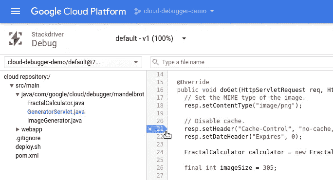

# 令人愉快的 Stackdriver 调试器

> 原文：<https://medium.com/google-cloud/the-delightful-stackdriver-debugger-4dda111999f2?source=collection_archive---------1----------------------->

我是一名开发者拥护者。作为我工作的一部分，我会在会议上展示谷歌的一些产品，我会教人们一些可能有助于他们做出酷东西的产品。我目前最兴奋的产品是 [Stackdriver 调试器](https://cloud.google.com/debugger/)。每次我在会议上演示调试器时，人们最初都不相信。一旦他们看到它真的能工作，而且我不只是在瞎编，他们要么很兴奋，要么很好奇它是如何工作的。

## 它的作用

Stackdriver Debugger 允许您在代码中的特定点拍摄在生产中运行的应用程序的快照，而无需部署该代码的检测版本。快照捕获局部变量状态和堆栈跟踪，这样您就可以看到给定请求通过代码的路径，并有望解决底层问题。

例如，可以有条件地设置快照，以便调试器仅在设置了错误代码时拍摄快照。您还可以包含希望包含在快照中的其他表达式。这对于查看深度嵌套的数据结构中的值或查看局部范围之外的变量的值非常有用。

我通常从 web UI 使用 Stackdriver 调试器，我上传我的代码，这样我就可以直观地设置快照点。您也可以使用它，而无需上传您的代码或指向 GitHub、BitBucket 或 Google Cloud Source Repository 上的云中的存储库。

对我来说，这在 Python 这样的解释语言中是可能的，但调试器也支持 Java、Go 和 Node.js，这看起来仍然很神奇。我有机会和那些为 Google Cloud 支持的一些其他语言的调试器工作的人交谈，他们正在做一些令人惊讶的事情来实现生产调试。

## 语言和基本设置

目前，Stackdriver 调试器支持 Go、Python、Java 和 Node.js。有一个针对 Ruby 的 alpha 库正在积极开发中。我希望在接下来的一两个月里，在几个不同环境下运行的 Rails 应用程序上尝试一下。

为了[设置](https://cloud.google.com/debugger/docs/before-you-begin)你的应用程序使用调试器，你需要安装 Stackdriver 调试器代理。每个环境都有点不同，但是对语言来说应该是有意义的。对于 Python，你用 pip 安装它，对于 Node.js，你用 npm，Ruby 作为 gem 安装，等等。一旦安装了代理，您就可以使用 [web UI](https://console.cloud.google.com/debug) 来拍摄和查看快照。您也可以像这样从命令行设置快照`gcloud debug snapshots create FILE_NAME:LINE_NUMBER`。关于设置快照的更多信息可以在[调试器文档](https://cloud.google.com/debugger/docs/debugging)中找到。

## 结论

我早期的一位导师谈到，他想建造“冰箱上的饮水机”他的目标是创造人们不知道他们想要或认为不可能的东西，但人们第一次使用时会很高兴。对我来说，调试器就是其中的一个产品。即使编译代码的实时调试只增加了很少的延迟，看起来也是不可能的，但是它确实有效。

*原载于*[*Thagomizer——命运之刺*](http://thagomizer.com/blog/2017/05/25/stackdriver-debugger.html)