# 从 Google 的实时数据库中使用比特币数据学习 SQL 的最快方法——第 1 部分

> 原文：<https://medium.com/google-cloud/the-fastest-way-to-learn-sql-with-bitcoin-data-on-a-live-database-from-google-part-1-c10480041f0a?source=collection_archive---------1----------------------->

# 为什么要学 SQL？

结构化查询语言(SQL)是一种允许您与数据库通信和操作数据库的语言。SQL 已经存在了 40 多年；它是处理数据的人的实际语言。

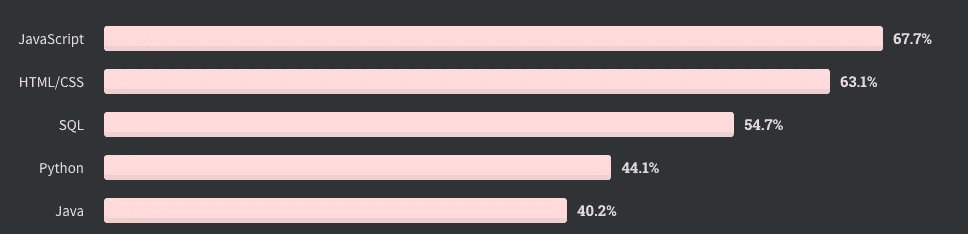

数据处理人员的实际语言— 2020 年堆栈溢出年度开发人员调查

# 为什么要用比特币学 SQL？

当学习新东西时，最好是找一个催化剂或真实世界的主题作为北极星。如今，比特币和其他加密货币将成为我们的北极星。

> 有成千上万的 SQL 课程，但大多数都没有让你为在公司使用 SQL 做好准备。

我在教授人们数据、数据库或 SQL 时发现，使用真实数据更容易掌握并取得成功。我们可以在获得一些快速胜利后，再回来学习第 2 部分中的基础知识！

# 我将在第 1 部分介绍的内容:

1.  激活免费(无信用卡)谷歌大查询沙箱
2.  在真实完整的比特币区块链数据上运行您的第一个 SQL 查询
3.  对真实完整的 Dogecoin 区块链数据运行第二个 SQL 查询

# 1)激活免费的 Google BigQuery 沙箱

Google BigQuery 的沙箱允许你每月免费处理 1TB 或 1000GiB 的查询，而且你不需要信用卡。

**步骤 1.1** 通过前往**[https://console.cloud.google.com/bigquery](https://console.cloud.google.com/bigquery)激活 BigQuery 沙箱**

****步骤 1.2** 这篇中型文章将带您了解整个过程[https://medium . com/@ rifkiamil/Step-by-Step-Step-guide-of-big query-sandbox-4429d 9655 d8e](/@rifkiamil/step-by-step-guide-of-bigquery-sandbox-4429d9655d8e)(您应该在两分钟内完成)**

# **2)对比特币区块链数据运行第一个 SQL 查询**

**我们将从 **Satoshi** 到 **Hal Finney** 中查找**第一笔已知的比特币交易**。我们想了解:**

*   **发送的比特币数量**
*   **交易发生的日期**
*   **比特币区块链上的区块号**

****步骤 2.1** -使用我已经在[https://console.cloud.google.com/bigquery?整理好的已保存的查询 sq = 819168234572:807 BF 59620394 d50b 587815 B2 af 6055 f](https://console.cloud.google.com/bigquery?sq=819168234572:807bf59620394d50b587815b2af6055f)。这应该会在 Google Cloud 控制台的 BigQuery 部分打开一个新的网页。**

****步骤 2.2** —您现在应该有一个类似这样的屏幕，编辑器中有一些 SQL。**

**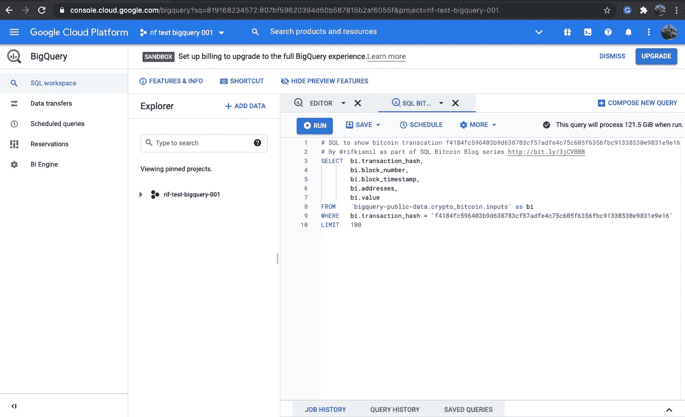**

****步骤 2.3** —点击编辑器内的“运行”。**

**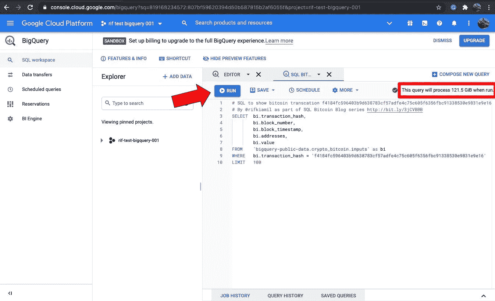**

**当您单击 run 时，您正在将 SQL 发送到数据库，您应该会得到一些结果。**

> **请注意“该查询运行时将处理 121.5 GiB”。每个月你可以在 BigQuery 免费获得 1000 GiB。注意不要用完这个月的免费限额。如果你确实达到了限额，你可以随时试用 300 美元的免费代金券，同时等待下个月的 1000 GiB。**

****步骤 2.4** —查看您被要求运行的 SQL 的结果。**

**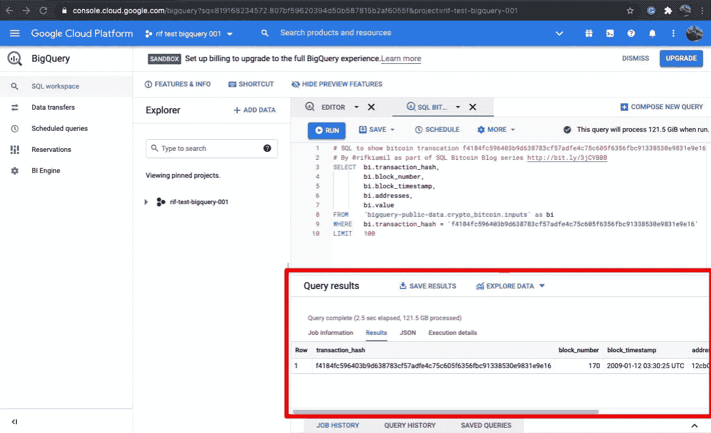**

**您可以看到，该交易的比特币区块编号为 170，日期为 2009 年 1 月 12 日 03:30:25 [UTC](https://en.wikipedia.org/wiki/ISO_8601)**

**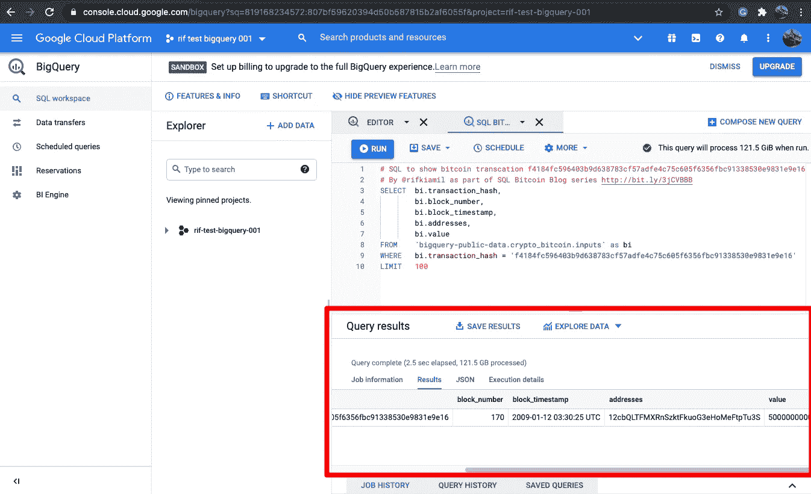**

**你可以看到这个交易值是 5000000000，比特币有八个小数位，所以值是 50.00000000**

****步骤 2.5** 在处理数据时，验证或复查您的工作总是很重要的。我们今天可以在[https://www . block chain . com/BTC/tx/f 4184 fc 596403 b9d 638783 cf 57 adfe 4c 75 c 605 f 6356 FBC 91338530 e 9831 e9e 16](https://www.blockchain.com/btc/tx/f4184fc596403b9d638783cf57adfe4c75c605f6356fbc91338530e9831e9e16)上查找该交易**

**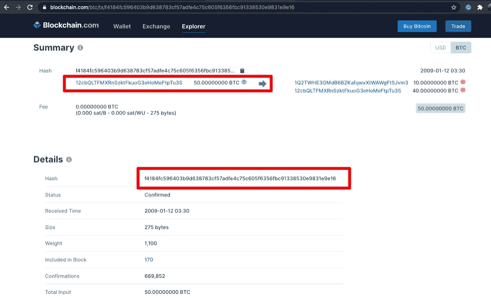**

**交易 f 4184 fc 596403 b9d 638783 cf 57 adfe 4c 75 c 605 f 6356 FBC 91338530 e 9831 e9 e 16 有 50 个 BTC 正在发送。**

**这是 SQL 查询的副本，您可以在将来使用它**

**我们刚刚做的总结！**

*   **证明你有一个工作的谷歌大查询设置**
*   **通过共享链接访问预先编写的 SQL 查询**
*   **查看 SQL 查询将处理的数据量**
*   **运行 SQL 查询并获取结果**
*   **使用第三方工具验证您的数据**

# **3 对 Dogecoin 数据运行第二个 SQL 查询(我们稍后再回到比特币)**

****

**在接下来的几个步骤中，我们将切换到对 Dogecoin 数据的学习，以节省我们每月免费获得的 1000GiB 中正在使用的数据量。**

> **Google BigQuery 让我们有机会在大规模数据库上运行强大的 SQL，而无需设置任何东西或购买昂贵的设备。谷歌正在将大数据的力量带给任何人。**

****步骤 3.1** 我们打开一个新的查询窗口。**

**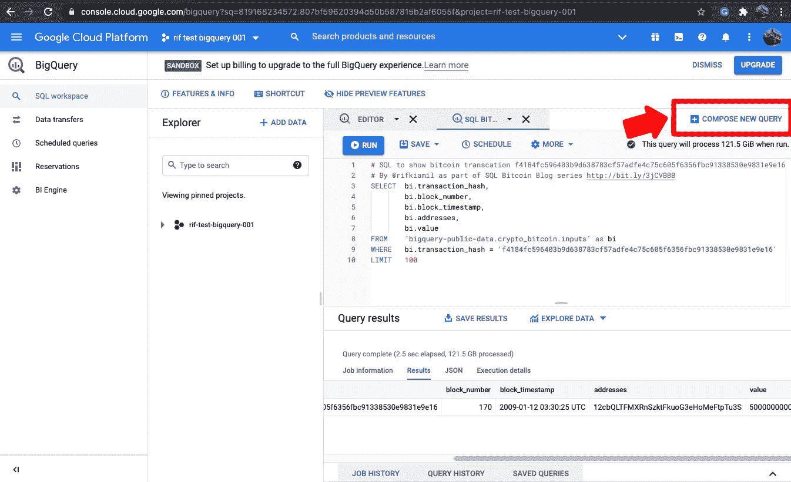****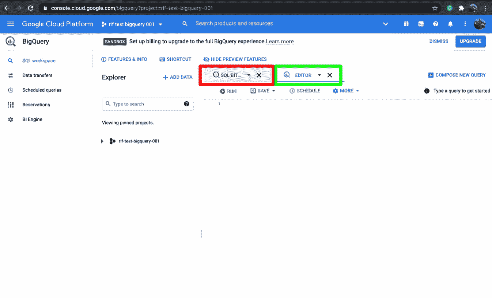**

**绿色框中是新的查询窗口，红色框中是之前的比特币查询。你可以像普通标签一样在它们之间切换。**

****步骤 3.2** 让我们将下面框中的 SQL 复制到新的查询窗口中。**

**在 Dogecoin 上查找 c 2941 b 764 e 5436 a 4 bb 39 EAA 1360 cf 7156 f 80d 831141 c 0d 352 e 950d 7 f 2427325 的 SQL**

**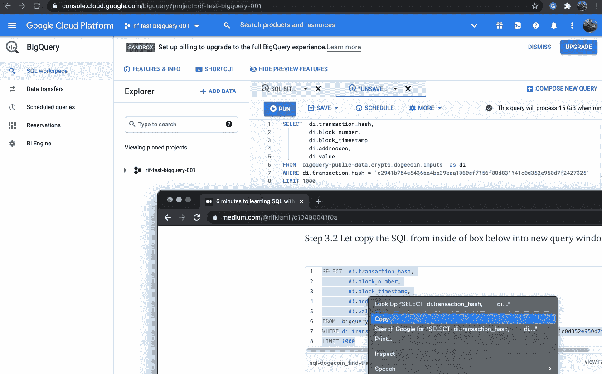**

**复制 SQL 并粘贴到新查询选项卡内的新查询窗口中**

**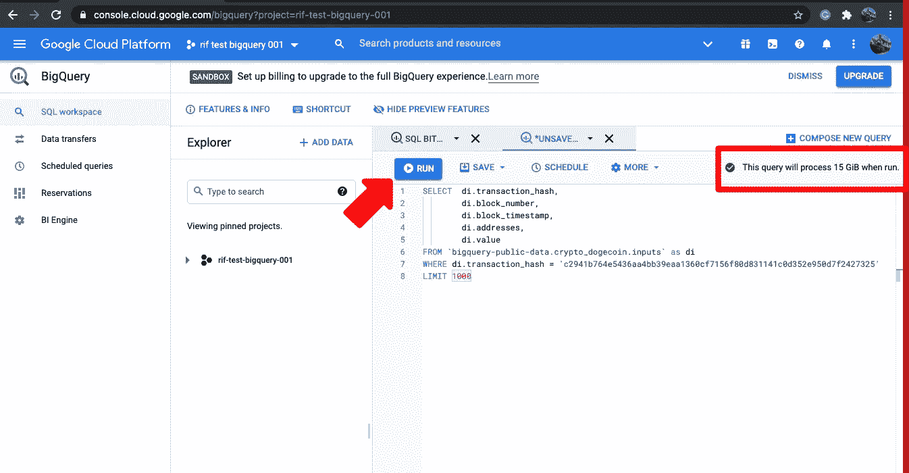**

> **回到步骤 2.3，对比特币数据库的查询说需要 121 GiB，现在用 Dogecoin 需要 15 GiB。这是 87%的减少，使你每月 1000 GiB 的自由走得更远。**

****步骤 3.3** 运行该查询的时间。**

**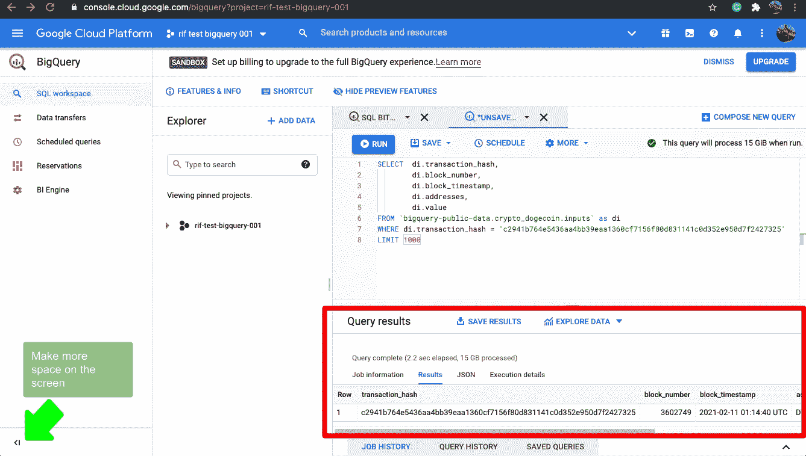**

**价值是 196，625，7587 . 686868686661**

**我们可以再次仔细检查我们从 BigQuery 返回的数据是否与[blockchair.com](https://blockchair.com/dogecoin/transaction/c2941b764e5436aa4bb39eaa1360cf7156f80d831141c0d352e950d7f2427325?_search=homepage&_type=transaction)匹配(blockchain.com 目前不支持 Dogecoin)。**

**我们刚刚做的总结！**

*   **打开一个新的编辑器窗口**
*   **复制了一个 Dogecoin SQL 查询并在 Dogecoin 数据库上运行它**
*   **我们可以看到 BigQuery 处理的数据量少了很多。**
*   **使用第三方工具验证数据**

# **然后**

**现在，您可以访问地球上最强大的数据库平台之一，并在两种不同的加密货币上成功运行 SQL。**

**我们将在[第二部分](/@rifkiamil/the-fastest-way-to-learn-sql-with-bitcoin-data-on-a-live-database-from-google-part-2-c00ff1067343)中深入了解 SQL 语言的更多细节。**

# **问题？**

**如果你对这篇博文有任何疑问，欢迎留下评论或给我发[推文@rifkiamil](https://twitter.com/rifkiamil)**