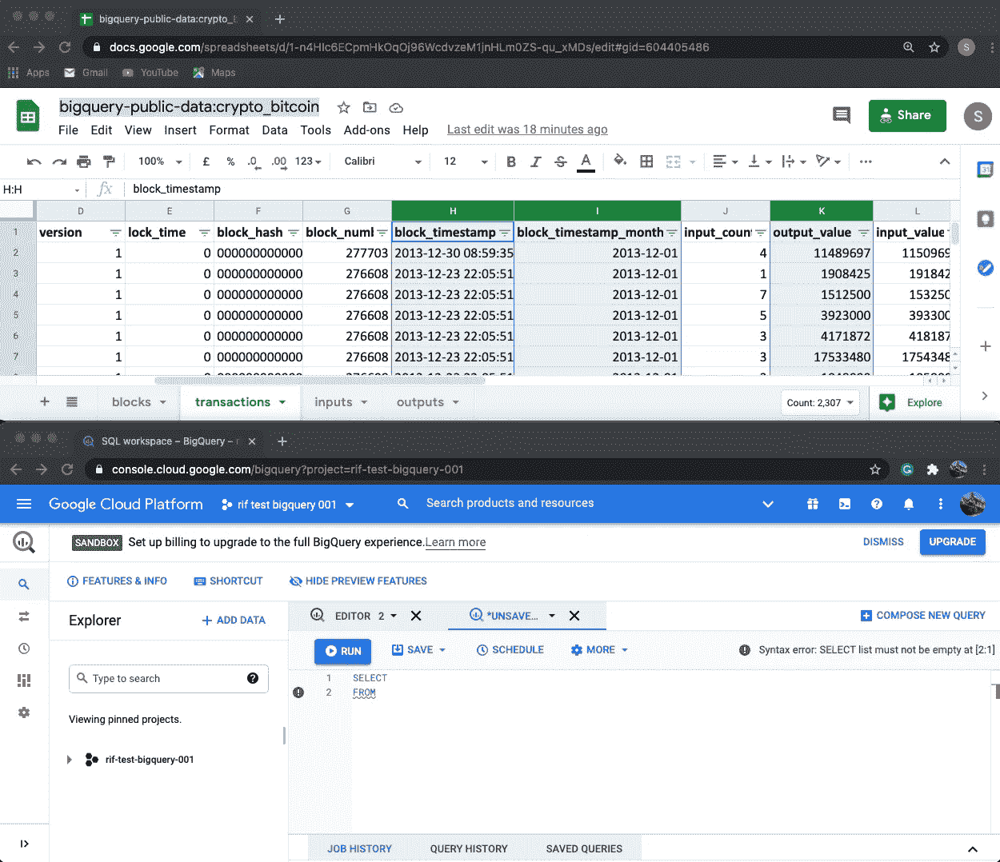
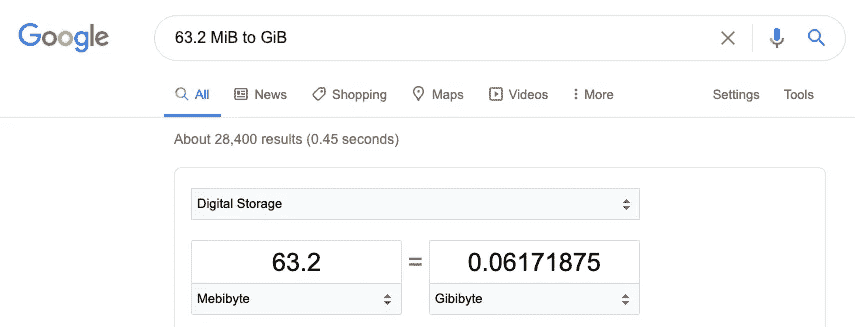

# 从谷歌实时数据库中用比特币数据学习 SQL 的最快方法——第 2 部分

> 原文：<https://medium.com/google-cloud/the-fastest-way-to-learn-sql-with-bitcoin-data-on-a-live-database-from-google-part-2-c00ff1067343?source=collection_archive---------0----------------------->

在[第 1 部分](https://rifkiamil.medium.com/the-fastest-way-to-learn-sql-with-bitcoin-data-on-a-live-database-from-google-part-1-c10480041f0a)中，我们在真实的数据库上运行了两个不同的 SQL 查询，并体验了处理大量数据的现实。

# 我将在第 2 部分中介绍的内容:

*   使用电子表格类比的数据库术语
*   编写我们的第一个 SQL 查询来获取比特币数据。
*   理解 SQL 中的 SELECT、FROM 和 WHERE 子句

# 使用电子表格类比的数据库术语

你会在里面找到一张带有比特币数据的[谷歌表单(就像一个 Excel 电子表格)。我创建了这个电子表格来帮助进行类比。](https://docs.google.com/spreadsheets/d/1-n4HIc6ECpmHkOqOj96WcdvzeM1jnHLm0ZS-qu_xMDs/edit?usp=sharing)

> 类比是将信息或意义从一个特定的主题转移到另一个主题的认知过程。

我假设有些人了解电子表格是什么样子的，并且对使用微软 Excel 或谷歌工作表(使用电子表格的两种最流行的方式)有一些了解

**比特币电子表格**

我用四个数字标记了谷歌表单图像，并列出了我们在电子表格中用来描述每个部分的常用术语。


包含常用电子表格术语的比特币电子表格的四个部分


电子表格-[big query-public-data:crypto _bit 币](https://docs.google.com/spreadsheets/d/1-n4HIc6ECpmHkOqOj96WcdvzeM1jnHLm0ZS-qu_xMDs/edit?usp=sharing)

下面，我创建了一个表格，使用电子表格中的四个红色框来概述等效的 SQL 术语。


电子表格术语和用于 SQL 的等效术语

**以太网谷歌版**

如果您在电脑上创建一个新的电子表格文件，或者在 Google Drive 上创建一个新的 Google Sheet，这将会是**类似于创建一个新的数据库**，然后您会有两个数据库，big query-public-data:crypto _bit 币和 big query-public-data:crypto _ ether eum。


电子表格-big query-public-data:crypto _ ether eum

**比较以太网/比特币**

下表汇总了。

*   以太网/比特币电子表格的四个部分
*   电子表格术语
*   等效的 SQL 术语


**比较以太网/比特币数据库。**

*   您可以看到，我们在比特币和以太网数据库中的表格名称非常不同。由于区块链技术的差异，以太网数据库比比特币数据库有更多的表格。
*   您也可以在交易表中看到比特币和以太网数据库之间的列差异。

我们刚才所做工作的总结！

*   涵盖了电子表格中使用的术语。
*   我们学习了在使用 SQL 时使用的等价术语，例如，如果您使用一个新表，它就相当于在电子表格中使用一个新表。
*   我们比较了比特币和以太坊的区别。

# 编写我们的第一个 SQL 查询来获取比特币数据

我们将使用名为 big query-public-data:crypto _ bitcoin 的 Google 工作表作为指南，帮助我们编写第一个 SQL 查询

**1。**打开名为[big query-public-data:crypto _ bit coin](https://docs.google.com/spreadsheets/d/1-n4HIc6ECpmHkOqOj96WcdvzeM1jnHLm0ZS-qu_xMDs/edit#gid=604405486)的谷歌表单

**2。**转到名为交易的表格

**3。**进入[https://console.cloud.google.com/bigquery](https://console.cloud.google.com/bigquery)打开 Google Bigquery


您可能仍然会看到从第 1 部分运行的最后一个查询。

**4。**打开新的查询


**5。**我们现在将从数据库 big query-public-data:crypto _ bit coin 中获取三列数据 block_timestamp、block_timestamp_month 和 output_value

> 我将电子表格窗口放在了 BigQuery 查询窗口的顶部，以便于引用。


在 BigQuery 中写`SELECT`，做一个新的行然后写`FROM`，这是大多数人从空白屏幕开始写 SQL 的一个非常常见的方式。

```
SELECT
FROM
```

如果您愿意，可以将 SQL 复制并粘贴到 BigQuery 中。



现在已经在 BigQuery 中有了 SELECT FROM。您可以在第 2 行看到一个红点和一个语法错误。现在还好，因为我们还没有完成 SQL 查询的编写。

我们现在将从电子表格中写出以下姓名。

1.  数据库名称-big query-public-data . crypto _ bit coin
2.  交易记录表的名称
3.  列名——块时间戳、块时间戳、月、输出值(每列用两个逗号分隔)

SQL 将如下所示

```
SELECT block_timestamp, block_timestamp_month, output_value
FROM `bigquery-public-data.crypto_bitcoin.transactions`
```

您可以将 SQL 复制并粘贴到 BigQuery 中

> 有些时候可能很难看到，但是我们使用了反勾`**`**` 和`‘`单引号。随意复制粘贴帖子里的人物。


一切都应该是绿色的，如果我们运行查询，它将处理每月免费的 1000 GiB 中的 18.4 GIB。

**6。**我们现在要运行 SQL 查询


我们可以看到 SQL 查询给出了以下结果

*   三列
*   616471961 行

616，471，961 是很多行数据。通常，使用 SQL 的人不希望看到那么多未经过滤的数据。

**7。**过滤 SQL 查询中的数据

在 Google 工作表中，我们看到 **block_timestamp_month** 包含 2013 年 12 月 1 日的数据，格式为 2013–12–01(YYYY-MM-DD)。我们将通过使用一个`WHERE`子句在 SQL 中进行过滤

```
SELECT block_timestamp, block_timestamp_month, output_value
FROM `bigquery-public-data.crypto_bitcoin.transactions`
WHERE
```

我们现在把列名 **block_timestamp_month** 放在要过滤的`WHERE`之后

```
SELECT block_timestamp, block_timestamp_month, output_value
FROM `bigquery-public-data.crypto_bitcoin.transactions`
WHERE block_timestamp_month
```

最后，我们需要输入 2013 年 12 月 1 日要过滤的月份的 SQL

```
SELECT block_timestamp, block_timestamp_month, output_value
FROM `bigquery-public-data.crypto_bitcoin.transactions`
WHERE block_timestamp_month = '2013-12-01'
```

您可以将 SQL 复制并粘贴到 BigQuery 中。


一切都应该是绿色的，如果我们运行查询，它将处理 63.2 MiB。



通过添加 WHERE on block_timestamp_month，您每个月可以自由处理 1000 GiB 的数据，从而将数据量从 18.4 GIB 降至 0.06 GiB。

在 MiB、GiB 和 TiB 之间切换可能会令人困惑。有时使用谷歌搜索会有所帮助。

8。我们现在将使用 WHERE 运行 SQL 查询

运行以下 SQL 查询

```
SELECT block_timestamp, block_timestamp_month, output_value
FROM `bigquery-public-data.crypto_bitcoin.transactions`
WHERE block_timestamp_month = '2013-12-01'
```


通过添加`WHERE`子句，我们可以在 SQL 查询的结果中看到以下变化

*   正在处理的数据量从 18.4 千兆字节降至 63.2 兆字节
*   运行 SQL 查询的时间从 16.5 秒减少到 6.9 秒
*   从 616，471，961 返回到 1，935，103 的行数
*   block_timestamp_month 的每一行的值是 2013–12–01

9。关于比特币我们了解到了什么

*   比特币总共有 616，471，961 笔交易

*   2013 年 12 月，比特币有 1935103 笔交易。

# 理解 SQL 中的 SELECT、FROM 和 WHERE 子句

让我们对 SQL 语言有更多的了解，但更深入地研究一下`SELECT`、`FROM`和`WHERE`子句。

> 一个**子句**只是一个 SQL 语句的逻辑块。

确保从句的顺序正确是很重要的。

```
SELECT
FROM
WHERE
```

我通常在每个新查询的开头输入 SELECT FROM。

**来自**

当您开始编写 SQL 查询时，考虑数据库和表是最好的起点。这可能感觉有点违反直觉，因为`SELECT`子句必须总是写在`FROM`子句之上。

子句是我们写下将要使用的表和/或数据库的名称的地方。


在 FROM 子句中，数据库和表之间总是有一个点。带反斜杠`*` ` on both sides.*`


关于空格、句号和反勾号的规则与`FROM`子句

*   `FROM`总是在`SELECT`之后
*   `FROM`后面总是有一个空格
*   在键入数据库名称之前，你有一个反勾`**`**`
*   键入数据库的名称后，你有一个句号`**.**`
*   在键入表格的名称后，你有另一个勾号`**`**`
*   当使用数据库和表格名称时，我们使用反勾**，请**不要与撇号或单引号混淆

**选择**

`SELECT`是我们写下将要使用的列名的地方。我们也能够用 SQL 写一些类似于电子表格公式的东西。


SELECT 和 FROM 的格式


只有一个列名的 SELECT 和 FROM 格式！没有逗号


只有两个列名的 SELECT 和 FROM 格式！有 1 个逗号

关于空格、句号和反勾号的规则与`SELECT`条款

*   `SELECT`后面总是有一个空格
*   如果有不止一列，用逗号`,`隔开
*   `FROM`子句前的最后一列名没有逗号`,`

**哪里**

子句是我们如何告诉数据库我们希望如何过滤我们的数据。`WHERE` 子句应该只影响符合指定标准的行。


SELECT、FROM 和 WHERE 的顺序


该 WHERE 子句的标准是我们只显示 2013–12–01 的行

与`WHERE`子句有关的空格、句号和反勾号规则

*   `WHERE`后面总是有一个空格
*   `WHERE`总是在`FROM`之后
*   该值的两边大部分时间都有一个单引号`'` `'`
*   [操作员](https://cloud.google.com/bigquery/docs/reference/standard-sql/operators)可以是`=`、`>`、`<`、`>=`和`=<`

SQL 查询示例— [在 Google BigQuery](https://console.cloud.google.com/bigquery?sq=819168234572:23a25ba09bb341f8a091a7b7613c4cab) 中打开 SQL 查询

*   这个示例 SQL 查询在`WHERE`子句中有三个标准
*   使用`>`操作者要求超过 1 个比特币的交易
*   1 比特币是 10000000，因为它目前有八位小数
*   列名 **hash** 需要有**反勾** `**`**` ，因为 hash 是 SQL 中的[保留字](https://cloud.google.com/bigquery/docs/reference/standard-sql/lexical#reserved_keywords)
*   我使用制表符来布局这个 SQL 查询的文本，与以前有所不同，这并没有改变它的运行方式。它可以都在一行中，但这将使它更难阅读。

我们刚刚做的总结！

*   条款`SELECT`、`FROM`和`WHERE`总是按照这个顺序
*   当您刚接触 SQL 时，在做任何事情之前，先选择要使用的表和数据库
*   使用`WHERE`的`=`和`>`操作符来查找比特币交易

# 然后

现在，我们复习了 SQL 中使用的术语(数据库名称、表、列和行)，并通过学习`SELECT`、`FROM`和`WHERE`子句来查看构造 SQL 查询。

下一篇文章将介绍如何在 Google BigQuery 上探索更多的公共数据库，并使用这种能力探索其他表来编写下一组 SQL 查询。

# 问题？

如果你对这篇博文有任何疑问，欢迎留言或给我发 [Tweet @rifkiamil](https://twitter.com/rifkiamil)