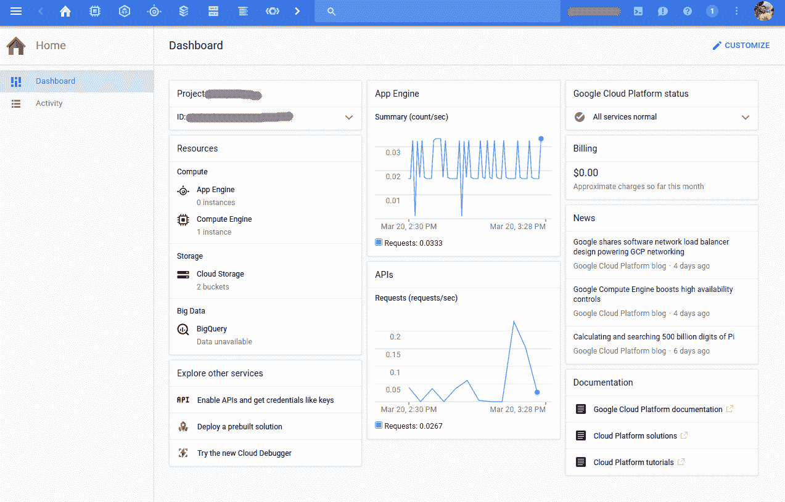
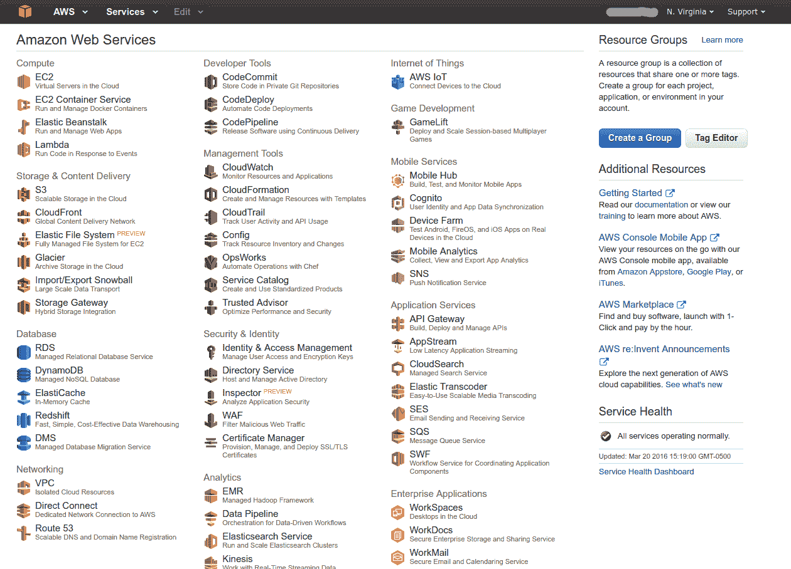

# 云计算的未来:谷歌云

> 原文：<https://medium.com/google-cloud/the-future-of-cloud-computing-google-cloud-1d2100fd74b8?source=collection_archive---------0----------------------->

你好。

我的名字叫 Obul。我在佛罗里达大学攻读云计算和大数据博士学位。我的爱好包括云、大数据、数据科学、Linux 和开源。我有大约 8 年使用各种云服务和大数据工具的经验。今天，我想谈谈云计算的未来。正如我们所知，云计算正在革新和重新定义“计算”。和其他尖端技术一样，云正在经历巨大的变化。我正在撰写一系列关于为什么我认为谷歌云将成为未来之云的帖子，重点是易用性、大数据、可扩展性、机器学习等。这是他们第一次将重点放在“易用性”上，将谷歌云与 AWS 进行比较。

# 易用性

云应该是好用的。对于开发人员来说，易用性意味着学习/知道尽可能少的东西。云计算要求我们从根本上改变对计算的看法(弹性、按次付费、..).但是，云不应该成为开发人员太多的认知开销。在比较 Google Cloud 和 AWS 的同时，我将涉及以下几个方面。

*   云不需要学习不必要的新术语。
*   云应该有易于使用的 UI、SDK、工具和服务。
*   云服务应该是一致的和组织良好的。

## 没有新的命名

以下是 AWS 上一些产品和服务的名称:弹性云计算(EC2)、弹性 Beanstalk、EC2 容器服务(ECS)、弹性负载平衡器(ELB)、简单排队系统(SQS)、卷、安全组、网络访问控制列表(NACLs)等等。命名方案应该足够简单，能够表达服务的内容。计算/应用/容器引擎、负载平衡器、磁盘、防火墙、发布/订阅、存储、监控、日志记录、产品和服务名称调试如何？看看 Google Cloud 是多么容易上手！

## 易于使用的 UI、SDK、工具和服务

Web 控制台是云服务的主要用户界面。如果我卖给你一辆汽车，仪表盘上写满了汽车所有部件的名称，我相信你不会感到兴奋。这就是我登录 AWS web 控制台时的感受。这实际上是他们产品的营销板。一旦你跨进你的车，你会期望有一个仪表板，在那里你可以看到你开得有多快，还剩多少燃料，汽车各个部件的任何潜在问题，容易接近方向盘，油门，刹车，杯架，但不是你的备胎。登录 Google Cloud console，您将看到您创建的资源列表、它们的性能指标和一些附加信息，如服务状态、最常用服务的可定制快捷方式。就像汽车的接口一样！

你甚至可以自定义你想看的和不想看的。如果你有 10 个项目，并且你正在做项目 A，为什么有些人会对项目 B 的信息感兴趣？可能是千载难逢，但不是永远。在 AWS 中，如果您有 10 个 VPC，并说您导航到 EC2 页面，您将看到所有 10 个 VPC 的实例。网络和其他资源也是如此。为什么这么疯狂？我不知道。谷歌云有很好的概念呼叫项目(类似于 AWS 上的 VPC)。一旦选择了您正在处理的项目，您将只看到该项目的资源。用这种方式管理资源要容易得多。

就像任何其他 UI 一样，它应该很容易访问资源。对于 AWS，您需要从 web 控制台导航到服务/产品页面，然后使用 VPC ID 或名称查询资源，然后访问资源。有了谷歌云，你只需在主页上点击两下鼠标就能访问资源。从任何服务页面，您可以使用可配置且易于使用的快捷方式跳转到任何其他服务页面。

谷歌云控制台

AWS 控制台

## 连贯的服务

云的另一个重要方面是服务的一致性以及它们的组织性。一些公司有车库/仓库的观念，而另一些公司有车间/博物馆的观念。(我说的不是黑客心态，我说的是他们组织的有多好)。两者的区别在于，车库/仓库是一个垃圾场，而工作室/博物馆是一个组织良好的收藏场所。在具有车库/仓库思维的公司中，人们不断选择新奇的工具来解决工作，最终公司会有许多垃圾场，需要维护人员，需要维护关于各种工具、孤立数据等的各种知识。一个组织良好的公司在工具方面应该尽可能地保持无趣。如果手头的工作无法用现有的工具解决，需要从根本上改变处理事情的方式，那么就去寻找新的服务。这样，你最终得到的是车间，而不是车库。

AWS 配备了 3 个排队系统(SQS、Kinesis Firehose、Kinesis Streams)，一个推送通知系统(SNS)，两个具有不同 API 的存储系统(S3 和冰川)，以及一个 gotchas(计费、最小对象大小、最小时间段)，每个服务仅解决该类别中问题的一个子集(S3 用于对象存储，冰川用于冷藏)。当然现在他们有 S3 IA，Kinesis Firehose 只能写到 S3 /红移/ Ealsticsearch，Kinesis Streams 只能支持 1000 次插入/秒，…)。EBS 优化实例、网络优化实例、EBS 需要在使用前预热、用于提高 RDS 性能的磁盘分片、负载平衡器预热标签、EC2 实例的时钟漂移、微实例定期关闭、没有默认的数据加密……等等。它们伸缩性不好，需要开发人员调整旋钮来放大和缩小。AWS 上的服务具有复杂的定价模型。对于一个开发人员来说，学习这么多工具和 API 简直是一场噩梦。应该只有一种排队技术，它应该解决所有的排队需求，并且应该无缝扩展。应该有一个对象存储系统，它应该满足所有的对象存储需求。

Google 的 Pub/Sub 解决了排队和通知系统的需求。发布/订阅处理计算、存储、日志、数据流、自动缩放、网络、监控和 AppEngine。谷歌存储是一个统一的存储解决方案。Google Dataflow 可以处理数据流和批量数据。Google cloud 提供了一套设计良好的工具，具有高度的一致性。AWS 是一堆工具，不考虑易用性，也没有任何一致性。

让我们以易用性来结束这篇文章。开发时间是一个公司最重要的资源。它不应该被浪费在学习不必要的名字、首字母缩略词、费力地浏览糟糕的用户界面、学习解决相似问题但覆盖不同角落的多种产品上。大数据和机器学习再见面吧！

声明:我应该说我是谷歌云的忠实粉丝。这些是我自己的意见，不是我雇主的意见。

编辑:这篇文章写于近一年前。因此，这里有一些更新，以保持内容新鲜。

关于 UI: AWS 对它的 Dashoboard 做了一些改变，但仍然很笨拙，还有很长的路要走。

关于数据库:我很高兴看到 Google Cloud 将 PostgreSQL 添加到它的托管数据库列表中！并且对扳手的能力印象深刻！这一举措让谷歌云在数据库方面也凌驾于 AWS 和其他云提供商之上！

机器学习:我对 Google Cloud ML(tensor flow 托管版)印象超级深刻。如果你或你的公司在 AI 上押了大赌注，甚至考虑 AI /机器学习，请确保尝试谷歌云 ML 和 ML APIs(语音/视觉/文本/视频)。