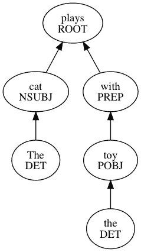

# Google NLP API 遇上 Ruby

> 原文：<https://medium.com/google-cloud/the-google-nlp-api-meets-ruby-5453ba0ee0d3?source=collection_archive---------1----------------------->

在 RailsConf，我将做一个关于自然语言处理的报告。作为我准备这次演讲的一部分，我一直在阅读自然语言处理的历史，并且一直在尝试谷歌的自然语言 API。这个 API 的 [Ruby Gem](https://github.com/GoogleCloudPlatform/google-cloud-ruby/tree/master/google-cloud-language) 是 alpha，但是它足够好来做基本的实验。

## 语法分析

关于 NLP，最让我感兴趣的事情之一是语法分析。对英语做静态分析是很棘手的。甚至确定词性也很难。例如，在句子“我要离开工作”中，工作是一个名词。我要离开一个实体的地方。但是在这个句子中，“我致力于我的谈话”是一个动词。像“very”这样的词既可以是副词，也可以是形容词，这取决于它们在句子中的位置。

尽管有这些挑战，知道词性还是很有用的。在上周的西雅图 Ruby Brigade 会议上，我们开发了一个文本生成器，最终将用于聊天机器人。我们为我们的机器人使用简单的[马尔可夫链](https://en.wikipedia.org/wiki/Markov_chain)，但有时会导致语法错误的句子。如果我们能够确保每个句子都有一个动词和一个主语，那么生成的文本可能会更好。

自然语言 API 将输入文本分解成标记(单词和标点符号)，然后提供关于每个标记的信息。下面是一些基本代码，它们使用自然语言 API 来识别输入中每个单词的词性。

```
require "google/cloud/language"

language = Google::Cloud::Language.new

content = ARGV[0]

document = language.document content
syntax = document.syntax

syntax.tokens.each do |token|
  puts "Token: #{token.text_span.text} #{token.part_of_speech.tag}"
end
```

我将这段代码与句子“猫在玩耍”进行了对比得到了这个输出。

```
Token: The DET
Token: cat NOUN
Token: plays VERB
Token: . PUNCT
```

我们更熟悉的将标签映射到标记的枚举是这里的。对照一个稍长的句子，“猫在玩玩具。”给了我这个。

```
Token: The DET
Token: cat NOUN
Token: plays VERB
Token: with ADP
Token: the DET
Token: toy NOUN
Token: . PUNCT
```

在这两个例子中，API 将 cat 标识为名词，将 play 标识为动词。被标识为限定词；你可能知道这是一篇文章。在较长的句子中，“with”被识别为“Adposition(介词和后置)”。

NLP API 还可以通过使用标记的“标签”属性来识别特定单词在句子中扮演的角色。

```
require "google/cloud/language"

language = Google::Cloud::Language.new

content = ARGV[0]

document = language.document content
syntax = document.syntax

syntax.tokens.each do |token|
  puts "Token: #{token.text_span.text} #{token.label}"
end
```

这是通过 API 运行上面的长句子的结果。

```
Word: The DET
Token: cat NSUBJ
Token: plays ROOT
Token: with PREP
Token: the DET
Token: toy POBJ
Token: . P
```



猫在玩玩具。

Cat 被确定为主语，plays 作为句子的词根，“with the toy”作为介词短语(介词、限定词、介词宾语)。

我一直喜欢摆弄 API，只是为了学习它，看看优势在哪里。下面是我使用 graph gem 和语法分析调用返回的信息制作的图表。

在我的 Rails Conf talk 中，我将展示其他句子图解方法，并更详细地说明所有这些语法术语对那些忘记中学语法的人意味着什么。

## 情感分析

在圣安东尼奥的 Ruby Conf 上，我做了一个题为[许多计算机的愚蠢想法](https://www.youtube.com/watch?v=_O1MGHcsQCI)的演讲。在那次演讲中，我通过给各种表情符号赋值，从推文中提取表情符号，然后把所有东西加起来，对推文进行了非常粗糙的情感分析。这是一个极其愚蠢的想法，但这正是我们演讲的目的。

我将在 Rails Conf 上重复这段代码，但这次我将使用适当的情感分析。代码类似于上面的语法分析代码。

```
require "google/cloud/language"

language = Google::Cloud::Language.new

content = ARGV[0]

document = language.document content
sentiment = document.sentiment

puts sentiment.score
puts sentiment.magnitude
```

分数是介于-1(消极情绪)和 1(积极情绪)之间的数字。量级是衡量信息“有多少”是负面或正面的。我通过情绪分析器发了一些微博。

我精心挑选了这一张，因为我相信这种情绪会是积极的。我的情绪得分是 0.7，震级是 1.5。所以用粗话来说就是“非常肯定”。我还尝试了西雅图 Ruby Brigade 发出的提醒我们开会的推文。

对此的情绪是 0.1，所以几乎是中性的。震级为 1.3 级。总的来说，这大约是“非常强烈的中立”。

## 结论

如果您喜欢这些例子，我鼓励您尝试一下云自然语言 API 库，并尝试它支持的所有不同类型的分析。如果你参加了 Rails Conf，你可以在我的演讲中看到更多的例子，或者在 Google Cloud 展台前停下来，在代码实验室里尝试一下。

*原载于*[*——命运之刺*](http://thagomizer.com/blog/2017/04/13/the-google-nlp-api-meets-ruby.html)