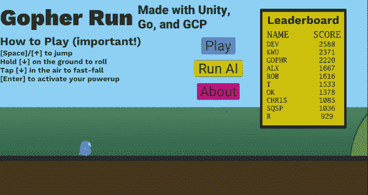
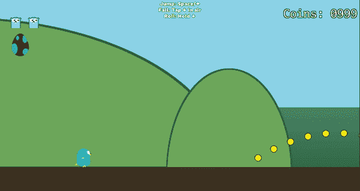
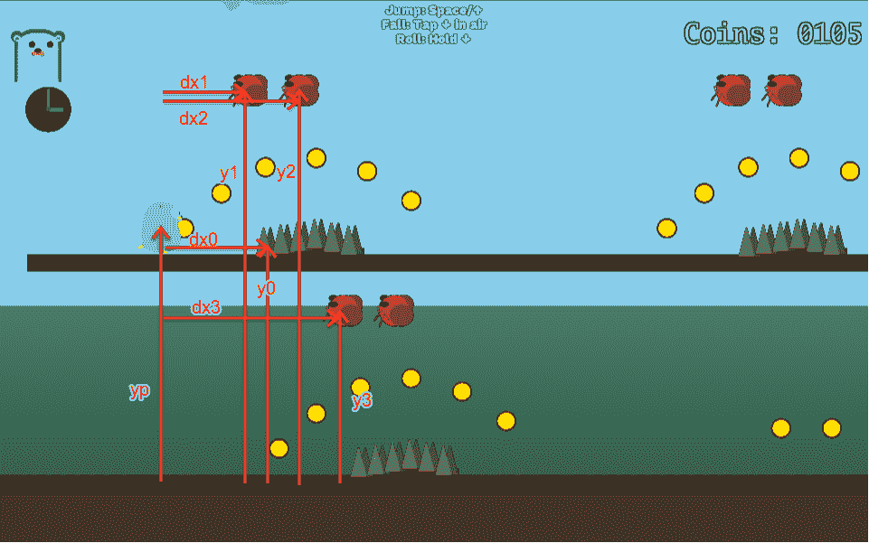
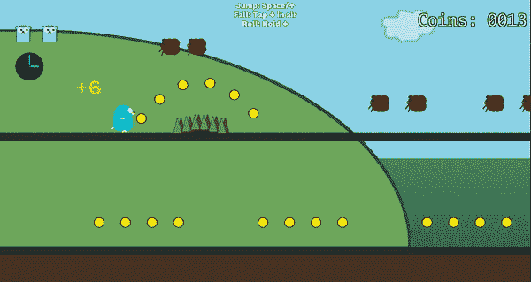
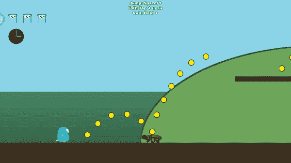

# 人工智能的地鼠

> 原文：<https://medium.com/google-cloud/the-gopher-with-artificial-intelligence-67715aeb13de?source=collection_archive---------0----------------------->

## 在游戏中使用监督式 ML

如今，机器学习到处都在使用。对于 Go 语言大会 [GopherCon](https://www.gophercon.com/) 2019，我们将 Go 的 Gopher 吉祥物放入了一个无休止的跑步游戏中。通过从人类玩家那里收集数据，并在 GCP 上训练一个模型，我们能够创造出一个得分比许多人都高的人工智能玩家。后端代码可在[这个回购](https://github.com/GoogleCloudPlatform/golang-samples/tree/master/getting-started/gopher-run)中获得。

# 游戏

Gopher Run 可以在谷歌云的 GopherCon 展台的 Chromebooks 上运行。主要的控制很简单:用向上箭头跳跃，用向下箭头滚动。级别是按程序生成的，所以它们是无限的，并且每次都会改变(但是包含相似的模式)。如果你遇到钉子或虫子，你会受到伤害，在失去三条生命后，你收集的硬币数就是你的分数。玩家以预定的时间间隔加速，随着游戏的进行，游戏会变得更难。这个游戏有一些其他的机制，但是它们与这篇文章无关。

*游戏玩法举例*

随着你的进步，它会加速，需要更快的反应时间

# 人工智能

为这款游戏创造的人工智能使用**监督学习**，这意味着它根据顶级玩家的行为进行训练，而不像**强化学习**通过玩和改进自己来训练。虽然强化学习不断改进，并且不需要存储球员数据，但它也需要更长的训练时间(监督算法只需要运行一次)，并且更难设置和实现。

训练数据由游戏快照组成，每半秒记录一次，每当玩家执行一个动作时记录一次。通过这种方式，算法可以看到玩家对不同情况的反应(跳跃、翻滚或无所事事)。在训练和部署模型之后，通过将当前游戏状态给予部署的模型来预测玩家在给定情况下最有可能做什么，来确定 AI 的动作。

我为游戏使用了 Unity 引擎，为 ML 使用了 Google Cloud AI 平台，但这适用于任何可以发送 HTTP 请求和 ML 服务(或自定义 ML 代码)的引擎。

# 创建输入

如果你正在制造这种人工智能，更具挑战性的任务之一是决定输入什么。为了保持速度和内存效率，将游戏状态浓缩成最有用的信息是很重要的。为了记录玩家的情况，我存储了他们当前的`y`位置和垂直速度。因为我想让 AI 避开障碍物，所以我查看了玩家前面最近的三个 bug 和一个尖峰，并存储了它们的`y`位置和与玩家的`x`距离(根据玩家速度归一化，见下面的注释)。每当玩家执行一个动作时以及每半秒钟收集一个数据点，以捕捉玩家无所事事的时间。在提交分数之前，数据存储在 Unity 的一个结构中。然后发送到云存储的一个 csv 文件里，准备训练收集前 10 名选手的档案。

输入变量图

该图显示了从最近的尖峰和最近的三个 bug 收集的变量。给算法的信息包括`y`变量，每个`dx`变量除以玩家的速度，以及玩家的垂直速度。

*标准化注意事项*:物体的水平间距随速度而缩放——比较第一节中的两张游戏 gif。考虑高速跳跃覆盖更多的水平距离，尽管具有相同的峰值高度和飞行时间。除以速度意味着输入变量是到达危险点所需的时间(例如，前方 6 个单位的峰值÷12 个单位/秒的速度= 0.5 秒到达峰值)，这对于计时输入(如跳跃)实际上很重要。

# 培养

我用的是 GCloud 内置的`[XGBOOST](https://xgboost.readthedocs.io/en/latest/)`框架，带有分类目标(`multi:softmax`)，每次训练大概需要 7 分钟。更复杂的行为可能更适合神经网络或回归目标。为你的输入找到合适的东西，它给出了人工智能行为的相关信息。例如，我可以使用回归目标，其中-1 =滚动，0 =不做任何事情，1 =跳跃。我选择不这样做，因为玩家的输入不是模拟的(按钮要么被按住，要么不被按住，这不是一个 360 控制杆)，而且它不会在滚动的同时处理跳跃。

大多数游戏可能只需要一次性的培训工作。然而，为了演示的目的，我们希望看到 AI 随着玩家的进步和贡献更好的数据而提高，所以我们定期重新训练。你可以用一个 shell 脚本自动完成这个任务([这里是](https://github.com/GoogleCloudPlatform/golang-samples/blob/master/getting-started/gopher-run/cmd/training.sh)我做的那个)。它使用来自人工智能平台[快速启动](https://cloud.google.com/ml-engine/docs/algorithms/linear-start#setup)的`gcloud`设置命令，然后循环训练和版本创建命令(也在快速启动中)。这将在云存储目录中创建一个经过训练的模型，该模型将覆盖来自先前训练作业的模型，并创建一个新版本的已部署模型(其`job-dir`参数指向训练输出目录)。您必须手动部署模型来创建第一个版本(使用云控制台很容易)，但之后新版本会使用最新的培训输出并将自己设置为默认版本，因此预测请求将始终使用最新的模型。

# 使用最大似然预测

人工智能播放器与普通播放器相同，但键盘输入被禁用，取而代之的是它反复向 ML 模型发出请求。对 GCloud AI 平台中部署的模型的请求被格式化为输入减去目标列(即，动作，这是被预测的)。然后，它返回一个可能的目标类，表明处于这种游戏状态的玩家可能会翻滚、跳跃或什么都不做(这调用 roll 或 jump 方法)。

*关于 GCloud 输出的注意事项*:尽管多类分类算法使用字符串作为 class 列，但 Google Cloud AI 的一个怪癖是预测返回一个浮点数而不是字符串，要么是 0.0(在输入中看到的第一类)，要么是 1.0(在输入中看到的第二类)，要么是 2.0，等等。由于浮点和类之间的对应关系根据类在输入中出现的顺序而变化，所以在 csv 训练文件中为每个类添加一个伪数据行前缀，这样 0.0 表示的类总是 jump，1.0 总是 roll，等等。

# 运行人工智能

最早的版本没有走多远。一个没有足够数据的早期版本在每次到达地面时都会跳跃。随着获得更多数据，人工智能迅速改善，人类玩家表现更好，但在第一天的高分 268 分有点停滞不前，这足以让它进入前 10 名排行榜，直到当天结束时被挤出。第二天，它继续提高，最后达到 370。相比之下，人类玩家通常在第一轮比赛中获得 10-30 分，第一天的排行榜分数约为 200-800 分，第二天为 600-2000 分(由于返回的玩家，分数要高得多)。

*早期 AI 纠结翻滚时机*

*后来艾好多了*

# 外卖食品

**优化性能和内存使用。**

有一个 bug，我不小心收集了每一帧的数据，这破坏了帧速率，并通过耗尽所有内存(即使是我收集的相对简单的数据点)使 WebGL 构建崩溃。遵循标准的最佳实践总是好的，比如让 Unity 的更新功能尽可能小。

**在快节奏的游戏中，查询模型的时间是不可忽略的。**

在等待模型的响应时，人工智能的游戏有短暂但明显的停顿。在其他情况下，可能一次发送多个数据点，因为 API 接受一个列表。我一次请求一个数据点，因为我不知道人工智能玩家未来会在哪里，也不知道未来的垂直速度。我还设置了异步运行的 HTTP 请求，但是游戏运行得太快了，在 AI 已经与即将到来的危险发生碰撞后，响应不会出现。

由于前面提到的限制，我每半秒钟才查询一次 AI(在更高的速度下更频繁)。这意味着人工智能在执行新动作的频率上受到限制。我把“停止滚动”算作它自己的独特输入，所以一个需要滚动的模式后面跟着一个需要跳跃的模式，有时会看到 AI 成功地滚动到第一部分，然后停止滚动，然后在另一个半秒过去之前，它会运行到第二个模式，因为它还没有发出新的请求(这会告诉它跳跃)。

**这种 ML 效果很好，可以用于更复杂的任务。**

在获得足够的数据后，人工智能一直很好(除了上一段中的问题，这是实现的限制而不是模型的限制)。我以一种非常直接的方式使用 ML 输出，让 AI 复制为玩家预测的动作，但是当你知道玩家在任何情况下可能做什么时，还有更多创造性的可能性。如果玩家总是跳过某些错误模式而不是掷骰子，等级生成算法可以适应并增加上面添加了错误的类似模式的频率，迫使玩家掷骰子。在像吃豆人或炸弹人这样的游戏中，人工智能可以通过预测玩家接下来会去哪里来阻止他们。每种类型都有无穷无尽的应用，所以我鼓励你在自己的项目中使用 ML 做一些有创意的事情。

有没有实现过什么游戏？你认为人工智能可以被训练来玩你的游戏吗？请在评论中告诉我！

特别感谢 Tyler Bui-Palsulich 和 Franzi Hinkelmann 以及 Dane Liergaard、Jon Foust 和 Google NYC 的所有移动和云 DPE 团队成员。

Go/Bash 代码在这里[可用](https://github.com/GoogleCloudPlatform/golang-samples/tree/master/getting-started/gopher-run)，Unity 项目目前不可用，但如果将来有，会链接到这里。更多关于 GCP AI 和定价模式的信息可以在[这里](https://cloud.google.com/ai-platform/)找到。