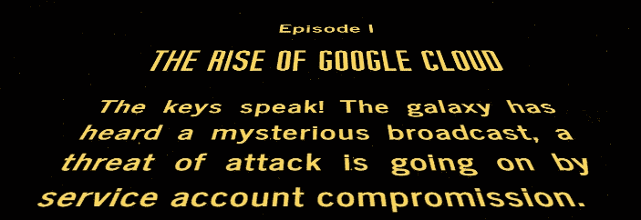
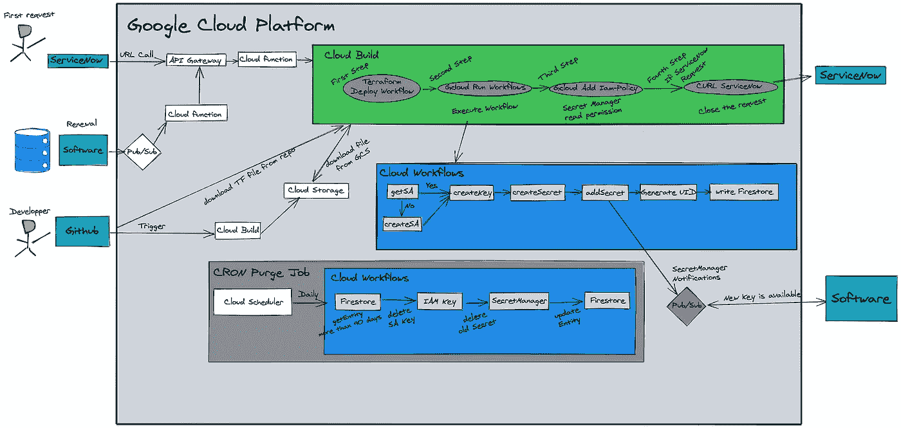
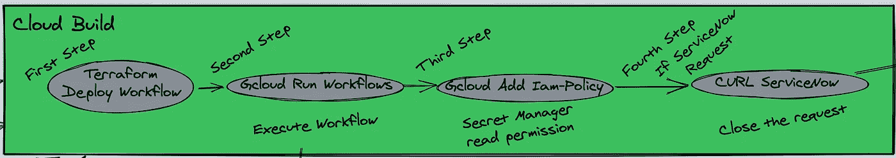
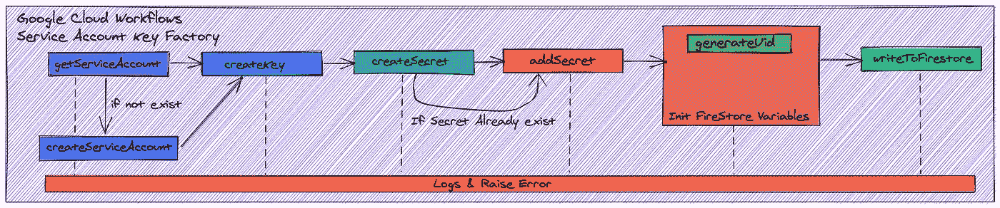
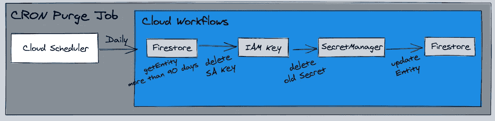

# 关键的战争故事

> 原文：<https://medium.com/google-cloud/the-key-wars-story-a65bb9dabe56?source=collection_archive---------3----------------------->

但是很抱歉这不是我们生活的世界！一个你必须保护自己和资源的世界。因为我们使用云资源，所以我们选择的安全机制可能是架构中最重要的部分。

正如您在此处看到的**，由谷歌推荐，在为您的服务帐户使用密钥之前，您有许多不同的选项不需要密钥，例如:**

*   ****工作量标识****
*   ****服务帐户的默认凭证****

**但是在某些特定的用例中，您最终真的需要一个密钥…比如将您的本地遗留应用程序连接到云。**

**服务帐户密钥允许应用程序作为服务帐户进行身份验证，类似于用户使用用户名和密码进行身份验证，但不使用密码！**

**一个密钥的问题在于它的生命周期，你可以通过我写的另一篇文章 [**这里**](/google-cloud/dear-keys-are-you-still-alive-ad7c73ce63b9) 来监控发生了什么。**

**但是这还不够，这可能是因为在这个领域中缺少的最重要的特性是在生成密钥时设置到期日期的可能性。这在今天的 GCP 是不可能的(比如在 Azure 上是可能的)。**

**谷歌告诉我，这两个重要的配置必须用来解决我的问题:**

*   ****使用 IAM 下的条件设置访问截止日期****
*   ****使用密钥工厂解决方案(最著名的是 Hashicorp 保险库)****

**我对这两点的看法是:**

*   **IAM 条件是不够的，首先是因为 BigQuery 不接受数据集级别的条件，其次是因为我不想每隔 XX 天就必须回到 IAM 下更新配置。**
*   **密钥工厂是最好的选择，但不是 Hashicorp，因为我不想为一个黑盒子付费，我也不想部署一个基于 GKE +许多不同功能的复杂技术。**

**在我的公司里，我们尽可能地推广和喜爱无服务器技术。**

**所以现在我们来了，为什么不试着建立我们自己的**无服务器密钥工厂**？哦耶！**

**在与可能是最疯狂的安全谷歌人 Seth Vargo 讨论之后，我们找到了共同点！**

****

**遵循谷歌的建议:**

***“安全最佳实践是定期轮换您的服务帐户密钥。您可以通过创建新密钥、切换应用程序以使用新密钥，然后删除旧密钥来轮换密钥。结合使用* `***serviceAccount.keys.create()***` *方法和* `***serviceAccount.keys.delete()***` *方法来自动旋转。”***

**[*谷歌云。*](https://cloud.google.com/iam/docs/creating-managing-service-account-keys)**

****

****我正在做的是:****

*   **在组织级别，我们部署了`**constraints/iam.disableServiceAccountKeyCreation**`组织策略，防止用户创建用户管理的服务帐户密钥**
*   **选择一个 GCP 项目(我公司的每个区域或实体),在该项目中不会激活策略，并且将生成所有密钥**
*   **在人类第一次请求后，部署一个管道来提供一个密钥(批准与否取决于用例),并直接向软件提供所有的密钥更新**

****

**这张图表需要一些解释**

*   **第一个请求是由 X 先生通过 ServiceNow 门户提出的，他试图解释为什么他真的需要一个密钥，在安全团队批准之后，就可以创建密钥了**
*   **续订请求将由软件本身通过发布/订阅主题直接提出，这是经典的方式！**
*   **来自工厂的功能开发被推送到 CloudBuild 正在观察的 repo，因为我们已经将上一个云工作流版本的 YAML 文件放在一个桶中，以便稍后能够使用 Terraform 部署它(目前只允许您从 GCS 导入 YAML 文件)**

# **现在让我们深入工厂内部:**

****在 API 网关接收到来自 ServiceNow 的安全调用后，云功能正在准备消息以供云构建理解:****

****

*   **第一步是在区域的特定项目中部署关键工厂(其中禁用了 org 策略，只有少数人有权限)，从云存储中获取 YAML 工作流文件，并使用 Terraform 进行部署**
*   **第二步是完全运行工作流以提供 SA 密钥**
*   **第三步是允许请求者读取存储在秘密管理器中的密钥**
*   **最后一步(如果请求来自 ServiceNow)是调用 ServiceNow 来关闭带有请求信息的请求。**

****现在我们来深入了解一下云工作流部分(上面刚刚解释的第二步):****

****

*   **如您所见，我试图知道服务协议是否已经存在(如果不存在，我创建它)**
*   **其次，我从 SA 创建密钥(即使另一个已经存在，因为可能是更新时间)**
*   **第三，我创建一个与这个密钥相关的秘密(或者只是检查这个秘密是否已经存在)**
*   **第四，我添加密钥有效载荷作为秘密的最后版本**
*   **最后是监控部分，意思是在 FireStore 中插入一个文档，说明:**

***“密钥 XXX 已经在 2021 年 11 月 5 日 20:10 被创建，它存储在秘密 XYZ 中。”***

**使用的完整云工作流代码可从[这里](https://github.com/antoinecastex/key_factory/blob/main/main.yaml)获得**

****现在我必须通知请求者有些东西是可用的。****

**请求者正在收听一个 PubSub 主题，这是一个好消息，因为 Google 刚刚引入了一个可能性，当一个秘密的新版本发布时，可以自动发布一个主题的消息(无需您的任何代码)。这里看[这里看](https://cloud.google.com/secret-manager/docs/event-notifications)。**

**我的请求者(无论他们是用户还是软件)将使用它来通知他们何时可以使用他们的续订:)**

****最后，也是最重要的，清洁部分:****

****

****每天早上 8 点，云调度程序将调用云工作流来:****

*   **询问 Firestore 哪些文件与超过 90 天的钥匙相关？**
*   **删除相关的 IAM 键**
*   **删除相关机密**
*   **更新 firestore 文档**

****结论:****

**我有一些非常轻的东西，可以部署在我想部署的地方，而且不需要任何成本。因为您可能知道，云工作流定价模式非常便宜(前 5 000 步是免费的), Secret 每个版本每个位置只需 0.06 美元…**

**最后，我必须通知人们，从创建第一个密钥的那一刻起，他们有责任在接下来的 90 天内回来请求续订，否则当前密钥将被自动删除…**