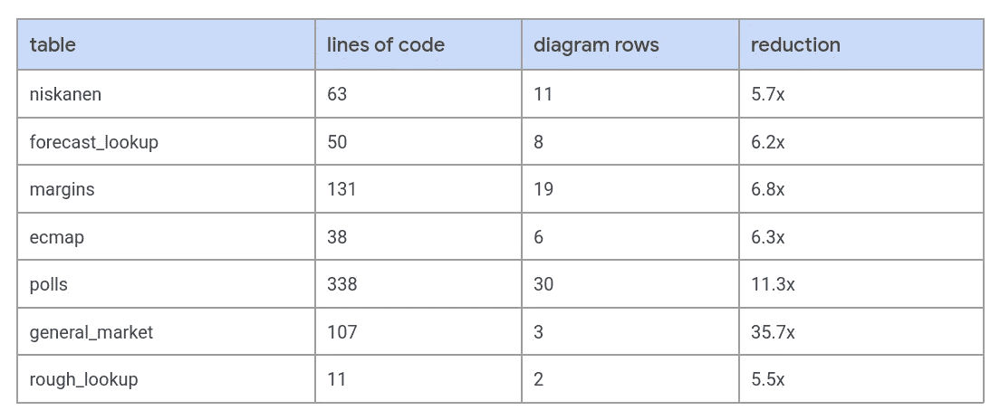

# LookML 图不是传统的 ERD

> 原文：<https://medium.com/google-cloud/the-lookml-diagram-is-not-your-traditional-erd-22a1911e715a?source=collection_archive---------0----------------------->

## 我们很高兴发布 LookML 图表，一个期待已久的“LookML ERD”，现在可以在 Looker Marketplace 上下载。

我们在日常生活中使用各种模型。地图是某个真实地方的直观表示。汽车模型或飞机模型是真实交通工具的缩影。这些是物理模型。也许更常见的是，我们使用抽象模型:人格类型、商业模型、信仰体系。这些模型是基于人类的经验；他们试图通过已建立的观察、构建和分析来理解和绘制一条穿越现实的路线。

另一种抽象模型是数据模型。抽象从最底层开始，当我们假设我们可以用有限的参数(0，1)近似现实的无限参数(0，…，1)时。琼·罗宾逊在 1962 年说过一句著名的话，“一个考虑到现实所有变化的模型，不会比一张 1:1 比例的地图更有用。”当我们进行抽象时，我们近似，并潜在地减少或转换；因此，必须应用科学方法的严格性来评估我们的模型。

> 数据模型是真实世界系统的数字表示。

编程语言、数据库模式和流程图都是数据模型的类型。我们在日常生活中也使用这些。模型通过扩展我们对现实的感知来帮助我们理解事物。地图让我们看到前方的情况，否则我们看不到。类似地，流程图组织信息、顺序和选择，以告知我们如何做出决策。

> 数据模型帮助我们创造一个可以测量、分类、组织和预测的世界。

一种数据模型是实体关系(ER)模型。ER 模型主要关心的是表示关联。实体代表数据库中的表。这些表格包含列。这些列具有类似数据类型的属性。我们使用一个叫做实体关系图(ERD)的图表来可视化 ER 模型。在实体之间绘制线条，链接特定的列，表示关联。

LookML 模型比 er 模型更复杂，因为 LookML 模型涉及关联、行为和继承。LookML 通过其语义建模层实现了这一点。视图构成了该对象层次结构的基础，由字段(维度和度量)组成。维度通常以原始 SQL 片段的方式映射到底层数据库中的列，但也可以引用其他维度。度量对数据库列或视图字段执行不同类型的 SQL 聚合，这就是 LookML 捕获数据行为的方式。

LookML 图的基本视图由深蓝色的标题表示。在每个视图表中，尺寸是白色的；尺寸为浅橙色。每个字段的左侧是代表其类型的图标。如果字段是主键，则在字段名称的右侧会出现一个键图标。

视图并不总是精确地映射到底层数据库表，尽管偶尔会这样。这是因为 LookML 提供了捕获 SQL 全部功能的机制，因为视图可以从原始 SQL blobs 的派生表中生成。视图也可以通过对象继承扩展或细化现有视图来描述。

视图之间的关系由浏览中的一组连接来描述。与字段类似，这些连接通过原始 SQL *或*视图对象引用来引用视图。LookML 图用连接两个或更多视图的有向线表示连接。结合的视图由浅蓝色标题指示。

线的形状，在它连接到视图或字段的地方，传达了对象之间关系的基数；分叉线表示“多”基数，单线表示“一”基数。您可以将从基础视图*到*联合视图的关系理解为*。*

LookML 是一种用于查询数据的编程语言，因为它允许我们描述这些高级分析对象，然后使用它们。LookML 图是一个数据模型可视化，显示了这些对象是如何定义的以及它们之间的关系。

# 可视化调试工具

LookML 图相对于其他可视化表示 LookML 的方式的另一个好处是，某一类令人沮丧的基于输入错误变得很明显。例如，主键图标将*真*主键与可能被误认为唯一标识符的字段区分开来。

LookML 图上的每一个元素都可以点击查看更多信息。这提供了一种方便的方式来检查给定浏览器中的多个视图，而无需重新加载单个页面。相关的对象元数据与分布和值查询一起显示，允许您进行有用的元分析，同时还可以查看底层的 LookML 代码块。到 IDE 和浏览页面的有用链接支持进一步的调查。

# 活的设计文档

从历史上看，创建记录报告团队数据模型的 ERD 可能更像是一个艺术项目，而不是工程工作。第三方图表工具需要痛苦的手动数据输入，并且通常不能处理高级模型或不断变化的设计。LookML 图改变了所有这一切，因为它的图会以最佳方式重新排列，并与您选择的任何 Git 分支保持同步。可共享的 URL 意味着您可以为您的团队指出正确的方向，或者以编程方式生成到您的模型图的链接。

# 看待 LookML 的新方式

新的 LookML 开发人员面临的挑战之一是他们可能需要快速理解的大量代码。LookML 图的设计是为了*将 LookML 开发者的注意力集中到真正重要的特性上*,并减少扫描无关文本文件的时间。通过在默认情况下隐藏隐藏字段并提供可组合的视图选项，用户能够快速获得模型的这种数据密集型表示的“情况”。使用 LookML 图表的 LookML 开发人员发现，数据墨水平均压缩了 11 倍***。**此外，LookML 图表通过图表分类法帮助我们更容易地识别和交流建模模式。*

**

*无论您是 LookML 的新手还是它的忠实粉丝，LookML 图都可以帮助向非技术合作伙伴传达连接逻辑错误，加速新分析师的入职，或者作为复杂模型开发的入门读物。在 Looker Marketplace 中找到 LookML Diagram 应用程序，亲自试用一下。*

# *扩展框架使之成为可能*

*扩展框架为许多令人惊叹的应用程序的创建铺平了道路——事实上，我们用它构建了这个数据模型图表应用程序。因为在使用扩展框架时，我们不直接致力于 Looker 的核心代码库，所以我们能够快速开发和部署改进。而且，由于应用程序托管在 Looker 内部，我们不需要担心身份验证，用户也不需要在平台外部导航来可视化他们的模型。使用 Looker UI 组件，我们能够匹配 Looker 平台的外观，并节省前端开发时间。*

*用扩展框架开发的下一个应用很可能是你自己创建的。点击了解更多关于如何开始开发自己的应用[的信息。](https://docs.looker.com/data-modeling/extension-framework/extension-framework-intro)*

# *阅读更多*

*[使用 LookML 图表应用程序](https://looker.com/blog/lookml-diagram-application-visualizes-data-model)
[可视化您的模型使用 LookML 图表](https://docs.looker.com/data-modeling/extension-framework/lookml-diagram)
[配置 LookML 图表](https://docs.looker.com/data-modeling/extension-framework/lookml-diagram-admins)*

***【1】***

**