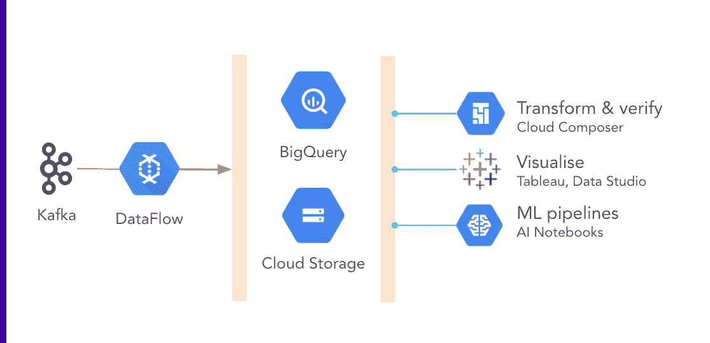

# 一个云函数的不幸遭遇

> 原文：<https://medium.com/google-cloud/the-misadventures-of-one-cloud-function-edd8e4036e92?source=collection_archive---------0----------------------->

**“管用！!"**

你知道当你调试了几天的东西终于工作时那种甜蜜的、闪闪发光的感觉吗？

作为一名偶然成为常驻 GCP 专家的平台工程师，我在过去的一年里一直与我们的数据工程师密切合作。我帮助他们构建架构，定义或帮助他们定义“基础设施即代码”,提醒他们不要在生产中进行测试，并考虑安全性。说到这个…

> 我们越是深入云技术，越是拥抱微服务，越是冒险进入无服务器领域，就有越多的数据四处流动，随时可以被利用或被攻破。

对于我们这些工作负载完全是云原生的人来说，数据分析的前景是光明的，充满了奇迹:AWS Lake Formation and Redshift，GCP 数据流和 BigQuery，ML 和 NLP 工具的口袋-一切都是为了构建一个只适合您公司的数据平台。

要保护的东西太多了。

谷歌云平台(GCP)，提供面向数据工程的广泛服务；以及多种安全工具，您可以使用这些工具来保护宝贵的数据。

您可能希望使用数据流来消费 Kafka 的主题，将其存储在 GCS 或 Big Query 中，使用 DataProc 或 Cloud Composer 运行数据转换，使用 AI 笔记本实现数据科学和机器学习，并在 Data Studio 中构建漂亮、有洞察力的仪表板。

这种架构可能是这样的:



使用 GCP 服务构建的数据管道示例

“但是 Natalie，”你说，“大多数服务都是公共 API，你如何确保入侵者——或者恶意的内部人员——不会从你的大型查询数据集中泄露敏感数据？”

## **VPC 服务控制**

云中的安全性可能是云提供商需要证明的最激烈的论点。今天，我们有大量的安全控制可供选择，在数据保护方面，GCP 为我们提供了一种叫做 VPC 服务控制的东西。

VPC 服务控制是一套工具，您可以应用它来限制在您的 GCP 项目中对谷歌服务的访问。你可以把它想象成类固醇上的防火墙:你通过把它们放入服务边界来定义你想要保护的项目；决定要限制哪些 API，以及谁可以从哪里访问这些 API。


VPC 服务控制通过将 Google APIs 限制在服务范围内来保护您的数据

当使用与上面类似的数据平台时，您想要保护的 API 列表包括:

```
[“bigquery.googleapis.com”,
“storage.googleapis.com”,
“logging.googleapis.com”,
“monitoring.googleapis.com”,
“notebooks.googleapis.com”,]
```

限制 API 意味着您在受保护项目中创建的资源将无法再通过通常的 DNS 地址从 Internet 访问；相反，这些请求将被重定向到一个专用域名——restricted.googleapis.com，进而指向谷歌管理的一组特殊 IP。

然后定义访问控制，称为访问级别，通常会列出内部 IP、公司设备设置或一些特殊服务帐户。只有与这些过滤器中的至少一个匹配的请求才会到达受保护的资源。

## **现在可以用云功能了吗？**

当然啦！无服务器是最近的时尚，你的使用案例是什么？

假设我们有一个外部供应商向存储桶提交报告。您可以创建一个云函数，该函数将监听存储桶中的特定路径，一旦写入一个文件，它将读取数据并将数据的一些转换版本写入 BigQuery 表。

您需要将该函数作为您为其创建的特殊服务帐户来运行，并通过将它添加到服务边界中的受限 API 列表来保护云函数 API。

然后，通常，在同一个 GCP 项目中运行的服务应该能够很好地通信…

```
ERROR: VPC Service Controls: Request is prohibited by organization’s policy.
```

啊，对了，好吧——也许我们需要将计算引擎默认服务帐户添加到访问级别；再试一次？

```
ERROR: VPC Service Controls: Request is prohibited by organization’s policy.
```

嗯。RTFM！谷歌使用一种叫做 Cloud Build 的特殊服务，它将在一个单独的、不可见的、所谓的“影子”项目中构建你的功能，然后让它可以在你的实际项目中执行。GCP 用很多这样的影子工程来做各种各样的魔术。它使得许多托管服务非常易于使用，但也无助于调试。

无论如何，让我们将云构建服务帐户添加到服务边界的访问级别中。

```
ERROR: VPC Service Controls: Request is prohibited by organization’s policy.
```

好吧好吧。让我们看看日志是否会给我们一些清晰。请求传递的是哪个主体？

```
“authenticationInfo”: {
“principalEmail”: “special-service-account@your-project.iam.gserviceaccount.com”,
  “serviceAccountDelegationInfo”: [
    {
      “firstPartyPrincipal”: {
        “principalEmail”: “service-098765432345@gcf-admin-robot.iam.gserviceaccount.com”
    }
  }]
},
```

这很令人困惑。该函数是作为指定的服务帐户运行的，但还有一个 firstPartyPrincipal，它既不是计算引擎，也不是云构建帐户？！

**解决方案**

既然我们有足够的数据来分析云功能实际上是如何调用其他 GCP 服务的，我们知道我们需要做什么:

1.  将云功能 API 限制在服务范围内
2.  将云功能、计算引擎和云构建机器人服务帐户添加到访问级别
3.  将我们为函数创建的运行时服务帐户添加到访问级别

不得不管理所有这些服务客户列表会变得**繁琐**。虽然机器人 sa 总是遵循相同的命名模式，并且可以根据项目编号进行预测，但是我们为每个功能创建的任意自定义服务帐户却不能。

每个功能有一个单独的服务帐户的全部原因是安全性:默认的计算引擎 SA 获得项目的编辑角色，这太开放了。

这里的折衷方案是创建一个专门用于 GCP 项目的云功能 SA，而不是一个单一的云功能。如果您遵循专用项目的架构，并且单个 SA 访问其项目中所有数据的风险是可以接受的，那么您可以轻松地自动化整个设置！你的谷歌云数据平台将是安全的，但功能强大，并提供更好的用户体验。

下面是如何使用 Terraform 实现这一点。

1.  将建立一个项目的所有资源打包成一个模块
    使用模块使你的代码可重用！

```
module "your-project" {
  source = "../shiny-modules/gcp-project"
  name = "your-project"
  # we will base certain resources on this list of services
  services = ["bigquery", "cloudfunctions"]
}
```

2.GCP-项目模块

```
# Add a label if Cloud Functions are requested — we will use it laterlocals {
  cloudfunctions = contains(var.services, “cloudfunctions”) ? “enabled” : “disabled”
  labels         = merge(var.labels, {
    “cloudfunctions” = local.cloudfunctions
    })
}resource “google_project” “project” {
  name   = var.name
  labels = local.labels
}# Create a project-dedicated SA to use in Cloud Functions
# A standard SA name will make the setup automatableresource “google_service_account” “sa” {
  count        = contains(var.services, “cloudfunctions”) ? 1 : 0 account_id   = “cf-runtime”
  display_name = “Cloud Functions runtime service account”
}
```

3.VPC 服务控制配置—使其在项目部署后自动部署；)

```
# Find out all project numbers where Cloud Functions are enableddata “google_projects” “cf_enabled_prj” {
  filter = “labels.cloudfunctions=enabled lifecycleState:ACTIVE”
}data “google_project” “cf_enabled_prj_numbers” {
  count = length(data.google_projects.cf_enabled_prj.projects) project_id = lookup(
    data.google_projects.cf_enabled_prj.projects[count.index],
    “project_id”
    )
}# Compile a list of SAs you need to add to the access levelslocals = {
  cf_sa_list = formatlist(
    “serviceAccount:service-%s@gcf-admin-robot.iam.gserviceaccount.com”, data.google_project.cf_enabled_prj_numbers.*.number) cloudbuild_sa_list = formatlist(
    “serviceAccount:%s@cloudbuild.gserviceaccount.com”, data.google_project.cf_enabled_prj_numbers.*.number) cloudbuild_agent_sa_list = formatlist(
    “serviceAccount:service-%s@gcp-sa-cloudbuild.iam.gserviceaccount.com”, data.google_project.cf_enabled_prj_numbers.*.number) runtime_cf_sa_list = formatlist(
    “serviceAccount:cf-runtime@%s.iam.gserviceaccount.com”, data.google_projects.cf_enabled_prj.*.project_id)
}# And add them to an access levelresource “google_access_context_manager_access_level” “cloud_functions_access_level” {
  parent = "accessPolicies/${access_policy_name}"
  name   = "accessPolicies/${access_policy_name}/accessLevels/cloud_functions_access_level"
  title  = "cloud_functions_access_level"basic {
  conditions {
  members = [
    concat(
      local.cf_sa_list,
      local.cloudbuild_sa_list,
      local.cloudbuild_agent_sa_list,
      local.runtime_cf_sa_list)
  ]
}}}# Include the access level in the service perimeterresource "google_access_context_manager_service_perimeter" "perimeter" {
  parent = "accessPolicies/${access_policy_name}"
  name   = "accessPolicies/${access_policy_name}/servicePerimeters/perimeter"
  title  = "perimeter"status {
    resources           = var.restricted_project_numbers
    restricted_services = var.restricted_apis access_levels       = [
google_access_context_manager_access_level.cloud_functions_access_level.name
    ]
  }
}
```

好了，*现在*你可以安全地使用云功能了！那真是一段旅程。

通常，当构建新的东西时，我们会发现技术中没有很好描述或记录的角落。我们喜欢称之为出血边缘。

但是工具已经为您准备好了—使用它们，与您的团队合作，适应您的工作流程—您会找到合适的解决方案。

*本文首次为 DevSecCon " sec advent Calendar " 2020:*[*https://www . DevSecCon . com/the-misadventures-of-one-cloud-function-sec advent-day-14-2/*](https://www.devseccon.com/the-misadventures-of-one-cloud-function-secadvent-day-14-2/)