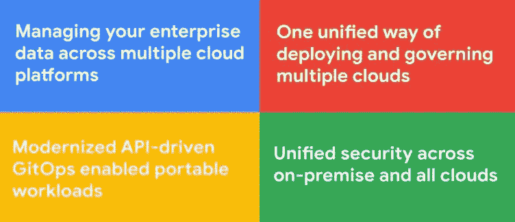

# 多云的未来(3) —要实现多云，您首先应该“考虑多云”

> 原文：<https://medium.com/google-cloud/the-multi-cloud-future-3-to-do-multi-cloud-you-should-first-think-multi-cloud-bf76d57660af?source=collection_archive---------1----------------------->

拥有多种云并不等同于拥有多种云策略。我们向您介绍“多云思维的四大支柱”。

SHaHraM Anhari 在 [Unsplash](https://unsplash.com?utm_source=medium&utm_medium=referral) 上拍摄的照片

*这是“云计算的未来”系列的第三部分。你可以阅读第一部分—* [*为什么只有“云”而没有“多云”会阻碍你的业务增长*](https://kishoregopalan.medium.com/the-multi-cloud-future-why-just-cloud-and-not-multi-cloud-will-impede-your-business-growth-8cadd897e86d) *。而第二部分—* [*到底为什么要采用多云？*](/google-cloud/the-multi-cloud-future-2-so-why-exactly-should-you-adopt-multi-cloud-d2c264069126) *。现在请继续阅读…*

多重云是几代人以来计算发展方式的一次范式转变。正如我们在本系列的上一期文章中所讨论的，云计算的发展与现实世界的经济发展非常相似。就像在全球化经济中取得成功需要突破保护主义和自由化界限的转变的思维过程一样，多云也需要转变的思维过程才能取得成功。

**为什么多重云是一种新的思维过程，而不仅仅是另一种技术？**

我听到一些首席信息官评论说，他们做多云是因为他们投资了所有三个主要的云平台——他们的许多应用程序运行在 AWS 上，许多其他应用程序和数据仓库驻留在谷歌云上，他们使用 Office 365。虽然这种组织确实跨多个云运营他们的业务，但这远不能称为真正的多云环境。

拥有多种云并不等同于拥有或利用多种云策略。相反，多云战略是一种全面的全球战略，

1.  战术和战略业务目标
2.  企业运营所在的每个地区的法规要求(对金融服务业更为重要)
3.  您现有技术体系的成熟度和生命周期，以及它在满足您的业务目标方面的功效
4.  您的 DevSecOps 过程以及您的发布周期有多快和无缝
5.  管理云和内部基础架构的运营效率和成本与您的收入相关
6.  您的安全控制的成熟度可随您的业务增长而扩展

鉴于这些业务考虑因素，首席信息官和首席技术官必须推动一项组织范围的全球战略，以推动多云思维的四大关键支柱。

多云思维的四大支柱

**跨多个云平台管理您的企业数据**

您公司最重要的资产是您的数据。大多数大型组织面临的最大挑战是管理数据——他们最重要的资产——这是一个矛盾的说法。无论您的数据在哪里，云计算都为您提供了一个统一的单一平台视图，这是迄今为止不太可能实现的，因此您现在能够比过去更好地理解和使用您的数据。

**部署和管理多种云的统一方式**

采用多云战略通常充满了挑战，即扩展您的运营和支持团队，以便能够学习技能、工具和分配资源带宽来管理您的所有云投资(不要忘记您的内部投资)。谷歌云是按照多云理念从头开始构建的。在本系列的后续文章中，我们将讨论 Google 提供的技术和工具，这些技术和工具可以帮助您的运营团队创建简单而可扩展的环境，并以一种统一的方式管理您的所有云。

**现代化的 API 驱动的 GitOps 支持便携式工作负载**

当您整理数据并让您的运营团队满意时，您还需要确保您的软件交付周期变得更快、更安全，并且您能够利用您的 GitOps 管道在您的所有云中部署和管理您的版本。同时，确保您的工作负载保持可移植性(阅读本系列前一期的“工作负载可移植性”一节[,您为什么要采用多重云？](/google-cloud/the-multi-cloud-future-2-so-why-exactly-should-you-adopt-multi-cloud-d2c264069126))。

**跨内部和所有云的统一安全性**

每一种云的构建都以安全性为首要要求，并有多项合规性认证作为后盾。虽然安全控制、设置和管理的配置可能因云而异，但重要的是组织能够在其所有云平台上应用单一的统一安全策略。

在本文中，我们讨论了为什么采用云计算需要采用不同的思维方式，并介绍了云计算思维的四大支柱。在本系列的后续文章中，我们将深入研究这四个支柱，以及使用 Google Cloud 实现它们的技术和架构模式。

但是在深入探讨这些支柱之前，下一篇文章将会介绍 5 种主要的云计算模式，这些模式通常在采用了云计算的组织中普遍存在。