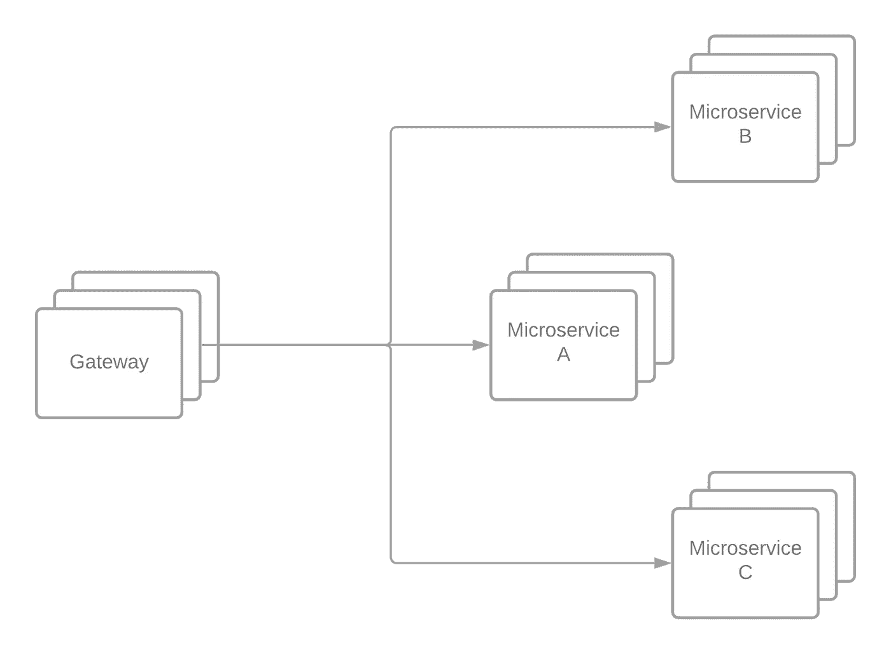
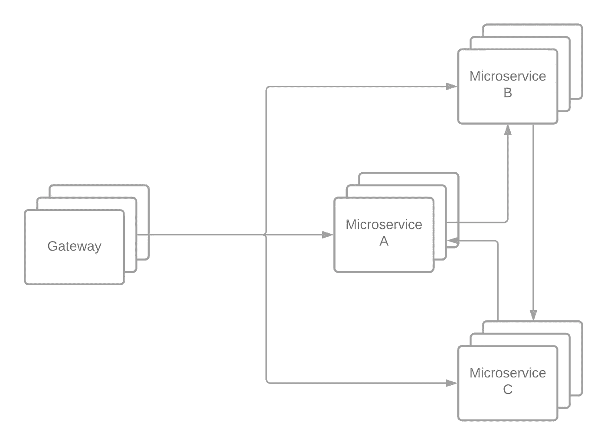
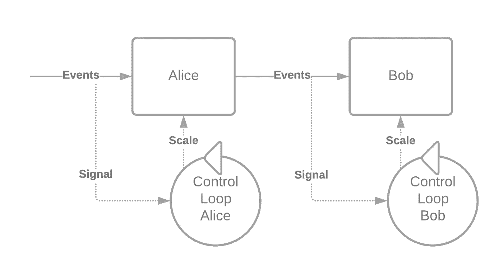
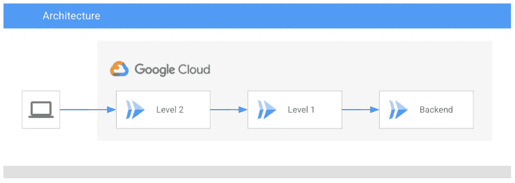
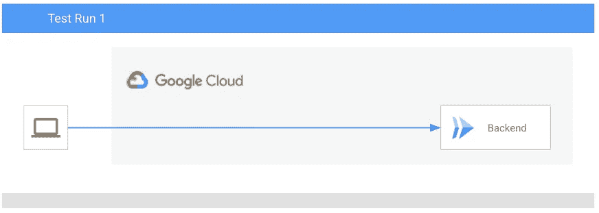
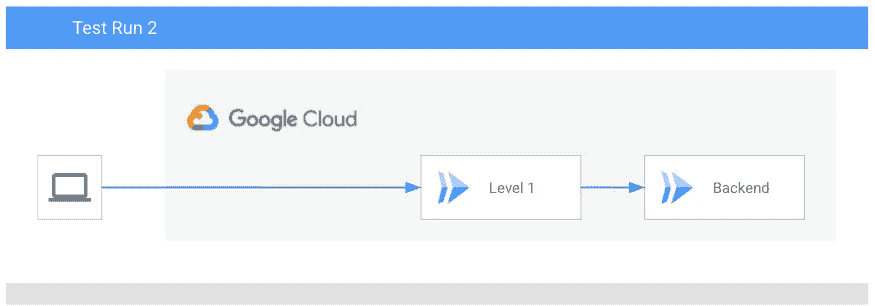
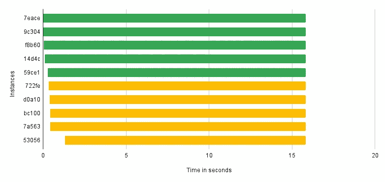
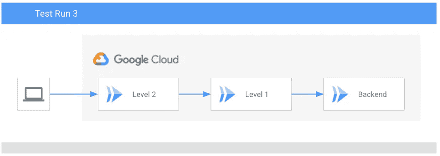
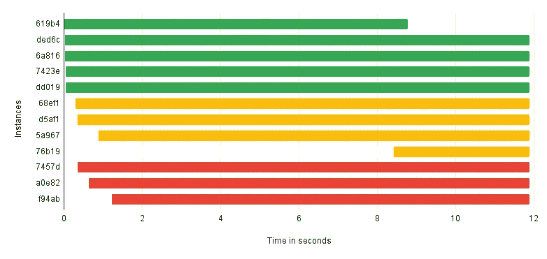
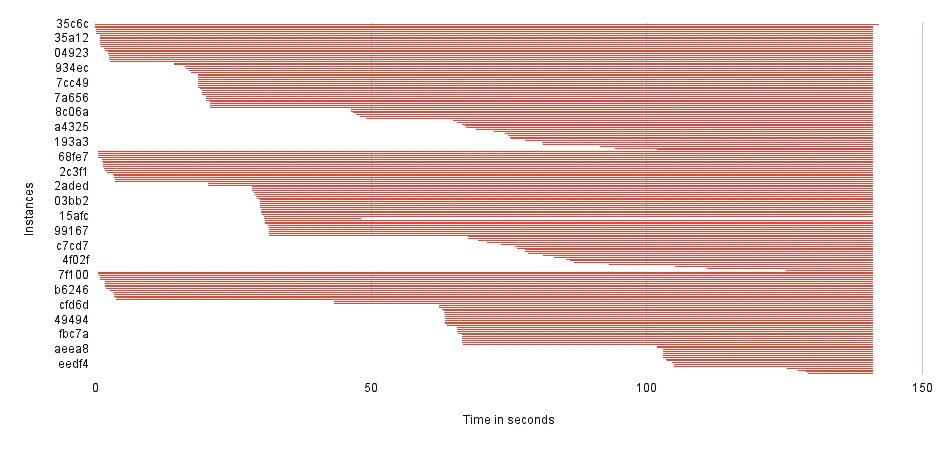

# 在无服务器平台上扩展的陷阱

> 原文：<https://medium.com/google-cloud/the-pitfalls-of-scaling-on-serverless-platforms-482ad69d7c37?source=collection_archive---------1----------------------->

**TL；扩展是困难的，有人为你扩展是很好的，但是没有免费的午餐。**

照片由[尼克·费因斯](https://unsplash.com/@jannerboy62?utm_source=unsplash&utm_medium=referral&utm_content=creditCopyText)在 [Unsplash](https://unsplash.com/s/photos/infinity?utm_source=unsplash&utm_medium=referral&utm_content=creditCopyText) 上拍摄

无服务器平台有时会让人觉得它是由生活在云中的魔法和独角兽制造的。但它是由比魔法更强大的东西制成的:工程学。这可能会让我们做出假设，而这可能不是真的。我和我的团队在 2015 年构建的首批无服务器架构之一非常简单。这是一个简单的物联网应用程序，用于从传感器收集数据，并将数据提供给运行在 iOS 和 Android 手机上的应用程序。后端由 Spring Boot 遵循[12 因子](https://12factor.net/)构建的微服务组成。我们使用了一个基于网飞 Zuul 的 API 网关来处理我们的 HTTP 请求并终止 AuthN 和 AuthZ。

但有时系统会变得拥挤。当大量数据涌入时，系统崩溃了。我们对此有点困惑，因为所有组件都被设置为独立扩展。我们很快发现了问题:某些中央微服务被对某些用例的请求所淹没。

但是系统的可扩展性不应该已经解决这个问题了吗？有趣的是，是的，我们可以扩展，但不是非常快速的系统。由于它们的同步依赖性，服务是紧密耦合的(目前我只能建议不要这样做，将您的微服务设计为自包含系统，尽可能依赖异步接口进行数据复制，如果用例要求，您应该只使用同步接口)。但是服务的可伸缩性是独立的。你可能会指出，这应该是一件好事吧？我的意思是，独立的可伸缩性是微服务架构的一个关键优势，不是吗？

让我们使用一个简化的模型更深入地探讨这个问题。

两个组件及其各自的缩放器的简单图示。

假设我们有两个组件 Alice 和 Bob。Alice 在 Bob 前面，Bob 只处理来自 Alice 的事件。两者都有一个独立的闭环控制器，可以根据等待它们的事件数量来调整它们。如果在特定时间内没有可用于处理事件的实例，将会传回一个错误。

现在，有两件事需要考虑。用于上下缩放 Alice 和 Bob 的信号是它们各自的输入队列。而 Alice 处理其输入队列的能力取决于 Bob 处理其输入的能力，因为她正在等待 Bob 的响应，所以它们各自的控制循环是相互独立的。由于 Bob 的输入队列相对于 Alice 的队列有一个延迟，我们可以观察到 Bob 的扩展与 Alice 相比有一个相移，由于启动时间和并发限制的不同，这也变得更加复杂。最后但并非最不重要的一点是，这是系统的一个突发属性，它可能是间歇性错误的来源，而间歇性错误通常会导致很多令人头疼的问题。间歇性错误是随机发生的错误，很难定位和解决。涌现性，是一个复杂系统的性质，该系统的任何一个单独的组成部分本身都不具备。

这些问题通常不会在逐步扩展时出现，而是在系统需要快速响应传入请求高峰时出现。将越来越多的服务层层叠加在一起，这种转变也会变得更糟。

## 实验

我们来做一个实验，看看能否验证以上。为了测试处理突发请求的能力，我创建了一个简单的 JMeter 负载测试，针对一个简单的应用程序运行 100 个线程。负载测试运行大约 2.5 分钟，加速时间为 10 秒。应用程序在云上运行，并发度为 1，最大实例数为 5。应用程序可以以两种方式运行， **loopback** 将请求转储回响应， **proxy** 实现一个简单的代理，将请求转发到另一个端点。回送在响应消息之前模拟 500 毫秒的处理时间。该应用程序还可以配置为启动延迟以及代理前和代理后延迟。

我们简单设置的架构

我使用云日志记录来自应用程序的启动和关闭日志消息，以跟踪应用程序实例的创建和停止，我将这些信息放入不同测试运行的图表中。

负载测试的第一次运行直接针对后端服务。

如果我们直接对后端层运行负载测试，我们可以观察到 18.5%的错误率和每秒 11.8 个请求的吞吐量(同样计数失败)。错误率不为零当然很好，这表明我们确实在对系统进行压力测试。

负载测试的第二次运行是针对后端前面的第一级运行的。

如果我们对后端前面的第一级进行测试。我们可以观察到 39.66%的错误率和每秒 12.7 个请求的吞吐量(也包括失败的计数)。第一个后端实例在第一个 1 级实例之后 323 毫秒启动。

两级测试运行中的实例生命周期。每一行都是一个实例，彩色条表示该实例能够接受请求的时间。绿色代表 2 级服务，黄色代表 1 级服务，红色代表后端服务。

负载测试的第三次和第四次运行是针对后端前面的第二级运行的。

如果我们对后端前面的第二层进行测试。我们可以观察到 53.97%的错误率和每秒 13.4 的吞吐量(同样计数失败)。第一个 1 级实例在第一个 2 级实例之后 286 毫秒启动。第一个后端实例在第一个 2 级实例之后 340 毫秒启动。

两级测试运行中的实例生命周期。每一行都是一个实例，彩色条表示该实例能够接受请求的时间。绿色代表 2 级服务，黄色代表 1 级服务，红色代表后端服务。

当我们将并发性设置为 2，最大实例数设置为 100 时，我们得到的当然是一幅不同的画面。错误率下降到 0%，我们实现了每秒 101.5 个请求的吞吐量。

两级测试运行中的实例生命周期。每一行都是一个实例，彩色条表示该实例能够接受请求的时间。

从上面的数据和图表中，我们可以观察到两件有趣的事情。

1.  相移是真实的事情，尽管云运行在这方面当然快得惊人。
2.  缺乏在 2 级测试中创建的后端实例，加上错误率和吞吐量的增加，表明我们无法使后端服务饱和。这不是我想强调的，但它显示了更高级别的并发性和最大实例设置有多重要。

## 结局

那么，这是否意味着您不应该使用分层方法呢？你应该摆脱你的 API 网关吗？

不，绝对不是。API 网关是一个好的模式，这是有原因的。但是你应该考虑你服务于他们的什么样的请求。就我个人而言，我认为你应该总是尝试使用 CDN 解决方案来提供静态内容，如 HTML、JS、CSS 和图像。

快速扩展具有挑战性，您可能会遇到“有趣”的问题。因此，您需要仔细考虑您的架构如何扩展。微服务的一个很好的特性是，它们可以独立伸缩，但是当你有紧密耦合的微服务时，这可能会导致一个问题。

理想情况下，你应该尽量保持你的架构浅显，尽量松散地耦合你的服务。异步数据复制应该是数据交换的主要选择。只使用同步操作调用，在这种情况下，您需要有一个事务行为。

既然最了解你的业务的人是你自己，你也可以考虑主动设置最小实例数。例如，如果你在黑色星期五进行零售，你可以“预热”你的应用程序，以保持较低的延迟和清晰的用户体验。生成请求突发的负载测试当然是验证您的应用程序是否按预期伸缩的好主意。

为什么这是特定于无服务器平台的？在无服务器平台上，与在 Kubernetes 上使用[水平 Pod 自动缩放](https://kubernetes.io/docs/tasks/run-application/horizontal-pod-autoscale/)相比，缩放行为通常更难配置。所以这个平台在无服务器上有更多的责任，你需要花更多的时间为这个平台设计你的应用程序。