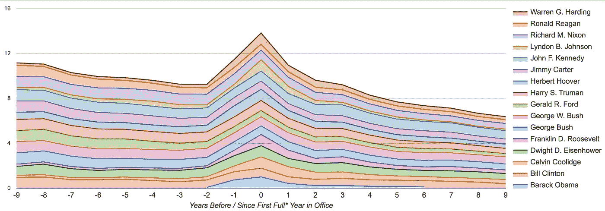
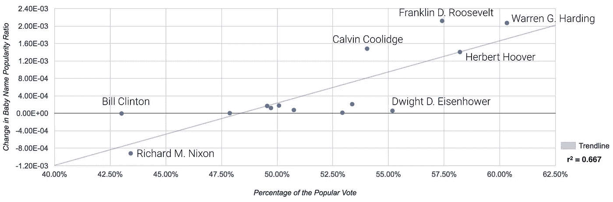
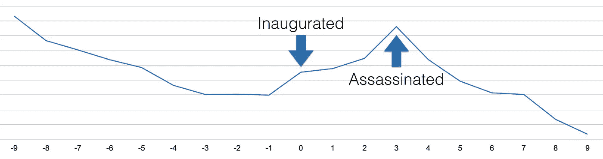
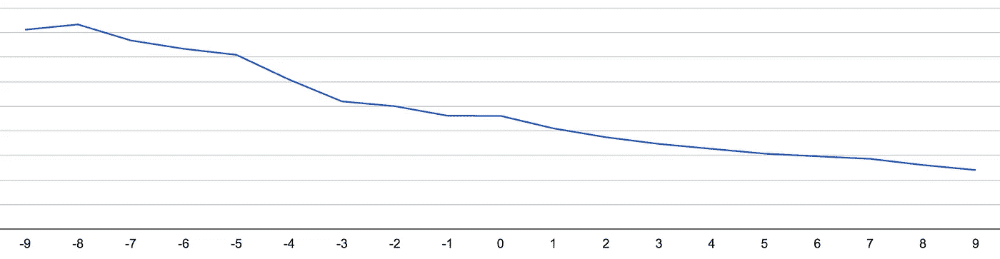
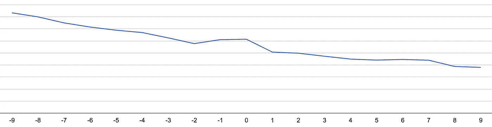
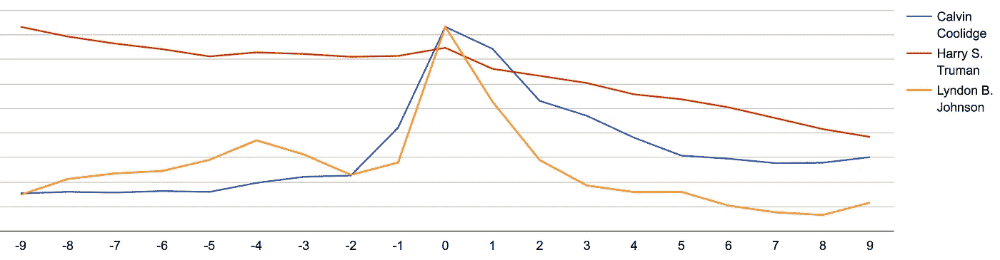
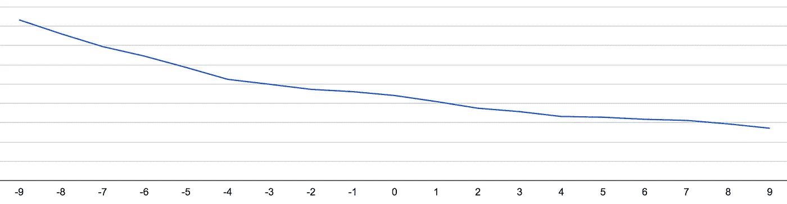
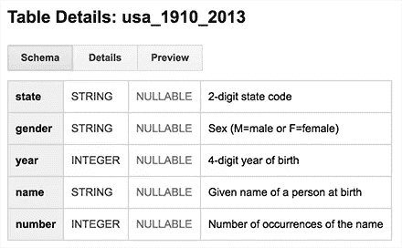
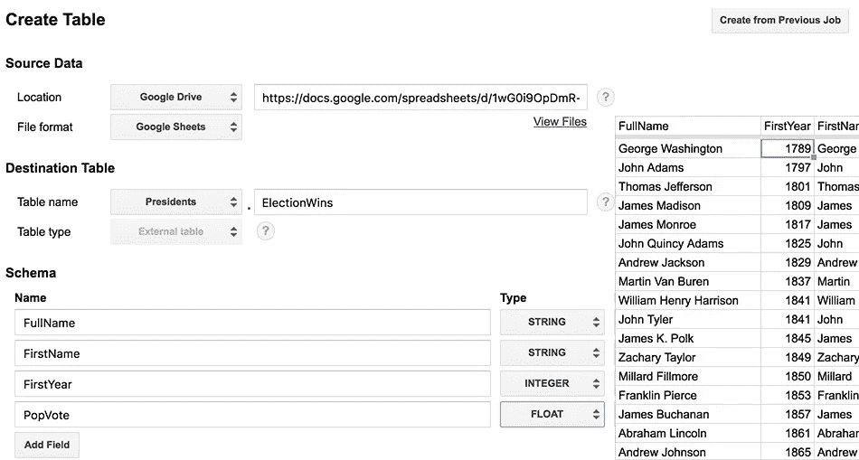

# 总统宝宝(名字)隆起

> 原文：<https://medium.com/google-cloud/the-presidential-baby-name-bump-5b9d786cb2fe?source=collection_archive---------0----------------------->

## 使用 BigQuery 调查美国总统选举对婴儿名字的影响

直到 2007 年，美国几乎没有新生儿的名字是巴拉克 T1。2008 年，巴拉克·奥巴马赢得美国总统大选，52 个巴拉克宝宝出生，随后在 2009 年又有 69 个巴拉克宝宝出生。

巧合吗？我觉得*不是*！利用 [BigQuery](https://bigquery.cloud.google.com) 和[美国婴儿名字](https://bigquery.cloud.google.com/dataset/bigquery-public-data:usa_names)的公共数据集，我能够探索总统婴儿(名字)撞回哈定总统的想法——并对我们可能在 2017 年看到的取名为*希拉里*或*唐纳德*的婴儿数量做出一些估计。



出生时与总统同名的人的标准化相对比例——从 9 年前开始，直到他们执政满一年后的 9 年。(“全年”大于 6 个月。)

确实有变化(我们将在后面探讨)，但当叠加在一起时，你可以看到每位总统的名字在当选前几年的受欢迎程度有明显的下降趋势。这一过程被一个明显的起伏打断，其峰值对应于每位总统执政的第一个整年。

> 在上图中，我绘制了 19 年来(自 1920 年以来)每任总统名字的流行趋势，以他们就职的年份为中心。我已经对每年命名的婴儿总数进行了调整，所以我们一直在比较每个名字与所有命名婴儿的比率。然后，我对结果进行了归一化处理，以显示相对影响——因此，1 分代表 19 年中每个名字最受欢迎的年份，其他值与此相关。

当你将每次增长的规模与每位获胜总统的民众投票比例进行比较时，你可以看到一种合理的相关性(R 为 0.667)。你还可以看到，除了两种情况——对应于两个最低的民众投票率(都低于 45%)，其他情况都有所增加。



婴儿名字受欢迎程度的相对变化与总统选举获胜者在大众投票中所占的百分比。

> 在这个图表中，我比较了总统上任第一年的名字与期望值的相对比率(基于前两年的趋势)。)这两个数字都是根据每年取名的婴儿总数进行调整的。

## 2017 年婴儿名字预测

预测 2016 年总统大选后希拉里或唐纳德的孩子数量是很棘手的。我们需要预测 2017 年的总体出生率，我们的 R 值并不是一个强有力的预测指标。

酪让我们假设 2017 年美国取名的孩子和 2015 年一样多(3668183)，并且名字*希拉里*和*唐纳德*的受欢迎程度将持平。然后，我们必须预测一个选举获胜者，以及差额。以下是一些可能影响婴儿名字的场景。

*   如果希拉里以 49.8%的得票率获胜(正如 11 月 8 日 [fivethirtyeight 的“仅民调](http://projects.fivethirtyeight.com/2016-election-forecast/?ex_cid=2016-election#odds)”所预测的那样)，那么取名为 *Hillary* 的宝宝可能会比我们预期的多 **977** 个——高于 2015 年的 136 个。
*   克林顿以 55%的得票率赢得了第 538 届总统选举的最高票数，这可能会增加 3915 名新生儿，取名为希拉里。
*   如果 Trump 达到 fivethirtyeight 预测的上限，并以 45%的普选票数获胜，我们的模型将预测 2017 年 Trump 的名字可能会从 2015 年的 690 下降到零(T21)。
*   任何一位候选人都需要赢得至少 48.2%的普选票数才能期望看到他们的名字的受欢迎程度上升。

## 特殊情况

魔鬼在细节(包括我为什么一直在“满”字旁边加“*”号)，那么我们来回顾一下一些有趣的特例。

约翰·肯尼迪

肯尼迪总统的第一个名字约翰的受欢迎程度总体呈下降趋势，但他的支持率却大幅上升。不同寻常的是，约翰的受欢迎程度持续上升——不像大多数其他总统在就职后的第二年声望下降。



约翰·肯尼迪

巅峰是 1963 年他[遇刺的那一年](https://en.wikipedia.org/wiki/Assassination_of_John_F._Kennedy)，之后*约翰*这个名字就恢复了颓势。

杰拉尔德·福特

看来你可能需要(最终)赢得选举，你的名字才能从总统选举中受益。1974 年理查德·尼克松辞职后，杰拉尔德·福特总统升任总统，但这并没有明显影响杰拉尔德作为婴儿名字的流行。



杰拉德·福特

他在 1977 年的选举中输给了吉米·卡特，后者在一场势均力敌的选举中获胜后，支持率略有上升。



吉米·卡特

**卡尔文·柯立芝、林登·约翰逊和哈里·楚门**

另一方面，1923 年 8 月，在沃伦·G·哈丁的[之死之后，卡尔文·柯立芝总统登上了总统宝座，并在 1924 年经历了一次显著的提升——这是他在任的第一年。他赢得了 1924 年的选举，并于 1925 年开始了他的第二个任期，但那时他的知名度已经在下降。](http://www.history.com/news/the-unexpected-death-of-president-harding-90-years-ago)



林登·约翰逊也是如此，他在肯尼迪遇刺后于 1963 年 11 月成为总统。林登作为一个婴儿名字的受欢迎程度在 1964 年达到顶峰——他执政的第一年——但随后下降，尽管未来的选举获胜。

1945 年 4 月，富兰克林·罗斯福去世后，哈里·杜鲁门成为总统。四月是一年中相当早的一年，所以我做出了行政决定，将 1945 年作为杜鲁门执政的第一个“完整”的一年。我也分享了下面的查询，所以如果你不同意，你可以相应地重新运行数据。

**罗纳德里根**

一些总统有相对较小的起伏——两位布什总统都只是延缓了“乔治”的受欢迎程度下降——但 1980 年罗纳德·里根的当选甚至没有对“罗纳德”产生影响



罗纳德·里根

## 如何检查我的结果



[BigQuery](https://bigquery.cloud.google.com) 包含了从 1910 年到 2013 年美国各州所有婴儿名字的[公共数据集。费利佩·霍法(feli PE Hoffa)](https://bigquery.cloud.google.com/dataset/bigquery-public-data:usa_names)继续上传，并且[分享了一个覆盖到 2015 年名字的全国性表格](https://bigquery.cloud.google.com/table/fh-bigquery:popular_names.usa_summary_1880_2015)。这两个数据集只共享每年至少出现 5 次的名字，所以全国范围的结果给出了稍好的保真度(特别是像“巴拉克”这样不常见的名字))

维基百科有一份自 1910 年以来每一次选举的列表，包括谁赢了和大众投票的比例——所以我用这些信息创建了一个谷歌表单，将其导入 BigQuery，[共享了 BigQuery 表](https://bigquery.cloud.google.com/table/reto-demo:Presidents.usa_presidents)。



将 Google Sheets 表导入 BigQuery。

有了这些数据，创建一个查询就很简单了，该查询查找每位总统第一个完整任期前后 9 年中名字的出现次数，以及这些年份中名字的总数、每位总统的名字以及他们在选举中赢得的普选比例。

```
SELECT a.year, a.name, a.yearlytotal, PopVote, 
       FullName, c.yearlyAllNames, FirstYear, 
       (a.year-FirstYear) as YearsSince
FROM (
  SELECT year, name, sum(number) as yearlytotal
  FROM [fh-bigquery:popular_names.usa_summary_1880_2015] 
  GROUP BY year, name
)a
JOIN (
  SELECT FirstName, FullName, PopVote, FirstYear
  FROM [reto-demo:Presidents.usa_presidents]  
  WHERE FirstYear > 1914
)b
ON
  a.name = b.FirstName
LEFT JOIN (
  SELECT year, sum(number) as yearlyAllNames
  FROM [fh-bigquery:popular_names.usa_summary_1880_2015] 
  GROUP BY year
)c
ON 
  a.year=c.year
GROUP BY a.year, a.name, a.yearlytotal, PopVote, FullName, 
         c.yearlyAllNames, FirstYear, YearsSince
HAVING ((YearsSince < 10) AND (YearsSince > -10))
LIMIT 1000
```

我将这些结果导出到 Google Sheets，这样我就可以创建一些简单的数据透视表并将结果图形化。


瞧啊。这些查询针对的是一个几百兆字节的数据集，所以您没有利用 BigQuery 的强大功能——但是另一方面，数据集已经存在于 BigQuery 中，并且导入数据与这些表连接非常容易，这使得开始处理数据变得很容易。

说到这个。

## 跟进问题

和大多数数据挖掘练习一样，我的分析到目前为止提出了更多的问题。肿块大小和大众投票百分比之间的微弱相关性表明可能有更多的原因(我猜支持率是一个因素。)

同样，你可以看到许多总统的名字实际上在他们就职的前一年*得到了提升，这就带来了更多的问题。*

你每个月可以免费使用 1tb 的 big query,所以在这个小小的数据集上，你可以自由支配这些公开可用的数据。例如，调查以下内容可能会很有趣:

*   总统的支持率与经济增长的幅度有更好的相关性吗？
*   落选的总统候选人会受到冲击吗？
*   副总统候选人会得到提升吗？
*   身为前副总裁会影响你肚子的大小吗？
*   在总统的家乡州，这种冲击更大吗？

## 潜在的未来问题

*   总统的性别会影响肿块的大小吗？
*   总统的种族会影响肿块的大小吗？

如果你最终做了这些调查，请回复并让我知道，这样我可以在这里链接到你的结果！