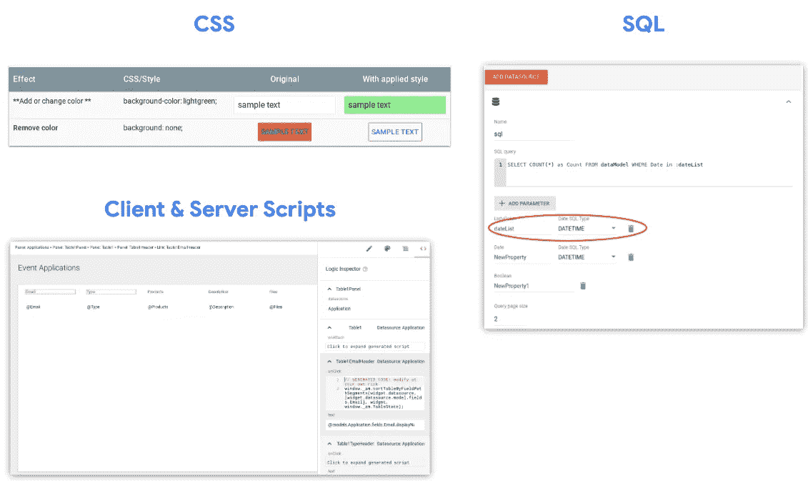

# 我可以使用 App Maker 解决的问题

> 原文：<https://medium.com/google-cloud/the-problems-i-can-solve-with-app-maker-2d6a7c570cca?source=collection_archive---------1----------------------->

**第一部分**[4 APP MAKER 迷你篇](/@TechandEco/4-part-app-maker-mini-articles-7e0c59e7c016)

***在这篇文章中，你将了解什么是 App Maker，有哪些常见的用例，以及衡量其影响的方法。***

在我们这个时代，如此多的重要操作都是由电子表格服务的。无论是计划、跟踪、计算、数据挖掘还是共享；他们在我们的团队中快速成长也是很自然的。

App Maker 是一个工具，它使组织中的大量个人能够使用"**拖放**"界面将**在**电子表格**中运行的**重要流程转变为**成熟的数据库**应用程序。

首先，App Maker 目前是谷歌的办公效率捆绑包 **G Suite** 的**部分，目前属于商业、企业和教育 SKU**。****

****

**它最初是在谷歌内部创建的，以满足对定制应用程序的巨大需求，目前正在与谷歌云 SQL 数据库配对。—这简化了数据库 web 应用程序的创建，并提供:数据的自动**备份**，比电子表格更快的**处理**速度**，以及**自动扩展**用户流量。****

**它还允许用户“**创建**、“**读取**、“**更新**、“**删除**数据。**

# **有两种普通的**用户**被 App Maker 吸引。**

****第一个**组是在电子表格函数和公式方面有**背景的人，通常是**但不限于**项目管理中**角色**的人、资产**跟踪**的人、财务、人力资源或支持的人。****

**一个**第二个**组是**开发人员或技术团队**，他们熟悉 **web 应用**语言，如 HTML、CSS 和 Javascript。**

# **非常适合 App Maker 关键功能的应用:**

**是经常使用的电子表格。那些电子表格的**模式**可以通过几次点击**导入**，**创建**也就是所谓的**数据模型。**”**

**然后可以通过**拖放**一个**表单小部件**来创建一个用户界面，例如，拖放到这个被称为“**数据模型编辑器的**灰色画布**中。****

****

**为了**显示****输入**的**数据，您可以在 app 内创建**另一个页面**，并且**拖动**一个**表格小部件**，该小部件自动**绑定**到进入该表单的**数据**。********

基于应用作者的**舒适度**水平，他们可以**添加**进一步**自定义自动化**如**显示** **结果**基于用户的**角色**，**给**分配**一个**任务**或**完成**一个；或者**每周** **自动生成带有最新图表**的报告**。****

# 还可以利用高级功能，例如:

在表之间建立**关系**，使用**自定义** CSS 进行 **UI 修改**，通过 **SQL** 查询创建**计算** **字段**，通过**客户端**和**服务器端**编写**事件驱动**工作流

# 最佳实践

还要注意的是，最适合 App Maker 的应用**属于相对**小**和**简单**的类别。比如那些**少于**15-30 页或者不需要大量定制后端集成的应用。**

如果你确实希望构建一个**更大**或更多**复杂** **应用**，我们推荐使用来自**谷歌云平台**的**产品**(它有[大的免费层](https://cloud.google.com/free/)来进行尝试)。

[https://cloud.google.com/free/](https://cloud.google.com/free/)

然而，你仍然可以使用 App Maker 来原型化更小的、特定功能的 GCP 应用。

# **内置 IT 治理&应用安全**

App Maker 的一个关键**与众不同**之处在于，它在 G 套件域级别设计了管理 [**安全控制**](https://developers.google.com/appmaker/security/secure-the-ui) **，例如根据作者在 **G 套件** **管理面板**中被**组织单位**分配给**什么来授予 App Maker 作者访问权限。****

它还允许应用程序制作者在创建**期间**或在上线后需要**支持**时进行协作，因为它与**谷歌** **文档**拥有相同的共享**权限**。

作者也可以实现**页面级权限**。

# 衡量 App Maker 影响力的 4 种方法

首先， **G 套件管理员**拥有[能力**查看**G 套件域**内**和**内**](https://support.google.com/a/answer/7648248?hl=en)有哪些 app 在**他们的** G 套件**管理面板**。

第二，**作者**可以**通过在应用中粘贴一个谷歌**分析 ID** 来测量**他们**应用的** **使用情况**。

第三，作者可以使用一个**图表** **小部件**在**应用**内**创建** **图表** **，以显示用户**输入的**数据的**摘要**，例如:**

最后，App Maker 作者可以**将**应用使用和**数据汇总**合并到一个**动态仪表盘**中，该仪表盘**可以免费**使用，称为**数据工作室**，因为它有**内置连接器**。

# **在您的组织内共享应用**

如果您领域中的其他人想要使用您的应用程序，但**基于他们的**用例**对**进行了修改，您可以通过点击“**导出**”按钮来共享它的**模板**，然后**选择**来选择**整个**应用程序或仅**特定的**功能。

例如，如果我在我的应用程序中创建了一个以电子方式收集签名的**自定义小部件**，并且我想只共享**功能的特定部分**，我可以通过**选中那个**特定**功能的框**来实现，它被称为一个**模块**。

更好的是，你可以**选择性地**选择包括应用程序的数据，或者只**它的接口**没有**任何数据。**

这些出口都存了一个**。ZIP 文件**并且可以保存在 **Google** **Drive** 中以**管理访问**或者被**嵌入**作为 [**Google 站点**上的**链接**，该站点也使用与 Google Doc 相同的共享控件。](https://support.google.com/a/users/answer/9314941)

用户在**接收**端的体验是**下载**的。**压缩文件**，只需在 App Maker 中点击**导入**，然后**选择**该文件。

尽管这些工具在与**谷歌电子表格**和**云 SQL** 结合使用时是**最友好的**，但是具有**开发者**背景的人们可以选择**集成**他们的**外部** **数据库**，或者与**其他谷歌 API**以及任何基于 **REST 的服务**如 Salesforce 或 ServiceNow。

希望本文对您有所帮助:)