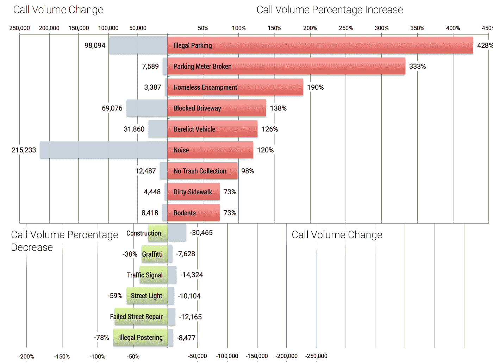
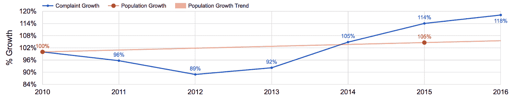
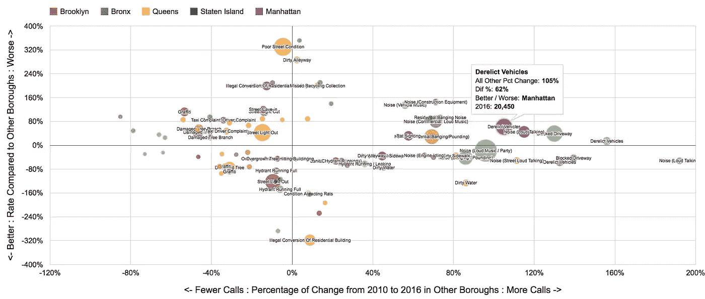
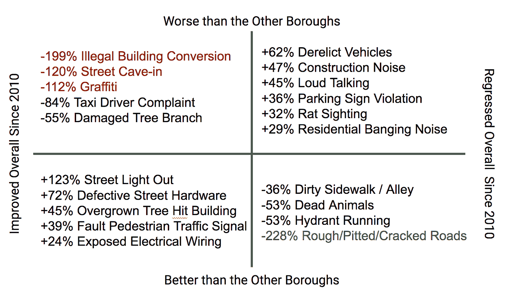
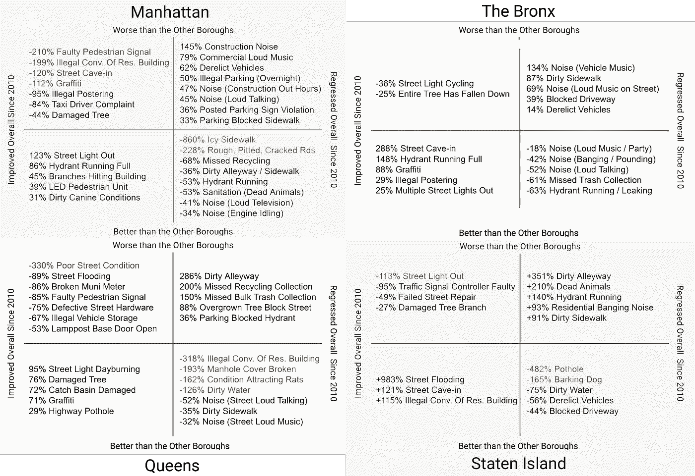

# 纽约城的兴衰(311 起投诉)——直到 BigQuery

> 原文：<https://medium.com/google-cloud/the-rise-and-fall-of-new-york-city-311-complaints-72bd894e0c74?source=collection_archive---------0----------------------->

纽约市公共数据集包含了自 2010 年以来所有的 T2 311 投诉。让我们来看看这座城市在过去的 6 年里是如何进步的，又是如何恶化的。

下图突出显示了 311 起投诉，呼叫量很大，在 2010 年至 2016 年间增加/减少最多。

2010 年以来最重要的 311 投诉类型呼叫量增减: [BigQuery 查询](https://bigquery.cloud.google.com:443/savedquery/174015642527:991443ede98348648d233c5ee9db212a)

## 投诉已经超过了人口的增长

自 2010 年以来，投诉数量增长了 18%，而人口估计增长了 6%。

自 2010 年以来，与 311 投诉量增长相比的人口增长

## 纽约有很多车，人们似乎不知道该把它们放在哪里

非法停车、停车计时器损坏、车道堵塞和废弃车辆是增长比例最高的几个方面。非法停车是最大的罪魁祸首，增幅超过四倍。

噪音占 2016 年所有 311 起投诉的 18%，高于 2010 年的 10%。这意味着增加了超过 200，000 个呼叫，占总增加量的三分之二。

我们之前[调查过老鼠目击事件的增加](/til-with-bigquery/crowning-the-rat-capital-of-new-york-a35dc82bf6cf#.s2329xh7e)；关于未收集垃圾和肮脏的人行道的投诉增加，可能是有助于解释这种跳跃的另一个线索。

## 涂鸦和非法张贴大大减少了

它们分别显示出 38%和 78%的减少，与纽约市正在进行的根除这两种疾病的努力相一致。

街道维修失败的频率减少了 76%，对损坏的路灯和交通信号的投诉也少了很多——平均下降了 50%(可能与该市用 LED 灯取代卤素灯泡有关。)

## 下图是每个区的放大快照

我们将特定行政区投诉增长率的百分比差异绘制在 y 轴上，相对于其他行政区的增长率绘制在 x 轴上。每个点的大小代表 2016 年收到的来电总数。

复制一份[这个谷歌工作表](https://docs.google.com/spreadsheets/d/1GeLS8CVVK_YTkTRKmBQk0ebrqubWqM77jRmWPm9Mi50/edit?usp=sharing)来自己玩这个图表

突出显示的点代表曼哈顿的废弃车辆，表明在其他行政区，这种投诉类型增加了 105%(从 17，759 增加到 36，416，增加了一倍)，而曼哈顿的增长率快 62%(增加了 170%，从 7，569 增加到 20，450)。

这是一个有趣的图表(你应该[复制一份表格](https://docs.google.com/spreadsheets/d/1GeLS8CVVK_YTkTRKmBQk0ebrqubWqM77jRmWPm9Mi50/edit?usp=sharing)并亲自调查)，但它很难解释，所以让我们为每个区提取一些值得注意的观察结果。

## **下图将投诉分为四个象限**

右边的代表投诉增加，左边的代表投诉减少。

上半部分代表一个区比其他区更糟糕的投诉类型，下半部分显示他们更好的地方。

左上角小于-100%的值(红色)表示投诉类型在一个区增加，而在其他区减少，而右下角小于-100%的值(绿色)表示投诉类型在一个区减少，尽管在其他区增加。

因此，在布鲁克林，对非法建筑改造、街道塌陷和涂鸦的投诉有所增加，而在其他区则有所下降。布鲁克林区对粗糙、坑坑洼洼和开裂道路的投诉下降速度是其他区的两倍多。

布鲁克林区路灯投诉的改善速度是其他地方的两倍，但废弃车辆投诉的增长速度比其他区快 62%。

您可以在下面的图表中看到其他行政区的特殊投诉类型。

## 我挑选了我认为最引人注目或最有趣的

有数以千计的个人投诉类型和描述，所以我在这篇博文中使用的图表和列表并不全面

这些年来，投诉类型和描述符也发生了变化，因此需要进行一些比较来解释重命名、废弃和新引入的投诉类型。

> 还要注意，我们正在测量*投诉*数量的变化。更多的投诉与更多的问题相关，但有可能人们只是抱怨更多，或者对 311 服务的认识一直在增加。

## 运行一些查询来更详细地调查这些变化

纽约市公开数据中有更多的趋势和变化值得探索。从乘坐城市自行车和出租车，到机动车事故。请亲自查看，并分享您的发现。

如果你是 BigQuery 的新手，请记住每个人每个月都可以免费获得 1TB 的[来运行查询](https://cloud.google.com/bigquery/pricing)。如果你以前从未尝试过 BigQuery，请遵循这些[入门指南](/til-with-bigquery/how-to-run-a-terabyte-of-bigquery-queries-each-month-without-a-credit-card-948773df8c0c#.w0kx0s6ho)。