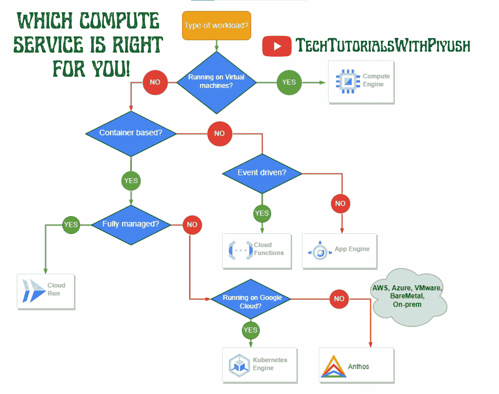
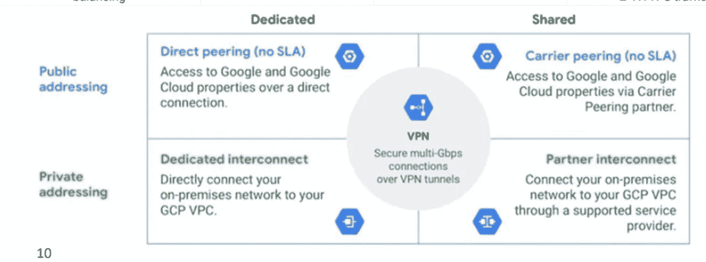

# 通过谷歌云专业云架构师认证的终极指南

> 原文：<https://medium.com/google-cloud/the-ultimate-guide-to-passing-the-professional-cloud-architect-certification-by-google-cloud-eb602449a05f?source=collection_archive---------1----------------------->

# 关于认证考试

**持续时间** : 2 小时

**考试形式:** 50 道选择题和多项选择题

**案例研究:** 2 个案例研究和基于此的 10-12 个问题。

我很高兴地宣布我成功通过了🎯2022 年 12 月 23 日的专业云认证考试，我第一次尝试。在这个博客中，我将分享一些帮助我准备考试的策略和资源，以及我的整个学习旅程。我们开始吧🚀

1.  **学习课程**:

首先，确保根据[考试指南](https://cloud.google.com/certification/guides/professional-cloud-architect)为考试做准备并涵盖所有相关主题。您可以在方便时参加以下任何学习课程:

*   兰加·卡拉南的 Udemy 课程。
*   专业云架构师学习路径由 [Coursera](https://www.coursera.org/professional-certificates/gcp-cloud-architect) 。(这是我拍的)

2.**动手练习:**

虽然视频教程是一种有用的学习工具，但重要的是要用实践来补充这种类型的指导，以充分理解和记住材料。为了获得实践经验，我建议注册一个谷歌云的试用账户([使用本教程](https://youtu.be/WLkgDAt9GtM))或者使用 [Qwiklabs](https://www.cloudskillsboost.google/paths/12) 进行练习并应用你的知识。这将帮助你更深入地理解这些概念，并确保你为长期发展做好充分准备。

3.**案例研究**

考试的一个重要方面是包含案例分析，案例分析占总考试的 20-30%。这些案例研究展示了虚构的业务场景和解决方案，并测试您在现实环境中应用知识的能力。理解如何用你所学的概念来分析和解决问题是很重要的，正如你在这些案例研究问题上的表现所展示的那样。试着详细理解这四个[案例分析](https://cloud.google.com/certification/guides/professional-cloud-architect)。

我还推荐浏览一下[萨特希·VJ](https://medium.com/u/ba857441758a?source=post_page-----eb602449a05f--------------------------------)的这个令人惊叹的[播放列表](https://www.youtube.com/watch?v=iNJe_NrbijM&list=PLQMsfKRZZviTIxEh0pkWNwnDUasGVZS4n)，在其中他基于这些案例研究和更多内容对问题做了简洁的解释。

4.**样题**

为了对考试中可能出现的问题类型有所了解，建议查看一下谷歌云提供的[官方样题](https://docs.google.com/forms/d/e/1FAIpQLSf54f7FbtSJcXUY6-DUHfBG31jZ3pujgb8-a5io_9biJsNpqg/viewform)。这将让你对问题的格式和风格有所了解，也有助于你衡量对材料的理解。

**5。GCP 备忘单:**

没有 Ammett W 的惊人备忘单，任何 GCP 认证的准备工作都是不完整的。这是它的[链接](https://drive.google.com/file/d/1_UfKnzxodTTk5CuwT0ScSmXegtmgpV5v/view)以及 [Priyanka Vergadia](https://medium.com/u/9b9e67983b04?source=post_page-----eb602449a05f--------------------------------) 关于 GCP 的[草图笔记](https://thecloudgirl.dev/sketchnote.html)。

**6。GCP 官方文件**

最后但同样重要的是，请参考 GCP 官方文档，以获得关于 GCP 服务和用例的见解。

# 技巧和窍门的时间到了🔥

我很高兴能与社区分享我学习之旅的主要收获。随着学习的进展，我学到了一些关键的东西，我相信这些东西对其他准备考试的人来说是有价值的。这些是我想强调的要点📌：

✔ PCA 考试可以被视为云工程师助理认证考试的延伸，如果您已经完成 ACE，您已经涵盖了几乎 60%的课程内容。您只需尝试从 ACE 以及一些其他主题(如安全中心、云装甲、CICD、发布-订阅、混合云、数据传输、组织策略约束、负载平衡器、云功能、Firebase、云 NAT、云 CDN 等)中获得深入的知识和实践经验。

✔:你应该很清楚何时使用哪种 gcp 服务:这里有一些重要的博客/视频，你应该看看:

*   [在 GCP 选择合适的数据库服务](/google-cloud/choose-the-right-database-service-in-gcp-8e3803245e1d)

*   [在 GCP 选择合适的计算服务](https://youtu.be/tPR6yGPD11Y)

*   选择哪种 VPN 服务，由 [Ammett W](https://medium.com/u/9e5f2fd8a569?source=post_page-----eb602449a05f--------------------------------) 充分解释

图片由 [Ammett W](https://medium.com/u/9e5f2fd8a569?source=post_page-----eb602449a05f--------------------------------) 拍摄

*   根据您的需求选择合适的负载平衡器

图片由 [Ammett W](https://medium.com/u/9e5f2fd8a569?source=post_page-----eb602449a05f--------------------------------) 拍摄

*   [选择正确的存储类别](https://youtu.be/ZJTgf_Ps7CY)

*   [选择正确的块存储](https://youtu.be/cTH9t_EcSGc)

✔:在回答任何与 IAM 相关的问题时，您应该始终考虑最小特权访问的原则。

✔:在回答问题时，你还应该考虑成本效益和谷歌推荐的最佳实践。

✔:除非 GCP 服务不能满足需求，否则你应该始终使用云原生服务，而不是开源或第三方服务。例如，在基础设施即代码服务的情况下，您应该选择部署管理器而不是 Terraform。

感谢您跟随我的旅程，成为谷歌云平台认证的专业云架构师。我希望我的建议和技巧对你准备考试有所帮助。如果你觉得这个博客有帮助，请不要忘记给它一两个掌声。如果你想了解我未来的最新内容，一定要关注我，并考虑订阅我的 YouTube 频道。祝您在认证之旅中好运，如果您有任何问题或需要更多支持，请随时联系我们。

# 参考资料:

*   Piyush Sachdeva 的 Namaste Google Cloud 播放列表:[https://www.youtube.com/watch?v=WLkgDAt9GtM&list = pl l4 apkphzsuxvkdfardrh 2 lmesvqeuh 8 w](https://www.youtube.com/watch?v=WLkgDAt9GtM&list=PLl4APkPHzsUXvkDFARdrH2LMESVqeuH8W)
*   priyanka vergadia 的草图笔记
*   兰加·卡拉南的《迷途》。[兰加·拉奥·卡拉南](https://medium.com/u/811759b6432?source=post_page-----eb602449a05f--------------------------------)
*   小抄由[阿米特 W](https://medium.com/u/9e5f2fd8a569?source=post_page-----eb602449a05f--------------------------------)
*   来自 [sathish vj](https://medium.com/u/ba857441758a?source=post_page-----eb602449a05f--------------------------------) 的 AwesomeGCP