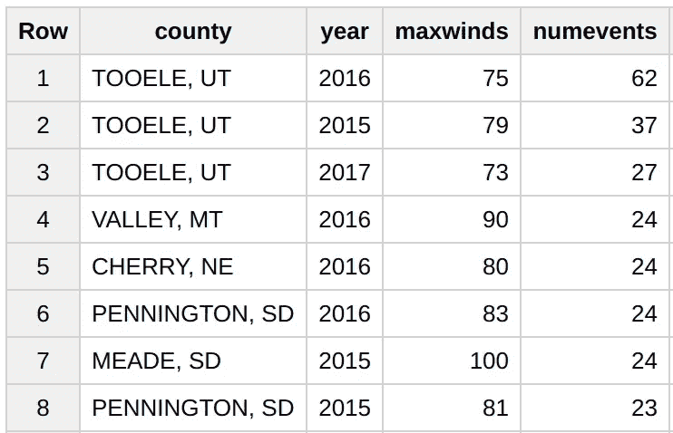
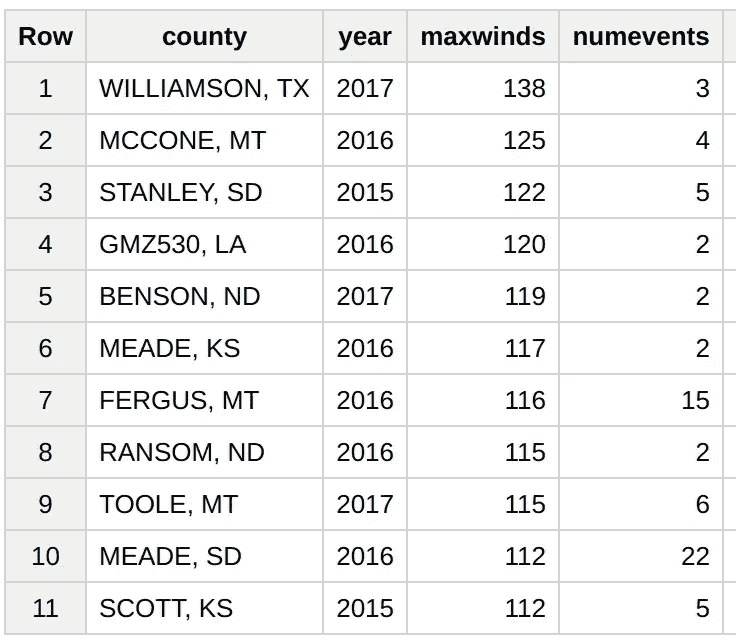

# 美国风力最大的地方在犹他州

> 原文：<https://medium.com/google-cloud/the-windiest-place-in-the-usa-is-in-utah-861d7438bc31?source=collection_archive---------1----------------------->

你现在可以在 Google BigQuery 中交互式查询[风暴预测中心](http://www.spc.noaa.gov/)(SPC)[的恶劣天气(龙卷风、冰雹、大风)的质量控制报告(每月前 1 TB 的处理是免费的)。这是 NOAA 开放数据集之一，由正在进行的名为](http://console.cloud.google.com/launcher/details/noaa-public/noaa-spc-storm-reports) [NOAA 大数据项目](http://www.noaa.gov/big-data-project)的公私合作项目提供。

这里有一个例子，你可以用这些数据做什么。美国风最大的地方是哪里？你可以用多种方式定义“风力最强”一词，但一种合理的方式是将它定义为在任何给定的一年中发生严重风力事件次数最多的县。

让我们编写一个快速的 SQL 查询来实现这一点…转到 [BigQuery web 控制台并键入](https://bigquery.cloud.google.com/savedquery/663413318684:eff13a6dfaea475a81b1d6be2affe6a0):

```
#standardsql
WITH
  windreports AS (
  SELECT
    CONCAT(county, ", ", state) AS county,
    speed AS windspeed,
    EXTRACT(year
    FROM
      timestamp) AS year
  FROM
    `bigquery-public-data.noaa_spc.wind_reports`)
SELECT
  county,
  year,
  MAX(windspeed) AS maxwinds,
  COUNT(windspeed) AS numevents
FROM
  windreports
GROUP BY
  year,
  county
ORDER BY
  numevents DESC
```

当我运行上述查询时，我得到了:



连续三年，美国风力最大的县是犹他州的图埃勒县

那里风很大(2016 年 62 天大风！)，但是 75 mph 最大风速也没那么差。嗯，足够快以至于逆风会让你的车停下来，但是你知道我的意思…

将查询改为按 maxwinds 排序，我们得到:



然而，按照风速排序，我们得到了一个有趣的组合

现在，事情似乎更有趣了，飓风地区(德克萨斯州，洛杉矶)，山地州(MT)和大草原(堪萨斯州，SD)混合在一起。

快乐查询。