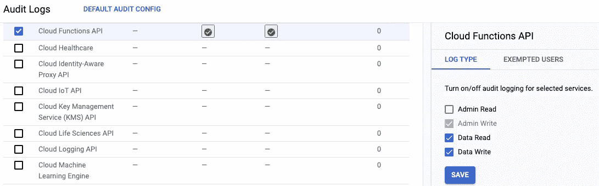
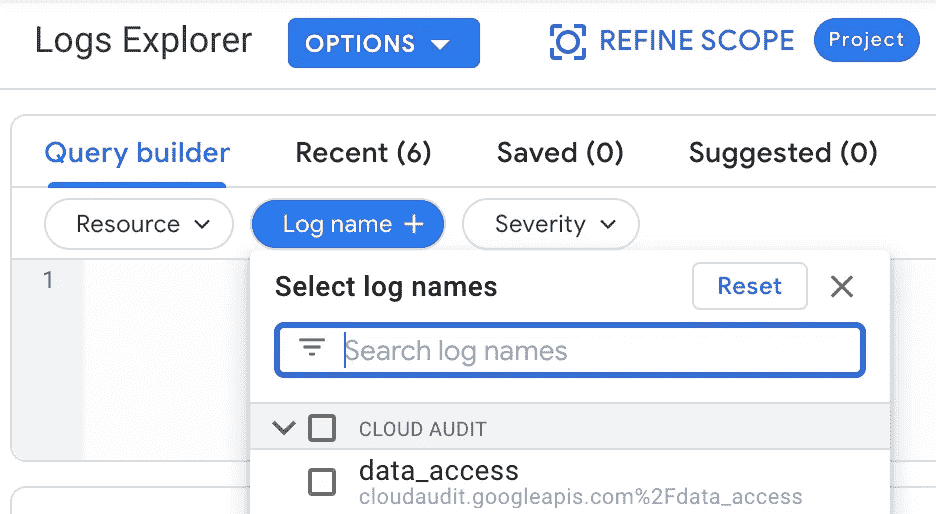
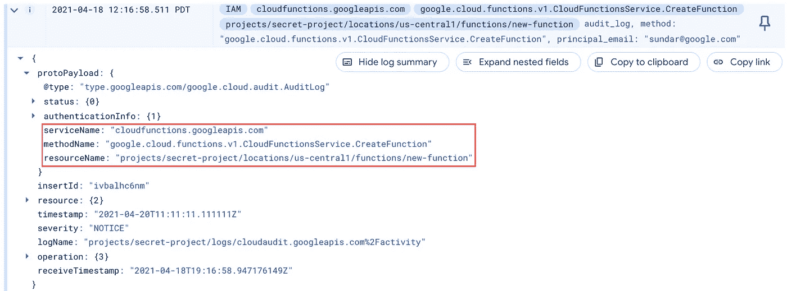

# 云审计日志的奇妙世界！

> 原文：<https://medium.com/google-cloud/the-wondrous-world-of-cloud-audit-logs-7a1fe6e47002?source=collection_archive---------0----------------------->

产生审计日志的谷歌云服务

几乎每个谷歌云服务都能在你的项目中产生一个事件，称为*云审计日志*。这些日志记录了项目中的活动。示例活动包括:创建新的虚拟机、修改 IAM 角色或访问云存储桶。

在这篇博文中，我们将探索云审计日志，并展示如何使用 Eventarc 来监听这些日志流，配置事件过滤器，并触发您的云运行服务。

# 什么是云审计日志？

云审计日志是针对*管理活动*、*数据访问*、*系统事件*和*策略被拒绝*事件的日志流。这些事件通常用于帮助客户满足审计和法规遵从性需求。他们会回答你项目中的“谁在何时何地做了什么”。[🔗](https://cloud.google.com/logging/docs/audit)

以下是审计日志类型:

1 ***管理活动*** *审计日志*包含 **API 调用**或**修改** **配置**或元数据的其他操作的日志条目。[🔗](https://cloud.google.com/logging/docs/audit#admin-activity)

2 ***数据访问*** *审计日志*记录读取资源配置、元数据的 API 调用，或者读取或写入资源数据的**用户级 API 调用**。[🔗](https://cloud.google.com/logging/docs/audit#data-access)

3 ***系统事件*** *审计日志*记录从 Google systems 生成的系统管理信息——不是由用户直接操作驱动的。[🔗](https://cloud.google.com/logging/docs/audit#system-event)

4 ***策略被拒绝*** *审计日志*记录服务帐户或用户对服务的未授权访问尝试，这在某些情况下很有用。[🔗](https://cloud.google.com/logging/docs/audit#policy_denied)

我个人发现 ***数据访问*** 日志包含有用的事件信息。我们将在这篇博文的其余部分引用这些日志。

# 启用审计日志

在开始之前，我们需要为我们想要生成审计事件的服务启用数据访问审计日志。我们可以在 IAM 和 Admin 下的 Audit Logs 页面中启用事件:

[https://console.cloud.google.com/iam-admin/audit](https://console.cloud.google.com/iam-admin/audit)

> 您可以使用默认配置为所有服务启用审计日志，尽管我发现通过单独选择服务更容易找到我想要观察的日志条目。

# 查看审计日志

启用审计日志后，您的项目将开始生成并保留这些日志。默认情况下，数据访问日志保留 30 天。

## 日志浏览器

查看日志的一个好方法是通过日志浏览器。在这里，您有一个强大的查询界面，我们可以在其中查看我们的数据访问日志:

[日志浏览器>日志名称过滤器](https://console.cloud.google.com/logs/query)

当在您的项目中执行某个操作时，您将会看到一个审计日志，比如这个创建云函数的日志(一些个人数据是伪造的):

带有红色矩形的扩展审计日志条目，突出显示日志的 ***服务名*** 、**方法名**和**资源名**。

在这里，您可以看到一个日志条目，其中包含我们的`protoPayload`中一些有用的字段。以下是一些亮点:

*   `serviceName`(始终存在):被记录的 API/服务。
*   `methodName`(始终存在):在服务中执行的动作。
*   `resourceName`(有时存在):执行动作时被修改的资源。

在这种情况下，我们记录了方法(`CreateFunction`)和关于函数的细节(函数在`secret-project`，位置`us-central1`，函数名`new-function`)。

# 使用 Eventarc 触发云运行服务

现在您已经创建了一个审计日志，您可以用这些信息做什么呢？

使用 Eventarc，我们可以创建一个触发器来监听这些审计日志，并以 CloudEvent 的形式向云运行服务发送 HTTP 请求。下面是一个`gcloud`命令的例子:

创建新 Eventarc 触发器的 gcloud 命令

因此，每当您的项目看到带有这个`serviceName`和`methodName`的审计日志时，Eventarc 将向您的运行服务发送一个带有审计日志的 HTTP 主体的`POST`请求。

## (可选)使用 Google CloudEvent 库

根据您的云运行服务的编程语言，您可能希望为 CloudEvent 有效负载提供某种类型的自动完成。

Google 提供了一些类型库，可以帮助您的应用程序使用这些事件:

*   **节点/打字稿**:[github.com/googleapis/google-cloudevents-nodejs](https://github.com/googleapis/google-cloudevents-nodejs)
*   **走**:[github.com/googleapis/google-cloudevents-go](https://github.com/googleapis/google-cloudevents-go)
*   **Java**:[github.com/googleapis/google-cloudevents-java](https://github.com/googleapis/google-cloudevents-java)

出于好奇，这些库是从 GitHub 上开源的 *protobufs* 和 *JSON schemas* 中生成的:

> [https://github.com/googleapis/google-cloudevents](https://github.com/googleapis/google-cloudevents)

感谢阅读！如果你学到了什么，请打碎它👏！