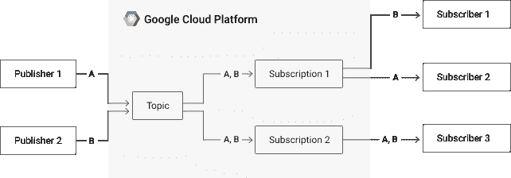
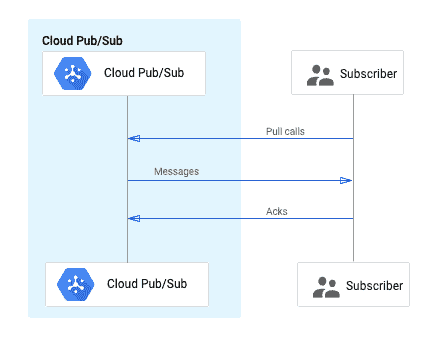

# 关于谷歌云发布/订阅，我希望知道的事情:第 2 部分

> 原文：<https://medium.com/google-cloud/things-i-wish-i-knew-about-google-cloud-pub-sub-part-2-b037f1f08318?source=collection_archive---------0----------------------->

这是我们提供有效使用发布/订阅的有用花絮的三部分系列的继续。在[第 1 部分](/google-cloud/things-i-wish-i-knew-about-google-cloud-pub-sub-852fac1ffbc6)，[梅根·波特](https://feywind.medium.com/)给出了发布/订阅概念以及如何调用发布/订阅 API 的高层次概述。这篇文章将深入探讨消息的生命周期，以及在使用[官方客户端库](https://cloud.google.com/pubsub/docs/quickstart-client-libraries)时，通过发布者和订阅者设置来优化应用程序所需的设置。

# 发布/订阅中消息的生命周期是什么？

## 有效使用发布/订阅的一个关键部分是理解消息从发布到消费的过程。

首先，发布者向主题发送消息。一旦发布/订阅服务器接收到消息，它就向消息添加字段，例如发布时间戳和消息 ID。发布/订阅将此消息传递给所有订阅。从每个订阅中，订阅者通过两个拉调用中的一个来拉消息(稍后会详细介绍)。每个订阅都有一个确认截止时间，它决定了在服务器重新传递该消息之前，为客户端分配多少时间来**ack**knowledge(**ack**)该消息。如果客户端在没有确认的情况下将消息保留到约定的截止日期之后，或者如果客户端发送了一个**nack**(**n**negative**ack**nowlegement)请求，则消息将被重新发送(可能会发送到同一订阅的不同订户)。

接收消息的典型订户流

有时，确认截止日期没有足够的时间让客户端确认消息，因此使用 ModifyAckDeadline 请求来延长截止日期。使用官方客户端库，这将在幕后透明地处理，这通过基于先前处理时间的频率分布模型来优化 ack 截止时间延长。

# 有哪些发布者设置可用，它们有什么作用？

## 我们的发布/订阅客户端库提供了许多配置选项来控制消息的发布，包括批处理功能。

批量发布通过将多条消息作为单个发布 RPC 的一部分来发布，有助于减少开销。当您使用官方客户端库调用 Publish 时，您的消息不会立即发布，而是添加到批处理程序中与其他消息一起发布。您可以使用以下内容配置此行为:

*   每批**消息的最大数量**
*   以字节为单位的最大**批量大小**
*   如果一批消息尚未填满，则在发送前保留该批消息多长时间( **delay** )。

增加每批消息的数量或批量的大小会减少需要发出的发布请求的数量，这转化为每个发布请求的更高的**吞吐量**。但是，如果您填充批处理的速度不够快，您可能会面临增加的**延迟**(客户端调用发布和服务器确认发布之间的时间)。相反，虽然减少批处理延迟有助于减少延迟，但是如果发布请求不能足够快地推出(降低吞吐量)，它们可能会排队。

# 确认消息是什么意思？为什么会出现重复？

## 有效使用发布/订阅的一个关键部分是理解消息的生命周期。

首先，发布者向主题发送消息。一旦发布/订阅服务器接收到消息，它就向消息添加字段，例如发布时间戳和消息 id。如果在主题收到消息之前，主题已有订阅，则订阅者可以从订阅中提取此消息。在服务器重新传递消息之前，会为客户端分配一段预定的时间(默认为 10 秒)来**ack**knowledge(**ack**)该消息。这就是所谓的确认截止日期。如果客户端在没有确认的情况下将消息保留到约定的截止日期之后，或者如果客户端发送了一个**Nack**(**n**negative**ack**nowledged)请求，则消息将被重新传送(如果您有多个设置，可能会传送到不同的订户)。

有时，确认截止日期没有足够的时间让客户端确认消息，因此使用 ModifyAckDeadline 请求来延长截止日期。有了正式的客户图书馆，这将在幕后透明地处理，使用基于以前处理时间的频率分布模型。

# 拉消息有哪些不同的方式？

## 流拉是从发布/订阅接收消息的最佳和推荐方式。

流拉建立到发布/订阅服务的长期运行的流连接，用于接收消息。这不同于[同步拉取](https://cloud.google.com/pubsub/docs/pull#synchronous_pull)，同步拉取是每次客户端需要接收消息时进行的一元 RPC 调用。

支持流拉的客户端库将建立一个 streaming pull 连接(通过 gRPC 流)。这通常比一元拉方法更可取，因为开销更少。但是，有几个“问题”可能会给流式拉取的用户带来问题。

首先，流拉[将总是返回一个非 OK 状态](https://cloud.google.com/pubsub/docs/pull#streamingpull_has_a_100_error_rate_this_is_to_be_expected)，并且当查看日志时，这起初可能看起来令人困惑。这是由于流中断时发出的错误代码的性质，所以这并不一定意味着您的应用程序没有工作。客户端库提供了一个抽象层，防止这些暂时的断开被发送到您的应用程序代码。

此外，流式拉连接在关闭之前只能存活大约 30 分钟，因为长寿命的流会定期终止。官方客户端库将自动重新打开流，因此这对您的应用程序应该是透明的。

# 有哪些订户设置可用，它们有什么作用？

## 客户端库提供了调整订阅者的设置:流控制和并发控制。

**流量控制**有助于限制用户从发布/订阅获取多少消息。如果您的客户端一次提取太多的消息，它可能无法处理所有的消息，导致许多消息过期。消息在一定时间后过期，以便在单个订阅者失败时，可以将消息重新传递给健康的订阅者。您可以限制消息的数量以及客户端一次保存的最大消息大小，这样就不会使单个客户端负担过重。

请注意，流式拉取只能保证基于最佳努力的流量控制。假设您注意到您的应用程序在任一时段只能处理 100 条消息，因此您将[最大未处理消息](https://cloud.google.com/pubsub/docs/pull#config)设置为 100。客户端在获取 100 条消息后会暂停，这在大多数情况下是可行的。但是，如果您随后在单个发布批次中发布 500 条消息，客户端将一次接收所有 500 条消息，但一次只能处理 100 条，这可能会导致过期消息的积压不断增加。这是因为流拉不能从单个发布批处理中拆分消息。若要避免这种情况，请增加订阅者的数量，或者减少批量大小，以匹配发布时订阅者的消息处理能力。

**并发控制**允许您配置客户端库使用多少线程或[流](https://cloud.google.com/pubsub/docs/pull#streamingpull)来拉取消息。增加线程或流的数量可以让您的客户端更快地从发布/订阅服务器获取消息。C++、Go、Java、Ruby 客户端允许您配置多少线程用于回调，尽管有些客户端(如 Node)不支持这一点。增加回调线程的数量允许您同时处理更多的消息。

# 还会有更多

感谢阅读，敬请期待本系列的第三部！如果你有其他想听的话题，请在下面留下评论。