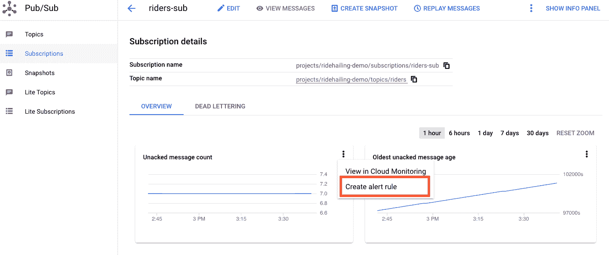

# 关于 Pub/Sub，我希望知道的事情，第 3 部分

> 原文：<https://medium.com/google-cloud/things-i-wish-i-knew-about-pub-sub-part-3-b8947b49224b?source=collection_archive---------0----------------------->

在第 [1](/google-cloud/things-i-wish-i-knew-about-google-cloud-pub-sub-852fac1ffbc6) 和 [2](/google-cloud/things-i-wish-i-knew-about-google-cloud-pub-sub-part-2-b037f1f08318) 部分，我的同事 Megan 和 Alex 向你介绍了 Pub/Sub 服务及其官方客户端库。在最后一节中，我将介绍一些剩余的主题，包括[推送订阅](https://cloud.google.com/pubsub/docs/push)、[模拟器](https://cloud.google.com/pubsub/docs/emulator)、 [IAM 策略](https://cloud.google.com/pubsub/docs/access-control)和[健康指标](https://cloud.google.com/pubsub/docs/monitoring)。

# 什么是推送订阅，我何时使用它？

## 推送订阅允许发布/订阅向您发送消息:发布/订阅将消息作为 HTTP POST 请求发送到预定义的 HTTPS 地址(也称为推送端点)。

与主动向 Pub/Sub 请求消息的拉订阅不同，推订阅允许您配置推端点，Pub/Sub 将消息传递到该推端点。

如果出现以下任何情况，您应该考虑推送订阅:

*   您不能在订户应用程序中包含任何客户端库代码。
*   您的用户不允许发出任何请求。
*   您的订户应以相同的方式处理来自不同订阅的消息，即您对不同的订阅使用相同的推送端点。

推送订阅中的消息确认与请求订阅中的不同。在 pull 中，您的应用程序代码必须在接收到的消息上显式调用**ack**nowledge(**ack**)方法。在 push 中，push 请求的成功响应代码(101、200、201、202、204 之一)用作 ack。

当推送请求获得其他响应代码(表示请求失败)时，消息被视为被否定，并将发生以下情况:

*   发布/订阅将尝试以指数回退的方式重新传递消息。这意味着你应该期待更长的时间之间的后续交货。
*   Pub/Sub 还将降低未完成消息的限制，即 Pub/Sub 已经发出但尚未被确认或否定的消息。

这些措施旨在降低发送到终端的消息的速率和数量，以便终端有机会恢复。[关于这些计算的详细说明](https://cloud.google.com/pubsub/docs/push#quotas_limits_and_delivery_rate)在官方文件中。

拉订阅和推订阅都满足高吞吐量需求。但是对于每个区域的每个订阅，推送传递模式的最大吞吐量是拉取传递模式的一半。要了解准确的报价单位，请查看[配额限制](https://cloud.google.com/pubsub/quotas#quotas)的参考页面。

# 我如何测试服务？

## 测试你的代码而不产生任何成本的一个好方法是使用 Pub/Sub [模拟器](https://cloud.google.com/pubsub/docs/emulator)，它拥有大多数基本功能，还有一些[已知的限制](https://cloud.google.com/pubsub/docs/emulator#known_limitations)。

安装了 cloud SDK [并初始化了](https://cloud.google.com/sdk/docs/install)和之后，您可以使用以下命令启动模拟器:

```
gcloud beta emulators pubsub start \
    --project=abc \
    --host-port=localhost:8085
```

这个命令在您的本地主机端口 8085 上启动模拟器—如果您没有指定值，这也是默认的。如果您没有使用`--project`标志提供一个虚拟项目 ID，模拟器将使用您用 gcloud 初始化的项目。从那里，您应该将环境变量`PUBSUB_EMULATOR_HOST`设置为`localhost:8085`，并且您可以开始使用官方客户端库与仿真的发布/订阅服务进行交互。

每次您启动模拟器时，您都是从一张白纸开始的。你不应该期待任何现有的主题或订阅。当您重新启动模拟器时，会话期间创建的主题或订阅也会消失。

如果出于集成测试或其他原因需要在容器中运行模拟器，应该将模拟器主机的`--host-port`标志更新为`0.0.0.0`，而不是使用默认的`localhost`。这将模拟器运行的端口绑定到容器的网络名称空间中的所有 IP 地址。无论容器的外部 IP 地址是什么，模拟器总是可以在指定的端口上访问。

以下命令在端口 8085 上启动 Docker 容器内的发布/订阅模拟器，并向 Docker 主机上的端口 8080 公开容器端口 8085。

```
docker run --rm -ti -p 8080:8085 \
    gcr.io/google.com/cloudsdktool/cloud-sdk:**$VERSION**-emulators \
    gcloud beta emulators pubsub start \
      --project=abc \
      --host-port=0.0.0.0:8085
```

在 GCP 的[公共容器注册表](https://console.cloud.google.com/gcr/images/google.com:cloudsdktool/GLOBAL/cloud-sdk?gcrImageListsize=30)中，将`**$VERSION**`替换为带有`<version>-emulators`标签的最新 Google Cloud SDK 映像的版本号。

启动模拟器后，您可以在本地开发环境中将`PUBSUB_EMULATOR_HOST`设置为`localhost:8080`，使用 Docker 容器中运行的模拟器测试您的代码。下面的 Python 例子首先创建一个主题`my-topic`，然后在虚拟项目`abc`中列出主题。

```
git clone https://github.com/googleapis/python-pubsub
cd python-pubsub/samples/snippets/
export PUBSUB_EMULATOR_HOST=localhost:8080
python publisher.py abc create my-topic
python publisehr.py abc list
```

尽管在 cloud.google.com 上使用模拟器的示例是用 Python 编写的，但所有语言客户端库都支持使用模拟器。至于模拟器的功能与真正的发布/订阅服务的对等性，我建议随着新功能的增加，不时检查一下它的已知限制。

# 如何在我的主题或订阅上配置 IAM？

## 细粒度的[访问控制](https://cloud.google.com/pubsub/docs/access-control)可以通过在主题和订阅级别设置角色和权限来实现。

有时，您可能希望限制用户或第三方服务对您的发布/订阅资源的操作。

例如，由某个服务帐户标识的下游消息使用者(可能来自不同的 GCP 项目)应该只有订阅权限，而没有更新订阅的消息保留策略的权限。这可以通过在该订阅上设置 IAM 策略来实现，这样它的策略成员(在本例中是服务帐户)就没有拥有`pubsub.subscription.update`权限的角色。具有该权限的角色的一个例子是`roles/pubsub.editor`。没有此权限的角色的一个例子是`roles/pubsub.subscriber`。

在主题或订阅上设置 IAM 策略通常包括三个步骤:

*   获取 JSON 或 YAML 文件中主题或订阅的现有 IAM 策略。
*   用您希望进行的更改更新 JSON 或 YAML 文件:添加/删除成员，添加/删除角色
*   将 JSON 或 YAML 文件中的更改应用到您的主题或订阅。

以下是您可以添加到主题或订阅的 IAM 策略中的[预定义角色](https://cloud.google.com/pubsub/docs/access-control#roles)的摘要。如果需要，还可以通过混搭[权限](https://cloud.google.com/pubsub/docs/access-control#required_permissions)自定义角色。(另见 [GCP IAM 角色解释](/google-cloud/gcp-iam-roles-explained-af84955346e7))。)

# 如何检查我的应用程序的健康状况？

## 发布/订阅[错误代码](https://cloud.google.com/pubsub/docs/reference/error-codes)允许您在开发过程中诊断您的问题。[指标](https://cloud.google.com/monitoring/api/metrics_gcp#gcp-pubsub)允许您检查您的主题和订阅的健康状况。

新用户中常见的一些错误是认证错误，如`UNAUTHENTICATED`和`PERMISSION_DENIED`。这通常是由于将环境变量`GOOGLE_APPLICATION_CREDENTIALS`设置为不存在的或错误的服务帐户密钥文件，导致服务不知道您的请求所携带的身份或认为它缺乏适当的权限。

当您使用尚未创建的主题或订阅，或者尝试创建已经创建的主题或订阅时，会出现`NOT_FOUND`和`ALREADY_EXISTS`。

至于最常见的指标， [Cloud Console for Pub/Sub](https://console.cloud.google.com/cloudpubsub/) 允许您查看和[设置针对您的主题的**发布请求**和**发布操作**的警报](https://cloud.google.com/monitoring/alerts/using-alerting-ui#create-policy)，以及针对您的订阅的**未确认消息计数**和**最早消息年龄**。



**发布请求**指您发送的发布 API 调用，**发布操作**指发布的消息数量。当[发布批处理](https://cloud.google.com/pubsub/docs/publisher#batching)被启用时，多个消息可能在一个发布 API 调用中被发送，并且如果您的批处理大小大于一个消息，您应该期望**发布操作**的数量大于**发布请求**。

**未确认消息计数**和**最早消息年龄**指您订阅中未送达消息的数量和年龄。如果它们一起增长并保持上升，您应该注意，因为这意味着服务已经积累了无法传递或无法传递的消息。当积压邮件中的这些邮件在邮件保留期后过期时，您将面临永远失去它们的风险。

我想告诉你关于 Pub/Sub 的其他很酷的提示和技巧，但是这篇中型文章越来越长，所以我将把它们留到另一个时间。如果你想让我或我的同事写一个话题，请在下面给我们留言。感谢阅读！