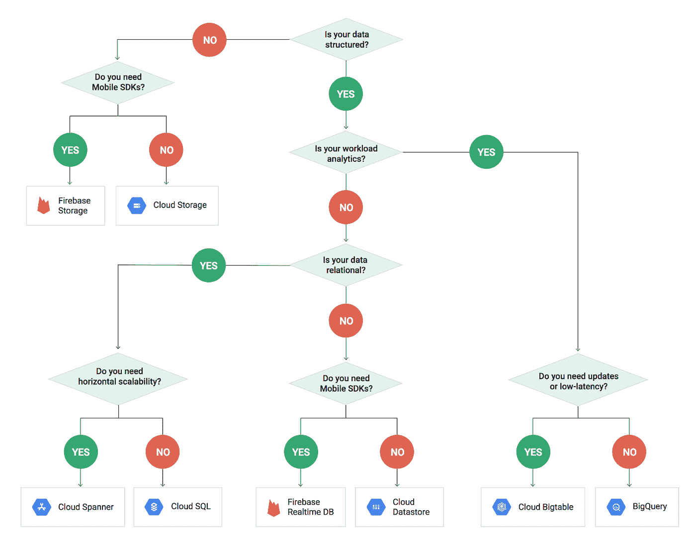

# 本周在 Google Cloud —“选择数据库/存储、python 升级、新的 CA 以及更多的数据中心和服务扩展”

> 原文：<https://medium.com/google-cloud/this-week-in-google-cloud-a-db-storage-decision-tree-a-python-upgrade-a-new-ca-and-still-more-1a653c63d881?source=collection_archive---------0----------------------->

过去一周的 GCP 公告包括:

*   [**Python** 开发者正在更新应用引擎](http://goo.gl/Ftpm1x)(灵活版和标准版)
*   [计算引擎更新带来 **Skylake** GA、扩展内存和更多 VM 灵活性](http://goo.gl/yyflj6)(概要截图[此处](http://goo.gl/HIutf6))
*   [俄勒冈地区(美国西部 1)增加了第三个区域、云 SQL 和区域托管实例组](http://goo.gl/HwqODh)
*   [谷歌云服务正在切换**认证机构**](http://goo.gl/XYH8Az) (你好 GS Root R2)多半是一个参考消息
*   [**Firebase** 版本 4.1.0](http://goo.gl/6vsVVa) (包括 Web / Node.js 的 JavaScript 客户端，Firebase 特性现在可以延迟加载)

不是公告，而是一个非常漂亮的[决策树，用于选择合适的 GCP 数据库/存储](http://goo.gl/s05irU)

来自“它是如何构建和完成的”部门:

*   [从 NoSQL 到新的 SQL:如何**扳手**成为一个全球性的关键任务数据库](http://goo.gl/S08z7c)(更多扳手细节基于新的出版物)
*   [在λ之后:**恰好一次**在云中处理**数据流**，第 2 部分](http://goo.gl/YpZhkE)(确保低延迟)

来自“我们的顾客对 GCP 的最佳评价”部门:

*   [我们如何充分利用谷歌云平台上的构建工具，同时节省资金](http://goo.gl/ioWZSZ)(特写詹金斯)(blog.shazam.com)
*   [向我发射光束——描绘火花束应用](http://goo.gl/ihizki)(paypal-engineering.com)
*   [使用 Kubernetes 和容器创建分布式数据中心架构](http://goo.gl/pX1iOS)(特色“Kubermesh”)(ocadotechnology.com)

来自“我喜欢播客”部门:

*   [GCP 播客#79《集装箱建造者》与克里斯托弗·桑森和大卫·本多利](http://goo.gl/FIMWHX)

来自“BigQuery 棒极了”部门:

*   使用谷歌大查询分析你的亚马逊网络服务账单
*   【medium.com 使用 BigQuery 和 Data Studio 可视化 GCP 计费
*   [BigQuery &新用户——top“WTF！?"瞬间](http://goo.gl/KezW3h)(shinesolutions.com)
*   [使用(Apache)波束流的 BigQuery 分区](http://goo.gl/XHkm1J)(medium.com)
*   [big query 流媒体插页](http://goo.gl/02EkWj)(谷歌博客)

来自“如此多的 GCP 内容要覆盖”部门:

*   [谷歌/ASF 用 Apache Beam 2.0 解决大型计算权衡](http://goo.gl/QUXWkI)(datanami.com)
*   [探索云视觉 API](http://goo.gl/OA7tuw) (之前分享视频的文字版)(medium.com)
*   [面向绝对初学者的 tensor flow](http://goo.gl/BqHz27)(codelab)(github.com)
*   [“distroles”Docker 图像](http://goo.gl/NvHBtK)(github.com)
*   [谷歌云功能，跟进](http://goo.gl/W4024l)(详细分步)(medium.com)
*   加入谷歌开发者挑战赛的行动【developers.google.com 

本周的截图是 [GCP 数据库/存储决策树](http://goo.gl/s05irU):

这星期到此为止！

-亚历克西斯